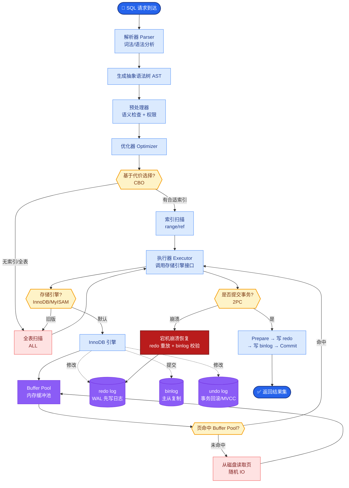
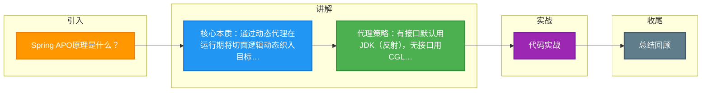

# Spring APO原理是什么？

### Spring AOP 原理

**1. 核心概念**
AOP (Aspect-Oriented Programming) 即面向切面编程。它将业务逻辑中与核心业务无关的公共行为（如日志、权限、事务）封装成“切面”，通过“织入”的方式动态地加入到业务逻辑中，从而降低耦合度。

**2. 实现原理：动态代理**
Spring AOP 主要通过动态代理机制在运行时织入代码。根据目标类是否实现接口，采用不同的代理方式：

*   **JDK 动态代理**：
    *   **条件**：目标类实现了接口。
    *   **原理**：利用 `java.lang.reflect.Proxy` 类和 `InvocationHandler` 接口。通过反射机制生成一个实现代理接口的匿名类，拦截方法调用。

*   **CGLIB 动态代理**：
    *   **条件**：目标类未实现接口。
    *   **原理**：基于字节码操作库（如 ASM），在运行时动态生成目标类的子类，并覆盖方法进行增强。因为是通过继承实现，所以无法代理 `final` 修饰的类或方法。

**3. 代理选择策略**
Spring 默认优先使用 JDK 动态代理，如果目标对象没有实现接口，则回退使用 CGLIB。也可以通过配置强制使用 CGLIB。

**动态代理调用链示意图（以 JDK 为例）：**

```text
Client
   │ 调用 Proxy.method()
   ▼
┌─────────────────────────────────┐
│   Proxy Object (代理对象)        │
│  ┌───────────────────────────┐  │
│  │ InvocationHandler         │  │
└──┴───────────────┬───────────┘  │
                   │ invoke()     │
                   ▼              │
          ┌────────────────┐     │
          │   Advisor 1    │─────┘  (前置逻辑/日志)
          │  (Interceptor) │
          └────────┬───────┘
                   │
                   ▼
          ┌────────────────┐
          │   Advisor 2    │──────  (前置逻辑/权限)
          │  (Interceptor) │
          └────────┬───────┘
                   │
                   ▼
          ┌────────────────┐
          │ Target Object  │──────  (目标方法执行)
          │   (真实对象)    │
          └────────┬───────┘
                   │
                   ▼ 返回结果
          ┌────────────────┐
          │   Advisor 2    │──────  (后置逻辑/事务提交)
          └────────┬───────┘
                   │
```

**实战案例**：
开发中常遇到“同类自调用”导致 AOP 失效的问题。例如在 Service 的 methodA 中调用 this.methodB()，由于 this 指向的是目标对象而非代理对象，因此 methodB 的事务或日志切面不会生效。解决方案是注入自身或使用 `AopContext.currentProxy()` 获取代理对象来调用。

**代码示例**：
```java
@Aspect
@Component
public class LogAspect {
    @Pointcut("execution(* com.example.service.*.*(..))")
    public void serviceLayer() {}

    @Around("serviceLayer()")
    public Object logAround(ProceedingJoinPoint joinPoint) throws Throwable {
        long start = System.currentTimeMillis();
        Object result = joinPoint.proceed(); // 执行目标方法
        long duration = System.currentTimeMillis() - start;
        System.out.println(joinPoint.getSignature() + " took " + duration + "ms");
        return result;
    }
}
```

**对比表格**：

| 特性 | JDK 动态代理 | CGLIB 动态代理 |
| :--- | :--- | :--- |
| **实现原理** | 反射机制生成实现接口的代理类 | 字节码操作生成目标类的子类 |
| **前提条件** | 目标类必须实现至少一个接口 | 目标类不能是 final 类 |
| **Spring 默认策略** | 优先使用（有接口时） | 无接口时回退使用 |
| **性能** | 生成代理快，执行稍慢（JDK8后已优化） | 生成代理慢，执行快（适合单例） |
| **方法限制** | 只能代理接口方法 | 无法代理 private/static/final 方法 |

**补充关键细节：**
*   **AspectJ 与 Spring AOP 的区别**：面试常考。Spring AOP 是运行时织入，基于代理，功能相对简单（仅支持方法级别连接点）；AspectJ 是编译期或类加载期织入，功能强大（支持字段、构造器等）。Spring AOP 借鉴了 AspectJ 的注解，但底层实现不同。
*   **CGLIB 性能与限制**：CGLIB 生成子类需要重写方法，无法代理 final 类。早期的 CGLIB 由于反射调用导致性能略低，但现代版本已经优化。Spring Boot 2.x 开始默认倾向于使用 CGLIB（即使实现了接口），但也保留了对 JDK 代理的支持。
*   **Chain of Responsibility（责任链模式）**：当有多个 Advisor（增强器）应用于同一个方法时，Spring 会通过 `ReflectiveMethodInvocation` 维护一个拦截器链，通过递归调用的方式依次执行。


## 核心流程图



## 记忆要点

- 核心本质：通过动态代理在运行期将切面逻辑动态织入目标方法
- 代理策略：有接口默认用JDK(反射)，无接口用CGLIB(生成子类继承)
- CGLIB限制：因为基于继承生成子类，无法代理final修饰的类或方法
- 致命坑点：同类内部使用this调用方法，会绕过代理对象导致AOP失效
- 常见应用：AOP常用于封装日志、权限校验、事务管理等非核心公共业务

## 结构化回答

**30 秒电梯演讲：** 通过动态代理在运行时将公共逻辑织入业务方法。打个比方，像给安检通道安装自动门禁，过路人（业务方法）无需动手，门禁（切面）自动执行检查。

**展开框架：**
1. **核心本质** — 通过动态代理在运行期将切面逻辑动态织入目标方法
2. **代理策略** — 有接口默认用JDK(反射)，无接口用CGLIB(生成子类继承)
3. **CGLIB限制** — 因为基于继承生成子类，无法代理final修饰的类或方法

**收尾：** 我在项目里踩过坑——开发中常遇到“同类自调用”导致 AOP 失效的问题。您想深入聊哪一段：原理、避坑还是对比选型？

## 视频脚本

> 预计时长：3 分钟 | 由浅入深

| 时间 | 画面/字幕 | 口播台词 | 讲解要点 |
|------|----------|----------|----------|
| 0:00 | 标题卡：Spring APO原理是什么 | "Spring APO原理是什么？一句话——像给安检通道安装自动门禁，过路人（业务方法）无需动手，门禁（切面）自动执行检查。" | 开场钩子 |
| 0:45 | 概念动画/示意图 | "通过动态代理在运行时将公共逻辑织入业务方法——像给安检通道安装自动门禁，过路人（业务方法）无需动手，门禁（切面）自动执行检查" | 核心定义 |
| 1:30 | 核心本质示意 | "通过动态代理在运行期将切面逻辑动态织入目标方法" | 要点1 |
| 2:15 | 代理策略示意 | "有接口默认用JDK(反射)，无接口用CGLIB(生成子类继承)" | 要点2 |
| 3:00 | 总结卡 | "记住这几条，面试不慌。下期讲进阶追问。" | 收尾 |

### 视频流程图



