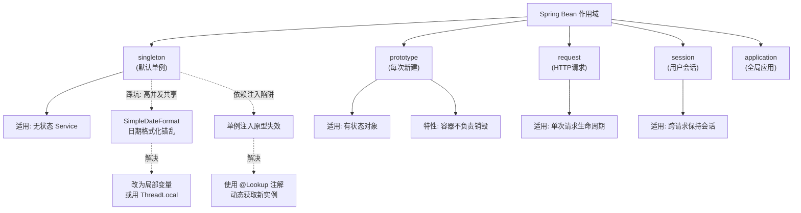

# Spring Bean 作用域是什么？

### Spring Bean 作用域

Spring 容器在初始化 Bean 实例时，提供了多种作用域，主要分为以下 5 种（其中 3 种仅适用于 Web 环境）：

1.  **singleton (单例模式)**
    *   **描述**：默认作用域。IOC 容器中只存在一个共享的 Bean 实例。
    *   **注意**：多线程环境下共享该实例，需注意线程安全问题（通常建议保持无状态）。

2.  **prototype (原型模式)**
    *   **描述**：每次获取 Bean 时，容器都会创建一个新的实例。
    *   **生命周期**：容器只负责创建和初始化，销毁回调由调用方管理。

3.  **request (Web应用)**
    *   **描述**：每一次 HTTP 请求都会产生一个新的 Bean，该 Bean 仅在当前 HTTP request 内有效。

4.  **session (Web应用)**
    *   **描述**：同一个 HTTP Session 共享一个 Bean 实例，不同的 Session 拥有不同的实例。

5.  **globalSession (Web应用)**
    *   **描述**：类似于标准的 HTTP Session 作用域，但仅用于基于 Portlet 的 Web 应用中。

**补充关键细节：**
*   **Bean 的线程安全**：对于 singleton Bean，如果是无状态的（如 Service 层只做计算不存数据），则是线程安全的；如果是有状态的（如存储了用户信息），则需要在代码层面加锁或使用 ThreadLocal，或者将作用域改为 prototype。
*   **Web 作用域的实现原理**：在 Web 应用中，Spring 使用 `RequestContextHolder` 和 `RequestListener` 机制。对于 request 作用域，Spring 会通过 Filter/DispatcherServlet 在请求开始时将 Bean 放入 RequestAttribute 中，请求结束时销毁。
*   **Spring 5.0 新增作用域**：
    *   **application**：ServletContext 作用域，整个 Web 应用共享一个实例。
    *   **websocket**：WebSocket 生命周期作用域。
*   **依赖注入的特殊情况**：当一个 singleton Bean 依赖一个 prototype Bean 时，请注意 prototype Bean 只会在 singleton Bean 初始化时注入一次。如果希望每次调用都能拿到新的 prototype Bean，需要使用 `@Lookup` 注解或 `ObjectProvider`。

#### 对比表格

| 作用域 | 描述 | 实例数量 | 线程安全性 | 典型应用场景 |
| :--- | :--- | :--- | :--- | :--- |
| **singleton** | 容器内唯一实例 | 1 | **不安全** (需保持无状态) | 工具类、无状态 Service、默认配置 |
| **prototype** | 每次请求创建新实例 | N | 安全 (独立实例) | 有状态对象、命令对象、非共享资源 |
| **request** | 每次 HTTP 请求一个实例 | N/Request | 安全 (线程隔离) | 请求级数据封装、用户当前操作上下文 |
| **session** | 同一个 Session 共享 | N/Session | 需注意 (Session 同步) | 购物车、用户登录信息 |
| **application** | ServletContext 生命周期 | 1/WebApp | 不安全 | 全局配置、后台服务统计器 |

#### 实战案例
> **踩坑经验**：在多线程环境下，曾在一个 Singleton 的 Service 类中直接定义了一个 `SimpleDateFormat` 成员变量（它是有状态的），导致高并发下日期格式化结果错乱。**解决方案**：将 `SimpleDateFormat` 改为局部变量，或使用 `DateTimeFormatter`（线程安全），或使用 `ThreadLocal` 包装。

#### 代码示例
```java
// 解决 Singleton 依赖 Prototype 失效问题：使用 @Lookup 注解
@Component
public class SingletonService {

    // 每次调用 process() 都会获取一个新的 PrototypeBean 实例
    public void process() {
        PrototypeBean bean = getPrototypeBean();
        bean.execute();
    }

    @Lookup
    public PrototypeBean getPrototypeBean() {
        return null; // Spring 会在运行时重写此方法
    }
}

@Component
@Scope("prototype")
public class PrototypeBean {
    public void execute() { System.out.println("Prototype instance: " + this.hashCode()); }
}
```

---

## 常见考点
1.  **prototype Bean 的销毁**：为什么 Spring 容器不负责销毁 prototype Bean？（因为容器创建了Bean并将其交给客户端，之后容器不再持有该对象的引用，无法追踪其生命周期）。
2.  **Request 作用域在非 Web 环境**：如果在普通的 Java SE 环境中配置 request 作用域会发生什么？（会抛出 IllegalStateException，因为容器无法找到相关的 Scope 实现，通常需要配置 SimpleThreadScope 来模拟）。
3.  **自定义 Scope**：如何实现自定义作用域？（实现 `org.springframework.beans.factory.config.Scope` 接口，并调用 `ConfigurableBeanFactory.registerScope` 注册）。

## 流程图




## 记忆要点

- 核心作用域：singleton单例(默认共享唯一)与prototype原型(每次新建)
- Web三大作用域：request(单次HTTP请求)、session(用户会话)、application(全局应用)
- 生命周期差异：prototype作用域的Bean，Spring容器不负责销毁回调
- 并发安全：singleton需保持无状态，若需有状态或独立实例则用prototype
- 依赖陷阱：单例注入原型时只注入一次，需用@Lookup注解解决获取新实例问题

## 结构化回答

**30 秒电梯演讲：** 定义Bean实例在容器中的创建方式和存活范围。打个比方，singleton是全校共用一个篮球场，prototype是每人发一个篮球。

**展开框架：**
1. **核心作用域** — singleton单例(默认共享唯一)与prototype原型(每次新建)
2. **Web三大作用域** — request(单次HTTP请求)、session(用户会话)、application(全局应用)
3. **生命周期差异** — prototype作用域的Bean，Spring容器不负责销毁回调

**收尾：** 我在项目里踩过坑——> 在多线程环境下，曾在一个 Singleton 的 Service 类中直接定义了一个 `SimpleDateFormat` 成员变量（它是有状态的），导致高并发下日期格式化结果错乱。您想深入聊哪一段：原理、避坑还是对比选型？

## 视频脚本

> 预计时长：3 分钟 | 由浅入深

| 时间 | 画面/字幕 | 口播台词 | 讲解要点 |
|------|----------|----------|----------|
| 0:00 | 标题卡：Spring Bean 作用域是什么 | "Spring Bean 作用域是什么？一句话——singleton是全校共用一个篮球场，prototype是每人发一个篮球。" | 开场钩子 |
| 0:45 | 概念动画/示意图 | "定义Bean实例在容器中的创建方式和存活范围——singleton是全校共用一个篮球场，prototype是每人发一个篮球" | 核心定义 |
| 1:30 | 核心作用域示意 | "singleton单例(默认共享唯一)与prototype原型(每次新建)" | 要点1 |
| 2:15 | Web三大作用域示意 | "request(单次HTTP请求)、session(用户会话)、application(全局应用)" | 要点2 |
| 3:00 | 总结卡 | "记住这几条，面试不慌。下期讲进阶追问。" | 收尾 |
