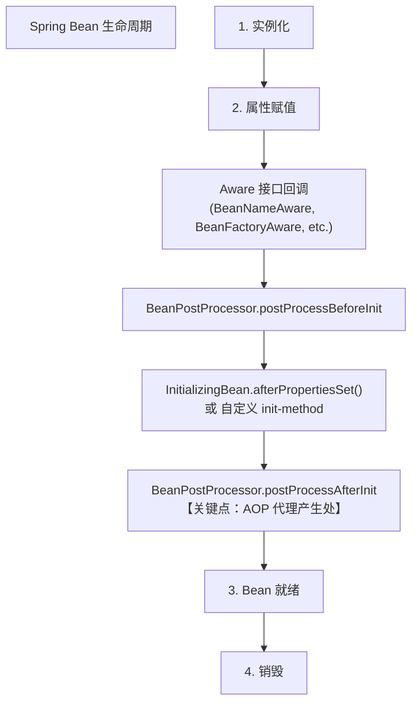

# Spring Bean 生命周期是什么？

### Spring Bean 生命周期

Spring Bean 的完整生命周期从创建到销毁，经历了一系列复杂的流程。对于 ApplicationContext 容器，主要阶段如下：

1. **实例化**：容器通过构造器创建 Bean 的实例（如果存在工厂方法则通过工厂方法实例化）。
2. **属性赋值**：注入配置的属性值和依赖的 Bean。
3. **BeanNameAware**：如果实现了该接口，调用 `setBeanName` 传入 Bean 的名称。
4. **BeanFactoryAware**：如果实现了该接口，调用 `setBeanFactory` 传入 BeanFactory。
5. **ApplicationContextAware**：如果实现了该接口，调用 `setApplicationContext` 传入 ApplicationContext。
6. **BeanPostProcessor (前置处理)**：调用 `postProcessBeforeInitialization` 方法。
7. **InitializingBean**：如果实现了该接口，调用 `afterPropertiesSet` 方法。
8. **init-method**：执行配置文件中定义的 `init-method` 方法。
9. **BeanPostProcessor (后置处理)**：调用 `postProcessAfterInitialization` 方法（此时 Bean 已就绪）。
10. **使用 Bean**：Bean 处于可用状态，被应用调用。
11. **DisposableBean**：容器关闭时，如果实现了该接口，调用 `destroy` 方法。
12. **destroy-method**：执行配置文件中定义的 `destroy-method` 方法。

#### 流程图解



#### 实战案例
> **工程场景**：在一个微服务项目中，需要在 Bean 初始化完成后加载本地缓存字典数据，并在服务关闭时将缓存状态持久化到数据库。**实现**：通过实现 `InitializingBean` 接口在 `afterPropertiesSet` 中加载缓存，通过 `@PreDestroy` 注解（或 DisposableBean）在销毁前保存数据。

#### 代码示例
```java
@Component
public class LifecycleDemoBean implements InitializingBean, DisposableBean {

    @Override
    public void afterPropertiesSet() throws Exception {
        // 初始化回调：加载资源、建立连接
        System.out.println("[Init] Bean 初始化完成，资源已加载");
    }

    @PostConstruct // 推荐使用 JSR-250 注解，解耦 Spring API
    public void initAnnotation() {
        System.out.println("[PostConstruct] 注解方式初始化");
    }

    @Override
    public void destroy() throws Exception {
        // 销毁回调：释放连接、清理临时文件
        System.out.println("[Destroy] Bean 即将销毁，资源已释放");
    }

    @PreDestroy
    public void destroyAnnotation() {
        System.out.println("[PreDestroy] 注解方式销毁");
    }
}
```

#### 关键节点对比

| 阶段 | 接口/注解 | 触发时机 | 典型用途 | 执行顺序 (同类) |
| :--- | :--- | :--- | :--- | :--- |
| **初始化** | `@PostConstruct` | 属性赋值后，Init前 | 校验参数、加载缓存 | 1
| | `InitializingBean` | 属性赋值后 | 复杂初始化逻辑 | 2
| | `init-method` | InitializingBean后 | XML/Config配置的初始化 | 3
| **销毁** | `@PreDestroy` | 容器关闭前 | 清理临时文件、优雅停机 | 1
| | `DisposableBean` | 容器关闭时 | 释放资源、关闭流 | 2
| | `destroy-method` | DisposableBean后 | XML/Config配置的清理 | 3 |


## 记忆要点

- 生命周期四阶段：实例化、属性赋值、初始化、销毁
- Aware接口回调：在初始化前注入底层容器组件
- 初始化三连：BeanPostProcessor前置 -> InitializingBean/init-method -> 后置处理
- AOP生成点：AOP动态代理在BeanPostProcessor后置处理阶段生成
- 销毁阶段：仅在容器关闭时触发DisposableBean和destroy-method回调

## 结构化回答

**30 秒电梯演讲：** 管理Bean从诞生到消亡的全过程。打个比方，产品生产线：零件组装（属性注入）、质检（初始化）、出厂（使用）、报废（销毁）。

**展开框架：**
1. **生命周期四阶段** — 实例化、属性赋值、初始化、销毁
2. **Aware接口回调** — 在初始化前注入底层容器组件
3. **初始化三连** — BeanPostProcessor前置 -> InitializingBean/init-method -> 后置处理

**收尾：** 我在项目里踩过坑——> 在一个微服务项目中，需要在 Bean 初始化完成后加载本地缓存字典数据，并在服务关闭时将缓存状态持久化到数据库。您想深入聊哪一段：原理、避坑还是对比选型？

## 视频脚本

> 预计时长：3 分钟 | 由浅入深

| 时间 | 画面/字幕 | 口播台词 | 讲解要点 |
|------|----------|----------|----------|
| 0:00 | 标题卡：Spring Bean 生命周期是什… | "Spring Bean 生命周期是什么？一句话——产品生产线：零件组装（属性注入）、质检（初始化）、出厂（使用）、报废（销毁）。" | 开场钩子 |
| 0:45 | 概念动画/示意图 | "管理Bean从诞生到消亡的全过程——产品生产线：零件组装（属性注入）、质检（初始化）、出厂（使用）、报废（销毁）" | 核心定义 |
| 1:30 | 生命周期四阶段示意 | "实例化、属性赋值、初始化、销毁" | 要点1 |
| 2:15 | Aware接口回调示意 | "在初始化前注入底层容器组件" | 要点2 |
| 3:00 | 总结卡 | "记住这几条，面试不慌。下期讲进阶追问。" | 收尾 |
