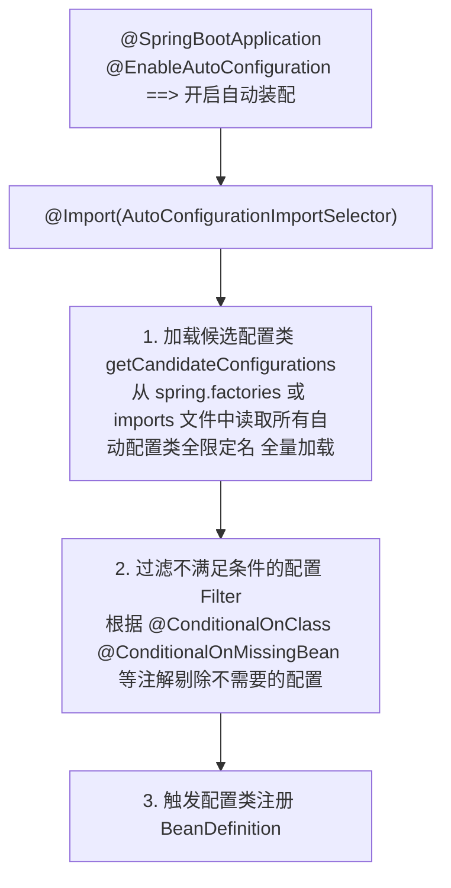

# Spring Boot自动装配的过程是什么？

### Spring Boot 自动装配的过程

Spring Boot 的自动装配是其核心特性，旨在简化配置。其核心过程如下：

1.  **启动引导**：`@SpringBootApplication` 是一个复合注解，其中包含了 `@EnableAutoConfiguration`，该注解开启了自动装配功能。

2.  **加载配置**：
    *   `@EnableAutoConfiguration` 通过 `@Import(AutoConfigurationImportSelector.class)` 导入选择器。
    *   `AutoConfigurationImportSelector` 从 `META-INF/spring.factories` (Spring Boot 2.7 及以下) 或 `META-INF/spring/org.springframework.boot.autoconfigure.AutoConfiguration.imports` (Spring Boot 3.0+) 文件中加载所有候选的自动配置类。

3.  **按需装配**：
    *   根据 `@Conditional` 系列注解（如 `@ConditionalOnClass`, `@ConditionalOnMissingBean` 等）进行判断。
    *   只有当类路径下存在指定的类，或者容器中不存在特定的 Bean 时，对应的自动配置类才会生效。

4.  **注册 Bean**：
    *   生效的配置类会根据 `@Bean` 等注解将所需的组件注册到 Spring 容器中，从而完成默认配置注入。

#### 核心流程图



#### 实战案例
> **自定义 Starter 场景**：公司内部封装了一个通用的短信发送服务。为了各业务线引入即用，我们自定义了 `sms-spring-boot-starter`。
> **实现步骤**：创建一个配置类 `SmsAutoConfiguration`，在 `META-INF/spring/org.springframework.boot.autoconfigure.AutoConfiguration.imports` 文件中添加该类的全限定名。在配置类上使用 `@ConditionalOnClass(SmsService.class)` 确保引入了相关依赖包才生效，并使用 `@EnableConfigurationProperties(SmsProperties.class)` 绑定配置文件中的 `sms.access-key` 等属性。

#### 代码示例
```java
// 自定义自动配置类
@Configuration // 标记为配置类
@ConditionalOnClass(SmsService.class) // 只有类路径下存在 SmsService 才生效
@EnableConfigurationProperties(SmsProperties.class) // 绑定配置属性
public class SmsAutoConfiguration {

    @Bean
    @ConditionalOnMissingBean // 容器中没有该 Bean 时才创建，允许用户覆盖
    public SmsService smsService(SmsProperties properties) {
        return new SmsService(properties.getAccessKey(), properties.getSecret());
    }
}

// 配置属性类
@ConfigurationProperties(prefix = "custom.sms")
public class SmsProperties {
    private String accessKey;
    private String secret;
    // getters & setters
}
```

#### 常用条件注解对比

| 注解 | 判定条件 | 应用场景 |
| :--- | :--- | :--- |
| `@ConditionalOnClass` | 类路径下存在指定类 | 依赖特定包的功能开关（如 RedisTemplate 依赖 jedis） |
| `@ConditionalOnMissingClass` | 类路径下不存在指定类 | 排除某些包时的降级处理 |
| `@ConditionalOnBean` | 容器中存在指定 Bean | 依赖其他组件时才装配（如依赖 DataSource） |
| `@ConditionalOnMissingBean` | 容器中不存在指定 Bean | **允许用户自定义覆盖**默认 Bean（非常关键） |
| `@ConditionalOnProperty` | 配置文件中指定的属性是否为 true | 通过 `application.yml` 控制功能开关 |
| `@ConditionalOnWebApplication` | 当前是 Web 环境 | 仅在 Web 项目中加载 MVC 相关配置 |


## 记忆要点

- 核心入口：启动类的@EnableAutoConfiguration注解触发自动装配机制
- 加载机制：通过Selector读取spring.factories或imports文件全量加载候选配置类
- 按需装配：根据@Conditional系列注解(如OnClass)过滤，满足条件才注入容器
- SPI思想：利用约定路径的配置文件，实现组件自动化按需装配
- 版本差异：Boot 2.7及以前读spring.factories，3.0后改读imports文件

## 结构化回答

**30 秒电梯演讲：** 根据依赖和条件自动注册Bean到容器。打个比方，像智能装修，系统根据你买的家具（依赖）自动把房间布局（配置）好。

**展开框架：**
1. **核心入口** — 启动类的@EnableAutoConfiguration注解触发自动装配机制
2. **加载机制** — 通过Selector读取spring.factories或imports文件全量加载候选配置类
3. **按需装配** — 根据@Conditional系列注解(如OnClass)过滤，满足条件才注入容器

**收尾：** 我在项目里踩过坑——> 公司内部封装了一个通用的短信发送服务。您想深入聊哪一段：原理、避坑还是对比选型？

## 视频脚本

> 预计时长：3 分钟 | 由浅入深

| 时间 | 画面/字幕 | 口播台词 | 讲解要点 |
|------|----------|----------|----------|
| 0:00 | 标题卡：Spring Boot自动装配的过程… | "Spring Boot自动装配的过程是什么？一句话——像智能装修，系统根据你买的家具（依赖）自动把房间布局（配置）好。" | 开场钩子 |
| 0:45 | 概念动画/示意图 | "根据依赖和条件自动注册Bean到容器——像智能装修，系统根据你买的家具（依赖）自动把房间布局（配置）好" | 核心定义 |
| 1:30 | 核心入口示意 | "启动类的@EnableAutoConfiguration注解触发自动装配机制" | 要点1 |
| 2:15 | 加载机制示意 | "通过Selector读取spring.factories或imports文件全量加载候选配置类" | 要点2 |
| 3:00 | 总结卡 | "记住这几条，面试不慌。下期讲进阶追问。" | 收尾 |

---

## 延伸：自动配置Spring

> 合并自 `jkc-034`（相似度 67%）

Spring Boot 自动配置的核心目标是「约定优于配置」，通过`@EnableAutoConfiguration`实现。其核心流程依赖于 `@Import` 导入的 `AutoConfigurationImportSelector`。

### 核心组件与流程
1. **启动入口**：`@SpringBootApplication` 是一个复合注解，包含了 `@EnableAutoConfiguration`。
2. **加载候选配置**：
   - **Spring Boot 2.x**：从 `META-INF/spring.factories` 文件中读取 `EnableAutoConfiguration` 的全限定类名。
   - **Spring Boot 3.x**：从 `META-INF/spring/org.springframework.boot.autoconfigure.AutoConfiguration.imports` 文件读取（读取性能更优）。
3. **按需装配**：利用 `OnClassCondition`、`OnBeanCondition` 等筛选器，结合 `@Conditional` 系列注解过滤掉不符合条件的配置类。

```text
+-------------------+
| @SpringBootApplication |
+--------+----------+
         | (包含)
         v
+-------------------+
|@EnableAutoConfiguration| -> @Import(AutoConfigurationImportSelector.class)
+--------+----------+
         |
         | 1. getAutoConfigurationEntry (获取入口)
         | 2. getCandidateConfigurations (加载候选配置)
         v
+---------------------------------------------------+
|  META-INF/spring.factories (2.x) OR .imports (3.x) |
|  [读取所有 127+ 个候选配置类]                     |
+---------------------+-----------------------------+
                      |
                      | 3. filter (过滤)
                      v
          +---------------------------+
          | 条件评估 (@Conditional...) |
          +-----------+---------------+
                      |
          (是否引入相关依赖? Classpath是否存在?)
                      |
          +-----------+---------------+
          | 符合条件的 Configurations |
          +-----------+---------------+
                      |
                      | 4. registerBean (注册到IOC容器)
                      v
              +-------+-------+
              |  ApplicationContext |
              +---------------+-------+
```

### 常用条件注解
- `@ConditionalOnClass(Class)`：类路径下存在指定类才生效。
- `@ConditionalOnMissingBean(Type)`：容器中不存在指定 Bean 时才生效（允许用户覆盖默认配置）。
- `@ConditionalOnProperty(prefix="...", name="...", havingValue="...")`：配置文件中属性匹配才生效。

### 实战深化
**实战案例**：在微服务项目中，引入了 `spring-boot-starter-data-redis` 依赖，但希望自定义 `RedisTemplate` 的序列化方式（改为 JSON）。若直接在配置类中声明 Bean，会利用 `@ConditionalOnMissingBean` 覆盖默认自动配置；若未声明，Boot 自动装配生效但默认使用 JDK 序列化，导致 Redis 中存储乱码。

**关键代码**：
```java
@Configuration
public class RedisConfig {
    @Bean
    // 覆盖默认自动配置中的 RedisTemplate
    public RedisTemplate<String, Object> redisTemplate(RedisConnectionFactory factory) {
        RedisTemplate<String, Object> template = new RedisTemplate<>();
        template.setConnectionFactory(factory);
        // 使用 Jackson2JsonRedisSerializer 替换默认序列化
        template.setKeySerializer(new StringRedisSerializer());
        return template;
    }
}
```

## 常见考点
1. **如何自定义 Starter？**
   - 创建一个 `spring.factories`/`imports` 文件，编写自动配置类，

## 记忆要点

- 核心思想：约定优于配置，借助@EnableAutoConfiguration启动自动装配机制。
- 加载机制：2.x读取spring.factories，而3.x读取.imports文件加载候选配置类。
- 按需装配：结合@Conditional系列注解(如OnClassCondition)按需过滤并注入IOC。
- 覆盖机制：自动配置常配合@ConditionalOnMissingBean，实现用户自定义配置的优先覆盖。

## 结构化回答

**30 秒电梯演讲：** 根据依赖自动装配，用条件注解决定是否生效。打个比方，像智能插座，插上电器（依赖）就自动通电，不插就不通电。

**展开框架：**
1. **核心思想** — 约定优于配置，借助@EnableAutoConfiguration启动自动装配机制。
2. **加载机制** — 2.x读取spring.factories，而3.x读取.imports文件加载候选配置类。
3. **按需装配** — 结合@Conditional系列注解(如OnClassCondition)按需过滤并注入IOC。

**收尾：** 我在项目里踩过坑——public class RedisConfig {。您想深入聊哪一段：原理、避坑还是对比选型？

## 视频脚本

> 预计时长：3 分钟 | 由浅入深

| 时间 | 画面/字幕 | 口播台词 | 讲解要点 |
|------|----------|----------|----------|
| 0:00 | 标题卡：自动配置Spring | "自动配置Spring？一句话——像智能插座，插上电器（依赖）就自动通电，不插就不通电。" | 开场钩子 |
| 0:45 | 概念动画/示意图 | "根据依赖自动装配，用条件注解决定是否生效——像智能插座，插上电器（依赖）就自动通电，不插就不通电" | 核心定义 |
| 1:30 | 核心思想示意 | "约定优于配置，借助@EnableAutoConfiguration启动自动装配机制。" | 要点1 |
| 2:15 | 加载机制示意 | "2.x读取spring.factories，而3.x读取.imports文件加载候选配置类。" | 要点2 |
| 3:00 | 总结卡 | "记住这几条，面试不慌。下期讲进阶追问。" | 收尾 |
