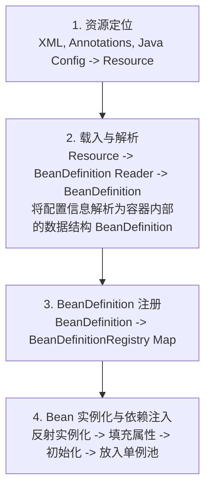

# Spring IOC原理是什么？

### Spring IOC 原理

**概念**
Spring 通过一个配置文件（或注解）描述 Bean 及 Bean 之间的依赖关系，利用 Java 语言的反射功能实例化 Bean 并建立 Bean 之间的依赖关系。 Spring 的 IoC 容器在完成这些底层工作的基础上，还提供了 Bean 实例缓存、生命周期管理、 Bean 实例代理、事件发布、资源装载等高级服务。

**Spring 容器高层视图**
Spring 启动时读取应用程序提供的 Bean 配置信息，并在 Spring 容器中生成一份相应的 Bean 配置注册表，然后根据这张注册表实例化 Bean，装配好 Bean 之间的依赖关系，为上层应用提供准备就绪的运行环境。其中 Bean 缓存池由 HashMap 实现。

#### IOC 容器工作流程图



**IOC 容器实现**

**1. BeanFactory（框架基础设施）**
BeanFactory 是 Spring 框架的基础设施，面向 Spring 本身。它采用延迟加载策略，只有在 getBean 时才实例化对象。

**2. ApplicationContext（面向开发者）**
ApplicationContext 是 BeanFactory 的子接口，提供了更多企业级功能，如事件发布、国际化支持、资源加载等。它采用预实例化策略，容器启动时即刻完成所有单例 Bean 的初始化。

#### 实战案例
在微服务架构中，若使用 BeanFactory 延迟加载，可能会将 NPE 或配置错误隐藏到请求流量高峰期才暴露；而使用 ApplicationContext 可在启动阶段通过 `refresh()` 方法快速fail-fast（故障早发现），避免上线后事故。

#### 代码示例（Java）
```java
// 模拟 Spring 底层通过反射创建 Bean 并注入依赖
public class SimpleContainer {
    private Map<String, Object> singletonObjects = new HashMap<>();

    public Object getBean(Class<?> clazz) throws Exception {
        String beanName = clazz.getSimpleName();
        if (singletonObjects.containsKey(beanName)) {
            return singletonObjects.get(beanName);
        }
        // 1. 实例化
        Object instance = clazz.getDeclaredConstructor().newInstance();
        singletonObjects.put(beanName, instance);
        // 2. 依赖注入（简化版：仅处理字段）
        for (Field field : clazz.getDeclaredFields()) {
            field.setAccessible(true);
            Object dependency = getBean(field.getType()); // 递归获取依赖
            field.set(instance, dependency);
        }
        return instance;
    }
}
```

#### 核心接口对比
| 特性 | BeanFactory | ApplicationContext |
| :--- | :--- | :--- |
| **加载方式** | 延迟加载 | 饿汉式（启动时加载） |
| **功能丰富度** | 基础 DI 功能 | 丰富（事件、国际化、资源加载） |
| **适用场景** | 轻量级应用、移动端 | 企业级应用、Web 应用 |
| **实现类** | XmlBeanFactory | ClassPathXmlApplicationContext, AnnotationConfigServletWebServerApplicationContext |

## 记忆要点

- 核心定义：控制反转，将对象创建和依赖关系交给容器管理，解耦组件
- 流程四步：资源定位 -> 解析为BeanDefinition -> 注册到容器 -> 实例化与注入
- 容器对比：BeanFactory是延迟加载(基础)；ApplicationContext是预加载(企业级)
- 底层实现：利用Java反射机制实例化对象，底层维护单例缓存池HashMap
- 核心价值：降低对象间耦合，提供生命周期管理与统一的获取入口

## 结构化回答

**30 秒电梯演讲：** 通过反射和配置，由容器管理对象创建与依赖。打个比方，像租房管家，你只需提需求，管家负责找房、签合同。

**展开框架：**
1. **核心定义** — 控制反转，将对象创建和依赖关系交给容器管理，解耦组件
2. **流程四步** — 资源定位 -> 解析为BeanDefinition -> 注册到容器 -> 实例化与注入
3. **容器对比** — BeanFactory是延迟加载(基础)；ApplicationContext是预加载(企业级)

**收尾：** 我在项目里踩过坑——在微服务架构中，若使用 BeanFactory 延迟加载，可能会将 NPE 或配置错误隐藏到请求流量高峰期才暴露；而使用 ApplicationContext 可在启动阶段通过 `refresh()` 方法快速fail-fast（故障早发现），避免上线后事故。您想深入聊哪一段：原理、避坑还是对比选型？

## 视频脚本

> 预计时长：3 分钟 | 由浅入深

| 时间 | 画面/字幕 | 口播台词 | 讲解要点 |
|------|----------|----------|----------|
| 0:00 | 标题卡：Spring IOC原理是什么 | "Spring IOC原理是什么？一句话——像租房管家，你只需提需求，管家负责找房、签合同。" | 开场钩子 |
| 0:45 | 概念动画/示意图 | "通过反射和配置，由容器管理对象创建与依赖——像租房管家，你只需提需求，管家负责找房、签合同" | 核心定义 |
| 1:30 | 核心定义示意 | "控制反转，将对象创建和依赖关系交给容器管理，解耦组件" | 要点1 |
| 2:15 | 流程四步示意 | "资源定位 -> 解析为BeanDefinition -> 注册到容器 -> 实例化与注入" | 要点2 |
| 3:00 | 总结卡 | "记住这几条，面试不慌。下期讲进阶追问。" | 收尾 |

---

## 延伸：什么是IoC？

> 合并自 `fw-016`（相似度 66%）

### 什么是IoC？

**IoC: Inversion of Control (控制反转)**

*   **核心概念**：将创建对象的控制权从程序代码内部（手动 `new` 对象）转移到了外部容器身上。
*   **通俗理解**：传统开发中，对象 A 需要对象 B，则 A 直接创建 B（A 控制了 B 的创建）；IoC 思想下，A 不再创建 B，而是等待容器把 B 送过来（容器控制了 B 的创建和分配，控制权发生了反转）。

**DI: Dependency Injection (依赖注入)**

*   **定义**：IoC 的主要实现方式。创建被调用对象由 Spring 来完成，在容器实例化对象的时候，主动将被调用者（依赖对象）注入给调用者。
*   **本质**：“控制反转”是目标，“依赖注入”是实现手段。

**IoC 和 DI 的关系**

它们是同一个概念的不同角度描述：
1.  **IoC (控制反转)**：强调的是**目的**和**结果**——对象的控制权转移到了容器，实现了对象间的解耦。
2.  **DI (依赖注入)**：强调的是**过程**和**手段**——容器是如何将依赖对象注入到目标对象中的（构造方法、Setter、字段注入）。

**Spring IoC 容器工作原理**

Spring 的 IoC 容器不仅仅是简单的工厂，它还是一个功能完备的生命周期管理器。其工作主要分为两个阶段：

1.  **容器启动阶段**
    *   **配置加载**：以某种方式（XML、注解、Java Config）将 Bean 的定义信息加载进内存。
    *   **BeanDefinition**：Spring 将配置解析为 `BeanDefinition` 对象，这是 Bean 的元数据（类似蓝图），此时 Bean 还未实例化。

2.  **Bean 实例化阶段**
    *   **实例化**：容器根据 BeanDefinition 进行实例化（反射）。
    *   **属性填充**：进行依赖注入（DI），设置 Bean 的属性。
    *   **初始化**：执行 `InitializingBean`、`init-method` 等。
    *   **销毁**：注册回调接口，当容器关闭时执行 `DisposableBean`、`destroy-method`。

**实战案例**：
在旧项目中，经常使用单例模式配合静态工厂来获取数据库连接池。切换到 Spring IoC 后，只需配置一个 `DataSource` Bean，所有需要数据库连接的类只需通过 `@Autowired` 注入即可。**踩坑经验**：如果在单例 Bean 中直接注入原型 Bean，依赖只会注入一次，导致后续使用“状态”不变，此时需使用 `ObjectProvider` 或 `@Lookup` 方法注入。

**代码示例（Java Config 配置）**：
```java
@Configuration
public class AppConfig {
    @Bean
    public OrderService orderService(ProductService productService) {
        // 通过构造器注入依赖，IoC 容器会自动传入 productService
        return new OrderService(productService); 
    }
}
```

**IoC 容器架构图（Bean 生命周期核心环节）：**

```text
┌─────────────────────────────────────────────────────────────────┐
│                    Spring IoC Container                          │
├─────────────────────────────────────────────────────────────────┤
│                                                                 │
│  1. 配置来源                                                    │
│     ├─ XML / Properties                                        │
│     ├─ Annotations (@Component, @Service)                       │
│     └─ Java Config (@Configuration)                             │
│          │                                                      │
│          ▼                                                      │
│  2. BeanDefinition (元数据/蓝图)                                │
│          │                                                      │
│          ▼                                                      │
│  3. BeanFactoryPostProcessor (工厂后置处理)

## 记忆要点

- 概念与关系：IoC是控制反转的思想（转移对象创建权），DI是依赖注入的手段（容器主动注入属性）。
- 核心流程：配置解析为BeanDefinition元数据蓝图，再由容器反射实例化、填充属性并初始化。
- 解耦与避坑：IoC实现对象解耦，但在单例Bean注入原型Bean时依赖只发生一次，需用@Lookup解决。

## 结构化回答

**30 秒电梯演讲：** 将对象创建与依赖管理的控制权交给容器。打个比方，像请管家管家，你要喝水只需吩咐，不用自己动手倒。

**展开框架：**
1. **概念与关系** — IoC是控制反转的思想（转移对象创建权），DI是依赖注入的手段（容器主动注入属性）。
2. **核心流程** — 配置解析为BeanDefinition元数据蓝图，再由容器反射实例化、填充属性并初始化。
3. **解耦与避坑** — IoC实现对象解耦，但在单例Bean注入原型Bean时依赖只发生一次，需用@Lookup解决。

**收尾：** 这三点都能配合实战聊。您想深入聊原理、对比还是避坑？

## 视频脚本

> 预计时长：2 分钟 | 由浅入深

| 时间 | 画面/字幕 | 口播台词 | 讲解要点 |
|------|----------|----------|----------|
| 0:00 | 标题卡：什么是IoC | "什么是IoC？一句话——像请管家管家，你要喝水只需吩咐，不用自己动手倒。" | 开场钩子 |
| 0:40 | 概念动画/示意图 | "将对象创建与依赖管理的控制权交给容器——像请管家管家，你要喝水只需吩咐，不用自己动手倒" | 核心定义 |
| 1:20 | 概念与关系示意 | "IoC是控制反转的思想（转移对象创建权），DI是依赖注入的手段（容器主动注入属性）。" | 要点1 |
| 2:00 | 总结卡 | "记住这几条，面试不慌。下期讲进阶追问。" | 收尾 |
