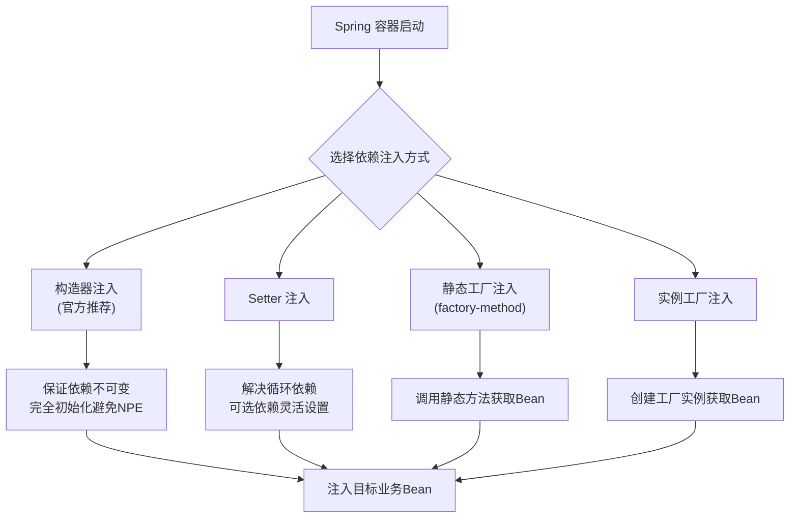

# Spring 依赖注入四种方式是什么？

### Spring 依赖注入四种方式

Spring 支持多种依赖注入方式，主要包括以下四种：

**1. Setter 注入**
通过调用无参构造器或无参静态工厂方法实例化 Bean 后，调用该 Bean 的 setter 方法即可实现基于属性的注入。
```xml
<bean id="id" class="com.Id">
  <property name="id" value="123"></property>
</bean>
```

**2. 构造器注入**
通过带参数的构造函数来实现注入，构造器注入可以保证组件在初始化时就已经完全就绪。
```xml
<bean id="catDao" class="com.CatDaoImpl">
  <constructor-arg value="message"></constructor-arg>
</bean>
```

**3. 静态工厂注入**
通过调用静态工厂的方法来获取对象，而不是直接通过 `new` 或反射创建对象。Spring 管理工厂类并指定 `factory-method`。
```xml
<!-- 工厂类 -->
<bean name="staticFactoryDao" class="com.DaoFactory" factory-method="getStaticFactoryDaoImpl"></bean>

<!-- 使用工厂产生的Bean -->
<bean name="springAction" class="com.SpringAction">
  <property name="staticFactoryDao" ref="staticFactoryDao"></property>
</bean>
```

**4. 实例工厂注入**
实例工厂的意思是获取对象实例的方法不是静态的，所以需要先创建工厂类的实例，再调用普通的实例方法来获取 Bean。
```xml
<!-- 工厂实例 -->
<bean name="daoFactory" class="com.DaoFactory"></bean>

<!-- 通过工厂实例的方法获取Bean -->
<bean name="factoryDao" factory-bean="daoFactory" factory-method="getFactoryDaoImpl"></bean>
```

#### 注入方式对比

| 方式 | 优点 | 缺点 | 适用场景 |
| :--- | :--- | :--- | :--- |
| **构造器注入** | 依赖不可变，保证对象初始化完成，避免 NPE | 构造参数过多时笨重，灵活性稍差 | 强依赖、必须的依赖 |
| **Setter 注入** | 灵活，可选依赖，兼容性好 | 依赖对象可能未初始化（未设值） | 可选依赖、多参数依赖 |
| **字段注入 (@Autowired)** | 代码简洁，看起来爽 | 容易空指针，不利于单元测试，违反单一职责 | 不推荐使用，仅用于旧代码维护 |

#### 实战案例
在重构遗留代码时，曾遇到大量字段注入导致的单元测试难以Mock问题。改用构造器注入后，不仅使得依赖关系一目了然，还能直接在测试中通过构造器传入Mock对象，极大提升了代码的可测试性和稳定性。

#### 代码示例（推荐写法）
```java
// 推荐：使用 Lombok 的 @RequiredArgsConstructor 实现构造器注入
@Service
@RequiredArgsConstructor
public class OrderService {
    private final PaymentService paymentService; // final 保证强依赖和不可变
    
    public void createOrder() {
        paymentService.pay();
    }
}
```

## 常见考点
1. **构造器注入 vs Setter 注入**：为什么 Spring 推荐使用构造器注入？（答：依赖不可变、能保证完全初始化、更易于编写不可变类、不依赖反射机制设值）。
2. **@Autowired 和 @Resource 的区别**：`@Autowired` 是 Spring 的注解，默认按 ByType 自动装配，如果有多个类型匹配则按 ByName；`@Resource` 是 JDK 的注解，默认按 ByName 装配，如果找不到则按 ByType。
3. **循环依赖**：构造器注入无法解决循环依赖，因为 Bean 在实例化阶段就需要依赖对象；而 Setter 注入（单例）可以解决。

## 流程图



## 记忆要点

- 四种方式：构造器、Setter、静态工厂、实例工厂方法注入
- 对比推荐：官方推荐构造器注入，保证依赖不可变且完全初始化避免NPE
- 注入痛点：@Autowired字段注入不利于单元测试，违反单一职责原则
- 循环依赖：构造器注入无法解决循环依赖，Setter注入可以
- 注解对比：@Autowired按类型，@Resource(默认)按名称匹配

## 结构化回答

**30 秒电梯演讲：** 将对象依赖通过配置或注解自动赋值，减少耦合。打个比方，像点外卖，你只要填好地址，配送员把餐送到你家。

**展开框架：**
1. **四种方式** — 构造器、Setter、静态工厂、实例工厂方法注入
2. **对比推荐** — 官方推荐构造器注入，保证依赖不可变且完全初始化避免NPE
3. **注入痛点** — @Autowired字段注入不利于单元测试，违反单一职责原则

**收尾：** 我在项目里踩过坑——在重构遗留代码时，曾遇到大量字段注入导致的单元测试难以Mock问题。您想深入聊哪一段：原理、避坑还是对比选型？

## 视频脚本

> 预计时长：3 分钟 | 由浅入深

| 时间 | 画面/字幕 | 口播台词 | 讲解要点 |
|------|----------|----------|----------|
| 0:00 | 标题卡：Spring 依赖注入四种方式是什么 | "Spring 依赖注入四种方式是什么？一句话——像点外卖，你只要填好地址，配送员把餐送到你家。" | 开场钩子 |
| 0:45 | 概念动画/示意图 | "将对象依赖通过配置或注解自动赋值，减少耦合——像点外卖，你只要填好地址，配送员把餐送到你家" | 核心定义 |
| 1:30 | 四种方式示意 | "构造器、Setter、静态工厂、实例工厂方法注入" | 要点1 |
| 2:15 | 对比推荐示意 | "官方推荐构造器注入，保证依赖不可变且完全初始化避免NPE" | 要点2 |
| 3:00 | 总结卡 | "记住这几条，面试不慌。下期讲进阶追问。" | 收尾 |
