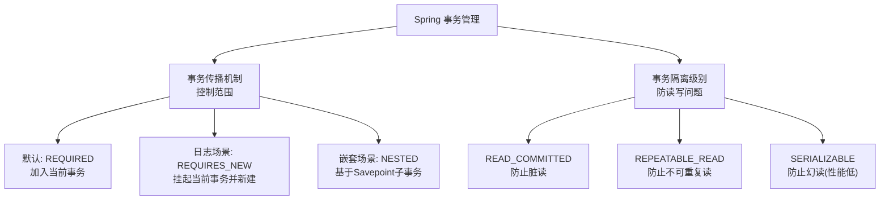

# Spring事务的传播机制和隔离级别是什么？

### Spring 事务的传播机制和隔离级别

事务是逻辑处理原子性的保证手段，通过使用事务控制，可以极大的避免出现逻辑处理失败导致的脏数据等问题。事务最重要的两个特性是传播级别和隔离级别。

#### 1. 事务传播机制
传播级别定义的是事务的控制范围，即当一个事务方法被另一个事务方法调用时，应该如何进行事务操作。

*   **PROPAGATION_REQUIRED** (默认)：如果上下文中已经存在事务，则加入到事务中执行；如果没有事务，则新建一个事务。
*   **PROPAGATION_SUPPORTS**：如果上下文存在事务，则支持事务加入事务；如果没有事务，则以非事务方式执行。
*   **PROPAGATION_MANDATORY**：强制要求上下文中必须存在事务，否则抛出异常。
*   **PROPAGATION_REQUIRES_NEW**：每次都会新建一个事务，并且将上下文中的事务挂起，当前新事务执行完毕后，上下文事务恢复执行。
*   **PROPAGATION_NOT_SUPPORTED**：以非事务方式执行操作，如果上下文存在事务，则将当前事务挂起。
*   **PROPAGATION_NEVER**：以非事务方式执行，如果上下文存在事务，则抛出异常。
*   **PROPAGATION_NESTED**：如果上下文存在事务，则嵌套事务执行；如果没有事务，则新建事务。嵌套事务是主事务的子事务，依赖于主事务的提交和回滚（基于 Savepoint）。

#### 传播行为示意图

```text
场景：Method A (事务) 调用 Method B

1. REQUIRED (默认)
   A(事务) ──────> B(加入A的事务)
   [ 两者同生共死，回滚都回滚 ]

2. REQUIRES_NEW (常用)
   A(事务) ──[挂起]──> B(新事务)
   [ B执行完提交，A恢复执行，B异常不影响A ]

3. NESTED (嵌套)
   A(事务) ───────> B(嵌套子事务/Savepoint)
   [ B异常回滚到Savepoint，A可选择提交或回滚；A回滚B必回滚 ]
```

#### 2. 事务隔离级别
隔离级别定义的是事务在数据库读写方面的控制范围，主要解决脏读、不可重复读、幻读等问题。

*   **ISOLATION_DEFAULT**：使用底层数据库的默认隔离级别。
*   **ISOLATION_READ_UNCOMMITTED**：读未提交，允许读取未被提交的数据（可能导致脏读）。
*   **ISOLATION_READ_COMMITTED**：读已提交，只能读取已提交的数据（防止脏读，但可能出现不可重复读）。
*   **ISOLATION_REPEATABLE_READ**：可重复读，保证在同一事务中多次读取同一数据的结果一致（防止脏读和不可重复读，但可能出现幻读）。
*   **ISOLATION_SERIALIZABLE**：串行化，最高的隔离级别，完全服从 ACID，强制事务串行执行（防止所有并发问题，但性能极低）。

#### 实战案例
在业务日志记录场景中，无论主业务是否成功，都需要记录操作日志。如果将日志方法与主业务放在同一事务（REQUIRED）中，日志回滚会导致数据丢失。此时应将日志方法设置为 `REQUIRES_NEW`，确保日志独立提交。

#### 代码示例
```java
@Service
public class OrderService {
    @Transactional(propagation = Propagation.REQUIRED)
    public void createOrder(Order order) {
        // 主业务逻辑
        orderMapper.insert(order);
        // 记录日志：独立事务，即使createOrder回滚，日志也保留
        logService.recordLog("订单创建", order.getId()); 
    }
}

@Service
public class LogService {
    @Transactional(propagation = Propagation.REQUIRES_NEW)
    public void recordLog(String action, Long orderId) {
        logMapper.insert(new Log(action, orderId));
    }
}
```

#### 传播机制实战选型对比
| 传播行为 | 外部无事务 | 外部有事务 | 实战应用场景 |
| :--- | :--- | :--- | :--- |
| **REQUIRED** | 开启新事务 | 融入外部事务 | 增删改操作（默认） |
| **REQUIRES_NEW** | 开启新事务 | 挂起外部事务，开启新事务 | 发送通知、记录独立审计日志 |
| **NESTED** | 开启新事务 | 建立回滚点 | 批量处理中的子步骤，出错部分回滚 |
| **SUPPORTS** | 非事务执行 | 融入外部事务 | 主要是查询，也可支持更新 |

## 常见考点
1. **Spring 事务失效的场景**：
    *   方法访问权限不是 public（final 方法也不行）。
    *   方法内部自调用（this 调用），即同类中非事务方法调用事务方法，绕过了 AOP 代理。
    *   异常被开发者手动 try-catch 捕获且未抛出，或者抛出了检查型异常但默认只回滚 RuntimeException。
    *   数据库引擎不支持事务（如 MySQL 的 MyISAM）。
2. **@Transactional 注解属性**：`rollbackFor` 和 `noRollbackFor` 的作用，默认情况下 Spring 只在抛出 `RuntimeException` 或 `Error` 时回滚。
3. **REQUIRES_NEW vs NESTED**：REQUIRES_NEW 是两个独立的事务，外层事务挂起；NESTED 是基于 Savepoint 的子事务，外层事务失败会波及子事务，子事务失败可以只回滚自己。

## 流程图



## 记忆要点

- 传播控范围（默认REQUIRED同生共死），隔离防读写（解决脏读不可重复读幻读）。
- 三大常用传播：REQUIRED融入、REQUIRES_NEW挂起新建、NESTED基于回滚点嵌套。
- 隔离级别层层递进：读未提交、读已提交、可重复读、串行化（性能极低）。
- 事务失效四大坑：非public、同类自调用绕过AOP、异常被吞或类型错误、引擎不支持。

## 结构化回答

**30 秒电梯演讲：** 控制事务边界与并发访问规则，保证数据一致性。打个比方，像银行转账，要么全成功要么全失败，防止同时操作出错。

**展开框架：**
1. **传播控范围（默认REQUIRED同生共死）** — 隔离防读写（解决脏读不可重复读幻读）。
2. **三大常用传播** — REQUIRED融入、REQUIRES_NEW挂起新建、NESTED基于回滚点嵌套。
3. **隔离级别层层递进** — 读未提交、读已提交、可重复读、串行化（性能极低）。

**收尾：** 我在项目里踩过坑——在业务日志记录场景中，无论主业务是否成功，都需要记录操作日志。您想深入聊哪一段：原理、避坑还是对比选型？

## 视频脚本

> 预计时长：3 分钟 | 由浅入深

| 时间 | 画面/字幕 | 口播台词 | 讲解要点 |
|------|----------|----------|----------|
| 0:00 | 标题卡：Spring事务的传播机制和隔离级别… | "Spring事务的传播机制和隔离级别是什么？一句话——像银行转账，要么全成功要么全失败，防止同时操作出错。" | 开场钩子 |
| 0:45 | 概念动画/示意图 | "控制事务边界与并发访问规则，保证数据一致性——像银行转账，要么全成功要么全失败，防止同时操作出错" | 核心定义 |
| 1:30 | 要点1图解示意 | "隔离防读写（解决脏读不可重复读幻读）。" | 要点1 |
| 2:15 | 三大常用传播示意 | "REQUIRED融入、REQUIRES_NEW挂起新建、NESTED基于回滚点嵌套。" | 要点2 |
| 3:00 | 总结卡 | "记住这几条，面试不慌。下期讲进阶追问。" | 收尾 |
