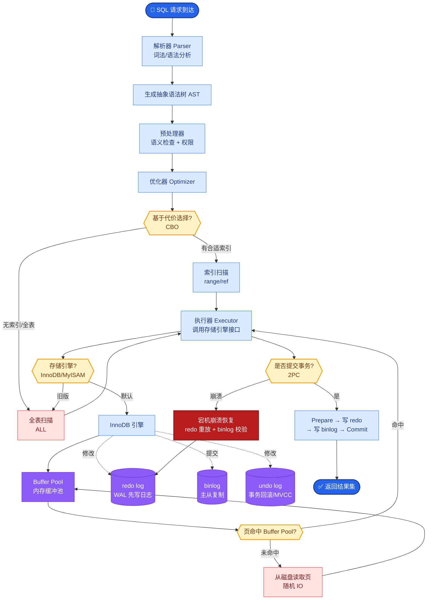

# Spring对AOP的支持是什么？

### Spring 对 AOP 的支持

**AOP 概念**
AOP (Aspect Oriented Programming)，即面向切面编程，是 OOP (Object Oriented Programming) 的补充和完善。OOP 引入封装、继承、多态等概念来建立一种对象层次结构，用于模拟公共行为的一个集合。然而 OOP 允许开发者定义纵向的关系，但并不适合定义横向的关系，例如日志、权限、事务等功能。这些横切关注点往往散布在各个对象中，导致代码重复和高耦合。

AOP 技术利用一种称为"横切"的技术，剖解开封装的对象内部，并将那些影响了多个类的公共行为封装到一个可重用模块，并将其命名为"Aspect"（切面）。AOP 的作用在于分离系统中的各种关注点，将核心关注点和横切关注点分离开来。

**AOP 核心概念**

1.  **横切关注点**：对哪些方法进行拦截，拦截后怎么处理。
2.  **切面**：类是对物体特征的抽象，切面就是对横切关注点的抽象。
3.  **连接点**：程序执行的某个特定位置（如方法调用时、异常抛出时）。Spring 中仅支持方法连接点。
4.  **切入点**：对连接点进行拦截的定义。
5.  **通知**：指拦截到连接点之后要执行的代码。通知分为前置、后置、异常、最终、环绕通知五类。
6.  **目标对象**：被代理的目标对象。
7.  **织入**：将切面应用到目标对象并导致代理对象创建的过程。
8.  **引入**：在不修改代码的前提下，引入可以在运行期为类动态地添加一些方法或字段。

**Spring 对 AOP 的支持**
Spring 中 AOP 代理由 Spring 的 IOC 容器负责生成、管理，其依赖关系也由 IOC 容器负责管理。Spring 创建代理的规则为：

1.  **默认使用 JDK 动态代理**：只要目标对象实现了接口，就使用 JDK 动态代理（基于接口实现）。
2.  **CGLIB 代理**：如果目标对象没有实现接口，则使用 CGLIB 代理（基于子类继承）。

注：在现代 Spring 版本（Spring Boot 2.x+）中，即便实现了接口，也可以通过配置强制使用 CGLIB。

**Spring AOP 代理调用流程图**
```text
   调用方 (Client)
       │
       ▼
┌───────────────────┐
│  Spring AOP 代理   │ ◄─── 由 IOC 容器创建
│  (Proxy Object)   │
└─────────┬─────────┘
          │
          │ 1. 匹配拦截器链
          ▼
┌───────────────────┐
│   切面逻辑        │ ◄─── 日志、事务、权限等
│  (Interceptors)   │
└─────────┬─────────┘
          │
          │ 2. 反射调用目标方法
          ▼
┌───────────────────┐
│   目标对象        │ ◄─── 业务逻辑
│  (Target Object)  │
└───────────────────┘
```

#### 实战案例
开发中曾遇到 `@Async` 注解不生效的问题，原因是该方法是同类中的 private 方法调用，绕过了 Spring 代理。解决方法是将其提取到独立的 Service 类中，或者通过注入 `ApplicationContext` 获取代理对象来调用。这体现了 AOP 代理必须基于接口或外部调用的局限性。

#### 代码示例（自定义注解 + 切面）
```java
@Aspect
@Component
public class LogAspect {
    // 定义切入点：拦截所有 Service 层方法
    @Pointcut("execution(* com.example.service.*.*(..))")
    public void serviceLayer() {}

    @Around("serviceLayer()")
    public Object logExecutionTime(ProceedingJoinPoint joinPoint) throws Throwable {
        long start = System.currentTimeMillis();
        Object proceed = joinPoint.proceed(); // 执行目标方法
        long executionTime = System.currentTimeMillis() - start;
        System.out.println(joinPoint.getSignature() + " executed in " + executionTime + "ms");
        return proceed;
    }
}
```

#### 代理方式对比
| 对比项 | JDK 动态代理 | CGLIB 代理 |
| :--- | :--- | :--- |
| **实现原理** | 反射机制，实现接口 | 字节码操作（ASM），继承子类 |
| **前提条件** | 目标类必须实现接口 | 目标类不能是 final，方法不能是 final |
| **性能** | 生成代理快，执行稍慢（JDK8后优化很好） | 生成代理慢，执行快（适合单例） |
| **默认策略** | Spring Boot 1.x 默认，有接口优先 | Spring Boot 2.x 默认倾向 CGLIB |

## 常见考点
1.  **JDK 动态代理与 CGLIB 的区别**：JDK 基于反射实现代理类，要求目标类必须实现接口；CGLIB 基于字节码操作（ASM）生成子类，目标类不能是 final，方法也不能是 final。
2.  **Spring AOP 与 AspectJ 的区别**：Spring AOP 属于运行时织入（基于代理），仅支持方法级别的连接点；AspectJ 支持编译期和类加载期织入，功能更强大（支持字段、构造器等），性能通常更好。
3.  **@Transactional 失效的场景**：例如方法访问权限非 public、同类内部方法调用（不经过代理）、异常被手动吞掉且未抛出 RuntimeException 等。


## 核心流程图



## 记忆要点

- 核心概念口诀：切面是类，切入点定拦截规则，通知定执行时机。
- 代理选型原则：有接口默认用JDK动态代理，无接口用CGLIB（SpringBoot2.x倾向CGLIB）。
- JDK基于接口实现，而CGLIB基于子类继承（不能拦截final方法/类）。
- 同类内部方法调用会失效（绕过代理），需注入自身代理对象或提取独立Bean解决。

## 结构化回答

**30 秒电梯演讲：** 将横切关注点（如日志）从业务逻辑中分离。打个比方，像切片面包，在面包之间夹火腿，不影响面包本身。

**展开框架：**
1. **核心概念口诀** — 切面是类，切入点定拦截规则，通知定执行时机。
2. **代理选型原则** — 有接口默认用JDK动态代理，无接口用CGLIB（SpringBoot2.x倾向CGLIB）。
3. **JDK基于接口实现** — 而CGLIB基于子类继承（不能拦截final方法/类）。

**收尾：** 我在项目里踩过坑——开发中曾遇到 `@Async` 注解不生效的问题，原因是该方法是同类中的 private 方法调用，绕过了 Spring 代理。您想深入聊哪一段：原理、避坑还是对比选型？

## 视频脚本

> 预计时长：3 分钟 | 由浅入深

| 时间 | 画面/字幕 | 口播台词 | 讲解要点 |
|------|----------|----------|----------|
| 0:00 | 标题卡：Spring对AOP的支持是什么 | "Spring对AOP的支持是什么？一句话——像切片面包，在面包之间夹火腿，不影响面包本身。" | 开场钩子 |
| 0:45 | 概念动画/示意图 | "将横切关注点（如日志）从业务逻辑中分离——像切片面包，在面包之间夹火腿，不影响面包本身" | 核心定义 |
| 1:30 | 核心概念口诀示意 | "切面是类，切入点定拦截规则，通知定执行时机。" | 要点1 |
| 2:15 | 代理选型原则示意 | "有接口默认用JDK动态代理，无接口用CGLIB（SpringBoot2.x倾向CGLIB）。" | 要点2 |
| 3:00 | 总结卡 | "记住这几条，面试不慌。下期讲进阶追问。" | 收尾 |
