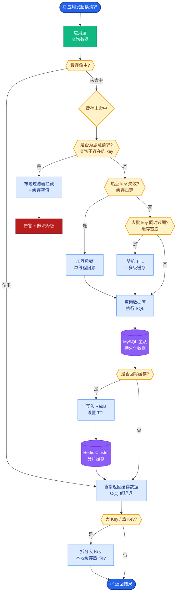

# Spring框架的特点和核心模块有哪些？

### Spring 框架的特点和核心模块

**1. Spring 框架特点**
*   **轻量级**：基础版本只有约 2MB，且核心所需的处理资源很少。
*   **控制反转 (IOC)**：通过 IOC 容器管理对象的创建和依赖关系，实现松耦合。
*   **面向切面 (AOP)**：将公共业务逻辑（如日志、事务）从业务逻辑中分离出来。
*   **容器**：Spring 包含并管理应用对象的配置和生命周期。
*   **框架集合**：Spring 提供了优秀的 Web 框架、持久层框架整合等一站式解决方案，且能与其他框架（如 Struts、Hibernate）无缝整合。

**2. 核心模块**
Spring 框架通常被分层为约 20 个模块，主要包含以下部分：

*   **核心容器**：由 Core、Beans、Context、SpEL 模块组成，提供 IOC 和依赖注入特性。
*   **数据访问/集成**：包括 JDBC、ORM、OXM、JMS 和 Transactions 模块，处理数据库交互。
*   **Web**：包括 Web、Servlet、Struts、Portlet 模块，提供面向 Web 的集成特性。
*   **AOP (Aspect Oriented Programming)**：提供与 AOP 联盟兼容的编程实现。
*   **Instrumentation**：提供类检测和类加载器实现的 instrumentation 支持。
*   **测试**：支持使用 JUnit 或 TestNG 对 Spring 组件进行测试。

**3. 实战案例与对比**

*   **实战案例**：在微服务架构中，利用 Spring 的 `ApplicationContext` 事件机制实现跨服务的配置中心动态刷新。当配置变更时，发布一个 `EnvironmentChangeEvent`，各个监听该事件的 Bean 自动更新缓存，避免了重启服务。这展示了容器作为事件总线的强大能力。

*   **代码示例 (Java - 演示 IOC 依赖注入)**：
```java
@Service
public class OrderService {
    // 利用 Spring IOC 自动注入 Repository，无需手动 new
    private final UserRepository userRepository; 

    public OrderService(UserRepository userRepository) {
        this.userRepository = userRepository;
    }
}
```

*   **对比表格：BeanFactory vs ApplicationContext**

| 特性 | BeanFactory | ApplicationContext |
| :--- | :--- | :--- |
| **定位** | Spring 基础设施，面向 Spring 本身 | 面向开发者，提供高级企业级功能 |
| **功能** | 仅包含基础的 DI 和 IOC 功能 | 继承 BeanFactory，增加国际化、事件传播、资源加载、AOP 等 |
| **初始化时机** | 延迟加载，只有获取 Bean 时才创建 | 预加载，容器启动时即初始化所有单例 Bean |
| **注册方式** | 手动注册或编程式注册 | 自动检测 Bean 定义 (如 @Component, @Service) |
| **适用场景** | 轻量级应用、移动设备、非 Web 环境 | 绝大多数企业级 Web 应用 |

**Spring 核心架构分层图**
```text
┌─────────────────────────────────────────────────────────────┐
│                         Web 层                               │
│              (Web, Servlet, Struts, Portlet)                │
├─────────────────────────────────────────────────────────────┤
│                      AOP / Aspects                          │
│                 (AOP, Aspects, Instrumentation)              │
├─────────────────────────────────────────────────────────────┤
│                     核心容器                                 │
│             (Core, Beans, Context, SpEL)                    │
├─────────────────────────────────────────────────────────────┤
│                   数据访问/集成                              │
│           (JDBC, ORM, OXM, JMS, Transactions)               │
├─────────────────────────────────────────────────────────────┤
│                       测试                                   │
│                   (Test)                                    │
└─────────────────────────────────────────────────────────────┘
```

## 常见考点
1.  **Spring 容器与 BeanFactory 的区别**：BeanFactory 是 Spring 基础容器，提供基础的 DI 功能；ApplicationContext 是 BeanFactory 的子接口，提供了更多企业级功能（如事件发布、国际化、资源加载等），它是运行时自动检测 Bean 的后处理器。
2.  **Spring 中设计模式的应用**：工厂模式、单例模式、代理模式（AOP）、模板方法模式（JdbcTemplate）、观察者模式（ApplicationEvent）。


## 核心流程图



## 记忆要点

- 核心IOC解耦（容器管理对象生命周期），AOP抽离公共逻辑（如日志事务）。
- 四大核心容器分层：Core/Beans负责基础，Context提供环境，SpEL负责表达式。
- 对比BeanFactory：ApplicationContext是进阶版，支持预加载、注解扫描和事件机制。
- 一站式整合层：上层Web(SpringMVC)，下层数据(JDBC/ORM)，旁侧AOP与Test。

## 结构化回答

**30 秒电梯演讲：** 轻量级一站式框架，通过IOC和AOP简化开发。打个比方，像瑞士军刀，集成了各种工具，需要什么用什么。

**展开框架：**
1. **核心IOC解耦（容器管理对象生命周期）** — AOP抽离公共逻辑（如日志事务）。
2. **四大核心容器分层** — Core/Beans负责基础，Context提供环境，SpEL负责表达式。
3. **对比BeanFactory** — ApplicationContext是进阶版，支持预加载、注解扫描和事件机制。

**收尾：** 我在项目里踩过坑——代码示例 (Java - 演示 IOC 依赖注入)：。您想深入聊哪一段：原理、避坑还是对比选型？

## 视频脚本

> 预计时长：3 分钟 | 由浅入深

| 时间 | 画面/字幕 | 口播台词 | 讲解要点 |
|------|----------|----------|----------|
| 0:00 | 标题卡：Spring框架的特点和核心模块有哪… | "Spring框架的特点和核心模块有哪些？一句话——像瑞士军刀，集成了各种工具，需要什么用什么。" | 开场钩子 |
| 0:45 | 概念动画/示意图 | "轻量级一站式框架，通过IOC和AOP简化开发——像瑞士军刀，集成了各种工具，需要什么用什么" | 核心定义 |
| 1:30 | 要点1图解示意 | "AOP抽离公共逻辑（如日志事务）。" | 要点1 |
| 2:15 | 四大核心容器分层示意 | "Core/Beans负责基础，Context提供环境，SpEL负责表达式。" | 要点2 |
| 3:00 | 总结卡 | "记住这几条，面试不慌。下期讲进阶追问。" | 收尾 |

---

## 延伸：简单介绍一下Spring的框架体系是什么？

> 合并自 `fw-047`（相似度 65%）

### Spring 框架体系

Spring框架体系由多个模块组成，主要包括：
1. **核心容器**：Core、Beans、Context、Expression Language，提供IOC和DI功能。
2. **AOP模块**：提供面向切面编程实现。
3. **数据访问/集成**：JDBC、ORM、OXM、JMS、Transaction模块。
4. **Web层**：Web、Servlet、Struts、Portlet模块（含Spring MVC）。
5. **测试模块**：支持JUnit和TestNG测试。
6. **其他**：Instrumentation（植入）、Messaging（消息）。

Spring是一个全面的IOC和AOP基础框架，Spring MVC是其Web模块，Spring Boot是基于Spring的快速开发脚手架。

**#### Spring 整体架构图**
```text
┌──────────────────────────────────────────────────────────────────────┐
│                          Spring Framework                             │
├──────────────────────────────────────────────────────────────────────┤
│  ┌──────────────┐  ┌──────────────┐  ┌──────────────┐  ┌───────────┐ │
│  │     AOP      │  │ Aspects      │  │ Instrument   │  │ Messaging │ │
│  │ (AspectJ)    │  │              │  │              │  │           │ │
│  └──────┬───────┘  └──────┬───────┘  └──────┬───────┘  └─────┬─────┘ │
├─────────┼──────────────────┼──────────────────┼──────────────────┤ │
│  ┌──────▼───────┐  ┌────────▼───────┐  ┌──────▼───────┐           │ │
│  │     Web      │  │  Context       │  │   Test       │           │ │
│  │ (Servlet/MVC)│  │ (Web/Remoting) │  │ (JUnit/NG)   │           │ │
│  └──────┬───────┘  └────────┬───────┘  └──────┬───────┘           │ │
├─────────┼──────────────────┼──────────────────┼──────────────────┤ │
│  ┌──────▼──────────────────▼───────┐  ┌──────▼───────┐           │ │
│  │         Core Container          │  │  Data Access/│           │ │
│  │  ┌──────────────────────────┐   │  │ Integration  │           │ │
│  │  │  Beans  │ Core │ Context│EL│   │  ┌────────┐  │           │ │
│  │  └──────────────────────────┘   │  │  │JDBC ORM│  │           │ │
│  └─────────────────────────────────┘  │  │OXM JMS │  │           │ │
│                                      │  │  TX    │  │           │ │
│                                      │  └────────┘  │           │ │
└──────────────────────────────────────┴──────────────┴───────────┘ │
```

**#### 实战案例**
在实际微服务拆分中，我们利用 Spring 的 **Context 模块**实现父子容器隔离，将公共 Service（如数据源）放在父容器，业务 Web 模块放在子容器，避免不同 Web 应用间的 Bean ID 冲突。

**#### 代码示例**
```java
// 手动注册 BeanDefinition，常见于基础框架开发
GenericApplicationContext context = new GenericApplicationContext();
// 读取配置类并注册 Bean
AnnotatedBeanDefinitionReader reader = new AnnotatedBeanDefinitionReader(context);
reader.register(AppConfig.class);
// 刷新容器（触发所有单例 Bean 初始化）
context.refresh(); 
```

## 记忆要点

- 底座是Spring Framework，提供IOC和AOP基础能力。
- 核心分层记5块：核心容器、AOP、数据访问、Web层、测试模块。
- 全家桶区分：Framework是底座，MVC是Web组件，Boot是脚手架，Cloud是微服务套件。
- 数据访问层集成了事务抽象（TX）及JDBC/ORM等第三方持久层框架。

## 结构化回答

**30 秒电梯演讲：** 基于IOC和AOP的分层模块化Java开发框架。打个比方，像装修公司的工具箱，包含水电（核心）、泥瓦（数据）、油漆等各层工具。

**展开框架：**
1. **底座是Spring Framework** — 提供IOC和AOP基础能力。
2. **核心分层记5块** — 核心容器、AOP、数据访问、Web层、测试模块。
3. **全家桶区分** — Framework是底座，MVC是Web组件，Boot是脚手架，Cloud是微服务套件。

**收尾：** 我在项目里踩过坑——在实际微服务拆分中，我们利用 Spring 的 Context 模块实现父子容器隔离，将公共 Service（如数据源）放在父容器，业务 Web 模块放在子容器，避免不同 Web 应用间的 Bean ID 冲突。您想深入聊哪一段：原理、避坑还是对比选型？

## 视频脚本

> 预计时长：3 分钟 | 由浅入深

| 时间 | 画面/字幕 | 口播台词 | 讲解要点 |
|------|----------|----------|----------|
| 0:00 | 标题卡：简单介绍一下Spring的框架体系是… | "简单介绍一下Spring的框架体系是什么？一句话——像装修公司的工具箱，包含水电（核心）、泥瓦（数据）、油漆等各层工具。" | 开场钩子 |
| 0:45 | 概念动画/示意图 | "基于IOC和AOP的分层模块化Java开发框架——像装修公司的工具箱，包含水电（核心）、泥瓦（数据）、油漆等各层工具" | 核心定义 |
| 1:30 | 要点1图解示意 | "提供IOC和AOP基础能力。" | 要点1 |
| 2:15 | 核心分层记5块示意 | "核心容器、AOP、数据访问、Web层、测试模块。" | 要点2 |
| 3:00 | 总结卡 | "记住这几条，面试不慌。下期讲进阶追问。" | 收尾 |
