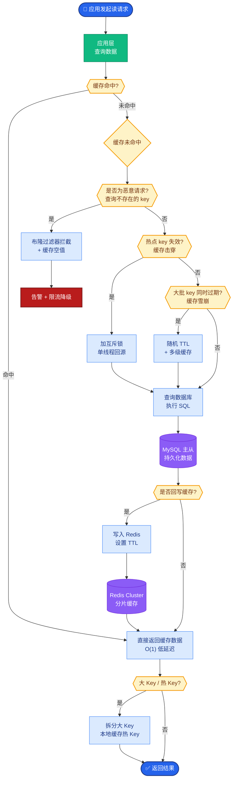
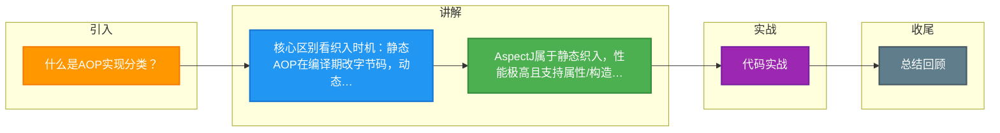

# 什么是AOP实现分类？

### AOP 实现分类

AOP 的实现主要分为两大类，区别在于**织入的时机**（即什么时候将切面代码织入到目标代码中）：

**1. 静态 AOP (Static AOP)**
*   **代表实现**：AspectJ (编译期织入/类加载期织入)
*   **原理**：在编译阶段或类加载阶段，AOP 框架会直接修改程序源代码或字节码，生成静态的 AOP 代理类。生成的 `.class` 文件已经被改变。
*   **特点**：由于在编译期已完成织入，性能较好，但需要特定的编译器或类加载器支持，灵活性相对较低。

**2. 动态 AOP (Dynamic AOP)**
*   **代表实现**：Spring AOP (运行期织入)
*   **原理**：在程序运行阶段，AOP 框架在内存中动态生成代理对象。Spring AOP 主要通过以下两种方式实现：
    *   **JDK 动态代理**：利用反射机制生成一个实现代理接口的匿名类。**要求目标类必须实现接口**。
    *   **CGLIB (Code Generation Library)**：基于 ASM 操作字节码，生成一个目标类的子类，并覆盖其中的方法。**目标类不能是 final 类，方法也不能是 final**。
*   **特点**：灵活，无需修改源码，无需特殊编译器。Spring 默认优先使用 JDK 动态代理，若未实现接口则回退到 CGLIB。

**3. 实战案例与对比**

*   **实战案例**：在某高并发交易系统中，使用 Spring AOP 进行接口耗时统计和权限校验。然而在压测时发现 `private` 方法和 `final` 方法无法被拦截，导致部分缓存预热逻辑未执行。排查发现是因为 Spring AOP 基于代理，无法拦截类内部方法调用（`this.method()`）或非 public 方法。最终改为使用 AspectJ 的编译期织入解决。

*   **代码示例 (Java - Spring AOP 配置)**：
```java
@Aspect
@Component
public class LoggingAspect {
    // 环绕通知，演示动态代理织入逻辑
    @Around("execution(* com.example.service.*.*(..))")
    public Object logMethodTime(ProceedingJoinPoint joinPoint) throws Throwable {
        long start = System.currentTimeMillis();
        Object result = joinPoint.proceed(); // 执行目标方法
        System.out.println("Cost: " + (System.currentTimeMillis() - start));
        return result;
    }
}
```

*   **对比表格：AspectJ vs Spring AOP**

| 特性 | AspectJ (静态 AOP) | Spring AOP (动态 AOP) |
| :--- | :--- | :--- |
| **织入时机** | 编译期、类加载期 | 运行期 (Runtime) |
| **织入方式** | 修改字节码 | 生成代理对象 (JDK/CGLIB) |
| **代理对象** | 目标类本身被修改 | 内存中生成的代理类 |
| **性能** | 高 (无额外反射开销) | 相对较低 (存在反射调用) |
| **功能范围** | 支持字段、构造函数、静态方法拦截 | 仅支持方法级别拦截 (public/protected) |
| **复杂度** | 高 (需引入编译插件/特殊构建) | 低 (纯 Java 配置即可) |

**AOP 实现分类对比与织入时机图**
```text
┌──────────────────────────────────────────────────────┐
│                    源代码                             │
└────────────────┬─────────────────────────────────────┘
                 │
                 ▼
┌──────────────────────────────────────────────────────┐
│                  编译器                               │
└─────┬──────────────────────────────┬──────────────────┘
      │                              │
      ▼ (静态织入)                   ▼
┌─────────────────────┐    ┌───────────────────────────────┐
│    AspectJ 编译     │    │      普通编译                  │
└─────────┬───────────┘    └───────────────┬───────────────┘
          │                              │
          ▼                              ▼
┌─────────────────────┐    ┌───────────────────────────────┐
│   字节码已修改       │    │       普通 .class 文件         │
└─────────┬───────────┘    └───────────────┬───────────────┘
          │                              │
          ▼                              ▼
┌─────────────────────┐    ┌───────────────────────────────┐
│    加载运行         │    │        JVM 运行时               │
└─────────────────────┘    │   (Spring 动态 AOP 织入)      │
                           │  1. JDK 动态代理               │
                           │  2. CGLIB 字节码生成           │
                           └───────────────────────────────┘
```

## 常见考点
1.  **Spring AOP 与 AspectJ 的区别**：Spring AOP 是运行时增强，AspectJ 是编译时增强；Spring AOP 仅支持方法拦截，AspectJ 支持字段/构造函数拦截。


## 核心流程图



## 记忆要点

- 核心区别看织入时机：静态AOP在编译期改字节码，动态AOP在运行期生成代理。
- AspectJ属于静态织入，性能极高且支持属性/构造拦截，但编译配置复杂。
- Spring AOP属于动态织入，基于JDK或CGLIB，纯Java配置且无侵入。
- 局限性对比：Spring AOP仅支持public方法级拦截，无法处理类内部自调用。

## 结构化回答

**30 秒电梯演讲：** 静态织入在编译期改代码，动态织入在运行时生成代理。打个比方，静态像翻译书出版，改好再卖；动态像实时同声传译。

**展开框架：**
1. **核心区别看织入时机** — 静态AOP在编译期改字节码，动态AOP在运行期生成代理。
2. **AspectJ属于静态织入** — 性能极高且支持属性/构造拦截，但编译配置复杂。
3. **Spring AOP属于动态织入** — 基于JDK或CGLIB，纯Java配置且无侵入。

**收尾：** 我在项目里踩过坑——代码示例 (Java - Spring AOP 配置)：。您想深入聊哪一段：原理、避坑还是对比选型？

## 视频脚本

> 预计时长：3 分钟 | 由浅入深

| 时间 | 画面/字幕 | 口播台词 | 讲解要点 |
|------|----------|----------|----------|
| 0:00 | 标题卡：什么是AOP实现分类 | "什么是AOP实现分类？一句话——静态像翻译书出版，改好再卖；动态像实时同声传译。" | 开场钩子 |
| 0:45 | 概念动画/示意图 | "静态织入在编译期改代码，动态织入在运行时生成代理——静态像翻译书出版，改好再卖；动态像实时同声传译" | 核心定义 |
| 1:30 | 核心区别看织入时机示意 | "静态AOP在编译期改字节码，动态AOP在运行期生成代理。" | 要点1 |
| 2:15 | 要点2图解示意 | "性能极高且支持属性/构造拦截，但编译配置复杂。" | 要点2 |
| 3:00 | 总结卡 | "记住这几条，面试不慌。下期讲进阶追问。" | 收尾 |

### 视频流程图



