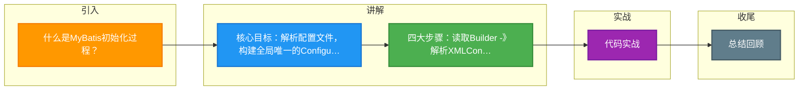

# 什么是MyBatis初始化过程？

### MyBatis 初始化过程

MyBatis 的初始化过程主要是构建 `Configuration` 对象，该对象包含了所有运行时的配置信息。初始化过程主要分为以下步骤：

1.  **加载配置文件**
    通过 `SqlSessionFactoryBuilder` 读取 `mybatis-config.xml` 核心配置文件。也可以直接通过 Java API 编程构建 Configuration。

2.  **解析配置构建对象**
    使用 `XMLConfigBuilder` 类解析 XML 配置文件。
    *   解析全局配置（settings, typeAliases, plugins 等）。
    *   根据 `<mappers>` 标签加载 Mapper 映射文件（XML）或 Mapper 接口注解。

3.  **构建 Configuration 全局对象**
    解析后的所有信息（包括 Mapper 接口方法、SQL 语句、参数映射、返回值映射等）都会被封装到 `Configuration` 对象中。
    *   每个 `<select|insert|update|delete>` 标签会被解析为一个 `MappedStatement` 对象，存储在 `Configuration` 的 `mappedStatements` Map 中。
    *   每个 Mapper 接口对应的 XML 配置会被解析并注册。

4.  **创建 SqlSessionFactory**
    最终，基于构建好的 `Configuration` 对象，创建 `DefaultSqlSessionFactory` 实例。应用程序通过该工厂获取 `SqlSession` 会话来执行数据库操作。

**补充：MyBatis 接口绑定方式**
*   **注解绑定**：在 Mapper 接口的方法上使用 `@Select`, `@Insert` 等注解编写 SQL。适合简单 SQL。
*   **XML 绑定**：在 XML 文件中编写 SQL，XML 的 `namespace` 必须指定为 Mapper 接口的全限定名。适合复杂 SQL。

**3. 实战案例与代码**

*   **实战案例**：在项目中集成了 `PageHelper` 分页插件。如果不理解 MyBatis 初始化流程，很容易将插件配置写在 `SqlSessionFactory` Bean 创建之后，导致插件未生效导致分页失败。实际上必须在 `XMLConfigBuilder` 解析阶段或 `Configuration` 对象构建完成前，通过 `configuration.addInterceptor()` 注册插件，它才能被加入到 `InterceptorChain` 中。

*   **代码示例 (Java - 手动构建 Configuration)**：
```java
// 不使用 XML，直接通过 Java 代码初始化 MyBatis (常见于多数据源配置)
DataSource dataSource = getDataSource();
TransactionFactory transactionFactory = new JdbcTransactionFactory();
Environment environment = new Environment("development", transactionFactory, dataSource);

Configuration configuration = new Configuration(environment);
configuration.addMapper(UserMapper.class); // 注册 Mapper 接口

SqlSessionFactory sqlSessionFactory = new SqlSessionFactoryBuilder().build(configuration);
```

**#### 初始化流程架构图**
```text
                      ┌─────────────────────┐
                      │ mybatis-config.xml  │
                      │  & Mapper XML Files │
                      └──────────┬──────────┘
                                 │ 1. 读取输入流
                                 ▼
              ┌──────────────────────────────────────┐
              │     SqlSessionFactoryBuilder         │
              └──────────┬───────────────────────────┘
                                 │ build()
                                 ▼
              ┌──────────────────────────────────────┐
              │          XMLConfigBuilder            │
              │  (解析settings, typeAliases, mappers) │
              └──────────┬───────────────────────────┘
                                 │ parse()
                                 ▼
              ┌──────────────────────────────────────┐
              │           Configuration              │
              │  ┌────────────────────────────────┐  │
              │  │ MappedStatements (SQL+ID Map) │  │


## 核心流程图

```mermaid
flowchart TD
    Start([🚀 SpringBoot 启动<br/>main 方法]):::start
    SpringApplication[SpringApplication.run<br/>启动入口]:::process
    PrepareEnv[准备 Environment<br/>加载 application.yml]:::process
    ContextQ{{应用上下文?<br/>Servlet/Reactive}}:::decision
    ServletCtx[AnnotationConfigCtx<br/>传统 MVC]:::process
    ReactiveCtx[ReactiveWebCtx<br/>WebFlux]:::process
    Refresh[refresh 刷新容器<br/>核心入口]:::process
    BeanFactory[BeanFactory<br/>IoC 容器]:::store
    BeanDef[BeanDefinition<br/>扫描 @Component/@Bean]:::process
    ScanQ{{配置方式?<br/>注解/XML}}:::decision
    AnnoScan[ComponentScan<br/>ClassPathBeanDefinitionScanner]:::process
    XmlScan[XmlBeanDefinitionReader<br/>解析 XML]:::process
    Instantiate[实例化 Bean<br/>反射 newInstance]:::process
    Populate[属性填充<br/>依赖注入 @Autowired]:::process
    AwareQ{{实现 Aware 接口?}}:::decision
    Aware[BeanNameAware / ContextAware<br/>回调注入]:::process
    InitQ{{自定义初始化?}}:::decision
    PostConstruct[@PostConstruct<br/>初始化方法]:::process
    AOPQ{{需要 AOP 增强?<br/>切面 @Aspect}}:::decision
    Proxy[创建动态代理<br/>JDK/CGLIB]:::process
    ProxyChain[代理链<br/>MethodInvocation]:::process
    Final([✅ Bean 就绪 可用]):::start

    Start --> SpringApplication --> PrepareEnv --> ContextQ
    ContextQ -->|传统| ServletCtx --> Refresh
    ContextQ -->|响应式| ReactiveCtx --> Refresh
    Refresh --> BeanFactory --> BeanDef --> ScanQ
    ScanQ -->|注解| AnnoScan --> Instantiate
    ScanQ -->|XML| XmlScan --> Instantiate
    Instantiate --> Populate --> AwareQ
    AwareQ -->|是| Aware --> InitQ
    AwareQ -->|否| InitQ
    InitQ -->|是| PostConstruct --> AOPQ
    InitQ -->|否| AOPQ
    AOPQ -->|是| Proxy --> ProxyChain --> Final
    AOPQ -->|否| Final

    classDef start fill:#2563eb,stroke:#1e3a8a,color:#fff,stroke-width:2px;
    classDef process fill:#dbeafe,stroke:#3b82f6,color:#1e3a8a;
    classDef decision fill:#fef3c7,stroke:#f59e0b,color:#78350f,stroke-width:2px;
    classDef store fill:#8b5cf6,stroke:#6d28d9,color:#fff;

```

## 记忆要点

- 核心目标：解析配置文件，构建全局唯一的Configuration大对象。
- 四大步骤：读取Builder -> 解析XMLConfigBuilder -> 封装Configuration -> 产出Factory。
- 细节：每个SQL标签会被解析为一个MappedStatement对象并注册进容器。
- 产出物：最终生成DefaultSqlSessionFactory，供后续获取SqlSession执行DB操作。

## 结构化回答

**30 秒电梯演讲：** 解析XML配置构建Configuration对象，生成会话工厂。打个比方，像装修，先设计图纸（解析配置），再建好工厂，按需生产产品。

**展开框架：**
1. **核心目标** — 解析配置文件，构建全局唯一的Configuration大对象。
2. **四大步骤** — 读取Builder -> 解析XMLConfigBuilder -> 封装Configuration -> 产出Factory。
3. **细节** — 每个SQL标签会被解析为一个MappedStatement对象并注册进容器。

**收尾：** 我在项目里踩过坑——代码示例 (Java - 手动构建 Configuration)：。您想深入聊哪一段：原理、避坑还是对比选型？

## 视频脚本

> 预计时长：3 分钟 | 由浅入深

| 时间 | 画面/字幕 | 口播台词 | 讲解要点 |
|------|----------|----------|----------|
| 0:00 | 标题卡：什么是MyBatis初始化过程 | "什么是MyBatis初始化过程？一句话——像装修，先设计图纸（解析配置），再建好工厂，按需生产产品。" | 开场钩子 |
| 0:45 | 概念动画/示意图 | "解析XML配置构建Configuration对象，生成会话工厂——像装修，先设计图纸（解析配置），再建好工厂，按需生产产品" | 核心定义 |
| 1:30 | 核心目标示意 | "解析配置文件，构建全局唯一的Configuration大对象。" | 要点1 |
| 2:15 | 四大步骤示意 | "读取Builder -> 解析XMLConfigBuilder -> 封装Configuration -> 产出Factory。" | 要点2 |
| 3:00 | 总结卡 | "记住这几条，面试不慌。下期讲进阶追问。" | 收尾 |

### 视频流程图



