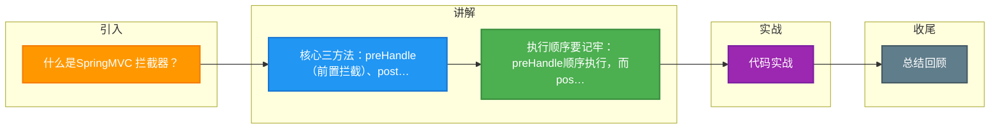

# 什么是SpringMVC 拦截器？

### Spring MVC 拦截器

**1. 什么是拦截器**
拦截器（Interceptor）是 Spring MVC 提供的一种机制，用于在处理器（Handler）执行前后进行预处理和后处理。它类似于 Servlet 规范中的 Filter，但更专注于对业务逻辑的拦截。

**2. 拦截器的定义**
所有的拦截器都需要实现 `HandlerInterceptor` 接口，该接口包含三个核心方法：
*   **preHandle(HttpServletRequest, HttpServletResponse, Object)**：在处理器方法执行之前调用。返回 `true` 表示继续流程，返回 `false` 表示中断流程（如权限校验失败）。
*   **postHandle(HttpServletRequest, HttpServletResponse, Object, ModelAndView)**：在处理器方法执行之后，视图渲染之前调用。可以对模型数据进行修改。
*   **afterCompletion(HttpServletRequest, HttpServletResponse, Object, Exception)**：在整个请求处理完成后（即视图渲染完毕）调用。通常用于资源清理。

**3. 执行流程**
1.  请求到达 `DispatcherServlet`。
2.  执行拦截器的 `preHandle` 方法（按配置顺序执行）。如果任一返回 `false`，流程结束。
3.  执行处理器逻辑。
4.  执行拦截器的 `postHandle` 方法（按配置逆序执行）。
5.  解析视图并进行页面渲染。
6.  执行拦截器的 `afterCompletion` 方法（按配置逆序执行）。

**4. 与 Filter 的区别**
*   **Filter**：依赖于 Servlet 容器，范围更大，可以拦截所有请求（包括静态资源）。
*   **Interceptor**：依赖于 Spring MVC 框架，仅拦截 Controller 请求，可以访问具体的 Handler 和 ModelAndView。

**5. 实战案例与对比**

*   **实战案例**：在实现登录鉴权时，最初使用 Filter 拦截所有请求。但在 Filter 中无法直接获取 Spring 容器管理的 UserService 实例（需要通过 WebApplicationContextUtils 手动获取），导致代码冗余。后改用 `HandlerInterceptor`，直接通过 `@Autowired` 注入 Service，并利用 `preHandle` 拦截未登录请求，代码更简洁且能精确控制 Controller 层的入口。

*   **代码示例 (Java - 拦截器注册与实现)**：
```java
@Component
public class AuthInterceptor implements HandlerInterceptor {
    @Override
    public boolean preHandle(HttpServletRequest request, HttpServletResponse response, Object handler) {
        // 仅校验 Controller 方法，不校验静态资源
        if (!(handler instanceof HandlerMethod)) return true;
        
        // 鉴权逻辑
        if (request.getSession().getAttribute("user") == null) {
            response.sendRedirect("/login");
            return false; // 中断流程
        }
        return true;
    }
}
```

*   **对比表格：Filter vs Interceptor**

| 特性 | Filter (过滤器) | Interceptor (拦截器) |
| :--- | :--- | :--- |
| **规范/来源** | Servlet 规范 (Java EE) | Spring MVC 框架提供 |
| **作用范围** | 几乎所有请求 (包括静态资源、JSP) | 仅针对 DispatcherServlet 处理的请求 (通常是 Controller) |
| **容器依赖** | 依赖 Servlet 容器 (如 Tomcat) | 依赖 Spring Web 容器 |
| **注入能力** | 难以直接注入 Spring Bean | 支持标准的 IOC/DI (可直接 @Autowired) |
| **细粒度控制** | 较粗，基于 URL 路径匹配 | 更细，可基于 HandlerMethod、注解 (如 @PreAuth) 进行匹配 |
| **执行时机** | 在 Servlet 之前，请求进入 Tomcat 后最早执行 | 在 DispatcherServlet 处理过程中，Controller 之前/之后 |

**#### 拦截器执行流程图**
```text
   请求 Request
       │
       ▼
┌──────────────┐
│DispatcherServlet│
└──────┬───────┘
       │
       ▼
┌──────────────────────────────────────┐
│ Interceptor 1 (preHandle) ────────────│─── false? ──> 结束
└──────────────┬───────────────────────┘
               │ true
               ▼
┌──────────────────────────────────────┐
│ Interceptor 2 (preHandle) ────────────│─── false? ──> 触发 Interceptor 1 afterCompletion
└──────────────┬───────────────────────┘
               │ true
               ▼
┌──────────────────────────────────────┐
│         Controller (Handler)         │
│         (执行业务逻辑)                │
└──────────────┬───────────────────────┘
               │
               ▼ (逆序执行 postHandle)
┌──────────────────────────────────────┐
│ Interceptor 2 (postHandle)           │ ◄── 修改 ModelAndView
└──────────────┬───────────────────────┘
               │
               ▼
┌──────────────────────────────────────┐
│ Interceptor 1 (postHandle)           │
└──────────────┬───────────────────────┘
               │
               ▼
┌───


## 核心流程图

```mermaid
flowchart TD
    Start([🚀 SpringBoot 启动<br/>main 方法]):::start
    SpringApplication[SpringApplication.run<br/>启动入口]:::process
    PrepareEnv[准备 Environment<br/>加载 application.yml]:::process
    ContextQ{{应用上下文?<br/>Servlet/Reactive}}:::decision
    ServletCtx[AnnotationConfigCtx<br/>传统 MVC]:::process
    ReactiveCtx[ReactiveWebCtx<br/>WebFlux]:::process
    Refresh[refresh 刷新容器<br/>核心入口]:::process
    BeanFactory[BeanFactory<br/>IoC 容器]:::store
    BeanDef[BeanDefinition<br/>扫描 @Component/@Bean]:::process
    ScanQ{{配置方式?<br/>注解/XML}}:::decision
    AnnoScan[ComponentScan<br/>ClassPathBeanDefinitionScanner]:::process
    XmlScan[XmlBeanDefinitionReader<br/>解析 XML]:::process
    Instantiate[实例化 Bean<br/>反射 newInstance]:::process
    Populate[属性填充<br/>依赖注入 @Autowired]:::process
    AwareQ{{实现 Aware 接口?}}:::decision
    Aware[BeanNameAware / ContextAware<br/>回调注入]:::process
    InitQ{{自定义初始化?}}:::decision
    PostConstruct[@PostConstruct<br/>初始化方法]:::process
    AOPQ{{需要 AOP 增强?<br/>切面 @Aspect}}:::decision
    Proxy[创建动态代理<br/>JDK/CGLIB]:::process
    ProxyChain[代理链<br/>MethodInvocation]:::process
    Final([✅ Bean 就绪 可用]):::start

    Start --> SpringApplication --> PrepareEnv --> ContextQ
    ContextQ -->|传统| ServletCtx --> Refresh
    ContextQ -->|响应式| ReactiveCtx --> Refresh
    Refresh --> BeanFactory --> BeanDef --> ScanQ
    ScanQ -->|注解| AnnoScan --> Instantiate
    ScanQ -->|XML| XmlScan --> Instantiate
    Instantiate --> Populate --> AwareQ
    AwareQ -->|是| Aware --> InitQ
    AwareQ -->|否| InitQ
    InitQ -->|是| PostConstruct --> AOPQ
    InitQ -->|否| AOPQ
    AOPQ -->|是| Proxy --> ProxyChain --> Final
    AOPQ -->|否| Final

    classDef start fill:#2563eb,stroke:#1e3a8a,color:#fff,stroke-width:2px;
    classDef process fill:#dbeafe,stroke:#3b82f6,color:#1e3a8a;
    classDef decision fill:#fef3c7,stroke:#f59e0b,color:#78350f,stroke-width:2px;
    classDef store fill:#8b5cf6,stroke:#6d28d9,color:#fff;

```

## 记忆要点

- 核心三方法：preHandle（前置拦截）、postHandle（视图渲染前）、afterCompletion（资源清理）。
- 执行顺序要记牢：preHandle顺序执行，而postHandle和afterCompletion逆序执行。
- 对比Filter：Filter依赖Servlet容器拦截所有请求，Interceptor依赖Spring仅拦截Controller。
- 拦截器最大优势：可以直接使用@Autowired注入Spring容器中的Service。

## 结构化回答

**30 秒电梯演讲：** 在请求处理前后进行拦截，增强Controller功能。打个比方，像安检，进门安检（preHandle），出门复查（postHandle）。

**展开框架：**
1. **核心三方法** — preHandle（前置拦截）、postHandle（视图渲染前）、afterCompletion（资源清理）。
2. **执行顺序要记牢** — preHandle顺序执行，而postHandle和afterCompletion逆序执行。
3. **对比Filter** — Filter依赖Servlet容器拦截所有请求，Interceptor依赖Spring仅拦截Controller。

**收尾：** 我在项目里踩过坑——代码示例 (Java - 拦截器注册与实现)：。您想深入聊哪一段：原理、避坑还是对比选型？

## 视频脚本

> 预计时长：3 分钟 | 由浅入深

| 时间 | 画面/字幕 | 口播台词 | 讲解要点 |
|------|----------|----------|----------|
| 0:00 | 标题卡：什么是SpringMVC 拦截器 | "什么是SpringMVC 拦截器？一句话——像安检，进门安检（preHandle），出门复查（postHandle）。" | 开场钩子 |
| 0:45 | 概念动画/示意图 | "在请求处理前后进行拦截，增强Controller功能——像安检，进门安检（preHandle），出门复查（postHandle）" | 核心定义 |
| 1:30 | 核心三方法示意 | "preHandle（前置拦截）、postHandle（视图渲染前）、afterCompletion（资源清理）。" | 要点1 |
| 2:15 | 执行顺序要记牢示意 | "preHandle顺序执行，而postHandle和afterCompletion逆序执行。" | 要点2 |
| 3:00 | 总结卡 | "记住这几条，面试不慌。下期讲进阶追问。" | 收尾 |

### 视频流程图



