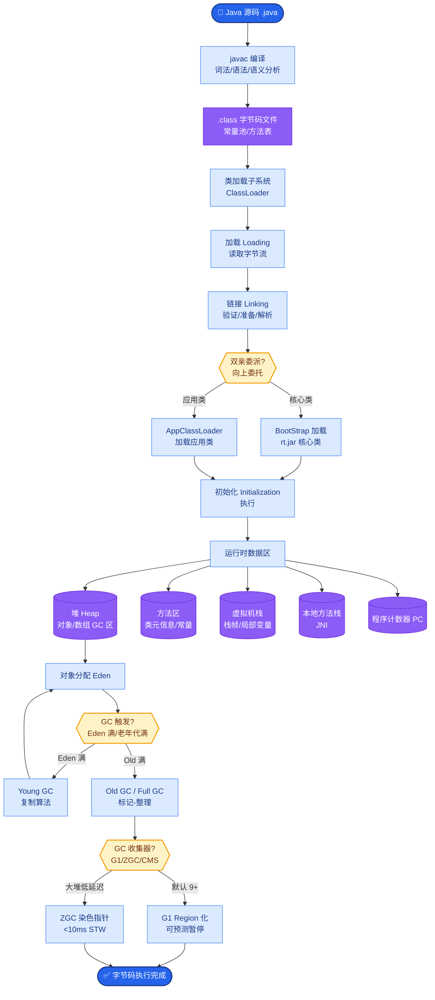

# 说一说你对Mybatis Plugin的了解？

### MyBatis Plugin (插件) 机制

MyBatis 作为一个应用广泛的优秀的 ORM 框架，具有强大的灵活性。它在四大组件处提供了简单易用的插件扩展机制。插件本质上就是拦截器，利用 **JDK 动态代理** 和 **责任链模式** 来增强核心对象的功能。

**1. 四大核心对象**
MyBatis 的插件允许拦截以下四大核心对象的方法：
*   **Executor**：MyBatis 的执行器，负责 SQL 语句的生成和执行（增删改查操作）。它是 MyBatis 调度的核心。
*   **StatementHandler**：数据库的处理对象，负责创建 JDBC Statement 对象、设置参数等。
*   **ParameterHandler**：负责将用户传递的参数转换为 JDBC PreparedStatement 所需要的参数。
*   **ResultSetHandler**：负责将 JDBC 返回的 ResultSet 结果集转换为 Java 对象（List 或 Map）。

**2. 插件原理**
MyBatis 插件通过动态代理机制，在目标对象（如 Executor）外围包裹了一层代理对象。当方法被调用时，会先经过代理对象的拦截逻辑。

**#### 插件代理架构与责任链示意图**
```text
                    请求
                     │
                     ▼
         ┌───────────────────────┐
         │  Plugin Proxy 1       │ ◄─── 插件 1 (如: 分页)
         │  (interceptor.chain)  │
         └───────────┬───────────┘
                     │ plugin.invoke()
                     ▼
         ┌───────────────────────┐
         │  Plugin Proxy 2       │ ◄─── 插件 2 (如: 监控 SQL)
         │  (interceptor.chain)  │
         └───────────┬───────────┘
                     │ plugin.invoke()
                     ▼
         ┌───────────────────────┐
         │      Target Object    │ ◄─── 真实的 Executor/StatementHandler
         │      (Real Executor)  │
         └───────────────────────┘
```

**3. 开发步骤**
1.  **实现接口**：编写一个类实现 `Interceptor` 接口。
2.  **指定拦截签名**：使用 `@Intercepts` 注解，指定要拦截的类、方法及参数类型。
    *   例如：`@Signature(type = Executor.class, method = "update", args = {MappedStatement.class, Object.class})`
3.  **重写 intercept 方法**：在方法中编写拦截逻辑，并使用 `invocation.proceed()` 继续执行责任链。
4.  **注册插件**：在 `mybatis-config.xml` 中使用 `<plugins>` 标签注册，或者在 Spring Boot 中配置为 Bean。

**#### 实战案例**
在生产环境中，曾遇到慢 SQL 问题导致数据库 CPU 飙升。我们编写了一个自定义 MyBatis 插件拦截 `Executor` 的 `update` 和 `query` 方法，当执行时间超过 500ms 时自动打印堆栈和 SQL，快速定位到了代码中的循环调用问题。

**#### 代码示例**
```java
@Intercepts({
    @Signature(type = Executor.class, method = "query", args = {MappedStatement.class, Object.class, RowBounds.class, ResultHandler.class})
})
public class SqlCostInterceptor implements Interceptor {
    @Override
    public Object intercept(Invocation invocation) throws Throwable {
        long start = System.currentTimeMillis();
        Object proceed = invocation.proceed();
        long cost = System.currentTimeMillis() - start;
        if (cost > 1000) {
            System.out.println("Slow SQL detected, cost: " + cost + "ms");
        }
        return proceed;
    }
}
```


## 核心流程图



## 记忆要点

- 本质是拦截器，底层依赖JDK动态代理和责任链模式增强功能。
- 四大核心拦截对象：Executor（调度）、StatementHandler（语句）、Parameter（参数）、ResultSet（结果）。
- 开发三步走：实现Interceptor接口、用@Intercepts注解签名、重写intercept逻辑。
- 经典应用场景：基于拦截Executor机制，实现PageHelper分页插件或慢SQL耗时监控。

## 结构化回答

**30 秒电梯演讲：** 利用JDK动态代理拦截四大核心对象以扩展功能。打个比方，像在安检口拦截行李，允许在查房、进站等环节插入自定义检查。

**展开框架：**
1. **本质是拦截器** — 底层依赖JDK动态代理和责任链模式增强功能。
2. **四大核心拦截对象** — Executor（调度）、StatementHandler（语句）、Parameter（参数）、ResultSet（结果）。
3. **开发三步走** — 实现Interceptor接口、用@Intercepts注解签名、重写intercept逻辑。

**收尾：** 我在项目里踩过坑——在生产环境中，曾遇到慢 SQL 问题导致数据库 CPU 飙升。您想深入聊哪一段：原理、避坑还是对比选型？

## 视频脚本

> 预计时长：3 分钟 | 由浅入深

| 时间 | 画面/字幕 | 口播台词 | 讲解要点 |
|------|----------|----------|----------|
| 0:00 | 标题卡：说一说你对Mybatis Plugi… | "说一说你对Mybatis Plugin的了解？一句话——像在安检口拦截行李，允许在查房、进站等环节插入自定义检查。" | 开场钩子 |
| 0:45 | 概念动画/示意图 | "利用JDK动态代理拦截四大核心对象以扩展功能——像在安检口拦截行李，允许在查房、进站等环节插入自定义检查" | 核心定义 |
| 1:30 | 本质是拦截器示意 | "底层依赖JDK动态代理和责任链模式增强功能。" | 要点1 |
| 2:15 | 四大核心拦截对象示意 | "Executor（调度）、StatementHandler（语句）、Parameter（参数）、ResultSet（结果）。" | 要点2 |
| 3:00 | 总结卡 | "记住这几条，面试不慌。下期讲进阶追问。" | 收尾 |
