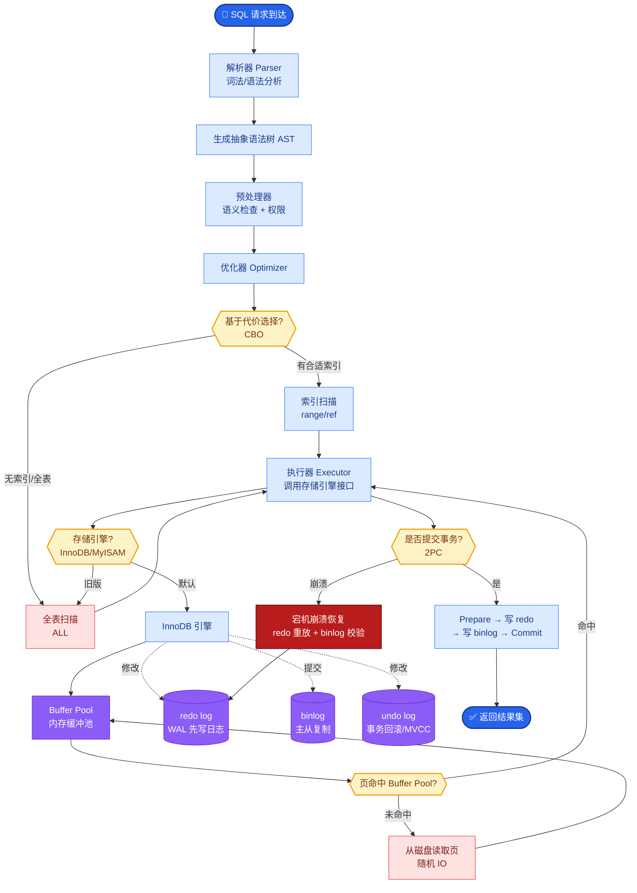

# Spring AOP 的 JDK 动态代理和 CGLIB 代理有什么区别？什么时候用哪个？

【两种代理方式】

1. **JDK 动态代理**：
   - **原理**：基于**接口**实现，目标类必须实现至少一个接口。利用反射机制在运行时动态生成一个实现代理接口的匿名类。
   - **实现**：使用 `Proxy.newProxyInstance(classLoader, interfaces, invocationHandler)` 创建代理对象，必须实现 `InvocationHandler` 接口的 `invoke` 方法。
   - **限制**：只能代理接口方法，目标类中未在接口中定义的方法无法被代理。
   - **依赖**：JDK 内置，无需额外依赖。

2. **CGLIB 代理**：
   - **原理**：基于**继承**实现，通过 ASM 字节码操作框架在运行时动态生成目标类的子类，并重写父类方法。
   - **实现**：使用 `Enhancer` 类，设置父类和回调拦截器 `MethodInterceptor`。
   - **限制**：
     - 不能代理 `final` 修饰的类或方法（无法继承/重写）。
     - **同类调用问题**：目标对象内部方法调用（`this.method()`）不会走代理逻辑，除非通过 AopContext 获取当前代理对象。
   - **依赖**：需引入 CGLIB 库（Spring Boot `spring-boot-starter-web` 等模块已内置）。

【Spring AOP 的选择规则】
- **Spring Boot 2.x+**：默认策略倾向于 CGLIB（`spring.aop.proxy-target-class=true`），即使类实现了接口也使用 CGLIB，以避免代理类与实现类类型不一致可能导致的困惑。
- **Spring Framework 4.x/传统 XML**：如果目标对象实现了接口，默认使用 JDK 动态代理；否则使用 CGLIB。
- **强制指定**：
  - 强制 CGLIB：`@EnableAspectJAutoProxy(proxyTargetClass = true)` 或配置 `spring.aop.proxy-target-class=true`。
  - 强制 JDK（必须有接口）：`proxyTargetClass = false`。

【性能对比】
- **创建阶段**：JDK 动态代理创建速度快（JDK 原生支持）；CGLIB 创建较慢（涉及字节码生成和类加载过程）。
- **运行阶段**：CGLIB 执行速度快（通过 FastClass 机制建立索引，直接调用方法，无需反射）；JDK 动态代理稍慢（依赖 `Method.invoke` 反射调用）。
- **实际场景**：在 Spring AOP 中，单例 Bean 的代理通常只创建一次，主要开销在于拦截器链的执行，因此性能差异通常可忽略。

**#### JDK vs CGLIB 对比表**
| 特性 | JDK 动态代理 | CGLIB 代理 |
| :--- | :--- | :--- |
| **实现机制** | 反射机制实现接口 | 字节码操作继承子类 |
| **前提条件** | 必须实现接口 | 类不能是 final，方法不能是 final |
| **Spring 默认策略** | 老版本默认（有接口时） | Spring Boot 2.x 默认 |
| **目标类识别** | `instanceof` 接口类型 | `instanceof` 目标类类型 |

【代理对象调用流程图】

```text
客户端调用代理对象方法
       │
       ▼
┌──────────────────────┐
│   Proxy Object       │
│  (JDK Interface Impl │
│   or CGLIB Subclass) │
└──────────┬───────────┘
           │ invoke
           ▼
┌──────────────────────┐    ┌─────────────────────┐
│   AOP Framework      │    │   Target Object     │
│ (Interceptor Chain)  │───▶│   (Business Logic)  │
│                      │    │                     │
│ 1. @Before/Around    │    └─────────────────────┘
│ 2. target.method()   │            ▲
│ 3. @After/AfterReturn│            │
└──────────────────────┘            │
                                   │
                            若发生同类内部调用
                            (this.methodB())
                            ▼
                    ┌───
```

**#### 实战案例**
在某项目中，我们将内部类拆分改为 `@Autowired` 注入自身代理对象（`@Autowired private SelfService self;`），解决了同类方法调用（`this.methodB()`）导致的事务失效（AOP 未拦截）问题。如果是 CGLIB 代理，需注意避免循环依赖。

**#### 代码示例**
```java
// 手动创建 CGLIB 代理 (模拟 Spring 底层)
Enhancer enhancer = new Enhancer();
enhancer.setSuperclass(TargetService.class);
enhancer.setCallback((MethodInterceptor) (obj, method, args, proxy) -> {
    System.out.println("Before Method");
    Object result = proxy.invokeSuper(obj, args); // 执行父类方法
    System.out.println("After Method");
    return result;
});
TargetService proxy = (TargetService) enhancer.create();
```


## 核心流程图



## 记忆要点

- 原理对比：JDK动态代理基于实现接口，而CGLIB基于继承生成子类。
- 限制对比：JDK必须实现接口，而CGLIB不能代理final修饰的类或方法。
- 性能对比：JDK创建快执行慢(反射)，而CGLIB创建慢执行快(FastClass索引)。
- 选择规则：Spring Boot 2.x默认使用CGLIB(proxyTargetClass=true)。

## 结构化回答

**30 秒电梯演讲：** JDK基于接口反射，CGLIB基于继承字节码生成。打个比方，JDK是找代理人（实现接口）办事，CGLIB是生个儿子（继承类）帮父办事。

**展开框架：**
1. **原理对比** — JDK动态代理基于实现接口，而CGLIB基于继承生成子类。
2. **限制对比** — JDK必须实现接口，而CGLIB不能代理final修饰的类或方法。
3. **性能对比** — JDK创建快执行慢(反射)，而CGLIB创建慢执行快(FastClass索引)。

**收尾：** 我在项目里踩过坑——在某项目中，我们将内部类拆分改为 `@Autowired` 注入自身代理对象（`@Autowired private SelfService self;`），解决了同类方法调用（`this.methodB()`）导致的事务失效（AOP 未拦截）问题。您想深入聊哪一段：原理、避坑还是对比选型？

## 视频脚本

> 预计时长：4 分钟 | 由浅入深

| 时间 | 画面/字幕 | 口播台词 | 讲解要点 |
|------|----------|----------|----------|
| 0:00 | 标题卡：Spring AOP 的 JDK 动… | "Spring AOP 的 JDK 动态代理和 CGLIB 代理有什么区别？什么时候用哪个？一句话——JDK是找代理人（实现接口）办事，CGLIB是生个儿子（继承类）帮父办事。" | 开场钩子 |
| 0:48 | 概念动画/示意图 | "JDK基于接口反射，CGLIB基于继承字节码生成——JDK是找代理人（实现接口）办事，CGLIB是生个儿子（继承类）帮父办事" | 核心定义 |
| 1:36 | 原理对比示意 | "JDK动态代理基于实现接口，而CGLIB基于继承生成子类。" | 要点1 |
| 2:24 | 限制对比示意 | "JDK必须实现接口，而CGLIB不能代理final修饰的类或方法。" | 要点2 |
| 3:12 | 性能对比示意 | "JDK创建快执行慢(反射)，而CGLIB创建慢执行快(FastClass索引)。" | 要点3 |
| 4:00 | 总结卡 | "记住这几条，面试不慌。下期讲进阶追问。" | 收尾 |
