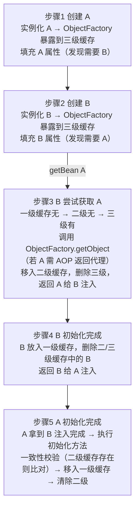

# Spring三级缓存如何解决循环依赖？

【核心背景】
Spring 通过**三级缓存**机制解决了**单例 Bean** 的** Setter 注入**循环依赖问题。构造器注入无法解决，会抛出 `BeanCurrentlyInCreationException`。

【三级缓存详解】
1.  **一级缓存 (`singletonObjects`)**：`Map<String, Object>`，存放**已经完全初始化好**的 Bean（完整的 Bean）。
2.  **二级缓存 (`earlySingletonObjects`)**：`Map<String, Object>`，存放**早期暴露**的 Bean（已实例化、但未填充属性、未执行初始化方法）。主要用于解决循环依赖中的 AOP 代理问题。
3.  **三级缓存 (`singletonFactories`)**：`Map<String, ObjectFactory<?>>`，存放 **Bean 工厂**（通常是 Lambda 表达式）。它的作用是**延迟**生成早期 Bean，特别是当 Bean 需要被 AOP 代理时，只有在确实发生循环依赖时，才会调用工厂生成代理对象放入二级缓存。

【实战案例】
曾遇到多线程环境下 `@Async` 导致的循环依赖报错。原因是 `@Async` 会通过 AOP 生成代理对象，若循环引用发生时代理对象尚未生成，Spring 会引用原始对象，后续注入代理对象时导致 Bean 类型不一致（ClassCastException）。解决方案是在循环依赖的一方使用 `@Lazy` 注解延迟加载，或在启动类上添加 `@EnableAspectJAutoProxy(exposeProxy = true)` 并配合 AopContext。

【解决循环依赖的流程 (A 依赖 B，B 依赖 A)】



【关键代码片段 (AbstractAutowireCapableBeanFactory)】
```java
// 1. 实例化后，将工厂放入三级缓存
addSingletonFactory(beanName, () -> getEarlyBeanReference(beanName, mbd, bean));

// 2. 获取早期 Bean 时 (doGetBean)
protected Object getSingleton(String beanName, boolean allowEarlyReference) {
    Object singletonObject = this.singletonObjects.get(beanName); // 一级缓存
    if (singletonObject == null && isSingletonCurrentlyInCreation(beanName)) {
        synchronized (this.singletonObjects) {
            singletonObject = this.earlySingletonObjects.get(beanName); // 二级缓存
            if (singletonObject == null && allowEarlyReference) {
                ObjectFactory<?> singletonFactory = this.singletonFactories.get(beanName); // 三级缓存
                if (singletonFactory != null) {
                    singletonObject = singletonFactory.getObject(); // 调用工厂生成代理(如果需要)
                    this.earlySingletonObjects.put(beanName, singletonObject); // 升入二级缓存
                    this.singletonFactories.remove(beanName); // 删除三级缓存
                }
            }
        }
    }
    return singletonObject;
}
```

## 记忆要点

- 适用前提：三级缓存仅能解决单例Bean的Setter注入循环依赖，构造器注入无解。
- 三级缓存：一级存成品，二级存早期半成品，三级存ObjectFactory(用于提前AOP)。
- 核心流程：A实例化后放入三级缓存，属性注入发现依赖B，B又依赖A时触发AOP。
- 解决AOP：发生循环时调三级缓存的工厂生成代理对象，并将其升级存入二级缓存。

## 结构化回答

**30 秒电梯演讲：** 利用三级缓存分离不同阶段的Bean以打破环状引用。打个比方，像双人对弈，先摆棋盘（实例化），互记位置（半成品），最后定局（成品）。

**展开框架：**
1. **适用前提** — 三级缓存仅能解决单例Bean的Setter注入循环依赖，构造器注入无解。
2. **三级缓存** — 一级存成品，二级存早期半成品，三级存ObjectFactory(用于提前AOP)。
3. **核心流程** — A实例化后放入三级缓存，属性注入发现依赖B，B又依赖A时触发AOP。

**收尾：** 我在项目里踩过坑——【解决循环依赖的流程 (A 依赖 B，B 依赖 A)】。您想深入聊哪一段：原理、避坑还是对比选型？

## 视频脚本

> 预计时长：3 分钟 | 由浅入深

| 时间 | 画面/字幕 | 口播台词 | 讲解要点 |
|------|----------|----------|----------|
| 0:00 | 标题卡：Spring三级缓存如何解决循环依赖 | "Spring三级缓存如何解决循环依赖？一句话——像双人对弈，先摆棋盘（实例化），互记位置（半成品），最后定局（成品）。" | 开场钩子 |
| 0:45 | 概念动画/示意图 | "利用三级缓存分离不同阶段的Bean以打破环状引用——像双人对弈，先摆棋盘（实例化），互记位置（半成品），最后定局（成品）" | 核心定义 |
| 1:30 | 适用前提示意 | "三级缓存仅能解决单例Bean的Setter注入循环依赖，构造器注入无解。" | 要点1 |
| 2:15 | 三级缓存示意 | "一级存成品，二级存早期半成品，三级存ObjectFactory(用于提前AOP)。" | 要点2 |
| 3:00 | 总结卡 | "记住这几条，面试不慌。下期讲进阶追问。" | 收尾 |
