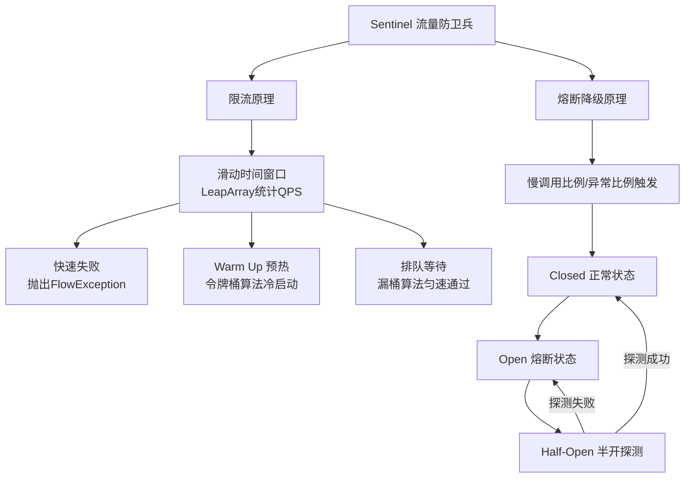

# Sentinel的限流和熔断原理是什么？

Sentinel 是阿里开源的流量防卫兵，主要用于流量控制、熔断降级和系统负载保护。

### 一、限流原理
**1. 核心统计机制：滑动时间窗口**
Sentinel 使用 LeapArray（滑动窗口数组）来统计实时指标。它将 1 秒的时间窗口切分为若干个样本窗口（默认 20 个，每个 50ms）。

**2. 限流阈值与算法**
- **QPS 限流**：直接基于滑动窗口统计的 pass 数量，若超过阈值则触发拒绝。默认使用「滑动窗口计数器」算法（兼顾性能与精确度）。
- **线程数限流**：基于 `LongAdder` 统计当前线程上下文的活跃线程数，若超过阈值则拒绝。适用于业务处理时长较长的场景。

**3. 流控效果（策略）**
- **快速失败**：直接抛出 `FlowException`，返回 Blocked 页面或自定义异常。
- **Warm Up（冷启动）**：
  - *原理*：基于令牌桶算法的「预热」概念。系统默认有一个 coldFactor（默认3），初始阈值为 `阈值 / coldFactor`，并在预热时长内逐渐攀升至设定阈值。
  - *场景*：秒杀系统开启瞬间，缓存预热或数据库连接池未满，防止瞬间流量击垮缓存。
- **排队等待（匀速排队）**：
  - *原理*：基于漏桶算法思想，严格控制请求通过的时间间隔，让请求以均匀速度通过。
  - *场景*：削峰填谷，消息队列处理等。

### 二、熔断降级原理
熔断器主要针对调用链路中的不稳定资源（调用慢、异常多）进行隔离。

**1. 熔断策略**
- **慢调用比例**：请求响应时间 RT > 设定的最大 RT，且比例超过阈值，熔断触发。
- **异常比例**：业务抛出异常（如 RuntimeException）的比例超过阈值。
- **异常数**：在 1 分钟统计窗口内，异常总数超过阈值。

**2. 熔断状态流转**
```text
      失败请求/慢调用 达到阈值
+-------------------------------+
|                               v
|  CLOSED (关闭) -----------> OPEN (开启)
|   ^  (正常通过)             |   (熔断中，所有请求直接拒绝)
|   |                           |  经过 熔断时长
|   |                           v
|   |                      HALF_OPEN (半开)
|   |                           |  (放行1个请求探测)
|   |                           v
|   +----------------------- 探测成功 (恢复正常) /
|                               探测失败 (重回熔断)
+-------------------------------+
```

**3. 实现细节**
- **@SentinelResource**：用于定义资源，指定 `blockHandler`（限流/熔断处理）和 `fallback`（业务异常处理）。
- **规则持久化**：支持推模式（如 Nacos、Apollo）和拉模式，保证重启规则不丢失。

【实战案例】
在营销活动中，第三方优惠券接口响应极不稳定（偶发 5s+ 延迟），导致 Tomcat 线程池被耗尽。我们配置了 **慢调用比例熔断**：设置最大 RT 为 200ms，比例为 0.5，熔断时长 10s。这确保了当下游变慢时，上游快速失败而不是阻塞，保护了主线程池，并在 10s 后通过半开状态自动探测恢复。

【关键代码片段 (自定义限流异常处理)】
```java
@RestControllerAdvice
public class SentinelBlockHandler {
    // 处理 BlockException (限流/熔断)
    @ExceptionHandler(BlockException.class)
    public Result<String> handleBlockException(BlockException e) {
        if (e instanceof FlowException) {
            return Result.error("访问频率过高，请稍后再试");
        } else if (e instanceof DegradeException) {
            return Result.error("服务降级，请稍后再试");
        }
        return Result.error("系统限流");
    }
}

// 资源定义
@SentinelResource(value = "queryUserInfo", 
    blockHandler = "handleBlock", // 限流/降级处理
    fallback = "handleFallback"   // 业务异常处理
)
public User queryUserInfo(Long id) {
    return userService.getById(id);
}

// BlockHandler 方法需签名匹配
public User handleBlock(Long id, BlockException ex) {
    return new User(-1L, "DefaultUser");
}
```

【常见考点对比表】

| 特性 | Sentinel | Hystrix (已停更) | Resilience4j |
| :--- | :--- | :--- | :--- |
| **隔离策略** | 信号量隔离（并发线程数限流） | 线程池隔离 / 信号量隔离 | 信号量隔离 (限流) / 半隔离 (异步) |
| **熔断降级** | 支持慢调用比例、异常比例、异常数 | 基于异常比例 / 异常数 | 基于异常率 / 慢调用 |
| **实时监控** | 自带控制台，实时规则推送 | 较弱，需接入 Turbine | 依赖 Micrometer 暴露指标 |
| **限流** | QPS / 线程数 / Warm Up | 仅支持线程池隔离(即限流) | 限流需自己实现或基于 Bulkhead |
| **系统自适应** | 支持 (Load 自适应) | 不支持 | 不支持 |

## 流程图



## 记忆要点

- 限流核心：基于滑动时间窗口算法统计QPS，结合令牌桶(预热)或漏桶(排队)控制流量。
- 熔断策略：支持慢调用比例、异常比例和异常数三种维度触发服务降级熔断。
- 状态流转：熔断器经历Closed(正常)、Open(熔断)到Half-Open(半开探测)的自动恢复。
- 处理机制：通过blockHandler处理限流熔断，通过fallback处理业务运行异常。

## 结构化回答

**30 秒电梯演讲：** 基于滑动窗口统计实现流量整形和故障隔离。打个比方，像景区限流（限流）和电路跳闸（熔断），人多排队控制，故障切断。

**展开框架：**
1. **限流核心** — 基于滑动时间窗口算法统计QPS，结合令牌桶(预热)或漏桶(排队)控制流量。
2. **熔断策略** — 支持慢调用比例、异常比例和异常数三种维度触发服务降级熔断。
3. **状态流转** — 熔断器经历Closed(正常)、Open(熔断)到Half-Open(半开探测)的自动恢复。

**收尾：** 我在项目里踩过坑——在营销活动中，第三方优惠券接口响应极不稳定（偶发 5s+ 延迟），导致 Tomcat 线程池被耗尽。您想深入聊哪一段：原理、避坑还是对比选型？

## 视频脚本

> 预计时长：3 分钟 | 由浅入深

| 时间 | 画面/字幕 | 口播台词 | 讲解要点 |
|------|----------|----------|----------|
| 0:00 | 标题卡：Sentinel的限流和熔断原理是什… | "Sentinel的限流和熔断原理是什么？一句话——像景区限流（限流）和电路跳闸（熔断），人多排队控制，故障切断。" | 开场钩子 |
| 0:45 | 概念动画/示意图 | "基于滑动窗口统计实现流量整形和故障隔离——像景区限流（限流）和电路跳闸（熔断），人多排队控制，故障切断" | 核心定义 |
| 1:30 | 限流核心示意 | "基于滑动时间窗口算法统计QPS，结合令牌桶(预热)或漏桶(排队)控制流量。" | 要点1 |
| 2:15 | 熔断策略示意 | "支持慢调用比例、异常比例和异常数三种维度触发服务降级熔断。" | 要点2 |
| 3:00 | 总结卡 | "记住这几条，面试不慌。下期讲进阶追问。" | 收尾 |
