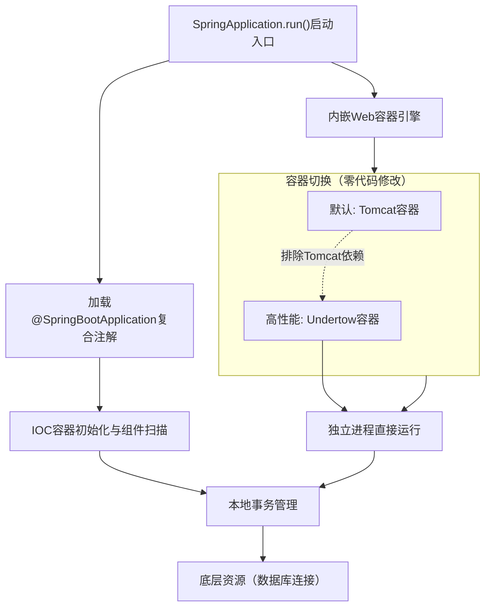

# 创建独立的Spring应用程序

【Spring Boot 原理】
Spring Boot 是由 Pivotal 团队提供的全新框架，其设计目的是用来简化新 Spring 应用的初始搭建以及开发过程。该框架使用了特定的方式来进行配置，从而使开发人员不再需要定义样板化的配置。通过这种方式，Spring Boot 致力于在蓬勃发展的快速应用开发领域(rapid application development)成为领导者。其特点如下：
1.  **创建独立的 Spring 应用程序**
2.  **嵌入的 Tomcat，无需部署 WAR 文件**
3.  **简化 Maven 配置**
4.  **自动配置 Spring**
5.  **提供生产就绪型功能**，如指标，健康检查和外部配置
6.  **绝对没有代码生成和对 XML 没有要求配置**

【实战案例】
项目初期为了快速启动，直接引入 `spring-boot-starter-web`，这会默认启动 Tomcat 容器。后来为了提升性能，需要切换到 Undertow（基于 XNIO，支持高并发）。只需在 `pom.xml` 中排除 `spring-boot-starter-tomcat` 并引入 `spring-boot-starter-undertow` 即可，无需修改任何代码，体现了 Spring Boot 约定优于配置的设计。

【关键代码片段 (独立应用主入口)】
```java
/**
 * @SpringBootApplication 是一个复合注解，包含：
 * 1. @Configuration: 标识为配置类
 * 2. @EnableAutoConfiguration: 开启自动配置（核心）
 * 3. @ComponentScan: 自动扫描组件
 */
@SpringBootApplication
// 排除某些自动配置类（实战中常用，如排除数据源自动配置）
@EnableAutoConfiguration(exclude = {DataSourceAutoConfiguration.class})
public class Application {
    public static void main(String[] args) {
        // 启动 Spring 应用上下文，内嵌 Web 容器
        SpringApplication.run(Application.class, args);
        System.out.println("Spring Boot Application Started Successfully!");
    }
}
```

【JPA 原理与事务】
事务是计算机应用中不可或缺的组件模型，它保证了用户操作的原子性、一致性、隔离性和持久性。

【本地事务】
紧密依赖于底层资源管理器（例如数据库连接 )，事务处理局限在当前事务资源内。此种事务处理方式不存在对应用服务器的依赖，因而部署灵活却无法支持多数据源的分布式事务。在数据库连接中使用本地事务示例如下：

```java
// JDBC 原生本地事务控制
public void transferAccount() {
    Connection conn = null;
    Statement stmt = null;
    try{
        conn = getDataSource().getConnection();
        // 将自动提交设置为 false，若设置为 true 则数据库将会把每一次数据更新认定为一个事务并自动提交
        conn.setAutoCommit(false); 
        stmt = conn.createStatement();
        // 将 A 账户中的金额减少 500  
        stmt.execute("update t_account set amount = amount - 500 where account_id = 'A'");
        // 将 B 账户中的金额增加 500
        stmt.execute("update t_account set amount = amount + 500 where account_id = 'B'");
        // 提交事务
        conn.commit();
    } catch (Exception e) {
        try {
            // 回滚事务
            if (conn != null) conn.rollback();
        } catch (SQLException ex) {
            ex.printStackTrace();
        }
        e.printStackTrace();
    } finally {
        // 释放资源
        try { if(stmt!=null) stmt.close(); } catch(Exception e){}
        try { if(conn!=null) conn.close(); } catch(Exception e){}
    }
}
```

## 流程图




## 记忆要点

- 核心特性：内嵌Tomcat等Web容器，直接运行独立进程，彻底抛弃传统WAR部署。
- 启动入口：依靠SpringApplication.run()引导，加载内嵌容器并初始化IOC上下文。
- 复合注解：主类@SpringBootApplication包含配置、自动配置与组件扫描三大功能。
- 切换容器：只需Maven排除Tomcat并引入Undertow，即可零代码切换高性能容器。

## 结构化回答

**30 秒电梯演讲：** 通过内嵌服务器和自动配置简化Spring应用搭建。打个比方，像精装修公寓，拎包入住（内嵌Tomcat），省去装修（配置）麻烦。

**展开框架：**
1. **核心特性** — 内嵌Tomcat等Web容器，直接运行独立进程，彻底抛弃传统WAR部署。
2. **启动入口** — 依靠SpringApplication.run()引导，加载内嵌容器并初始化IOC上下文。
3. **复合注解** — 主类@SpringBootApplication包含配置、自动配置与组件扫描三大功能。

**收尾：** 我在项目里踩过坑——【关键代码片段 (独立应用主入口)】。您想深入聊哪一段：原理、避坑还是对比选型？

## 视频脚本

> 预计时长：3 分钟 | 由浅入深

| 时间 | 画面/字幕 | 口播台词 | 讲解要点 |
|------|----------|----------|----------|
| 0:00 | 标题卡：创建独立的Spring应用程序 | "创建独立的Spring应用程序？一句话——像精装修公寓，拎包入住（内嵌Tomcat），省去装修（配置）麻烦。" | 开场钩子 |
| 0:45 | 概念动画/示意图 | "通过内嵌服务器和自动配置简化Spring应用搭建——像精装修公寓，拎包入住（内嵌Tomcat），省去装修（配置）麻烦" | 核心定义 |
| 1:30 | 核心特性示意 | "内嵌Tomcat等Web容器，直接运行独立进程，彻底抛弃传统WAR部署。" | 要点1 |
| 2:15 | 启动入口示意 | "依靠SpringApplication.run()引导，加载内嵌容器并初始化IOC上下文。" | 要点2 |
| 3:00 | 总结卡 | "记住这几条，面试不慌。下期讲进阶追问。" | 收尾 |
