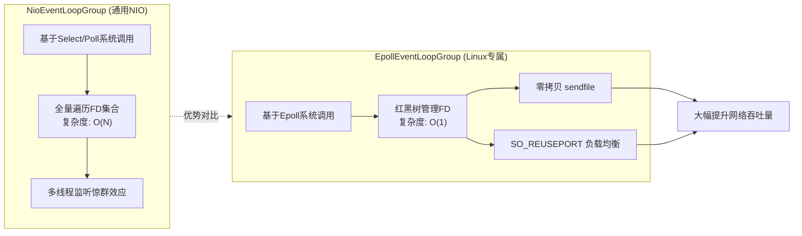

# 在构建高并发网关或服务时，Netty 的 `EpollEventLoopGroup` 相比于默认的 `NioEventLoopGroup` 在 Linux 环境下有哪些性能优势？请从系统调用角度简要说明。

在 Linux 环境下，Netty 的 `EpollEventLoopGroup` 利用 Linux 特有的 `epoll` 系统调用，相比 JDK 通用的 `NIO`（通常基于 `select`/`poll`）具有显著优势。首先，`epoll` 内部使用红黑树管理文件描述符，而 `select` 需要每次调用都遍历 FD_SET，因此 `epoll` 在连接数极高时（如万级并发）依然保持 O(1) 的时间复杂度。其次，`EpollEventLoopGroup` 通过 `Native` 传输层使用了 `sendfile` 实现零拷贝，并利用 `SO_REUSEPORT` 实现多进程/线程监听同一端口时负载均衡，从而降低上下文切换和 CPU 中断开销，大幅提升网络吞吐量。

## 技术原理

- **O(1) 复杂度：红黑树替代遍历，高并发无性能衰减**：`select`/`poll` 每次调用都要把全部 FD 传给内核遍历，连接数上万时单次系统调用就要遍历几万个 FD，复杂度 O(N)。`epoll` 用红黑树管理 FD，`epoll_ctl` 增删改是 O(log N)，但关键的 `epoll_wait` 只返回"就绪"的 FD（基于就绪链表），复杂度 O(就绪数)，在大多数连接空闲时近似 O(1)。
- **零拷贝：sendfile 直接内核传输，减少数据拷贝**：传统读文件再发网络要 4 次拷贝（磁盘→内核→用户→内核→网卡）和 2 次系统调用（read/write）。`sendfile` 让内核直接把文件页缓存拷到网卡 socket buffer，省掉用户态中转（2 次拷贝 + 1 次系统调用）。Netty 的 `EpollEventLoopGroup` 通过 Native 调用 `FileRegion` 包装 `sendfile`，大文件传输场景吞吐数倍提升。
- **负载均衡：SO_REUSEPORT 避免多线程惊群效应**：传统多进程监听同一端口时，一个连接到来所有进程被唤醒争抢（惊群），浪费 CPU。`SO_REUSEPORT` 让内核在多个监听 socket 间做哈希负载均衡，连接到来只唤醒一个进程/线程，Netty 利用它实现多 EventLoop 均匀分担 Accept，降低上下文切换。

## 对比/选型

| 维度 | select/poll（NIO 默认） | epoll（EpollEventLoopGroup） |
|------|-------------------------|------------------------------|
| FD 管理 | 数组/链表全量遍历 | 红黑树 O(log N) |
| 就绪检测 | O(N) 全量扫描 | O(就绪数)，多数空闲时 O(1) |
| FD 上限 | select 默认 1024 | 系统级（百万级） |
| 零拷贝 | 不直接支持 sendfile | 原生支持 |
| 端口复用 | 无 SO_REUSEPORT 优化 | 支持避免惊群 |
| 平台 | 跨平台 | Linux 专有 |

## 代码示例

Netty 切换到 Epoll 传输（Linux 专属优化）：

```java
import io.netty.channel.epoll.EpollEventLoopGroup;
import io.netty.channel.epoll.EpollServerSocketChannel;

// Linux 环境用 Epoll，其他平台回退 NIO
EventLoopGroup boss = new EpollEventLoopGroup(1);
EventLoopGroup worker = new EpollEventLoopGroup(Runtime.getRuntime().availableProcessors() * 2);

ServerBootstrap b = new ServerBootstrap()
    .group(boss, worker)
    .channel(EpollServerSocketChannel.class)        // 关键：用 Epoll 的 ServerSocketChannel
    .option(EpollChannelOption.SO_REUSEPORT, true)  // 端口复用，多实例均衡
    .childOption(EpollChannelOption.TCP_CORK, true) // 批量发送减少小包
    .childHandler(new MyInitializer());

// 零拷贝发送大文件
FileRegion region = new DefaultFileRegion(
    new FileInputStream("big.bin").getChannel(), 0, fileSize);
ctx.writeAndFlush(region);  // 底层调用 sendfile，不进用户态
```

## 常见坑/注意事项

- **Epoll 是平台强绑定**：`EpollEventLoopGroup` 只能在 Linux 跑，开发在 Mac/Windows 部署到 Linux 时要兼容判断：`Epoll.isAvailable() ? new EpollEventLoopGroup() : new NioEventLoopGroup()`。
- **JDK NIO 在 Linux 上其实也是 epoll**：JDK 5+ 的 `Selector` 在 Linux 默认就是 epoll 实现（通过 `epoll` 包装），所以"Epoll 比 NIO 快"的差异主要来自 Netty 的 Native 优化（sendfile、SO_REUSEPORT、更少的 GC），不是 epoll 本身。别把 Netty Epoll 和 JDK NIO 的差异等同于 epoll vs select。
- **SO_REUSEPORT 需多实例配合**：单进程开 SO_REUSEPORT 无意义，它的价值是多进程/容器实例监听同端口时内核层负载均衡。
- **零拷贝的适用边界**：sendfile 只适合"文件→socket"场景（静态资源、文件下载），动态生成的内容（业务数据序列化）用不上。

## 流程图



## 记忆要点

- 底层数据结构：epoll用红黑树管理FD，而select需全量遍历，所以epoll高并发下检索O(1)。
- 零拷贝优势：Epoll底层调用sendfile实现零拷贝，大幅减少CPU和内存数据拷贝开销。
- 端口复用均衡：利用SO_REUSEPORT实现多线程监听同端口，有效降低上下文切换开销。
- 平台限制：EpollEventLoopGroup利用Linux特有系统调用，属于平台强相关的Native传输层。

## 结构化回答

**30 秒电梯演讲：** Linux原生优化，O(1)复用与零拷贝提升吞吐。打个比方，NIO是门卫挨个敲门查岗（效率低）；Epoll是门口装了门铃，谁有事儿谁按铃，门卫只处理响铃的（效率高）。

**展开框架：**
1. **底层数据结构** — epoll用红黑树管理FD，而select需全量遍历，所以epoll高并发下检索O(1)。
2. **零拷贝优势** — Epoll底层调用sendfile实现零拷贝，大幅减少CPU和内存数据拷贝开销。
3. **端口复用均衡** — 利用SO_REUSEPORT实现多线程监听同端口，有效降低上下文切换开销。

**收尾：** 这三点都能配合实战聊。您想深入聊原理、对比还是避坑？

## 视频脚本

> 预计时长：3 分钟 | 由浅入深

| 时间 | 画面/字幕 | 口播台词 | 讲解要点 |
|------|----------|----------|----------|
| 0:00 | 标题卡：在构建高并发网关或服务时，Netty… | "在构建高并发网关或服务时，Netty 的 `EpollEventLoopGroup` 相比于默认的 `NioEventLoopGroup` 在 Linux 环境下有哪些性能优势？请从系统调用角度简要说明。？一句话——NIO是门卫挨个敲门查岗（效率低）；Epoll是门口装了门铃，谁有事儿谁按铃，门卫只处理响铃的（效率高）。" | 开场钩子 |
| 0:45 | 概念动画/示意图 | "Linux原生优化，O(1)复用与零拷贝提升吞吐——NIO是门卫挨个敲门查岗（效率低）；Epoll是门口装了门铃，谁有事儿谁按铃，门卫只处理响铃的（效率高）" | 核心定义 |
| 1:30 | 底层数据结构示意 | "epoll用红黑树管理FD，而select需全量遍历，所以epoll高并发下检索O(1)。" | 要点1 |
| 2:15 | 零拷贝优势示意 | "Epoll底层调用sendfile实现零拷贝，大幅减少CPU和内存数据拷贝开销。" | 要点2 |
| 3:00 | 总结卡 | "记住这几条，面试不慌。下期讲进阶追问。" | 收尾 |
