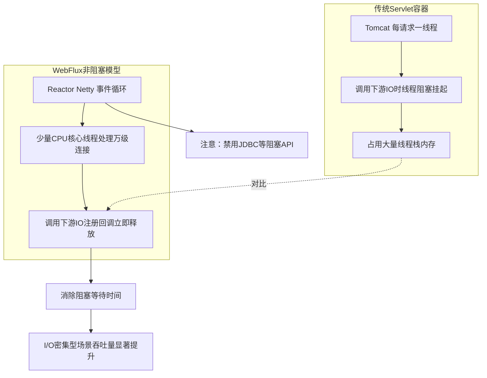

# Spring Cloud Gateway 的核心模型是 DispatcherHandler，它和传统的 Servlet 容器（如 Tomcat）处理请求的模型有何不同？WebFlux 的非阻塞特性是如何提升吞吐量的？

Tomcat 基于 Servlet 规范，采用“每连接一线程”或线程池模型，属于阻塞式 I/O，线程在等待数据库或网络响应时会被挂起，占用大量内存和上下文切换资源。Spring Cloud Gateway 基于 Spring WebFlux，默认使用 Reactor Netty 作为服务器，采用 Reactor 响应式编程模型和非阻塞 I/O（NIO）。在 WebFlux 中，少量的事件循环线程可以处理成千上万个并发连接。当请求访问数据库或外部服务时，线程不会阻塞等待，而是注册回调后立即释放去处理其他请求。这种极少的线程数和高效的回调机制，使得在 I/O 密集型场景下，Gateway 的资源利用率远高于传统 Servlet 容器，从而显著提升系统吞吐量并降低延迟。

## 技术原理

- **Tomcat 是阻塞式 I/O（BIO），高并发时线程上下文切换消耗大**：传统 Servlet 容器采用"每请求一线程"模型（实际是线程池），线程在 `InputStream.read()` 等待下游 DB/RPC 响应时被挂起（BLOCKED），占用线程栈内存（默认 1MB/线程）。10000 并发就需要 10000 线程，上下文切换和内存开销巨大，这是 Tomcat 默认配置上限通常几百到几千并发的根本原因。
- **WebFlux 是非阻塞 I/O（NIO），少量线程处理大量连接**：WebFlux 基于 Reactor Netty，用少量事件循环线程（默认 CPU 核数 × 2，如 8 核机器仅 16 线程）配合 NIO Selector 处理上万连接。线程不阻塞等待 I/O，而是注册回调（`Mono.flatMap`）后立即释放去处理其他请求，I/O 完成后由事件循环线程回调处理结果。
- **核心区别在于等待 I/O 期间**：Servlet 线程被阻塞挂起（资源闲置）；WebFlux 线程注册回调后立即释放处理其他任务。WebFlux 的高吞吐量源于消除了阻塞等待——同样的硬件能同时承载的"在途请求"数提升 10-100 倍，特别适合 I/O 密集型场景（网关、聚合 BFF、调下游微服务）。

## 对比/选型

| 维度 | Tomcat（Servlet BIO） | WebFlux + Netty（NIO） |
|------|------------------------|------------------------|
| 线程模型 | 每请求一线程（线程池） | 事件循环（少量线程） |
| I/O 模型 | 阻塞 | 非阻塞 |
| 等待 I/O 时 | 线程挂起 | 注册回调后释放 |
| 内存占用 | 高（线程栈 ×并发数） | 低（线程数固定） |
| 并发上限 | 受线程池大小限制 | 受 FD 上限限制（万级+） |
| 编程模型 | 同步命令式 | 响应式（Mono/Flux） |
| 适合场景 | CPU 密集、传统业务 | I/O 密集、网关聚合 |

## 代码示例

Spring Cloud Gateway 的 WebFlux 非阻塞过滤器：

```java
@Component
public class AuthFilter implements GlobalFilter, Ordered {
    @Override
    public Mono<Void> filter(ServerWebExchange exchange, GatewayFilterChain chain) {
        String token = exchange.getRequest().getHeaders().getFirst("Authorization");
        // 非阻塞调用鉴权服务：返回 Mono 而非阻塞等待
        return authClient.verify(token)                       // 异步非阻塞
            .flatMap(userId -> {
                exchange.getRequest().mutate().header("X-User-Id", userId).build();
                return chain.filter(exchange);                // 放行下游
            })
            .switchIfEmpty(Mono.error(new AuthException("无效token")))
            .onErrorResume(e -> {
                exchange.getResponse().setStatusCode(HttpStatus.UNAUTHORIZED);
                return exchange.getResponse().setComplete();
            });
    }
    @Override public int getOrder() { return -100; }
}
```

对比传统 Servlet 阻塞写法（线程被挂起）：

```java
// Servlet：线程在 authClient.verify 时阻塞，10000 并发需 10000 线程
String userId = authClient.verify(token);   // 阻塞调用
if (userId == null) { resp.sendError(401); return; }
chain.doFilter(req, resp);
```

## 常见坑/注意事项

- **WebFlux 不能用阻塞 API**：在 WebFlux 里调 `Thread.sleep`、JDBC、同步 HTTP 客户端（HttpURLConnection）会阻塞事件循环线程，整条 pipeline 跟着阻塞。必须用异步驱动（R2DBC、WebClient、异步 Redis 客户端），或显式 `subscribeOn(boundedElastic())` 隔离。
- **调试困难**：响应式链是声明式的，异常栈不连续，调试比命令式痛苦很多。要用 `checkpoint()`、`Hooks.onOperatorDebug()` 辅助。
- **不一定更快**：CPU 密集型任务用 WebFlux 没优势（甚至更慢，因 Mono 调度开销），它的甜区是 I/O 密集（网关、BFF、大量调下游）。简单 CRUD 用 Servlet 反而更易写。
- **背压（Backpressure）要处理**：响应式流的核心是消费者能反向施压控制生产速率，不处理背压会导致上游堆积 OOM。
- **学习曲线陡**：Mono/FlatMap/操作符链对团队是负担，小团队或快速迭代项目慎选。

## 流程图



## 核心知识点图


## 记忆要点

- 模型对比：Tomcat是阻塞式线程池，而WebFlux+Netty是非阻塞事件循环
- 瓶颈差异：Tomcat线程等待IO会挂起，而Netty线程注册回调后立即释放
- 性能结论：因为少量事件循环线程即可处理万级并发，所以I/O密集型场景吞吐量显著提升

## 结构化回答

**30 秒电梯演讲：** 由阻塞线程模型转为非阻塞事件循环模型，大幅提升并发效率。打个比方，传统 Servlet 像银行柜台，每个客户必须占用一个窗口（线程）办理业务，等待时窗口闲置；WebFlux 像快餐店，一个服务员（线程）利用等待餐点的时间轮流服务多个顾客，无需死等。

**展开框架：**
1. **模型对比** — Tomcat是阻塞式线程池，而WebFlux+Netty是非阻塞事件循环
2. **瓶颈差异** — Tomcat线程等待IO会挂起，而Netty线程注册回调后立即释放
3. **性能结论** — 因为少量事件循环线程即可处理万级并发，所以I/O密集型场景吞吐量显著提升

**收尾：** 这三点都能配合实战聊。您想深入聊原理、对比还是避坑？

## 视频脚本

> 预计时长：2 分钟 | 由浅入深

| 时间 | 画面/字幕 | 口播台词 | 讲解要点 |
|------|----------|----------|----------|
| 0:00 | 标题卡：Spring Cloud Gatew… | "Spring Cloud Gateway 的核心模型是 DispatcherHandler，它和传统的 Servlet 容器（如 Tomcat）处理请求的模型有何不同？WebFlux 的非阻塞特性是如何提升吞吐量的？一句话——传统 Servlet 像银行柜台，每个客户必须占用一个窗口（线程）办理业务，等待时窗口闲置；WebFlux 像快餐店，一个服务员（线程）利用等待餐点的时间轮流服务多个顾客，无需死等。" | 开场钩子 |
| 0:40 | 概念动画/示意图 | "由阻塞线程模型转为非阻塞事件循环模型，大幅提升并发效率——传统 Servlet 像银行柜台，每个客户必须占用一个窗口（线程）办理业务，等待时窗口闲置；WebFlux 像快餐店，一个服务员（线程）利用等待餐点的时间轮流服务多个顾客，无需死等" | 核心定义 |
| 1:20 | 模型对比示意 | "Tomcat是阻塞式线程池，而WebFlux+Netty是非阻塞事件循环" | 要点1 |
| 2:00 | 总结卡 | "记住这几条，面试不慌。下期讲进阶追问。" | 收尾 |
