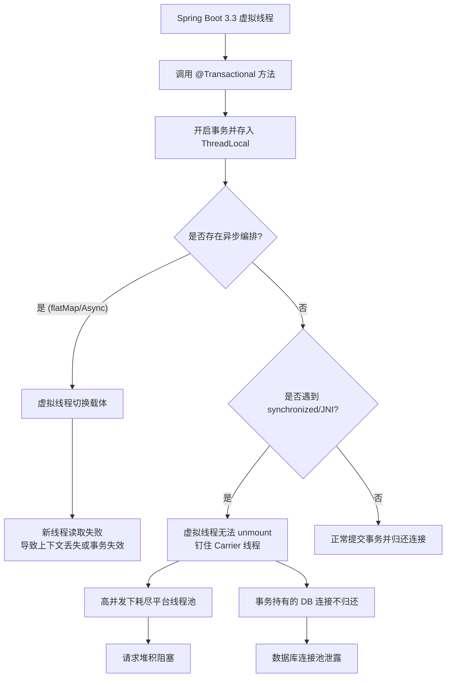

# 在Spring Boot 3.3中使用虚拟线程作为Web容器线程时，`@Transactional`注解的行为会有什么潜在风险？

Spring Boot 3.3支持虚拟线程事务，但存在两个主要风险：一是上下文隔离问题，传统`@Transactional`基于ThreadLocal，在虚拟线程与平台线程切换或异步场景下可能导致上下文丢失；二是线程钉住（Pinning）风险，事务代码调用`synchronized`块或JNI时会钉住Carrier线程，高并发下可能耗尽平台线程池，导致请求阻塞和数据库连接泄露。

## 技术原理

- **事务上下文通常依赖 ThreadLocal 存储，在线程切换时可能丢失**：Spring 的 `@Transactional` 通过 AOP 在方法进入时开启事务，把 `Connection` 和事务状态存在 `TransactionSynchronizationManager` 的 `ThreadLocal` 里，方法返回时提交。虚拟线程在 `flatMap`/异步编排时会切换载体线程，如果上下文没透传，新线程读不到原线程的事务，会出现"事务不生效"或"连接获取错乱"的幽灵问题。Spring 6 已支持 `ScopedTransaction` 改进，但第三方库未必兼容。
- **虚拟线程虽廉价，但调用 synchronized 或 JNI 会导致 Carrier 线程被钉住**：虚拟线程挂载在 Carrier（平台）线程上执行，遇到 `synchronized` 块、`Object.wait`、JNI 调用等"不可卸载"操作时，虚拟线程无法 unmount，会"钉住"Carrier 线程阻塞等待。JDK 21 已修复 `synchronized` 的 pinning（JEP 491），但 JNI、某些 native 库（如旧版数据库驱动、加密库）仍会 pin。
- **高并发下钉住会耗尽平台线程池，引发阻塞和连接泄露**：ForkJoinPool 默认 `CPU 核数` 个 Carrier 线程。大量虚拟线程被钉住占用 Carrier，可用的 Carrier 被耗尽，后续虚拟线程无法调度执行，请求堆积超时；更严重的是事务持有的 DB 连接在虚拟线程被 pin 期间不会归还连接池，高并发下连接池被占满，整个应用对 DB 的访问瘫痪。

## 代码示例

检测 pinning（JVM 参数 + 代码）：

```bash
# JDK 21+ 开启 pinning 日志，能看到哪些虚拟线程被钉住
java -Djdk.tracePinnedThreads=full -jar app.jar
# 输出示例：
# VirtualThread[#123] pinned at com.example.Service.synchronizedMethod(Service.java:45)
```

高风险代码（synchronized 在事务中钉住 Carrier）：

```java
@Service
public class OrderService {
    private final Object lock = new Object();

    @Transactional                          // 事务 + 虚拟线程
    public void placeOrder(Order o) {
        synchronized (lock) {               // 危险：pinning Carrier 线程
            orderDao.insert(o);
            accountDao.debit(o.getUserId(), o.getAmount());
        }
    }
}

// 改造：用 ReentrantLock 替代 synchronized（可释放 Carrier）
private final ReentrantLock lock = new ReentrantLock();

@Transactional
public void placeOrder(Order o) {
    lock.lock();
    try {
        orderDao.insert(o);
    } finally {
        lock.unlock();                      // ReentrantLock 不 pin，虚拟线程可 unmount
    }
}
```

配置虚拟线程 + 监控连接池：

```yaml
# application.yml
spring:
  threads:
    virtual:
      enabled: true                         # 开启虚拟线程
  datasource:
    hikari:
      maximum-pool-size: 50                 # 注意：pinning 时连接会被占住不释放
```

## 对比/选型

| 场景 | synchronized | ReentrantLock |
|------|--------------|---------------|
| JDK 版本 | JDK 24+ 才完全修复 pinning | 不 pin（虚拟线程友好） |
| 可中断 | 否 | 是 |
| 可超时 | 否 | 是（tryLock） |
| 建议 | 虚拟线程下避免 | 虚拟线程下推荐 |

## 常见坑/注意事项

- **JDK 版本决定 pinning 严重程度**：JDK 21 的 `synchronized` 仍会 pin（JEP 491 在 JDK 24 才修），生产用虚拟线程要确认 JDK 版本，或提前用 `ReentrantLock`。
- **数据库驱动要新版**：旧版 JDBC 驱动（如 MySQL Connector/J 8.0.28 之前）内部用了 `synchronized` 或 native 阻塞，会 pin 虚拟线程。升级到支持虚拟线程的版本（MySQL 8.0.32+/PostgreSQL 42.6+）。
- **连接池要支持虚拟线程**：HikariCP 5.1+ 才完全适配虚拟线程；连接池大小在虚拟线程下要重新评估（虚拟线程可能瞬间打出大量并发请求打爆池子）。
- **事务 + 异步组合要谨慎**：`@Transactional` + `@Async` 或 `CompletableFuture` 本身就有上下文丢失问题，叠加虚拟线程风险更高，必要时用编程式事务 + 手动透传。
- **监控 pinning**：上线前用 `-Djdk.tracePinnedThreads=short` 跑压测，发现 pin 点提前改造，避免线上 Carrier 耗尽。

## 流程图



## 核心知识点图


## 记忆要点

- 风险一：传统事务基于ThreadLocal，因为虚拟线程切换可能导致事务上下文隔离丢失
- 风险二：因为遇到synchronized或JNI会发生线程钉住，所以高并容易耗尽Carrier线程
- 底层隐患：平台线程耗尽不仅引发请求阻塞，甚至可能导致数据库连接泄露

## 结构化回答

**30 秒电梯演讲：** ThreadLocal切换易丢事务，Carrier线程钉住引发资源耗尽。打个比方，就像把任务分配给大量临时工（虚拟线程），虽然临时工很多，但如果临时工必须借用经理（平台线程）的手才能操作某些老旧设备（同步块），经理就会被长时间占用，导致整个办公室因经理不够用而瘫痪。

**展开框架：**
1. **风险一** — 传统事务基于ThreadLocal，因为虚拟线程切换可能导致事务上下文隔离丢失
2. **风险二** — 因为遇到synchronized或JNI会发生线程钉住，所以高并容易耗尽Carrier线程
3. **底层隐患** — 平台线程耗尽不仅引发请求阻塞，甚至可能导致数据库连接泄露

**收尾：** 这三点都能配合实战聊。您想深入聊原理、对比还是避坑？

## 视频脚本

> 预计时长：2 分钟 | 由浅入深

| 时间 | 画面/字幕 | 口播台词 | 讲解要点 |
|------|----------|----------|----------|
| 0:00 | 标题卡：在Spring Boot 3.3中使… | "在Spring Boot 3.3中使用虚拟线程作为Web容器线程时，`@Transactional`注解的行为会有什么潜在风险？一句话——就像把任务分配给大量临时工（虚拟线程），虽然临时工很多，但如果临时工必须借用经理（平台线程）的手才能操作某些老旧设备（同步块），经理就会被长时间占用，导致整个办公室因经理不够用而瘫痪。" | 开场钩子 |
| 0:40 | 概念动画/示意图 | "ThreadLocal切换易丢事务，Carrier线程钉住引发资源耗尽——就像把任务分配给大量临时工（虚拟线程），虽然临时工很多，但如果临时工必须借用经理（平台线程）的手才能操作某些老旧设备（同步块），经理就会被长时间占用，导致整个办公室因经理不够用而瘫痪" | 核心定义 |
| 1:20 | 风险一示意 | "传统事务基于ThreadLocal，因为虚拟线程切换可能导致事务上下文隔离丢失" | 要点1 |
| 2:00 | 总结卡 | "记住这几条，面试不慌。下期讲进阶追问。" | 收尾 |
