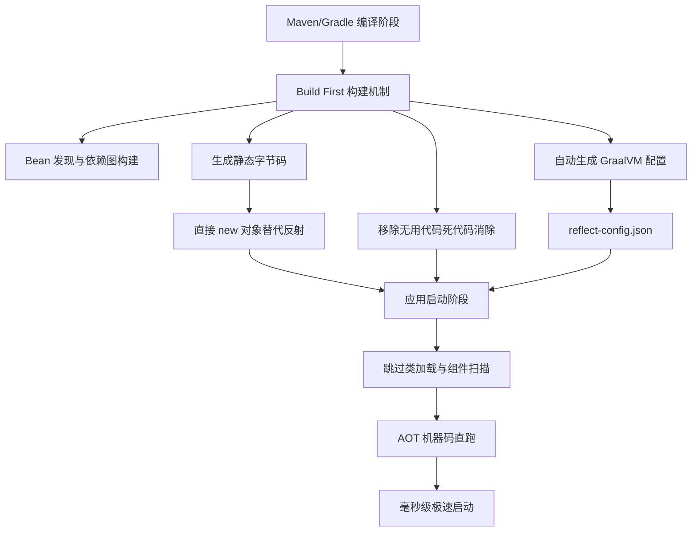

# 在使用Quarkus构建云原生应用时，其“Supersonic Subatomic Java”特性是如何在AOT编译层面实现极速启动的？

Quarkus的核心优势在于其“Build First”构建时处理策略。与Spring Boot在运行时通过反射和依赖注入组装Bean不同，Quarkus在编译阶段（Maven/Gradle build）完成了Bean发现与验证、移除未使用代码，并将依赖注入逻辑转化为静态字节码（直接new对象代替反射），同时自动生成GraalVM Native Image配置。这种策略使得应用启动时无需繁重的类加载和组件扫描，直接从已初始化状态执行，从而实现毫秒级启动和极低内存占用。

## 技术原理

- **Build First 策略：将运行时反射和 DI 逻辑在编译期静态化**：Spring Boot 在运行时通过类路径扫描 + 反射发现 `@Component`、解析 `@Autowired` 注入依赖，这些动作发生在启动时，是慢启动的根源。Quarkus 把这些工作搬到构建阶段——Maven/Gradle 插件在编译期完成 Bean 发现、依赖图构建、配置绑定，启动时直接执行已组装好的对象图，跳过扫描和反射。
- **字节码优化：直接 new 对象替代反射，移除死代码**：Quarkus 在构建期生成静态字节码，用直接 `new` + setter 调用替代反射 `Class.forName` + `Method.invoke`，性能高且 JIT 友好。同时做"死代码消除"——未被引用的 Bean、未使用的依赖库元数据会被移除，减少启动加载量和内存占用。这使得 Quarkus 启动时间从秒级降到毫秒级。
- **集成 GraalVM：自动生成 Native Image 配置，跳过类加载**：GraalVM Native Image 要求在编译期知道所有反射/动态代理/资源使用情况，否则运行时报错。Quarkus 在构建期自动收集这些信息生成 `reflect-config.json`、`resource-config.json`，让 Native Image 编译顺畅；Native Image 把字节码 AOT 编译成机器码，启动时无 JVM 类加载、无 JIT 预热，启动时间低至几十毫秒。

## 对比/选型

| 维度 | Spring Boot | Quarkus（JVM 模式） | Quarkus（Native） |
|------|-------------|----------------------|--------------------|
| 启动时间 | 2-10 秒 | 0.5-2 秒 | 10-50 毫秒 |
| 内存占用 | 200MB+ | 100MB+ | 20-50MB |
| DI 实现 | 运行时反射 | 构建期静态字节码 | 构建期 + AOT |
| 生态成熟度 | 极高 | 中 | 中 |
| 适合场景 | 传统应用、复杂业务 | 云原生、微服务 | Serverless、Lambda |

## 代码示例

Quarkus 的 CDI Bean（与 Spring 类似但 Build First）：

```java
// 启动时静态注入，无运行时反射
@ApplicationScoped                           // 构建期记录，运行时直接 new
public class OrderService {
    @Inject                                  // 构建期生成 setter 注入字节码
    InventoryClient client;

    public Order create(Order o) {
        if (!client.check(o.getProductId())) throw new IllegalArgumentException();
        return o;
    }
}

@Path("/orders")
public class OrderResource {
    @Inject OrderService service;

    @POST
    public Response place(Order o) {
        return Response.ok(service.create(o)).build();
    }
}
```

构建 Native Image：

```bash
# Maven 构建 Native 可执行文件（构建慢，启动极快）
./mvnw package -Dnative \
  -Dquarkus.native.container-build=true \
  -Dquarkus.native.builder-image=quay.io/quarkus/ubi-quarkus-native-image:23-java

# 启动监控对比
./target/order-service-runner
# 启动时间: 0.032s   内存: 38MB   （Spring Boot 同应用: 8s / 350MB）
```

## 常见坑/注意事项

- **Native Image 兼容性**：GraalVM 对反射/动态代理/动态类加载有限制，引入第三方库前要确认有 Quarkus Extension 或 GraalVM 配置，否则 Native 编译失败。
- **构建时间显著增加**：JVM 模式构建几十秒，Native 模式构建可能几分钟（AOT 编译慢），CI/CD 流水线要预留时间。
- **调试体验变差**：Native 模式下堆栈、反射行为与 JVM 模式有差异，开发用 JVM 模式、生产用 Native，要分别测试。
- **不一定要 Native**：Quarkus 在 JVM 模式下（不开 `-Dnative`）也通过 Build First 大幅缩短启动时间，对不能接受 GraalVM 限制的场景，仅用 JVM 模式 + Quarkus 已有可观收益。
- **生态比 Spring 小**：Quarkus Extension 覆盖度不及 Spring Starter，某些冷门库可能没适配，迁移成本要评估。

## 流程图



## 记忆要点

- 核心策略：Quarkus采用Build First机制，在编译阶段完成Bean发现与组装
- 极致优化：因为构建时直接用new生成静态字节码替代反射，所以启动无需组件扫描
- 闭环联动：构建时自动移除无用代码并生成Native配置，实现毫秒级极速启动

## 结构化回答

**30 秒电梯演讲：** 编译时将动态依赖注入转化为静态代码，移除运行时开销。打个比方，传统框架像点餐现做，锅碗瓢盆（类加载）都要摆一遍；Quarkus像预制菜，构建时切好配料，启动只需加热上桌。

**展开框架：**
1. **核心策略** — Quarkus采用Build First机制，在编译阶段完成Bean发现与组装
2. **极致优化** — 因为构建时直接用new生成静态字节码替代反射，所以启动无需组件扫描
3. **闭环联动** — 构建时自动移除无用代码并生成Native配置，实现毫秒级极速启动

**收尾：** 这三点都能配合实战聊。您想深入聊原理、对比还是避坑？

## 视频脚本

> 预计时长：2 分钟 | 由浅入深

| 时间 | 画面/字幕 | 口播台词 | 讲解要点 |
|------|----------|----------|----------|
| 0:00 | 标题卡：在使用Quarkus构建云原生应用时… | "在使用Quarkus构建云原生应用时，其“Supersonic Subatomic Java”特性是如何在AOT编译层面实现极速启动的？一句话——传统框架像点餐现做，锅碗瓢盆（类加载）都要摆一遍；Quarkus像预制菜，构建时切好配料，启动只需加热上桌。" | 开场钩子 |
| 0:40 | 概念动画/示意图 | "编译时将动态依赖注入转化为静态代码，移除运行时开销——传统框架像点餐现做，锅碗瓢盆（类加载）都要摆一遍；Quarkus像预制菜，构建时切好配料，启动只需加热上桌" | 核心定义 |
| 1:20 | 核心策略示意 | "Quarkus采用Build First机制，在编译阶段完成Bean发现与组装" | 要点1 |
| 2:00 | 总结卡 | "记住这几条，面试不慌。下期讲进阶追问。" | 收尾 |
