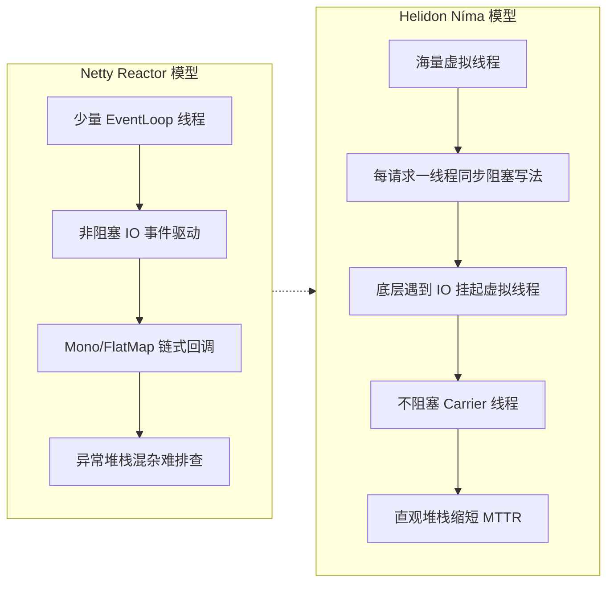

# Helidon Níma 是如何利用虚拟线程来重新定义Reactive编程模型的？它与Netty的Reactor模式有何不同？

Helidon Níma 是基于虚拟线程构建的Reactive Web服务器。传统的Netty Reactor模式依赖于少量的EventLoop线程和非阻塞IO回调，虽然避免了线程阻塞，但异步编程逻辑复杂，容易出现回调地狱且难以调试。Helidon Níma利用虚拟线程“每请求一线程”的编程模型，开发者可以编写看似同步阻塞的代码（如直接`requestInputStream.read()`），但底层IO操作会挂起虚拟线程而不阻塞Carrier线程。这保留了Reactive模型的高吞吐量能力，同时大幅简化了代码结构。其本质区别在于：Netty是基于“事件驱动+回调”的异步非阻塞，而Helidon Níma是基于“轻量级线程+同步阻塞”的并发非阻塞。

### 实战案例
在处理复杂业务逻辑（如包含多次数据库查询和外部RPC调用）时，Netty的Mono/Flux链路一旦出现异常，堆栈追踪往往充满非业务相关的Reactor框架类，排查困难；而在Helidon Níma中使用虚拟线程，异常堆栈与传统的同步代码一致，能够直接定位到具体的业务代码行，极大地缩短了故障修复时间（MTTR）。

### 关键代码示例
```java
// Helidon Níma: 虚拟线程 + 同步风格
public void handle(ServerRequest req, ServerResponse res) {
    try (var executor = Executors.newVirtualThreadPerTaskExecutor()) {
        // 在虚拟线程中直接阻塞读取，不会阻塞底层OS线程
        String data = req.content().as(String.class); // 模拟阻塞IO
        String result = dbService.blockingQuery(data); // 模拟阻塞JDBC
        res.send(result);
    }
}

// Netty: Reactor 异步风格
public Mono<ServerResponse> handle(ServerRequest req) {
    return req.bodyToMono(String.class)
           .flatMap(data -> dbService.asyncQuery(data)) // 必须全链路异步
           .map(result -> ServerResponse.ok().bodyValue(result));
}
```

### 模型对比
| 特性 | Netty (Reactor Pattern) | Helidon Níma (Virtual Threads) |
| :--- | :--- | :--- |
| **编程模型** | 异步/响应式 | 同步阻塞 (看似) |
| **核心抽象** | EventLoop + Callback | Virtual Thread (Continuation) |
| **上下文切换** | 极低 (线程不切换) | 极低 (由JVM调度挂起) |
| **代码可读性** | 较低 (学习曲线陡峭) | 高 (如同写传统Servlet) |
| **调试难度** | 困难 (堆栈非直观) | 容易 (堆栈直观) |
| **阻塞代价** | 极高 (阻塞EventLoop会死锁) | 低 (只挂起虚拟线程) |

## 技术原理

**编程模型：Netty 全链路异步 vs Helidon Níma 同步阻塞**
Netty 基于 Reactor 模式，要求整条调用链都是异步的（Mono/FlatMap 链式调用），一旦某一步写了阻塞代码（如 JDBC 查询）就会卡死 EventLoop，导致整个服务不可用。Helidon Níma 利用 Java 21 虚拟线程，开发者写的是传统的同步阻塞代码（直接 `inputStream.read()`、`jdbcTemplate.query()`），但底层 IO 操作只会挂起虚拟线程而不阻塞 Carrier 线程，JVM 调度器自动切换其他虚拟线程执行。

**底层机制：EventLoop 回调 vs 虚拟线程挂起**
Netty 的核心是少量 EventLoop 线程（通常等于 CPU 核数）配合非阻塞 IO 和回调。所有 IO 完成后通过回调通知，复杂的业务逻辑需要拼装成回调链或响应式流。Helidon Níma 的核心是 Continuation（ continuation 虚拟线程），当遇到阻塞 IO 时，JVM 会保存当前虚拟线程的执行栈并挂起，IO 完成后恢复执行，对开发者完全透明。

**调试体验：堆栈复杂难追踪 vs 堆栈直观易排查**
Netty 的异步代码一旦抛异常，堆栈里全是 Reactor 框架类（如 `FluxFlatMap.java`），很难定位到具体业务代码行。虚拟线程的同步代码堆栈与传统 Servlet 一致，异常能直接定位到业务方法，极大缩短 MTTR（平均修复时间）。

## 代码示例

```java
// Helidon Níma: 虚拟线程 + 同步阻塞写法（推荐）
public void handle(ServerRequest req, ServerResponse res) {
    // 每个请求分配一个虚拟线程，直接写阻塞代码
    String data = req.content().as(String.class);   // 阻塞读取
    String result = dbService.blockingQuery(data);  // 阻塞 JDBC
    res.send(result);                                // 直接返回
}
```

```java
// Netty: Reactor 异步链式写法（必须全链路异步）
public Mono<ServerResponse> handle(ServerRequest req) {
    return req.bodyToMono(String.class)
        .flatMap(dbService::asyncQuery)   // 必须返回 Mono
        .map(r -> ServerResponse.ok().bodyValue(r))
        .onErrorResume(e -> Mono.just(errorResponse(e))); // 异常处理也是异步
}
```

## 注意事项

- 模型颠覆：Helidon Níma 利用虚拟线程，实现每请求一线程的同步阻塞编程模型。
- 吞吐不减：看似是同步阻塞代码，实际底层 IO 仅挂起虚拟线程而不阻塞 Carrier 线程。
- 核心对比：Netty 是事件驱动+回调，而 Níma 是轻量级线程+同步，且异常堆栈极易调试。
- 虚拟线程不适合 CPU 密集型长任务（会长期占用 Carrier），IO 密集型才收益最大。
- 使用虚拟线程时避免 `synchronized` 长期持有（会 pin 住 Carrier），改用 `ReentrantLock`。

## 流程图



## 记忆要点

- 模型颠覆：Helidon Níma利用虚拟线程，实现每请求一线程的同步阻塞编程模型
- 吞吐不减：看似是同步阻塞代码，实际底层IO仅挂起虚拟线程而不阻塞Carrier线程
- 核心对比：Netty是事件驱动+回调，而Níma是轻量级线程+同步，且异常堆栈极易调试

## 结构化回答

**30 秒电梯演讲：** 利用虚拟线程将Reactive模型从异步回调回归为同步阻塞写法。打个比方，Netty像是用对讲机接力传话（异步回调），稍有断线就混乱；Helidon Níma像是给每个人配了分身（虚拟线程），可以专心打电话等待，不会占用大活人（系统线程）。

**展开框架：**
1. **模型颠覆** — Helidon Níma利用虚拟线程，实现每请求一线程的同步阻塞编程模型
2. **吞吐不减** — 看似是同步阻塞代码，实际底层IO仅挂起虚拟线程而不阻塞Carrier线程
3. **核心对比** — Netty是事件驱动+回调，而Níma是轻量级线程+同步，且异常堆栈极易调试

**收尾：** 我在项目里踩过坑——在处理复杂业务逻辑（如包含多次数据库查询和外部RPC调用）时，Netty的Mono/Flux链路一旦出现异常，堆栈追踪往往充满非业务相关的Reactor框架类，排查困难；而在Helidon Níma中使用虚拟线程，异常堆栈与传统的同步代码一致，能够直接定位到具体的业务代码行，极大地缩短了故障修复时间（MTTR）。您想深入聊哪一段：原理、避坑还是对比选型？

## 视频脚本

> 预计时长：2 分钟 | 由浅入深

| 时间 | 画面/字幕 | 口播台词 | 讲解要点 |
|------|----------|----------|----------|
| 0:00 | 标题卡：Helidon Níma 是如何利用… | "Helidon Níma 是如何利用虚拟线程来重新定义Reactive编程模型的？它与Netty的Reactor模式有何不同？一句话——Netty像是用对讲机接力传话（异步回调），稍有断线就混乱；Helidon Níma像是给每个人配了分身（虚拟线程），可以专心打电话等待，不会占用大活人（系统线程）。" | 开场钩子 |
| 0:40 | 概念动画/示意图 | "利用虚拟线程将Reactive模型从异步回调回归为同步阻塞写法——Netty像是用对讲机接力传话（异步回调），稍有断线就混乱；Helidon Níma像是给每个人配了分身（虚拟线程），可以专心打电话等待，不会占用大活人（系统线程）" | 核心定义 |
| 1:20 | 模型颠覆示意 | "Helidon Níma利用虚拟线程，实现每请求一线程的同步阻塞编程模型" | 要点1 |
| 2:00 | 总结卡 | "记住这几条，面试不慌。下期讲进阶追问。" | 收尾 |
