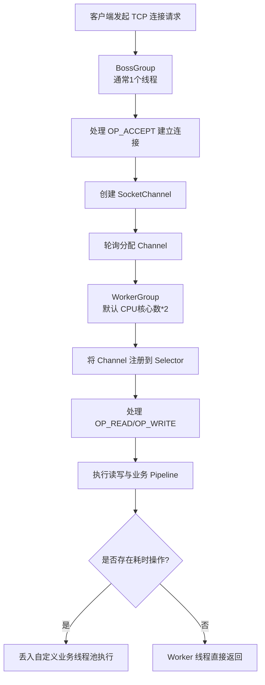

# Netty 的 Reactor 线程模型中，BossGroup 和 WorkerGroup 的职责分工是什么？

Netty 基于 Reactor 模式，通常将线程池分为 BossGroup 和 WorkerGroup。BossGroup 通常只有 1 个线程（也可配置多个），专门负责处理客户端的 TCP 连接请求（Register、Accept 事件）。一旦连接建立，BossGroup 会将新建的 Channel 注册到 WorkerGroup 的某个 Selector 上。WorkerGroup 由默认为 CPU 核数 * 2 的线程组成，负责处理 I/O 读写事件以及处理任务队列中的非 I/O 任务（如 `Context.execute()` 提交的任务）。这种设计实现了连接建立与数据处理的解耦，BossGroup 专注于接入，WorkerGroup 专注于高并发读写，极大利用了多核 CPU 的并行计算能力。

## 技术原理

- **BossGroup：监听端口，Accept 连接，默认 1 线程**：BossGroup 专职处理 OP_ACCEPT 事件——监听服务器端口，接收客户端的 TCP 三次握手并创建 SocketChannel。这一阶段是 I/O 密集但操作轻量的（建连接本身不耗时），所以 Boss 通常只需 1 个线程即可处理极高 QPS 的连接建立（单线程 Accept 在万级并发连接/秒下仍够用）。
- **WorkerGroup：处理已连接 Channel 的 I/O 读写，默认 CPU*2 线程**：连接建立后，Boss 把该 Channel 的 OP_READ/OP_WRITE 事件注册到 WorkerGroup 的某个 NioEventLoop 的 Selector 上。Worker 线程负责读写编解码、业务 pipeline 处理。默认 `CPU 核数 × 2` 是经验值——兼顾多核并行和避免过多线程竞争。
- **职责解耦：连接建立与数据处理分离，避免阻塞**：如果 Accept 和读写混在一起，慢的 I/O 处理会拖慢新连接接入，导致连接被拒绝。分离后，Boss 永远能快速 Accept，Worker 专心处理业务，两者互不阻塞；新增的 Channel 在 Worker 间轮询分配（round-robin），天然实现负载均衡。

## 代码示例

Netty 标准 Reactor 模型：

```java
// BossGroup：1 个线程专职 Accept
EventLoopGroup bossGroup = new NioEventLoopGroup(1);
// WorkerGroup：默认 CPU 核数 × 2，处理已连接 Channel 的读写
EventLoopGroup workerGroup = new NioEventLoopGroup(Runtime.getRuntime().availableProcessors() * 2);

ServerBootstrap b = new ServerBootstrap()
    .group(bossGroup, workerGroup)
    .channel(NioServerSocketChannel.class)
    .option(ChannelOption.SO_BACKLOG, 1024)        // 全连接队列大小
    .childOption(ChannelOption.TCP_NODELAY, true)
    .childHandler(new ChannelInitializer<SocketChannel>() {
        @Override
        protected void initChannel(SocketChannel ch) {
            ch.pipeline()
              .addLast(new LengthFieldBasedFrameDecoder(1024, 0, 4, 0, 4))
              .addLast(new MyBizHandler());        // 业务 Handler 在 Worker 线程跑
        }
    });
ChannelFuture f = b.bind(8080).sync();
```

单线程 Reactor 模型（Boss 和 Worker 共用，适合低并发）：

```java
// 1 个线程既 Accept 又处理读写，适合连接数少、请求快的场景
EventLoopGroup group = new NioEventLoopGroup(1);
new ServerBootstrap().group(group).channel(NioServerSocketChannel.class)...
```

## 对比/选型

| 模型 | 线程数 | 适用场景 |
|------|--------|----------|
| 单线程 Reactor | 1 | 低并发、客户端 |
| 非 Reactor（每连接一线程） | = 连接数 | 已被淘汰 |
| 主从 Reactor（Boss+Worker） | 1 + N | 高并发服务端（主流） |
| 主从 Reactor 多 Boss | M + N | 极高并发连接率（少见） |

## 常见坑/注意事项

- **业务 Handler 不要阻塞 Worker 线程**：Handler 在 Worker 上同步执行，如果调 DB、慢 RPC 会阻塞整个 EventLoop，该 EventLoop 上绑定的几百个 Channel 全部卡住。耗时操作要丢到业务线程池 `ctx.executor().execute()` 或 `DefaultEventExecutorGroup`。
- **Boss 线程数别配多**：多数场景 1 个 Boss 就够，配多了反而带来 Accept 争抢（除非用 SO_REUSEPORT 显式负载均衡）。误以为"Boss 越多接入越快"是常见误解。
- **Worker 默认 CPU*2 不要随意改大**：线程数过多会争抢 CPU 增加上下文切换，反而降低吞吐。CPU 密集型场景甚至可以减半。
- **Handler 默认在 Worker 跑**：通过 `pipeline.addLast(executorGroup, handler)` 才能让该 Handler 跑在指定业务线程池，否则就是 Worker 同步执行。
- **连接数极多时 Channel 要均匀分配**：默认 round-robin 在某些场景（如长连接 + 短连接混合）可能不均，可自定义 `EventExecutorChooserFactory` 优化。

## 流程图



## 记忆要点

- 职责对比：BossGroup专职处理TCP连接建立，而WorkerGroup专职处理IO读写
- 线程配比：Boss通常仅1个线程，而Worker默认配置为CPU核心数*2
- 协作机制：因为连接建立后Boss会转发注册给Worker，所以实现了接入与并行的解耦

## 结构化回答

**30 秒电梯演讲：** Boss负责连接，Worker负责读写，分工解耦实现高并发。打个比方，像餐馆：Boss是门口迎宾员负责接待客人（建立连接），Worker是内部厨师负责炒菜（处理数据读写）。

**展开框架：**
1. **职责对比** — BossGroup专职处理TCP连接建立，而WorkerGroup专职处理IO读写
2. **线程配比** — Boss通常仅1个线程，而Worker默认配置为CPU核心数*2
3. **协作机制** — 因为连接建立后Boss会转发注册给Worker，所以实现了接入与并行的解耦

**收尾：** 这三点都能配合实战聊。您想深入聊原理、对比还是避坑？

## 视频脚本

> 预计时长：2 分钟 | 由浅入深

| 时间 | 画面/字幕 | 口播台词 | 讲解要点 |
|------|----------|----------|----------|
| 0:00 | 标题卡：Netty 的 Reactor 线程… | "Netty 的 Reactor 线程模型中，BossGroup 和 WorkerGroup 的职责分工是什么？一句话——像餐馆：Boss是门口迎宾员负责接待客人（建立连接），Worker是内部厨师负责炒菜（处理数据读写）。" | 开场钩子 |
| 0:40 | 概念动画/示意图 | "Boss负责连接，Worker负责读写，分工解耦实现高并发——像餐馆：Boss是门口迎宾员负责接待客人（建立连接），Worker是内部厨师负责炒菜（处理数据读写）" | 核心定义 |
| 1:20 | 职责对比示意 | "BossGroup专职处理TCP连接建立，而WorkerGroup专职处理IO读写" | 要点1 |
| 2:00 | 总结卡 | "记住这几条，面试不慌。下期讲进阶追问。" | 收尾 |
