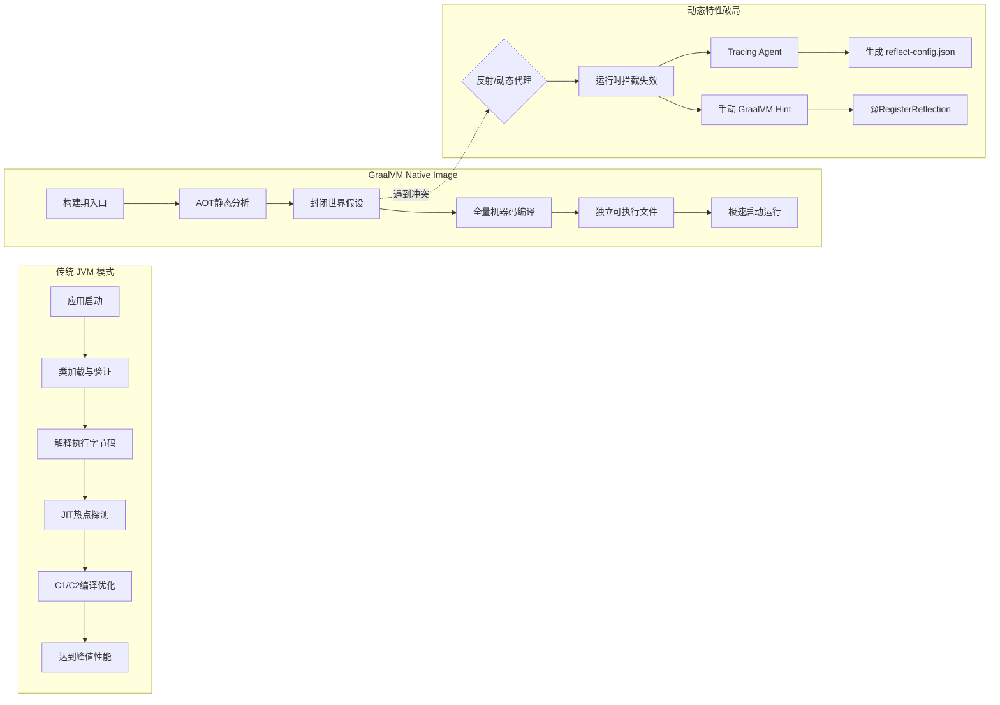
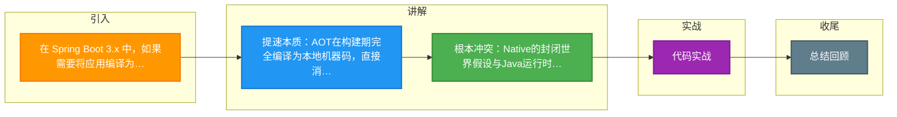

# 在 Spring Boot 3.x 中，如果需要将应用编译为 GraalVM Native Image，相比传统 JVM 运行模式，启动速度提升的原理是什么？这给反射和动态代理带来了什么挑战？

GraalVM Native Image 利用 **AOT (Ahead-Of-Time)** 编译技术，在构建阶段将 Java 字节码完全编译成独立的、平台相关的本地机器码可执行文件。

### 启动提速原理
1. **消除 JVM 启动开销**：
   - 传统 JVM：启动需加载类 -> 验证 -> 解释执行 -> JIT 编译器收集热点 -> 编译为机器码（C1/C2 编译器有预热成本）。
   - Native Image：编译时已完成静态分析、类初始化和代码编译，运行时直接是可执行的机器指令，无类加载和 JIT 编译过程。
2. **内存优化**：
   - 无需堆内存管理结构，运行时内存占用极低（通常仅消耗堆外内存和代码段空间）。

```text
Build Time (Maven/Gradle Build Phase):
+--------------------------------------------------+
| Java Bytecode (.class)                           |
|         +                                        |
|         | GraalVM Native Image Builder           |
|         v                                        |
| [Static Analysis] -> [Heap Snapshots] -> [Code]  |
|          |                   |            |       |
|          | (Closed World)   | (Scanned)   | (Opt)  |
|          v                   v            v       |
|     Reachability Metadata (Reflection/Proxy)     |
|         +                                        |
|         |  Compile                                |
|         v                                        |
| Native Executable (ELF/Mach-O/PE)               |
+--------------------------------------------------+

Runtime:
+----------------------+      +----------------------+
| Native Executable    | VS    | JVM App              |
| [Start: ms级]        |      | [Start: 秒级]         |
| [Low Memory Footprint]|      | [Large Heap]         |
+----------------------+      +----------------------+
```

### 对反射和动态代理的挑战与解决
**1. 挑战：封闭世界假设**
- Native Image 在编译时进行静态分析，仅分析从入口点可到达的代码。Reflection（`Class.forName`, `Method.invoke`）和动态代理通常是在运行时通过字符串动态确定的，编译器无法感知，导致相关代码在编译优化时被剔除，运行时抛出 `ClassNotFoundException` 或 `NoSuchMethodException`。

**2. 解决方案**
- **Tracing Agent (追踪代理)**：在 JVM 模式下运行应用或测试，启动时挂载 Agent，它会在运行时拦截所有反射、JDBC、资源访问的操作，并自动生成 `reflect-config.json`、`proxy-config.json` 等配置文件。
- **手动配置**：对于 Agent 未覆盖到的场景（如插件化架构），开发者需手动编写 GraalVM Hint 配置文件。

### 实战案例
在某金融网关接入Native Image改造时，初期并未配置Jackson的反射Hint，导致运行时无法反序列JSON报错。通过在测试环境集成`java-agent`运行完整测试用例集，自动捕获了`reflect-config.json`，但在生产环境遇到动态加载SPI类的情况，最终通过手动添加`@RegisterReflectionForBinding`注解才彻底解决。

### 关键代码示例 (反射配置)
```json
// reflect-config.json (自动生成或手动配置)
[
  {
    "name": "com.example.model.User",
    "allDeclaredConstructors": true,
    "allPublicConstructors": true,
    "allDeclaredMethods": true,
    "allPublicMethods": true,
    "allDeclaredFields": true
  }
]
```

### 运行时模式对比
| 特性 | 传统 JVM 模式 | GraalVM Native Image |
| :--- | :--- | :--- |
| **启动方式** | 解释执行 + JIT 编译 | 直接执行机器码 |
| **启动速度** | 较慢 (秒级，需预热) | 极快 (毫秒级) |
| **峰值性能** | 极高 (C2 优化) | 较高 (AOT 优化，无Profile) |
| **内存占用** | 高 (堆内存 + 开销) | 低 (仅代码段 + 必要堆) |
| **反射支持** | 完全支持 (动态加载) | 需编译时配置 (Closed World) |
| **平台兼容性** | 跨平台 | 依赖于构建平台 |

## 常见考点
1. **GraalVM Native Image 和 JVM JIT 的主要区别？**
   - JIT 基于运行时 Profile（热点探测）优化；AOT 基于静态分析，无法感知运行时热点，但启动极快。

## 流程图




## 记忆要点

- 提速本质：AOT在构建期完全编译为本地机器码，直接消除类加载和JIT预热开销
- 根本冲突：Native的封闭世界假设与Java运行时的动态反射机制严重相斥
- 破局方案：利用Tracing Agent自动拦截生成配置，或手动编写GraalVM Hint

## 结构化回答

**30 秒电梯演讲：** 构建期AOT编译为机器码，消除JVM启动预热开销；封闭世界假设导致动态特性失效。打个比方，传统JVM像“翻译官”，现场边听边翻译边总结（JIT编译），刚开会时（启动）反应慢；GraalVM像“录播室”，会前就把所有台词（字节码）翻好字幕刻进光盘（机器码），开会直接播放秒开。但这也意味着光盘内容固定，没法像现场那样临时点歌（动态反射）。

**展开框架：**
1. **提速本质** — AOT在构建期完全编译为本地机器码，直接消除类加载和JIT预热开销
2. **根本冲突** — Native的封闭世界假设与Java运行时的动态反射机制严重相斥
3. **破局方案** — 利用Tracing Agent自动拦截生成配置，或手动编写GraalVM Hint

**收尾：** 我在项目里踩过坑——在某金融网关接入Native Image改造时，初期并未配置Jackson的反射Hint，导致运行时无法反序列JSON报错。您想深入聊哪一段：原理、避坑还是对比选型？

## 视频脚本

> 预计时长：2 分钟 | 由浅入深

| 时间 | 画面/字幕 | 口播台词 | 讲解要点 |
|------|----------|----------|----------|
| 0:00 | 标题卡：在 Spring Boot 3.x … | "在 Spring Boot 3.x 中，如果需要将应用编译为 GraalVM Native Image，相比传统 JVM 运行模式，启动速度提升的原理是什么？这给反射和动态代理带来了什么挑战？一句话——传统JVM像“翻译官”，现场边听边翻译边总结（JIT编译），刚开会时（启动）反应慢；GraalVM像“录播室”，会前就把所有台词（字节码）翻好字幕刻进光盘（机器码），开会直接播放秒开。但这也意味着光盘内容固定，没法像现场那样临时点歌（动态反射）。" | 开场钩子 |
| 0:40 | 概念动画/示意图 | "构建期AOT编译为机器码，消除JVM启动预热开销；封闭世界假设导致动态特性失效——传统JVM像“翻译官”，现场边听边翻译边总结（JIT编译），刚开会时（启动）反应慢；GraalVM像“录播室”，会前就把所有台词（字节码）翻好字幕刻进光盘（机器码），开会直接播放秒开。但这也意味着光盘内容固定，没法像现场那样临时点歌（动态反射）" | 核心定义 |
| 1:20 | 提速本质示意 | "AOT在构建期完全编译为本地机器码，直接消除类加载和JIT预热开销" | 要点1 |
| 2:00 | 总结卡 | "记住这几条，面试不慌。下期讲进阶追问。" | 收尾 |

### 视频流程图



