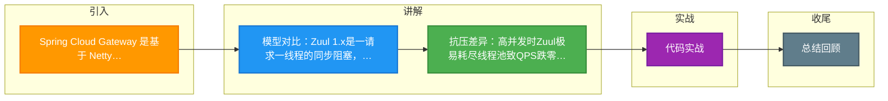

# Spring Cloud Gateway 是基于 Netty 实现的响应式网关，它与传统的基于 Servlet（如 Zuul 1.x）的阻塞网关模型在处理高并发长连接时有何优势？

Spring Cloud Gateway (SCG) 与传统 Servlet 网关（如 Zuul 1.x）的核心区别在于 **I/O 模型** 和 **线程模型**。SCG 基于 Spring WebFlux + Netty 实现异步非阻塞，采用少量 EventLoop 线程处理大量连接，资源利用率高，支持背压；而 Zuul 1.x 基于 Servlet 容器，采用“一请求一线程”的同步阻塞模型，高并发下容易因线程阻塞耗尽而拒绝请求。

### 实战案例
在大促期间，当后端微服务响应变慢（RT从50ms升至500ms）时，基于Zuul 1.x的网关由于Tomcat线程池（默认200线程）迅速被阻塞等待耗尽，导致QPS直接跌至0；而切换到Spring Cloud Gateway后，由于Netty EventLoop线程极少阻塞（仅4核CPU），能够hold住数万并发连接，虽然响应变慢但并未拒绝请求，起到了良好的“熔断前缓冲”作用。

### 关键代码示例
```java
// SCG GlobalFilter (Netty/Reactive)
@Component
public class AuthFilter implements GlobalFilter {
    @Override
    public Mono<Void> filter(ServerWebExchange exchange, GatewayFilterChain chain) {
        // 非阻塞验证，不占用线程等待
        return reactiveAuthService.validate(exchange.getRequest())
            .flatMap(valid -> {
                if (valid) return chain.filter(exchange);
                return exchange.getResponse().setComplete(); // 快速失败
            });
    }
}
```

### 网关模型对比
| 维度 | Servlet 网关 | Spring Cloud Gateway (Reactive) |
| :--- | :--- | :--- |
| **通信框架** | Servlet (Tomcat/Jetty) | Netty (EventLoop) |
| **IO 模型** | 阻塞 IO (BIO) | 非阻塞 IO (NIO) |
| **线程模型** | 1请求1线程 (Thread-per-Request) | 少量线程处理多请求 | 
| **背压支持** | 不支持 (容易OOM) | 支持 (Reactive Streams) |
| **长连接处理** | 线程池极易耗尽 | 轻松处理大量闲置连接 |
| **扩展性** | 受限于线程数上限 | 受限于系统资源 (CPU/内存) |

## 技术原理

I/O 模型和线程模型的差异决定了两个网关在高并发下的命运分化：

- **EventLoop 非阻塞 I/O 的核心机制**：Netty 采用 Reactor 模式，CPU 核数个小线程（通常 2×CPU）跑 EventLoop，每个线程绑定一个 Selector 轮询上千个 Channel。当一个请求发起 I/O（读 body、调下游），线程不会阻塞等待，而是注册一个 OP_READ 事件后立即去处理下一个连接；I/O 完成后内核回调通知 EventLoop，由它唤醒对应的处理逻辑。结果是**线程数恒定、与并发连接数无关**——4 核机器的 8 个 EventLoop 可以扛住数万长连接。
- **Thread-per-Request 同步阻塞的代价**：Servlet 容器（Tomcat 默认 200 线程）每个请求占用一个线程的整个生命周期。当请求调用下游慢服务（如 RT 500ms），这个线程要阻塞 500ms 干等响应。并发一上来：200 个请求就把 200 线程全占满，第 201 个请求直接拒绝连接。线程数 × 平均 RT = 系统最大并发数，这是阻塞模型的硬上限。
- **背压（Backpressure）的原理**：响应式流（Reactive Streams）规范定义了 `Publisher`→`Subscriber` 模式，消费者通过 `request(n)` 主动告诉生产者"我还能处理多少"，生产者不会推超过这个量的数据。当后端处理不过来时，背压自动传导到上游限速，而非 OOM。Servlet 模型没有这个机制，下游慢就堆积在队列或内存里。
- **线程切换成本的隐藏优势**：阻塞模型下，每次 I/O 都涉及线程 park/unpark 的内核态切换（上下文保存恢复，微秒级开销）。非阻塞模型用事件回调，全程在用户态 EventLoop 内完成，高频 I/O 下节省的上下文切换相当可观。

## 代码示例

```java
// 1. SCG GlobalFilter —— 全程非阻塞，不占用线程等待
import org.springframework.cloud.gateway.filter.GlobalFilter;
import org.springframework.cloud.gateway.filter.GatewayFilterChain;
import org.springframework.core.io.buffer.DataBuffer;
import org.springframework.web.server.ServerWebExchange;
import reactor.core.publisher.Mono;

@Component
public class AuthFilter implements GlobalFilter, Ordered {

    private final WebClient userServiceClient;  // 异步 HTTP 客户端

    @Override
    public Mono<Void> filter(ServerWebExchange exchange, GatewayFilterChain chain) {
        String token = exchange.getRequest().getHeaders().getFirst("Authorization");
        if (token == null) {
            return reject(exchange, "Missing token");   // 快速失败，不占线程
        }
        // 非阻塞调用鉴权服务：flatMap 在响应回来后才执行，期间线程处理其他请求
        return userServiceClient.get().uri("/auth/verify?token=" + token)
                .retrieve().bodyToMono(AuthResult.class)
                .flatMap(result -> {
                    if (!result.isValid()) return reject(exchange, "Invalid token");
                    // 把用户信息塞到请求头，继续过滤器链
                    exchange.getRequest().mutate().header("X-User-Id", result.getUserId()).build();
                    return chain.filter(exchange);
                });
    }

    @Override
    public int getOrder() { return -100; }  // 越小越先执行
}

// 2. 对比：Zuul 1.x 同步阻塞过滤器（线程被占满即拒绝）
public class AuthZuulFilter extends ZuulFilter {
    @Override
    public Object run() {
        HttpServletRequest req = RequestContext.getCurrentContext().getRequest();
        String token = req.getHeader("Authorization");
        // 同步阻塞调用！线程在此挂起等响应，并发上来直接耗尽 Tomcat 线程池
        AuthResult result = authService.verifySync(token);
        if (!result.isValid()) throw new RuntimeException("Invalid token");
        return null;
    }
}
```

```yaml
# 3. SCG 路由配置 + 超时与背压控制
spring:
  cloud:
    gateway:
      httpclient:
        connect-timeout: 1000       # 连接超时
        response-timeout: 5s        # 响应超时
        pool:
          max-connections: 500      # 连接池上限（背压的硬约束）
          pending-acquire-timeout: 30s  # 拿不到连接的等待上限，超过快速失败
      routes:
        - id: user-service
          uri: lb://user-service
          predicates: [Path=/api/users/**]
          filters:
            - name: RequestRateLimiter   # 内置限流（基于 Redis 令牌桶）
              args: { redis-rate-limiter.replenishRate: 100, burstCapacity: 200 }
```

## 注意事项

- **阻塞调用是响应式模型的头号杀手**：在 SCG 的 Filter/Handler 里调用阻塞 API（`Thread.sleep`、同步 JDBC、阻塞 HTTP 客户端）会卡住 EventLoop 线程，几个阻塞调用就能让整个网关的吞吐崩塌。必须用 `Schedulers.boundedElastic()` 把阻塞操作隔离到独立线程池，或换成响应式客户端（R2DBC、WebClient）。
- **Mono/Flux 的陷阱**：响应式编程容易踩坑——忘记 `subscribe` 链路根本不执行（"nothing happens until you subscribe"）；`flatMap` 里抛异常如果没有 `onErrorResume` 会导致整条链断掉；冷热流不分（`Mono.fromCallable` 是冷的，`Sinks.many()` 是热的）引发重复执行或丢失数据。
- **连接池上限要算清**：Netty 的 `max-connections` 是背压的硬约束，超过的请求进入等待队列。如果下游服务本身扛不住，盲目调大连接池只会把延迟从"快速失败"变成"慢死"，应该配合熔断器（Resilience4j）使用。
- **调试与可观测性更难**：响应式栈的调用栈跨越多个回调，传统断点调试很难追踪请求流。要用 `reactor.tools.agent` 在启动时挂载，它会还原出逻辑调用栈；同时打开 Micrometer 指标监控 EventLoop 队列长度、连接池使用率，提前发现阻塞。
- **不是所有场景都该上 SCG**：如果系统是纯 CRUD、并发量不高（QPS < 1000）、团队对响应式不熟，Zuul 1.x 或 Spring Cloud MVC 网关更简单。SCG 的优势在长连接、高并发、IO 密集型场景，强行用在低并发系统反而增加复杂度。

## 流程图

```mermaid
sequenceDiagram
    classDef start fill:#4CAF50,color:#fff
    classDef process fill:#2196F3,color:#fff
    classDef decision fill:#FF9800,color:#fff
    classDef special fill:#9C27B0,color:#fff
    classDef error fill:#f44336,color:#fff
    classDef info fill:#607D8B,color:#fff
    class C start
    class D process
    class E decision
    class EventLoop special
    class Netty error
    class RT info
    class S start
    class T process
    class Z decision
    class Zuul special
    class as error
    class rgb info
    participant C as 客户端
    participant Z as Zuul 1.x网关
    participant T as Tomcat线程池
    participant S as SCG网关
    participant E as Netty EventLoop
    participant D as 后端慢服务

    rect rgb(255, 230, 230)
    Note over C,T: 同步阻塞模型 (最大并发 = 线程数 / RT)
    C->>Z: 1. 发起请求
    Z->>T: 2. 占用Worker线程
    T->>D: 3. 调用下游 (RT 500ms)
    D-->>T: 4. 阻塞等待响应
    Note over T: 线程池耗尽, 拒绝新请求
    end

    rect rgb(230, 255, 230)
    Note over C,E: 异步非阻塞模型 (少量线程扛万级并发)
    C->>S: 5. 发起请求
    S->>E: 6. EventLoop接收
    E->>D: 7. 注册OP_READ事件
    Note over E: 不阻塞, 立即处理下一个连接
    D-->>E: 8. 内核回调通知
    E-->>C: 9. 响写给客户端
    end
```


## 记忆要点

- 模型对比：Zuul 1.x是一请求一线程的同步阻塞，而SCG是少量线程的异步非阻塞
- 抗压差异：高并发时Zuul极易耗尽线程池致QPS跌零，而Netty轻松扛住万级连接
- 防雪崩特性：因为SCG支持背压且不轻易拒绝请求，所以能起到良好的熔断缓冲作用

## 结构化回答

**30 秒电梯演讲：** 异步非阻塞替代同步阻塞，用少量线程高并发处理请求。打个比方，传统网关像餐厅服务员，每人负责一桌客人，客人没吃完前服务员只能傻等（阻塞），人多了就排长队；响应式网关像传菜员，只负责下单和传菜，不用等客人吃完（不阻塞），几个人就能应付满堂客。

**展开框架：**
1. **模型对比** — Zuul 1.x是一请求一线程的同步阻塞，而SCG是少量线程的异步非阻塞
2. **抗压差异** — 高并发时Zuul极易耗尽线程池致QPS跌零，而Netty轻松扛住万级连接
3. **防雪崩特性** — 因为SCG支持背压且不轻易拒绝请求，所以能起到良好的熔断缓冲作用

**收尾：** 我在项目里踩过坑——在大促期间，当后端微服务响应变慢（RT从50ms升至500ms）时，基于Zuul 1.x的网关由于Tomcat线程池（默认200线程）迅速被阻塞等待耗尽，导致QPS直接跌至0；而切换到Spring Cloud Gateway后，由于Netty EventLoop线程极少阻塞（仅4核CPU），能够hold住数万并发连接，虽然响应变慢但并未拒绝请求，起到了良好的“熔断前缓冲”作用。您想深入聊哪一段：原理、避坑还是对比选型？

## 视频脚本

> 预计时长：2 分钟 | 由浅入深

| 时间 | 画面/字幕 | 口播台词 | 讲解要点 |
|------|----------|----------|----------|
| 0:00 | 标题卡：Spring Cloud Gatew… | "Spring Cloud Gateway 是基于 Netty 实现的响应式网关，它与传统的基于 Servlet（如 Zuul 1.x）的阻塞网关模型在处理高并发长连接时有何优势？一句话——传统网关像餐厅服务员，每人负责一桌客人，客人没吃完前服务员只能傻等（阻塞），人多了就排长队；响应式网关像传菜员，只负责下单和传菜，不用等客人吃完（不阻塞），几个人就能应付满堂客。" | 开场钩子 |
| 0:40 | 概念动画/示意图 | "异步非阻塞替代同步阻塞，用少量线程高并发处理请求——传统网关像餐厅服务员，每人负责一桌客人，客人没吃完前服务员只能傻等（阻塞），人多了就排长队；响应式网关像传菜员，只负责下单和传菜，不用等客人吃完（不阻塞），几个人就能应付满堂客" | 核心定义 |
| 1:20 | 模型对比示意 | "Zuul 1.x是一请求一线程的同步阻塞，而SCG是少量线程的异步非阻塞" | 要点1 |
| 2:00 | 总结卡 | "记住这几条，面试不慌。下期讲进阶追问。" | 收尾 |

### 视频流程图



