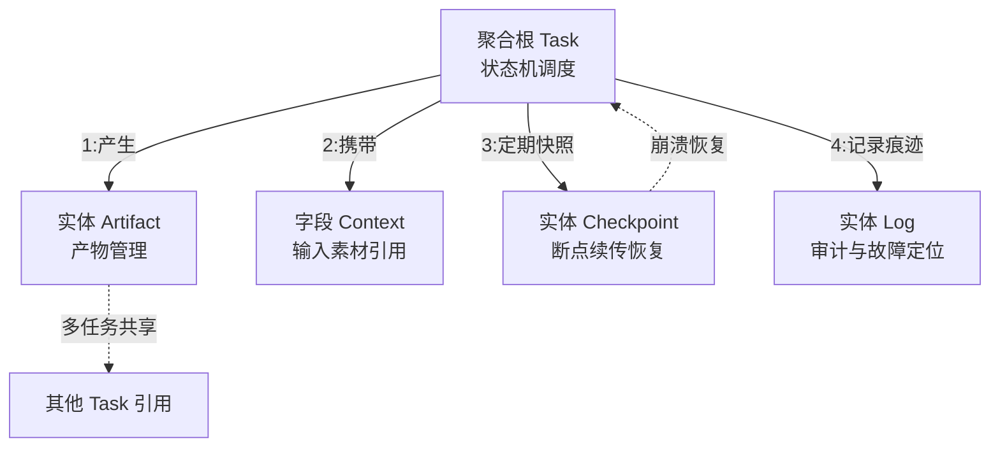

# 【月之暗面面经】如果让你设计桌面 Agent 的任务中心，会有哪些关键对象？

<!-- ANSWER_BODY_HERE -->

## 技术原理

任务中心本质是 Agent 系统的领域模型，借鉴 DDD（领域驱动设计）的聚合根思路组织对象关系。Task 作为聚合根，其他四大对象（Artifact/Context/Checkpoint/Log）围绕 Task 组织，通过 `task_id` 建立关联。

1. **聚合根设计** — Task 是核心实体，承载状态机与调度依赖；其他对象是依附于 Task 的值对象或独立实体，通过外键关联而非嵌套，保证对象独立生命周期
2. **状态机驱动** — Task 用有限状态机管理生命周期（created→running→paused→succeeded/failed/canceled），每次状态迁移触发对应事件，驱动 Artifact 落盘、Checkpoint 保存、Log 记录
3. **断点续传机制** — Checkpoint 定期序列化执行快照（已完成步骤、中间产物引用、上下文摘要）到本地磁盘，崩溃后通过反序列化恢复到最近检查点，避免长任务从头跑
4. **可观测性闭环** — Log 记录结构化执行链路（步骤、耗时、成本、错误堆栈），既是审计依据也是性能优化和故障定位的数据源，与 Checkpoint 交叉定位卡顿根因

对象独立性判断标准：是否有独立生命周期（Artifact 可被多 Task 共享，需独立）、是否强绑定 Task（Context 是该任务的输入引用，生命周期与 Task 一致，作为字段即可）。

## 代码示例

五大对象的 TypeScript 领域模型与状态机定义：

```typescript
// 任务状态机
type TaskStatus = 'created' | 'running' | 'paused' | 'succeeded' | 'failed' | 'canceled';

// 合法状态迁移表（防止非法跳转）
const TRANSITIONS: Record<TaskStatus, TaskStatus[]> = {
  created:  ['running', 'canceled'],
  running:  ['paused', 'succeeded', 'failed', 'canceled'],
  paused:   ['running', 'canceled'],
  succeeded: [], failed: [], canceled: [],
};

// Task 聚合根
interface Task {
  id: string;
  status: TaskStatus;
  priority: number;
  type: 'generate' | 'edit' | 'export';
  context: TaskContext;           // 强绑定，作为字段
  artifactIds: string[];          // 引用独立 Artifact
  version: number;                // 乐观锁版本号
  lastHeartbeat: number;          // 心跳时间戳，检测僵尸任务
}

// Artifact 独立实体（可被多 Task 共享、独立版本）
interface Artifact {
  id: string;
  taskId: string;                 // 归属 Task
  type: 'file' | 'site' | 'image';
  path: string;
  version: number;
  sharedBy: string[];             // 被哪些 Task 复用
}

// Context 强绑定 Task（任务输入素材引用）
interface TaskContext {
  sources: string[];              // 引用的素材 id
  extracted: string;              // 摘要
  references: Reference[];
}

// Checkpoint 断点续传快照
interface Checkpoint {
  taskId: string;
  step: number;                   // 已完成步骤
  totalSteps: number;
  snapshot: any;                  // 序列化的执行状态
  savedAt: number;
}

// 状态迁移 + 副作用触发
function transition(task: Task, next: TaskStatus) {
  if (!TRANSITIONS[task.status].includes(next)) {
    throw new Error(`非法迁移: ${task.status} -> ${next}`);
  }
  const prev = task.status;
  task.status = next;
  task.version++;
  // 触发对应事件：落盘 Artifact / 保存 Checkpoint / 记录 Log
  emit(`task:${prev}->${next}`, task);
}
```

## 注意事项

1. **Checkpoint 频率权衡** — 短任务（<1分钟）不必做 Checkpoint（序列化开销占比高）；长任务（>5分钟）和高价值任务才做，频率适中（每分钟或每步骤一次），过频会拖慢执行
2. **僵尸任务检测** — Task 状态是 running 但 `lastHeartbeat` 超时（如 5 分钟无更新），说明执行进程崩溃但状态未更新，需定时扫描并标记 failed 或恢复
3. **Artifact 共享的引用计数** — 删除 Task 时不能直接删 Artifact（可能被其他 Task 引用），要用引用计数或 `sharedBy` 列表判断，避免误删共享产物
4. **Context 不要过度独立化** — Context 强绑定 Task，任务结束即失效，独立化收益低反而增加模型复杂度；但 Context 引用的"素材"（Source）若需跨任务共享，素材本身可独立
5. **状态机非法迁移防护** — 必须用迁移表约束合法跳转（如 succeeded 不能回到 running），防止 bug 导致状态混乱破坏数据一致性
6. **Checkpoint 本地优先** — AI 桌面产品强调隐私和离线，Checkpoint 以本地磁盘为主，云端备份为辅且需用户主动触发，避免中间状态含敏感数据自动上云

## 流程图




## 记忆要点

- 核心对象五大件：Task(任务) + Artifact(产物) + Context(上下文) + Checkpoint(检查点) + Log(日志)
- Task是调度核心，记录状态机与执行依赖关系
- Checkpoint保运行快照，Log记操作痕迹，二者保障可追溯与断点续传


## 苏格拉底式面试追问

> 这组追问模拟面试官层层逼问，每一问先回答"为什么"，再回答"怎么做"，最后回答"如何证明"。

### 第一层：目标与动机

**Q：任务中心你抽象了五大对象（Task/Artifact/Context/Checkpoint/Log），但为什么不更精简（如只有 Task 和 Log）或更详细（如十几个对象）？**

对象数量是"覆盖必要维度"和"避免过度设计"的平衡。只有 Task 和 Log 太精简：Task 没法管理产物（Artifact 缺失，产物散落在 Task 字段里，难以独立预览/编辑/版本管理）、没法管理上下文（Context 缺失，多模态素材引用混乱）、没法支持断点续传（Checkpoint 缺失，长任务失败只能从头跑）。十几个对象太复杂：每个对象都要状态机、关联关系、UI，开发成本高且用户认知负担重（用户要理解十几个概念才能用任务中心）。五大对象是"最小必要集"——Task 是核心（调度）、Artifact 是产出（交付）、Context 是输入（素材）、Checkpoint 是恢复（续传）、Log 是可观测（审计）。借鉴 DDD（领域驱动设计）的"聚合根"思路：Task 是聚合根，其他对象围绕 Task 组织。

### 第二层：证据与定位

**Q：用户说"任务卡在 running 状态不动了"，你怎么用任务中心的对象定位问题？**

用 Log 和 Checkpoint 交叉定位。一、Log——查该 Task 的执行日志，看最后一条记录是什么（如"调用了云端推理 API"、"等待 API 响应"），如果日志停在"等待 API 响应"且超过预期时间（如 5 分钟），可能是云端推理超时或网络断开；二、Checkpoint——查 Task 的 Checkpoint，看最后保存的执行位置（如"已完成步骤 3/5"），如果 Checkpoint 显示在某步骤卡住，是该步骤的执行逻辑问题；三、Task 状态——看 Task 的 status 字段，如果是 running 但心跳超时（如 last_heartbeat 是 10 分钟前），可能是执行进程崩溃但状态未更新（僵尸任务）。常见根因：云端 API 超时未设置 timeout、执行进程崩溃未捕获、网络断开未重试。

### 第三层：根因深挖

**Q：Artifact 你设计成独立对象（不嵌套在 Task 里），但这样查询"某 Task 的所有产物"要 join，为什么不直接把产物列表作为 Task 的字段？**

Artifact 独立 vs 嵌套的权衡。嵌套（产物作为 Task 字段）查询简单（一次查 Task 拿全部），但有问题：一、产物独立生命周期——产物可被多个 Task 引用（如一个生成的站点被多个任务复用），嵌套则产物只属于一个 Task，无法共享；二、产物版本管理——产物有独立版本树（多次重生成），嵌套则版本作为 Task 字段，Task 对象膨胀；三、产物操作——用户可能直接操作产物（预览、编辑、发布）而不通过 Task，嵌套则必须先找 Task。Artifact 独立的好处：产物可共享、独立版本、直接操作。查询"某 Task 的产物"用 artifact.task_id 索引（O(1) 查询），性能不是问题。所以独立是"灵活性优先"，嵌套是"简单性优先"，AI 场景产物需要共享和独立操作，选独立。

**Q：那为什么不把 Context 也独立成对象（和 Artifact 一样），而非要作为 Task 的字段？**

Context 通常是 Task 的字段而非独立对象，原因：一、Context 强绑定 Task——Context 是"该任务的输入素材引用"，任务结束 Context 基本无意义（不像产物可复用），生命周期和 Task 一致；二、Context 不共享——不同任务的 Context 不同（即使是相同素材，引用方式、摘要不同），独立化收益低；三、简化模型——五大对象已经够多，Context 作为 Task 字段（如 `task.context = {sources, extracted, references}`）足够，不必再独立。例外：如果 Context 中的"素材"需要被多任务共享（如同一份 PDF 被多个任务引用），素材本身可独立（作为 Source 对象），但 Context（素材的引用方式）仍属于 Task。所以"素材可共享，引用属于任务"，分层管理。

### 第四层：方案权衡

**Q：Checkpoint 你设计成"定期保存执行快照"，但保存 Checkpoint 本身有开销（序列化大状态），为什么不只存最终结果（失败就从头跑）？**

Checkpoint 的开销 vs 从头跑的开销权衡。Checkpoint 开销：序列化执行状态（如已完成步骤、中间产物）写磁盘，大状态可能几百毫秒。从头跑的开销：长任务（5-10 分钟）从头重来，用户等待成本高。权衡依据：任务耗时。短任务（< 1 分钟）从头跑可接受，Checkpoint 开销占比高（如 30 秒任务每次存 Checkpoint 用 1 秒，占 3%），不值得；长任务（> 5 分钟）从头跑成本高，Checkpoint 开销占比低（如 5 分钟任务每次存 Checkpoint 用 1 秒，占 0.3%），值得。所以 Checkpoint 策略是"长任务和高价值任务做，短任务不做"，且频率适中（如每分钟或每步骤存一次，不是每秒）。

**Q：为什么不把 Checkpoint 存到云端（而非本地磁盘），防止本地崩溃丢失？**

云端 Checkpoint 的利弊。利：本地崩溃（如断电、应用崩溃）后可从云端恢复，更可靠。弊：一、网络延迟——每次存 Checkpoint 要上传云端（如几百 KB 状态，上传几百毫秒），比本地磁盘慢；二、隐私——Checkpoint 含任务数据（可能含用户敏感文件内容），上传云端有隐私顾虑（用户不希望中间状态上云）；三、成本——云端存储和带宽要付费。折中：本地 Checkpoint 为主（快、隐私），云端 Checkpoint 为辅（定期同步关键 Checkpoint，如每 5 分钟或重要节点）。或者"本地 Checkpoint + 用户主动云端备份"（用户点"备份任务"才上传）。AI 桌面产品强调本地优先（隐私、离线），云端是可选增强。

### 第五层：验证与沉淀

**Q：你怎么验证任务中心的五大对象设计合理（不冗余、不缺失）？**

两个验证维度：一、覆盖性——列举所有用户场景（发起任务、查看产物、恢复失败任务、审计执行），每个场景都能用五大对象描述，如果某场景无法描述（如"分享产物给他人"找不到对应对象），说明缺对象；二、非冗余性——每个对象是否有"独立存在的理由"（独立生命周期、独立操作），如果某对象总是和其他一起用（如 Log 总是嵌在 Task 里查），可能冗余。实践验证：跑 3-6 个月，看是否有"为了实现某功能不得不 hack 现有对象"（说明设计不足）或"某对象几乎不用"（说明冗余），迭代调整。

**Q：这道题沉淀出什么可复用的任务中心对象设计经验？**

四条原则：一、最小必要集——五大对象（Task/Artifact/Context/Checkpoint/Log）覆盖调度、产出、输入、恢复、可观测，不冗余不缺失；二、独立生命周期——Artifact 独立（可共享、可版本、可操作），Context 属 Task（强绑定、不共享），按生命周期决定独立性；三、Checkpoint 按需——长任务和高价值任务做 Checkpoint，短任务从头跑，频率适中；四、本地优先——Checkpoint 本地为主、云端为辅，尊重 AI 桌面的隐私和离线特性。核心洞察："任务中心本质是'AI Agent 的领域模型'，借鉴 DDD 的聚合根设计——Task 是核心，其他对象围绕组织，平衡覆盖性和简洁性。"


## 结构化回答

**30 秒电梯演讲：** 任务中心的关键对象：Task(任务)、Context(上下文)、Product(产物)、Permission(权限)、Log(日志)。打个比方，就像项目管理系统的核心对象——任务(做什么)、资源(用什么)、交付物(产出什么)、权限(谁能做)、记录(做了什么)。

**展开框架：**
1. **核心对象五大件** — Task(任务) + Artifact(产物) + Context(上下文) + Checkpoint(检查点) + Log(日志)
2. **Task是调度核心** — Task是调度核心，记录状态机与执行依赖关系
3. **Checkpoint保运** — Checkpoint保运行快照，Log记操作痕迹，二者保障可追溯与断点续传

**收尾：** 这块我踩过坑——要不要深入聊：任务状态机怎么设计？

## 视频脚本

> 预计时长：4 分钟 | 由浅入深

| 时间 | 画面/字幕 | 口播台词 | 讲解要点 |
|------|----------|----------|----------|
| 0:00 | 标题卡 | "AI-Native桌面一句话：任务中心的关键对象：Task(任务)、Context(上下文)、Product(产物)…。" | 开场钩子 |
| 0:15 | 架构示意图 | "核心对象五大件：Task(任务) + Artifact(产物) + Context(上下文) + Checkpoin…" | 核心对象五大件 |
| 1:08 | 架构示意图分步演示 | "Task是调度核心，记录状态机与执行依赖关系" | Task是调度核心 |
| 2:01 | 关键代码/伪代码片段 | "Checkpoint保运行快照，Log记操作痕迹，二者保障可追溯与断点续传" | Checkpoint保运 |
| 2:54 | 对比表格 | "Task: id/状态/优先级/类型" | Task |
| 3:50 | 总结卡 | "核心抓住这条主线，下期咱们接着聊：任务状态机怎么设计。" | 收尾 |
