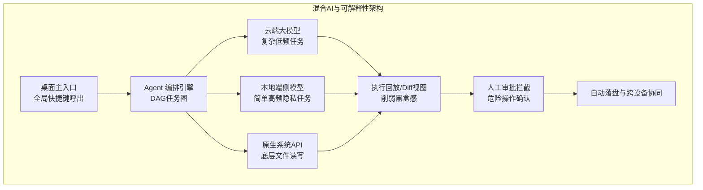

# 【月之暗面面经】你怎么看桌面 AI 产品前端未来一年的主战场？

<!-- ANSWER_BODY_HERE -->

## 技术原理

未来一年桌面 AI 前端主战场的判断基于三个趋势：交互形态从单对话框走向多 Agent 协同、模型能力溢出要求前端补工程化短板、用户对黑盒的不信任要求可解释性。

1. **全链路体验闭环** — 单对话框只能处理"问-答"，但真实场景是多步骤、多 Agent 协同（一个 Agent 规划、一个执行、一个校验）、产物自动落盘可复用；前端要从"渲染回答"升级为"编排任务全生命周期"
2. **深度系统级集成** — 浏览器沙箱限制了 AI 的触达范围（不能读本地文件、不能操控其他应用），桌面端依托原生能力（Electron/Tauri 的 Node/Rust 层、系统 API）打破沙箱，实现全局快捷键呼出、跨应用操作、底层文件读写
3. **可解释性与掌控感** — 模型是黑盒，用户对 AI 自动操作有信任焦虑；前端通过执行回放（展示 Agent 每步思考与行动）、产物 Diff（对比修改前后）、审批拦截（危险操作前确认）削弱黑盒感，建立用户信任
4. **本地化与隐私** — 大模型推理部分上云，但用户数据（文件、操作历史）留在本地优先；前端需管理本地索引、缓存、断点续传，平衡云端算力与本地隐私

## 代码示例

多 Agent 协同编排与执行回放（削弱黑盒感）的架构示意：

```typescript
// 多 Agent 协同：Planner 规划、Executor 执行、Validator 校验
interface AgentRun {
  taskId: string;
  steps: AgentStep[];       // 全链路步骤，支持回放
}

interface AgentStep {
  agent: 'planner' | 'executor' | 'validator';
  thought: string;          // Agent 的思考（可解释性）
  action: { tool: string; args: any };
  observation: string;      // 执行结果
  timestamp: number;
  approved?: boolean;       // 是否经用户审批
}

// 编排多个 Agent 协同
async function runMultiAgent(goal: string) {
  const steps: AgentStep[] = [];
  const plan = await planner.decompose(goal);
  steps.push({ agent: 'planner', thought: plan.reasoning, action: {tool:'plan', args:plan}, observation: JSON.stringify(plan), timestamp: Date.now() });

  for (const sub of plan.subtasks) {
    // 危险操作前拦截审批
    if (isDangerous(sub)) {
      const ok = await askUserApproval(sub);
      if (!ok) continue;
    }
    const result = await executor.run(sub);
    steps.push({ agent: 'executor', thought: result.reasoning, action: sub, observation: result.output, timestamp: Date.now(), approved: true });

    const validation = await validator.check(result);
    if (!validation.ok) {
      steps.push({ agent: 'validator', thought: validation.reason, action: {tool:'reject'}, observation: validation.detail, timestamp: Date.now() });
      break;
    }
  }
  return { steps };   // 全链路可回放
}

// 执行回放 UI：让用户看清 Agent 每步做了什么
function renderReplay(steps: AgentStep[]) {
  return steps.map(s => `
    <div class="step">
      <span class="agent">${s.agent}</span>
      <div class="thought">${s.thought}</div>      // 削弱黑盒：展示思考
      <div class="action">${s.action.tool}(${JSON.stringify(s.action.args)})</div>
      <div class="obs">${s.observation}</div>
    </div>`).join('');
}
```

## 注意事项

1. **多 Agent 协同的编排复杂度** — Agent 间的依赖、并发、失败回滚比单 Agent 复杂得多，需引入 DAG 编排和补偿事务，否则协同容易死锁或状态混乱
2. **系统级集成的安全边界** — 打破沙箱意味着 AI 能读文件、操控应用，必须建立权限模型（每个能力需用户授权）、沙箱执行生成代码、危险操作二次确认，否则 AI 误操作后果严重
3. **可解释性不能牺牲效率** — 执行回放、产物 Diff 会增加认知负担和渲染开销，要分层（默认看摘要、展开看详情）、按需展示，避免信息过载
4. **本地化与云端的权衡** — 全本地推理慢且受硬件限制，全云端有隐私和延迟问题；需按数据敏感度分级（敏感数据本地、算力密集任务云端），前端做智能路由
5. **跨设备协作是延伸战场** — 桌面只是入口，手机/平板的协同（任务在桌面发起、移动端查看审批）会成为差异化能力，状态同步和冲突解决要提前设计
6. **不要过度押注单一模型** — 模型能力迭代快，前端架构要解耦模型调用（统一抽象层），避免绑定单一模型，便于切换和升级

## 流程图




## 记忆要点

- 全链路体验闭环：主战场从单一对话框转向多 Agent 协同与产物自动落盘
- 深度系统级集成：依托原生能力打破浏览器沙箱，实现全局呼出与底层操控
- 可解释性与掌控感：通过执行回放、产物 Diff 削弱黑盒感，建立用户信任


## 苏格拉底式面试追问

> 这组追问模拟面试官层层逼问，每一问先回答"为什么"，再回答"怎么做"，最后回答"如何证明"。

### 第一层：目标与动机

**Q：你说未来一年主战场是"Agent 任务编排 + 产物质量护栏 + 本地 AI 集成 + 跨设备协作"，但为什么不把"模型能力提升"（如等 GPT-5）作为主战场，前端再怎么编排也弥补不了模型弱？**

模型能力是"底层变量"，前端不能控制（取决于 OpenAI/Anthropic 等模型厂商），但前端能控制"如何用好现有模型"。即使模型能力提升（如 GPT-5 更准），如果前端编排差（如任务失败无法恢复、产物无法审阅），用户体验仍差。反之，前端编排好（如多步 Agent 断点续传、产物 Diff 审阅），即使模型不变（如 GPT-4），用户体验也能大幅提升。所以"主战场"是"前端可控的、能放大模型价值的领域"：一、Agent 编排——把单轮对话升级为多步任务，让模型完成更复杂工作；二、产物护栏——让用户审阅和修正模型输出，弥补模型不完美；三、本地 AI——端侧推理降低延迟和成本，提升体验。这些是"前端工程能发力的"，而非等模型变强。

### 第二层：证据与定位

**Q：用户说"AI 桌面产品用了一年还是个聊天框"（没进化），你怎么定位是产品方向问题还是技术能力不足？**

看产品迭代历史：一、功能迭代——过去一年加了哪些功能（如是否有多步 Agent、产物管理、多窗口），如果只加了"对话优化"（如更好的 prompt），仍是聊天框思维，是方向问题；二、技术投入——是否有 Agent 编排框架（如任务状态机、断点续传）、产物管理系统（如版本管理、Diff），如果没有，是技术能力不足（想做但做不了）；三、用户反馈——用户是否要求"更复杂的任务"（如"能不能让 AI 连续处理多个文件"），如果用户要求但产品没做，是响应慢。常见根因：一、团队以 Web 聊天框思维做桌面（不懂桌面特殊性），方向问题；二、技术栈不支持（如纯 Electron 无原生能力），技术能力问题。修复对应：换有桌面经验的产品/技术负责人，或升级技术栈。

### 第三层：根因深挖

**Q：Agent 任务编排你说是主战场，但多步 Agent 容易失败（某步出错全任务废），怎么提升可靠性？**

多步 Agent 可靠性的核心是"错误隔离和恢复"：一、步骤独立——每个步骤设计为独立可重试（如步骤 3 失败，重试步骤 3 而非从头），需要每步存检查点；二、降级策略——某步失败时降级（如"AI 分析"失败，降级为"规则匹配"），而非全任务废；三、人工介入——关键步骤失败时暂停任务，让用户介入（如"AI 不确定怎么处理，请用户选择"），而非自动失败；四、监控告警——任务失败率监控，高失败率的步骤重点优化（如该步的 prompt 不准、工具调用不稳定）。技术实现：借鉴工作流引擎（如 Airflow、Temporal）的"retry policy + 降级 + 人工干预"，把 Agent 任务当"分布式工作流"处理。核心："多步 Agent 的可靠性靠'步骤独立 + 降级 + 人工介入 + 监控'，而非寄希望于每步都成功"。

**Q：那为什么不直接用单步 Agent（简单可靠），多步 Agent 太复杂不值得？**

单步 Agent 的局限：能力天花板低。单步 Agent 只能完成"一问一答"（如"总结这个文档"），无法完成"连续任务"（如"分析这个文档，提取关键数据，生成报告，发布到站点"）。用户需求是连续的（完成一个工作流而非问一个问题），单步 Agent 满足不了。多步 Agent 虽然复杂，但能完成"端到端工作流"，价值远高于单步。类比：单步 Agent 是"计算器"（算一次），多步 Agent 是"Excel 宏"（自动化连续操作）。AI 桌面产品的目标是"生产力平台"（让 AI 完成工作流），必须做多步 Agent。可靠性问题靠工程手段（断点续传、降级、监控）解决，而非退回单步。

### 第四层：方案权衡

**Q：本地 AI 集成你说是主战场（端侧推理），但端侧模型能力弱（如 Llama 3 8B 远不如 GPT-4），为什么还要做？**

端侧模型的价值不在"能力强"，在"延迟低 + 隐私 + 离线 + 成本"：一、延迟——端侧推理毫秒级（本地 GPU），云端推理秒级（网络往返），简单任务（如短文本摘要、分类）端侧更快；二、隐私——敏感数据（如个人文档、密码）不出本地，用户更信任；三、离线——无网络时仍可用（如出差、飞机上）；四、成本——端侧推理零 API 成本，高频任务（如实时补全）用端侧省钱。所以端侧模型用于"简单、高频、隐私敏感"任务，云端模型用于"复杂、低频、需要强能力"任务，两者分工（混合 AI）。端侧模型弱不是问题，关键是"用对场景"——简单任务用端侧（快、隐私），复杂任务用云端（强）。

**Q：为什么不直接把所有 AI 能力放云端（如 GPT-4），能力最强？**

全云端的问题：一、延迟——每次都网络往返，简单任务（如代码补全、拼写纠正）也要等秒级，体验差；二、隐私——用户敏感数据（如代码、文档）全上传云端，隐私顾虑（尤其企业用户）；三、离线——无网络不可用，桌面产品应在离线时仍有基础能力；四、成本——高频任务（如实时补全，每输一个字符都调 API）成本爆炸。混合 AI 解决：一、端侧处理简单高频任务（如补全、分类、拼写），快且省；二、云端处理复杂低频任务（如长文生成、复杂推理），强但贵；三、端云协同——端侧做初步处理（如判断任务复杂度），复杂时自动转云端。所以混合 AI 是"延迟/隐私/成本/能力的平衡"，全云端是"能力优先但忽视其他维度"。

### 第五层：验证与沉淀

**Q：你怎么验证"主战场"判断正确（一年后回看，是否真的这些领域最重要）？**

事后验证：一、行业趋势——一年后看行业头部产品（如 Kimi、Cursor、Copilot）是否在这些领域发力（如多 Agent、端侧推理），如果是，判断准确；二、用户需求——一年后用户是否强烈要求这些能力（如"能不能多步处理""能不能离线用"），如果是，判断准确；三、竞争态势——竞品是否在这些领域领先（如某竞品的多 Agent 做得好，抢了用户），如果是，说明主战场判断对但执行落后。验证方法：定期（如每季度）回顾行业动态、用户反馈、竞品分析，校准"主战场"判断，适时调整方向。

**Q：这道题沉淀出什么可复用的 AI 桌面趋势判断经验？**

四条原则：一、前端可控优先——主战场是"前端能发力、放大模型价值"的领域（编排、护栏、本地集成），而非等模型变强（不可控）；二、多步 Agent 是方向——从单轮对话升级为多步工作流，可靠性靠"步骤独立 + 降级 + 人工介入 + 监控"；三、混合 AI 是趋势——端侧处理简单高频（快、隐私、省），云端处理复杂低频（强），端云协同；四、趋势判断靠验证——定期回顾行业、用户、竞品，校准判断，适时调整。核心洞察："AI 桌面趋势判断本质是'前端工程视角的差异化'——不追模型强（不可控），追'如何用好模型'（可控），从'AI 对话框'进化为'AI 生产力平台'，类比移动端从简单 App 到复杂生态的演进。"


## 结构化回答

**30 秒电梯演讲：** 主战场：Agent任务编排(从单轮到多步)、产物质量护栏(编辑-确认-发布)、本地AI能力集成(端侧推理)、跨设备协作。打个比方，就像2010年的移动端——从简单App到复杂生态，AI桌面正从'聊天框'进化到'生产力平台'。

**展开框架：**
1. **全链路体验闭环** — 主战场从单一对话框转向多 Agent 协同与产物自动落盘
2. **深度系统级集成** — 依托原生能力打破浏览器沙箱，实现全局呼出与底层操控
3. **可解释性与掌控感** — 通过执行回放、产物 Diff 削弱黑盒感，建立用户信任

**收尾：** 这块我踩过坑——要不要深入聊：端侧推理的前端怎么配合？

## 视频脚本

> 预计时长：4 分钟 | 由浅入深

| 时间 | 画面/字幕 | 口播台词 | 讲解要点 |
|------|----------|----------|----------|
| 0:00 | 标题卡 | "AI-Native桌面一句话：主战场：Agent任务编排(从单轮到多步)、产物质量护栏(编辑-确认-发布)…。" | 开场钩子 |
| 0:15 | 架构示意图 | "全链路体验闭环：主战场从单一对话框转向多 Agent 协同与产物自动落盘" | 全链路体验闭环 |
| 1:08 | 架构示意图分步演示 | "深度系统级集成：依托原生能力打破浏览器沙箱，实现全局呼出与底层操控" | 深度系统级集成 |
| 2:01 | 关键代码/伪代码片段 | "可解释性与掌控感：通过执行回放、产物 Diff 削弱黑盒感，建立用户信任" | 可解释性与掌控感 |
| 2:54 | 对比表格 | "Agent任务编排(多步/多Agent/断点续传)" | Agent任务编排 |
| 3:50 | 总结卡 | "核心抓住这条主线，下期咱们接着聊：端侧推理的前端怎么配合。" | 收尾 |
