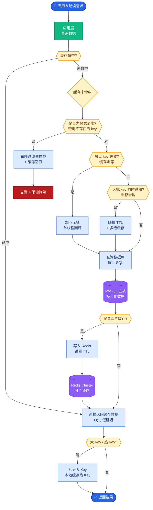

# 【Java 后端架构师】推荐系统在线服务与特征一致性

> 适用场景：JD 推荐核心。推荐模型离线训练 AUC 0.8（效果好），上线后 AUC 0.6（效果崩）——这是"训练服务不一致"的经典问题。根因是特征不一致——离线训练用的特征计算口径和在线预测不同。解决不了这个问题，模型再先进也白搭。核心是"统一特征平台 + 在线离线对齐"。

## 一、概念层：特征一致性陷阱

**训练服务不一致的三种表现**：

```
陷阱 1：特征口径不一致
  离线训练：Spark 算"近 30 天点击数"，时间窗口 [T-30, T]
  在线预测：Flink 算"近 30 天点击数"，时间窗口 [T-30, T)  ← 少了边界点
  结果：同一用户同一时刻，离线 28 次，在线 27 次，特征值不一致

陷阱 2：数据分布漂移
  离线训练：用 1 月份数据训练，用户画像"价格敏感"
  在线预测：6 月份预测，用户行为变了（消费升级），但特征还是旧的
  结果：模型基于过时分布训练，预测效果差

陷阱 3：特征工程不一致
  离线训练：特征做了归一化（min-max，min=0, max=1000）
  在线预测：特征没归一化（或归一化参数不同）
  结果：模型输入分布偏移，预测错误
```

**统一特征平台架构**（解决一致性）：

```
                    特征 DSL 定义（声明式）
                    "近30天点击数：窗口30天，聚合COUNT"
                          │
              ┌───────────┴───────────┐
              │                       │
              ▼                       ▼
    ┌─────────────────┐     ┌─────────────────┐
    │ 离线特征生成      │     │ 在线特征生成      │
    │ (Spark 批处理)   │     │ (Flink 流处理)   │
    │                  │     │                  │
    │ 算历史特征       │     │ 算实时特征        │
    │ 写特征仓库       │     │ 写 Redis         │
    │ 供模型训练       │     │ 供在线预测        │
    └─────────────────┘     └─────────────────┘
              │                       │
              │     ┌─────────┐       │
              └────►│ 特征对账 │◄──────┘
                    │ 差异检测 │
                    └─────────┘
                        │
                   不一致告警 + 修复
```

## 二、机制层：特征 DSL 与统一生成

**特征 DSL 设计**：

```java
/**
 * 特征定义（DSL）：声明式描述，平台自动生成离线/在线代码
 */
@Data
public class FeatureSpec {
    private String name;              // 特征名：user_click_count_30d
    private String description;       // 描述：近30天点击数
    private FeatureType type;         // 类型：用户/商品/上下文
    private String entityType;        // 实体：user_id / item_id
    private Aggregation agg;          // 聚合：COUNT / SUM / AVG
    private Duration window;          // 窗口：30 days
    private String sourceEvent;       // 来源事件：click
    private List<Filter> filters;     // 过滤条件：status=success
    private boolean realtime;         // 是否实时特征
}

/**
 * 示例：用户近30天点击数
 */
FeatureSpec clickCount30d = FeatureSpec.builder()
    .name("user_click_count_30d")
    .description("用户近30天点击数")
    .type(FeatureType.USER)
    .entityType("user_id")
    .agg(Aggregation.COUNT)          // 聚合方式：计数
    .window(Duration.ofDays(30))     // 时间窗口：30 天
    .sourceEvent("click")            // 来源：点击事件
    .filters(Arrays.asList(
        new Filter("status", "=", "success")))  // 只算成功点击
    .realtime(true)                   // 实时特征
    .build();
```

**特征平台（生成离线/在线作业）**：

```java
@Service
public class FeaturePlatform {

    /**
     * 注册特征：DSL → 生成离线 Spark 作业 + 在线 Flink 作业
     */
    public void registerFeature(FeatureSpec spec) {
        // 1. 生成离线 Spark SQL（训练用）
        String sparkSql = generateSparkSql(spec);
        sparkJobService.submit(spec.getName() + "_offline", sparkSql);

        // 2. 生成在线 Flink 作业（实时预测用）
        if (spec.isRealtime()) {
            String flinkCode = generateFlinkCode(spec);
            flinkJobService.deploy(spec.getName() + "_online", flinkCode);
        }

        // 3. 注册特征元信息（供查询）
        featureMetaRepo.save(spec);

        // 4. 启动对账任务（离线/在线一致性检测）
        scheduleReconciliation(spec);

        log.info("特征 {} 注册完成", spec.getName());
    }

    /**
     * 生成 Spark SQL（离线特征计算）
     */
    private String generateSparkSql(FeatureSpec spec) {
        // 根据 DSL 自动生成 SQL，确保口径一致
        return String.format(
            "SELECT user_id, " +
            "       COUNT(1) as %s " +     // 聚合方式
            "FROM click_event " +           // 来源事件
            "WHERE status = 'success' " +   // 过滤条件
            "  AND event_time BETWEEN " +
            "      DATE_SUB('{{date}}', %d) AND '{{date}}' " +  // 窗口
            "GROUP BY user_id",
            spec.getName(),
            (int) spec.getWindow().toDays()
        );
    }

    /**
     * 生成 Flink 代码（在线实时特征）
     */
    private String generateFlinkCode(FeatureSpec spec) {
        // 生成 Flink KeyedProcessFunction，窗口聚合，结果写 Redis
        return FlinkCodeGen.generate(spec);
    }
}
```

## 三、机制层：在线特征服务

**特征查询服务（低延迟）**：

```java
@Service
public class FeatureService {

    @Autowired private RedisTemplate redis;

    /**
     * 在线查询特征：模型预测时调用，需低延迟（< 10ms）
     */
    public Map<String, Object> getFeatures(String entityType, Long entityId,
                                            List<String> featureNames) {
        Map<String, Object> features = new HashMap<>();

        // 批量从 Redis 取（MGET，一次网络往返）
        List<String> keys = featureNames.stream()
            .map(name -> "feature:" + entityType + ":" + entityId + ":" + name)
            .collect(Collectors.toList());

        List<Object> values = redis.opsForValue().multiGet(keys);

        for (int i = 0; i < featureNames.size(); i++) {
            Object value = values.get(i);
            if (value == null) {
                // 特征缺失：降级（默认值 or 实时算）
                value = computeOnDemand(featureNames.get(i), entityId);
                monitor.record("feature_missing", featureNames.get(i));
            }
            features.put(featureNames.get(i), value);
        }

        monitor.record("feature_query_rt",
            System.currentTimeMillis() - startTime);
        return features;
    }

    /**
     * 特征缺失时按需计算（降级，慢但保可用）
     */
    private Object computeOnDemand(String featureName, Long entityId) {
        FeatureSpec spec = featureMetaRepo.findByName(featureName);
        if (spec == null) return getDefault(featureName);

        // 从实时事件流临时算（降级，延迟高）
        return realtimeComputeService.compute(spec, entityId);
    }
}
```

**推荐预测服务（组合特征查询 + 模型推理）**：

```java
@Service
public class RecommendService {

    @Autowired private FeatureService featureService;
    @Autowired private ModelClient modelClient;

    /**
     * 推荐：召回 → 特征查询 → 模型预测 → 排序
     */
    public List<RecommendItem> recommend(Long userId, List<Long> candidateItems) {
        // 1. 查询用户特征
        Map<String, Object> userFeatures = featureService.getFeatures(
            "user", userId, getUserFeatureNames());

        // 2. 批量查询商品特征
        Map<Long, Map<String, Object>> itemFeatures = new HashMap<>();
        for (Long itemId : candidateItems) {
            itemFeatures.put(itemId, featureService.getFeatures(
                "item", itemId, getItemFeatureNames()));
        }

        // 3. 组装模型输入（用户特征 + 商品特征 + 交叉特征）
        List<ModelInput> inputs = candidateItems.stream()
            .map(itemId -> assembleInput(userId, itemId,
                userFeatures, itemFeatures.get(itemId)))
            .collect(Collectors.toList());

        // 4. 批量调模型预测（gRPC，GPU 推理）
        List<Prediction> predictions = modelClient.batchPredict(inputs);

        // 5. 排序
        return sortAndReturn(predictions, candidateItems);
    }

    private ModelInput assembleInput(Long userId, Long itemId,
            Map<String, Object> userFeat, Map<String, Object> itemFeat) {
        ModelInput input = new ModelInput();
        input.setUserFeatures(userFeat);
        input.setItemFeatures(itemFeat);
        // 交叉特征（用户-商品交互）
        input.addCrossFeature("user_item_match",
            calcMatchScore(userFeat, itemFeat));
        return input;
    }
}
```

## 四、机制层：特征对账与一致性保障

**特征对账服务**：

```java
@Service
public class FeatureReconciliationService {

    /**
     * 对账：同一 entity 同一时间点，离线特征值 vs 在线特征值
     */
    @Scheduled(cron = "0 0 * * * ?")   // 每小时跑一次
    public void reconcile() {
        List<FeatureSpec> realtimeFeatures = featureMetaRepo.findRealtimeFeatures();

        for (FeatureSpec spec : realtimeFeatures) {
            // 抽样 1000 个 entity
            List<Long> sampleEntities = entityRepo.sample(spec.getEntityType(), 1000);

            int mismatchCount = 0;
            for (Long entityId : sampleEntities) {
                // 离线值（从特征仓库查）
                Object offlineValue = offlineFeatureStore.get(
                    spec.getName(), entityId, LocalDateTime.now());

                // 在线值（从 Redis 查）
                Object onlineValue = redis.opsForValue().get(
                    "feature:" + spec.getEntityType() + ":" + entityId + ":" + spec.getName());

                // 比对（允许微小误差，如浮点数）
                if (!isConsistent(offlineValue, onlineValue, spec)) {
                    mismatchCount++;
                    log.warn("特征不一致 {} entity={} offline={} online={}",
                        spec.getName(), entityId, offlineValue, onlineValue);
                }
            }

            double consistencyRate = 1.0 - (double) mismatchCount / sampleEntities.size();
            monitor.record("feature_consistency_rate", spec.getName(), consistencyRate);

            // 一致性 < 99% 告警
            if (consistencyRate < 0.99) {
                alertService.send("特征一致性告警",
                    spec.getName() + " 一致性 " + consistencyRate);
            }
        }
    }

    private boolean isConsistent(Object offline, Object online, FeatureSpec spec) {
        if (offline == null && online == null) return true;
        if (offline == null || online == null) return false;

        if (offline instanceof Number && online instanceof Number) {
            double diff = Math.abs(
                ((Number) offline).doubleValue() - ((Number) online).doubleValue());
            // 允许 1% 误差（浮点精度）
            return diff / Math.max(((Number) offline).doubleValue(), 1.0) < 0.01;
        }
        return offline.equals(online);
    }
}
```

## 五、底层本质：特征一致性的本质是"训练预测同构"

回到第一性：**特征一致性的本质是"保证模型在训练时看到的特征分布和预测时一致"**。

- **训练预测同构**：模型是一张"特征→预测"的映射表。训练时学的是"某组特征值→某标签"，预测时必须用同口径特征值才能复现学到的模式。口径不一致（同 entity 特征值不同），模型预测就错。这像"用错字典翻译"——训练用英汉词典，预测用汉英词典，结果驴唇不对马嘴。
- **离线在线同源**：统一特征平台从一份 DSL 生成离线 Spark 和在线 Flink 代码，从源头保证口径一致。这是"单一真理源"——特征定义只有一份，离线在线都基于它生成，不可能不一致。
- **对账是兜底**：即使 DSL 统一，实现细节（Spark 和 Flink 的算子语义微差）可能引入不一致。对账是"事后验证"——抽样比对离线在线值，发现差异即修复。这是"信任但验证"。
- **特征是模型的血液**：模型本身可以复现（公开算法），但特征是"数据工程"的产物，每个公司不同。特征一致性是推荐系统的核心竞争力——不是模型多先进，而是特征多准确。这是"数据 > 模型"的体现。

**实时特征的挑战是"新鲜度 vs 延迟"**：实时特征（如"最近 5 分钟点击数"）新鲜度高（反映用户当下兴趣），但实时计算有延迟（Flink 处理 + Redis 写入），可能和"理论值"有偏差。解法是"近似但一致"——实时特征允许和理论值有小误差，但离线训练也要用同样的"近似口径"，保证训练预测一致。

**特征版本管理的本质是"可复现"**：特征定义会变（改窗口、改聚合），模型训练必须锁定特定版本的特征，否则无法复现。新特征上线（v2）不影响旧模型（用 v1），新模型训练用 v2。这像"软件版本管理"——特征是"数据维度的代码"，也要版本化。

## 六、AI 架构师加问：5 个

1. **用大模型（LLM）生成特征，怎么做？**
   LLM 理解业务语义，自动生成特征建议——如分析用户行为，LLM 建议"深夜浏览者特征"（晚上 11 点后活跃用户）。但 LLM 生成的特征需人工验证（是否有效、是否一致）。京东实践：LLM 辅助特征发现，特征数量提升 30%。

2. **AI 自动检测特征漂移（分布变化），怎么做？**
   AI 监控特征分布——训练时特征的分布（均值/方差/分位数），在线预测时的分布，两者偏离（PSI > 0.2）告警。漂移可能因数据问题（采集异常）或业务变化（用户行为变）。AI 定位根因并触发模型重训。

3. **用向量数据库做特征存储，怎么做？**
   高维稠密特征（如 Embedding）用向量库存（Milvus/FAISS），支持近邻查询。但传统特征（计数/统计值）用 Redis/MySQL。混合存储——结构化特征 Redis，向量特征 Milvus，模型预测时分别取合并。

4. **AI 做特征选择（剔除无效特征），怎么做？**
   AI 评估特征重要性——模型训练输出特征权重（XGBoost feature_importance），低权重特征剔除。或用 SHAP 值（特征对预测的贡献），负贡献特征剔除。京东实践：特征从 1000 个精简到 200 个，模型效果不变，延迟降低 5 倍。

5. **AI 做特征实时回填（新特征补历史），怎么做？**
   新特征上线需历史数据训练。AI 自动生成回填作业——从事件流回算历史特征值，写入特征仓库。复杂特征（涉及多事件关联）AI 优化回填算法（增量计算，避免全量重算）。京东实践：新特征回填从天级优化到小时级。

## 七、记忆口诀与面试现场表达

### 1 分钟记忆口诀

抓 **"统一特征平台 DSL、离线在线同源生成、特征对账兜底、Redis 低延迟查询"**。

- **一致性陷阱**：离线训练特征口径 vs 在线预测口径不一致，模型效果崩
- **统一平台**：DSL 定义特征，自动生成 Spark（离线）+ Flink（在线），同源保证一致
- **在线服务**：Redis 存特征，MGET 批量查询，< 10ms
- **特征对账**：抽样比对离线/在线值，差异率 < 0.1%，一致性 > 99%
- **特征版本**：模型训练锁定版本，特征变更不影响线上模型

### 面试现场 60 秒回答

> 推荐系统最大难题是特征一致性——模型离线训练 AUC 0.8，上线 0.6，根因是离线训练和在线预测的特征口径不一致。离线用 Spark 算"近30天点击数"（时间窗口含边界），在线用 Flink 算（窗口不含边界），同 entity 特征值不同，模型预测错。解法是统一特征平台——特征用 DSL 声明式定义（名称/聚合/窗口/过滤条件），平台从一份 DSL 自动生成离线 Spark SQL 和在线 Flink 代码，从源头保证同口径。在线预测时特征从 Redis 查询（MGET 批量，< 10ms），缺失按需实时算（降级）。特征对账兜底——每小时抽样 1000 个 entity，比对离线值（特征仓库）和在线值（Redis），一致性率 > 99%，低于则告警。特征版本管理——特征变更版本化（v1/v2），模型训练锁定版本，新特征不影响旧模型。特征存储分层——结构化特征 Redis（低延迟），向量特征 Milvus（近邻查询），模型预测分别取合并。监控 feature_consistency_rate（一致性率，> 99%）、feature_query_rt（查询延迟，< 10ms）、feature_missing_rate（缺失率，< 1%）。最关键的是"训练预测同构——同一份 DSL 生成离线在线代码"，这是特征一致性的根本保障。

## 八、苏格拉底式面试追问

| 追问层级 | 面试官可能这样问 | 高分回答方向 |
|----------|------------------|--------------|
| 目标追问 | 为什么不直接用同一套代码算离线在线特征（要两套）？ | 离线全量批处理（Spark，算历史），在线实时流处理（Flink，算当下），技术栈不同。且离线可慢（小时级），在线必须快（毫秒级）。用 feature_consistency_rate（一致性率）和 latency（延迟）量化，统一 DSL 保证口径，不同引擎保证性能 |
| 证据追问 | 怎么证明特征一致（不是自欺欺人）？ | 对账（抽样离线在线比对，差异率 < 0.1%）+ 端到端 A/B（一致特征 vs 不一致特征，比模型效果）+ 线上监控（模型 AUC/CVR 稳定，不骤降）。监控 feature_consistency_rate（> 99%）和 model_auc_drift（AUC 漂移，应 < 5%） |
| 边界追问 | 统一 DSL 能描述所有特征吗？ | 不能。极复杂特征（如"用户聚类标签"，需离线 ML 模型）DSL 难表达，需自定义代码。这类特征单独管理，但对账仍需覆盖 |
| 反例追问 | 什么场景不需要特征一致性（离线在线可不同）？ | 探索性分析（offline only，不在线预测）、冷启动（新特征无在线数据，先用离线）。但生产推荐必须一致 |
| 风险追问 | 特征平台最大风险？ | 主动点出：DSL bug（生成的代码有错，离线在线都错但一致——更危险）、对账漏报（抽样没覆盖问题 entity）、特征漂移（数据分布变化，特征失效）、Redis 故障（在线特征不可查）。靠 DSL 测试 + 全量对账 + 漂移检测 + 降级方案 |
| 验证追问 | 怎么验证特征对账有效（不是漏报）？ | 注入测试（故意制造不一致，验证对账能发现）+ 全量对账（不只抽样，定期跑全量）+ 多维度对账（不同 entity 类型/时间点）。监控 reconciliation_coverage（对账覆盖率，应 100%）和 false_negative（漏报，应 0） |
| 沉淀追问 | 特征平台沉淀什么？ | DSL 引擎、Spark/Flink 代码生成器、特征存储（Redis/Milvus）、对账框架、特征监控大盘（一致性率/查询延迟/缺失率/漂移检测） |

### 现场对话示例

**面试官**：模型上线后发现 AUC 从离线 0.8 降到在线 0.65，怎么排查是特征不一致？

**候选人**：系统化排查。第一步，确认是否特征问题——导出在线预测时的实际特征值（日志），用这些值跑离线模型，看预测是否和在线一致。如果离线用在线特征值跑出 AUC 0.65，说明特征不一致；如果离线用在线特征值还是 0.8，说明模型部署有问题（模型参数不一致）。第二步，定位不一致特征——逐个特征比对离线训练时的特征分布和在线预测时的分布，PSI（Population Stability Index）> 0.2 的特征是嫌疑。第三步，根因分析——对嫌疑特征，抽样具体 entity，查离线 Spark 算的值和在线 Flink 算的值，找差异。常见根因：时间窗口边界（离线含 T，在线不含 T）、过滤条件不同（离线过滤了 status=fail，在线没过滤）、聚合方式不同（离线 COUNT DISTINCT，在线 COUNT）。第四步，修复——统一 DSL，重新生成离线在线代码，重新训练模型。第五步，预防——加强特征对账（从抽样改全量），加特征一致性自动化测试（每次特征变更跑对账）。京东实践：模型上线有"特征一致性校验"门禁，不一致不让上线。监控 model_auc_online vs model_auc_offline，差异 > 10% 告警。

**面试官**：实时特征（如"最近5分钟点击数"）Redis 查询延迟 50ms（超 SLA 10ms），怎么优化？

**候选人**：Redis 查询慢通常因数据量大或网络。优化措施——第一，Key 设计优化（feature:user:123:click_5min，Hash Tag 保证同 entity 同分片，批量 MGET 走同分片）；第二，Pipeline（批量命令一次发送，减少网络往返）；第三，本地缓存（Caffeine 缓存热点用户特征，TTL 1 分钟，Redis 兜底）；第四，特征预取（用户进入推荐页时预取特征，预测时直接用）；第五，Redis 集群分片（按 entity hash 分散，避免热点）。京东实践：特征查询从 50ms 优化到 3ms（Pipeline + 本地缓存 + 集群分片），支撑 10 万 QPS 推荐。监控 feature_query_p99（查询延迟，< 10ms）和 redis_hit_rate（命中率，> 95%）。极端情况 Redis 挂——降级到按需实时算（慢但保可用）或用默认特征（牺牲效果保可用）。

**面试官**：新特征上线（如"用户近期搜索词偏好"），怎么验证有效再全量？

**候选人**：四步验证。第一步，离线评估——新特征加入模型训练，看 AUC/NDCG 是否提升（对比 baseline）。提升显著（AUC +0.01）进入下一步；不显著可能特征无效或工程问题。第二步，特征重要性——模型输出特征重要性，新特征排名靠前（TOP 20%）说明有用；排名垫底可能无效。第三步，在线 A/B——灰度 10% 流量用新特征模型，90% 用旧模型，对比 CTR/CVR/GMV。统计显著性检验（p < 0.05），新模型显著更优则扩大灰度。第四步，全量——50% → 100%，持续监控。每步都有回滚预案（新特征效果差可关闭）。京东实践：新特征上线有"灰度平台"，自动分流 + 自动统计 + 自动决策（显著优扩量，显著差回滚）。监控 feature_ab_lift（A/B 提升幅度）和 feature_rollout_rate（灰度比例）。

## 常见考点

1. **特征工程和特征平台的区别？**——特征工程是"设计特征"（业务理解，如"用户价格敏感度"），特征平台是"工程实现"（特征计算/存储/服务/一致性）。前者是数据科学，后者是工程。
2. **离线特征和实时特征的区别？**——离线特征用批处理（Spark，历史全量，延迟小时级），实时特征用流处理（Flink，增量，延迟秒级）。实时特征新鲜但计算成本高。
3. **怎么做特征重要性分析？**——模型内置（XGBoost feature_importance）、SHAP 值（特征贡献）、Permutation Importance（打乱特征看效果下降）。低重要性特征剔除（降维）。
4. **特征存储选型？**——低延迟查询 Redis（KV 特征）、向量近邻 Milvus（Embedding）、离线仓库 Hive/Parquet（训练）、特征平台 Feast（统一管理）。

## 核心流程图



## 结构化回答

**30 秒电梯演讲：** 推荐系统的核心难题不是模型（模型公开可复现），而是特征一致性——离线训练用的特征和在线预测用的特征必须完全一致，否则模型在线效果崩。一致性陷阱：离线用历史全量数据算特征（如近 30 天点击数），在线用实时流算（同一特征但数据窗口/计算逻辑微妙不同），导致离线训练的模型在线预测时特征值偏移，模型效果骤降。架构核心是统一特征平台 + 在线离线特征对齐

**展开框架：**
1. **特征一致性陷阱** — 离线训练 vs 在线预测，特征口径不一致导致模型失效
2. **统一特征平台** — 特征定义一次，离线/在线生成（DSL → Spark/Flink 代码）
3. **在线特征服务** — 低延迟查询（Redis/特征存储），模型预测时实时取特征

**收尾：** 以上是我的整体思路。您想继续深入聊——实时特征怎么低延迟查询？


## 视频脚本

> 预计时长：2 分钟 | 由浅入深

| 时间 | 画面/字幕 | 口播台词 | 讲解要点 |
|------|----------|----------|----------|
| 0:00 | 标题卡：推荐系统在线服务与特征一致性 | "这题核心是——推荐系统的核心难题不是模型（模型公开可复现），而是特征一致性——离线训练用的特征和在线预测用的特……" | 开场钩子 |
| 0:15 | 像培训销售。培训时（离线训练）用去年的市场数类比图 | "打个比方：像培训销售。培训时（离线训练）用去年的市场数。" | 核心类比 |
| 0:40 | 特征一致性陷阱示意/对比图 | "离线训练 vs 在线预测，特征口径不一致导致模型失效" | 特征一致性陷阱要点 |
| 1:05 | 统一特征平台示意/对比图 | "特征定义一次，离线/在线生成（DSL → Spark/Flink 代码）" | 统一特征平台要点 |
| 1:30 | 在线特征服务示意/对比图 | "低延迟查询（Redis/特征存储），模型预测时实时取特征" | 在线特征服务要点 |
| 1:55 | 总结卡 | "记住：特征一致性。下期见。" | 收尾 |

---

## 延伸：【Java 后端架构师】推荐特征实时更新与训练服务偏差

> 合并自 `java-architect-173`（相似度 71%）

> 适用场景：JD 核心技术。推荐模型训练时用"用户近 30 天点击数"，但线上服务时工程师为了性能改成"近 7 天点击数"——模型效果骤降。架构师要设计的是一个"训练和服务特征完全一致、支持实时更新"的特征平台。

## 一、概念层：训练服务偏差的类型

| 偏差类型 | 示例 | 后果 |
|---------|------|------|
| **定义偏差** | 训练"点击数"含浏览，服务"点击数"不含 | 特征语义不同 |
| **窗口偏差** | 训练 30 天，服务 7 天 | 分布完全不同 |
| **计算偏差** | 训练 Spark 算均值去重，服务 Java 算没去重 | 数值不一致 |
| **数据穿越** | 训练样本用了事件后的数据 | 模型"作弊"上线失效 |
| **延迟偏差** | 服务时特征更新延迟，用的是过时特征 | 实时性丢失 |

## 二、机制层：统一特征平台架构

```
                    统一特征定义（FeatureSpec）
                            │
            ┌───────────────┼───────────────┐
            │               │               │
     离线计算（Spark）  实时计算（Flink）  特征 SDK
            │               │            ┌───┴───┐
            ▼               ▼            │       │
     Hive/Iceberg      Redis          训练侧   服务侧
     （训练读）        （服务读）       （读）   （读）
            │               │
            └──────对账─────┘
              （监控分布一致）
```

### 2.1 特征定义（FeatureSpec）

```java
@Data
public class FeatureSpec {
    private String featureId;              // "user_click_count_30d"
    private String ownerId;
    private String description;
    private FeatureType type;              // NUMERIC / CATEGORICAL / EMBEDDING
    private String timeWindow;             // "30d" / "realtime"
    private String computeLogic;           // 计算逻辑（共享代码）
    private Integer version;               // 版本号
    private List<String> sourceTables;     // 数据源

    // 关键：训练和服务用同一个 FeatureSpec，不可各自实现
}

// 特征注册表（所有特征统一定义）
@Service
public class FeatureRegistry {
    private final Map<String, FeatureSpec> specs;

    public FeatureSpec get(String featureId, Integer version) {
        return specs.get(featureId + ":" + version);
    }
}
```

### 2.2 共享计算逻辑（Feature SDK）

```java
// 训练和服务共享同一套特征计算代码
public class UserFeatureCalculator {

    /**
     * 计算用户近 30 天点击数
     * 训练和在线服务都调这个方法，保证一致
     */
    public long calcClickCount30d(String userId, Instant asOf) {
        Instant windowStart = asOf.minus(Duration.ofDays(30));
        return clickEventRepo.countByUserAndTime(
            userId, windowStart, asOf);
    }

    /**
     * 计算用户品类偏好向量
     */
    public float[] calcCategoryPreference(String userId, Instant asOf) {
        List<ClickEvent> events = clickEventRepo.findByUserAndTime(
            userId, asOf.minus(Duration.ofDays(30)), asOf);
        // 共享的计算逻辑（TF-IDF 或 embedding 聚合）
        return aggregator.aggregate(events);
    }
}
```

## 三、机制层：实时特征更新

```java
// Flink 流式计算实时特征，写 Redis
public class RealtimeFeatureJob {

    /**
     * 监听用户行为流，实时更新特征
     */
    public void start() {
        DataStream<UserEvent> events = env.addSource(
            new FlinkKafkaConsumer<>("user_events", new UserEventDeserializer(), props));

        events
            .keyBy(UserEvent::getUserId)
            .process(new FeatureUpdateFunction())
            .addSink(new RedisSink<>(redisConfig, new FeatureRedisMapper()));
    }

    public static class FeatureUpdateFunction
            extends KeyedProcessFunction<String, UserEvent, FeatureUpdate> {

        private ValueState<Long> clickCountToday;

        @Override
        public void processElement(UserEvent event, Context ctx,
                Collector<FeatureUpdate> out) {
            if (event.getType() == CLICK) {
                long count = clickCountToday.value() + 1;
                clickCountToday.update(count);
                // 实时特征更新到 Redis（延迟 < 1 秒）
                out.collect(new FeatureUpdate(
                    event.getUserId(),
                    "user_click_count_today",
                    String.valueOf(count)));
            }
        }
    }
}
```

```java
// 在线服务读特征
@Service
public class FeatureStore {

    private final RedisTemplate<String, String> redis;
    private final UserFeatureCalculator fallbackCalculator;

    /**
     * 获取用户特征：先读 Redis（实时），miss 则实时算
     */
    public Map<String, Object> getUserFeatures(String userId, Instant asOf) {
        Map<String, Object> features = new HashMap<>();

        // 实时特征从 Redis 读
        String realtimeVal = redis.opsForValue().get("feature:rt:" + userId);
        if (realtimeVal != null) {
            features.putAll(parseFeatures(realtimeVal));
        }

        // 离线特征（30 天窗口）从 Redis 缓存或实时算
        Long clickCount30d = (Long) redis.opsForHash().get(
            "feature:offline:" + userId, "click_count_30d");
        if (clickCount30d == null) {
            // 缓存 miss，用共享 SDK 实时算（保证和训练一致）
            clickCount30d = fallbackCalculator.calcClickCount30d(userId, asOf);
            redis.opsForHash().put("feature:offline:" + userId,
                "click_count_30d", String.valueOf(clickCount30d));
        }
        features.put("click_count_30d", clickCount30d);

        return features;
    }
}
```

## 四、机制层：Point-in-Time 训练样本生成

```java
@Service
public class TrainingSampleBuilder {

    /**
     * 生成训练样本：特征值必须是"事件发生时刻"的历史值
     * 防止数据穿越（用未来数据训练导致上线失效）
     */
    public List<TrainingSample> build(List<LabeledEvent> events) {
        List<TrainingSample> samples = new ArrayList<>();

        for (LabeledEvent event : events) {
            Instant eventTime = event.getTimestamp();
            String userId = event.getUserId();
            String itemId = event.getItemId();

            // Point-in-Time：特征值取 eventTime 之前的最新值
            Map<String, Object> userFeatures = featureStore.getAsOf(
                userId, eventTime);    // 关键：asOf = eventTime
            Map<String, Object> itemFeatures = featureStore.getAsOf(
                itemId, eventTime);

            samples.add(TrainingSample.builder()
                .userId(userId)
                .itemId(itemId)
                .features(merge(userFeatures, itemFeatures))
                .label(event.getLabel())     // 点击=1，未点击=0
                .timestamp(eventTime)
                .build());
        }
        return samples;
    }
}

// 特征表的 Point-in-Time 查询
// SELECT * FROM user_features
// WHERE user_id = ?
//   AND as_of_time <= ?    -- 关键：<= 事件时间
// ORDER BY as_of_time DESC LIMIT 1
```

## 五、机制层：训练服务偏差监控

```java
@Service
public class TrainingServingSkewMonitor {

    /**
     * 监控线上特征分布 vs 训练集分布
     * 分布偏移说明训练服务不一致
     */
    @Scheduled(fixedDelay = 3600_000)
    public void checkSkew() {
        for (String featureId : monitoredFeatures) {
            // 训练集分布
            Distribution trainDist = getTrainingDistribution(featureId);
            // 线上实时分布（最近 1 小时）
            Distribution serveDist = getOnlineDistribution(featureId, Duration.ofHours(1));

            // PSI（Population Stability Index）< 0.1 稳定，> 0.25 偏移
            double psi = calcPSI(trainDist, serveDist);

            if (psi > 0.25) {
                alertService.send(String.format(
                    "特征 %s 训练服务偏差 PSI=%.3f（阈值 0.25），请检查特征定义",
                    featureId, psi));
                metrics.gauge("feature.skew.psi", psi, "feature", featureId);
            }
        }
    }

    private double calcPSI(Distribution train, Distribution serve) {
        // PSI = Σ (serve_pct - train_pct) * ln(serve_pct / train_pct)
        double psi = 0;
        for (int i = 0; i < train.getBuckets(); i++) {
            double trainPct = train.getPercent(i) + 1e-6;
            double servePct = serve.getPercent(i) + 1e-6;
            psi += (servePct - trainPct) * Math.log(servePct / trainPct);
        }
        return psi;
    }
}
```

## 六、底层本质：训练服务偏差是"分布式系统的数据一致性问题"

训练和服务是两个独立的系统（Spark 离线训练、Java 在线服务），它们各自计算特征时可能产生偏差。根因是"代码重复"——同一个特征定义被实现了两次（一次 Spark、一次 Java），任何一次的 bug 或理解偏差都会导致不一致。

**解法的本质是"单一数据源（Single Source of Truth）"**：特征定义只声明一次（FeatureSpec），计算逻辑只实现一次（Feature SDK），训练和服务都调用同一套代码。这和软件工程的"DRY 原则"同构。

**Point-in-Time 的本质是"因果性约束"**：训练样本的特征值必须是事件发生时刻的历史值，不能用事件之后的数据。否则模型学到了"用未来数据预测过去"的虚假规律（数据穿越），上线后没有未来数据可用，效果崩溃。这和时序数据库的"时间旅行查询"同构。

**实时特征的本质是"低延迟的增量计算"**：用户刚点了商品，下次推荐要立即反映这个行为。Flink 流式计算把增量变化（+1 点击）实时写入 Redis，服务读取时就是最新值。离线批量重算 30 天窗口太慢（分钟级），流式增量更新是秒级。

## 七、AI 工程化深挖

1. **特征工程怎么自动化？**
   工具（如 Feast/Tecton）管理特征定义和计算。AI 辅助发现特征（从数据里自动生成候选特征：聚合/交叉/时序），人工筛选有效特征。监控 feature_importance（模型学到的特征重要性）。

2. **LLM 怎么辅助特征描述？**
   LLM 根据特征代码生成人类可读的描述（"user_click_count_30d = 用户最近 30 天的点击事件数"），帮助数据科学家理解特征含义。但特征定义本身用代码保证精确性。

3. **推荐场景的 Embedding 特征怎么实时更新？**
   用户行为 embedding（如 YouTube DNN 的 user embedding）随行为变化。实时更新方案：用户行为触发增量推理（Flink 调模型），更新后的 embedding 写 Redis。但成本高，一般分钟级更新而非秒级。

4. **特征平台怎么做多租户？**
   不同业务线（电商/金融/出行）的特征隔离。tenant_id 作为特征 key 前缀（feature:tenant_id:user_id）。配额控制（每个租户特征数上限，防一个业务占满 Redis）。监控 tenant_feature_usage。

5. **怎么做特征的血缘追溯？**
   记录每个特征的来源（原始表/计算逻辑/版本）、消费方（哪些模型用了）、变更历史。模型效果退化时沿血缘定位是哪个特征变了。血缘用图数据库（Neo4j）存储。

## 八、记忆口诀与面试现场表达

### 1 分钟记忆口诀

抓 **"统一 SDK、实时更新、Point-in-Time、PSI 监控"** 四个词。

- **统一 SDK**：训练和服务共享 FeatureSpec + 计算代码，DRY 原则
- **实时更新**：Flink 流式增量写 Redis，秒级延迟
- **Point-in-Time**：训练样本特征取事件时刻值，防数据穿越
- **PSI 监控**：< 0.1 稳定，> 0.25 训练服务偏差告警

### 面试现场 60 秒回答

> 推荐特征的核心是训练服务一致性。统一特征平台——特征定义只声明一次（FeatureSpec），计算逻辑只实现一次（Feature SDK），训练（Spark 离线）和服务（Java 在线）都调同一套代码，杜绝"训练 30 天窗口/服务 7 天窗口"的偏差。实时特征更新走 Flink 流式——监听用户行为 Kafka topic，增量计算（点击数+1）秒级写 Redis，服务读取时是最新值。离线特征 Spark 批处理写 Hive，训练读。训练样本生成用 Point-in-Time join——特征值取事件时刻（asOf <= eventTime）的历史值，防止用未来数据（数据穿越）导致模型上线失效。监控训练服务偏差用 PSI（Population Stability Index）——线上特征分布和训练集分布对比，PSI > 0.25 告警排查特征定义是否改了。特征版本化，变更要重训模型。核心指标 feature_serving_latency、psi_value、feature_coverage_rate。

## 九、常见考点

1. **训练服务偏差怎么产生？**——同一特征被训练侧和服务侧各自实现（Spark 一次、Java 一次），任何一侧的 bug/理解偏差/口径不同都导致不一致。解法是统一 FeatureSpec + 共享 SDK。
2. **Point-in-Time 为什么重要？**——训练样本如果用了事件后的数据（数据穿越），模型学到"作弊"规律，上线后没有未来数据可用，效果崩溃。必须 asOf <= eventTime 查历史特征。
3. **实时特征延迟多少？**——推荐秒级（用户点了立即影响下次推荐）。Flink 流式写 Redis，端到端延迟 < 1 秒。离线特征分钟/小时级（每天批量算）。
4. **PSI 怎么算？**——把特征值分桶，算训练集和服务集各桶占比，PSI = Σ (serve_pct - train_pct) × ln(serve_pct/train_pct)。PSI < 0.1 稳定，0.1-0.25 轻微偏移，> 0.25 显著偏移告警。

## 结构化回答

**30 秒电梯演讲：** 推荐特征实时更新的核心是特征工程的训练-服务一致性——训练时用的特征（用户近 30 天点击数）和线上服务时用的特征必须完全一致，否则模型学到的规律失效（训练服务偏差）。解法是统一特征定义 + 共享特征计算逻辑 + 实时特征 store

**展开框架：**
1. **训练服务偏差** — 训练特征和服务特征定义/计算/窗口不一致
2. **实时特征** — 用户实时行为（点击/购买/停留）秒级更新到特征 store
3. **特征 store** — Redis（在线）+ Hive/Iceberg（离线），双写或 Lambda 架构

**收尾：** 以上是我的整体思路。您想继续深入聊——训练服务偏差怎么检测？


## 视频脚本

> 预计时长：1 分 30 秒 | 由浅入深

| 时间 | 画面/字幕 | 口播台词 | 讲解要点 |
|------|----------|----------|----------|
| 0:00 | 标题卡：推荐特征实时更新与训练服务偏差 | "这题核心是——推荐特征实时更新的核心是特征工程的训练-服务一致性——训练时用的特征（用户近 30 天点击数）和……" | 开场钩子 |
| 0:15 | 训练服务偏差示意/对比图 | "训练特征和服务特征定义/计算/窗口不一致" | 训练服务偏差要点 |
| 0:40 | 实时特征示意/对比图 | "用户实时行为（点击/购买/停留）秒级更新到特征 store" | 实时特征要点 |
| 1:25 | 总结卡 | "记住：训练服务偏差。下期见。" | 收尾 |


