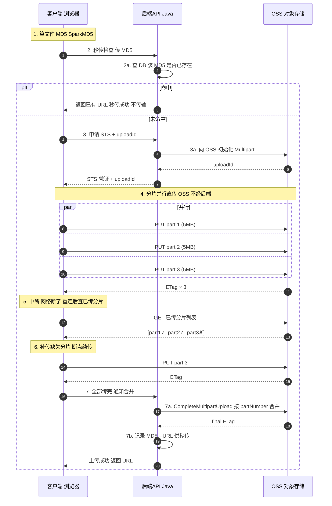

# 【Java 后端架构师】大文件上传、断点续传与对象存储

> 适用场景：JD 核心技术。商家上传商品视频（2G）、用户上传高清图片、批量导入商品数据（Excel 几百 MB）。架构师必须设计分片上传、秒传去重、断点续传方案，保证大文件在弱网下可靠上传。

## 一、概念层：大文件上传的四大能力

**四大能力对比**：

| 能力 | 解决的问题 | 实现机制 |
|------|-----------|---------|
| **分片上传** | 大文件单连接不可靠、速度慢 | 切 5-10MB 块，并行多连接上传 |
| **秒传** | 重复文件浪费带宽 | MD5 查重，命中不实际传输 |
| **断点续传** | 中断后从头重来 | 记录已传分片，补传缺失 |
| **直传** | 后端转发双倍带宽 | STS 凭证，客户端直连 OSS |

**完整上传流程**（面试必画）：



## 二、机制层：分片上传 + MD5 校验代码

**客户端分片与 MD5 计算**（前端核心代码）：

```javascript
// 使用 SparkMD5 流式计算大文件 MD5（不爆内存）
async function calculateMD5(file) {
    return new Promise((resolve) => {
        const blobSlice = File.prototype.slice || File.prototype.mozSlice || File.prototype.webkitSlice;
        const chunkSize = 5 * 1024 * 1024;   // 5MB 分片
        const chunks = Math.ceil(file.size / chunkSize);
        const spark = new SparkMD5.ArrayBuffer();
        const fileReader = new FileReader();
        let currentChunk = 0;

        fileReader.onload = (e) => {
            spark.append(e.target.result);    // 增量计算
            currentChunk++;
            if (currentChunk < chunks) {
                loadNext();
            } else {
                resolve(spark.end());          // 最终 MD5
            }
        };

        function loadNext() {
            const start = currentChunk * chunkSize;
            const end = Math.min(start + chunkSize, file.size);
            fileReader.readAsArrayBuffer(blobSlice.call(file, start, end));
        }
        loadNext();
    });
}

// 分片上传
async function uploadFile(file) {
    // 1. 算 MD5
    const md5 = await calculateMD5(file);

    // 2. 秒传检查
    const checkResp = await fetch('/api/upload/check', {
        method: 'POST',
        body: JSON.stringify({ md5, fileName: file.name, size: file.size })
    });
    const checkResult = await checkResp.json();
    if (checkResult.instantHit) {
        return checkResult.url;   // 秒传成功，直接返回
    }

    // 3. 获取 STS + uploadId
    const initResp = await fetch('/api/upload/init', {
        method: 'POST',
        body: JSON.stringify({ md5, fileName: file.name, size: file.size })
    });
    const { stsToken, uploadId, bucket, objectKey } = await initResp.json();

    // 4. 分片并行上传（直传 OSS）
    const chunkSize = 5 * 1024 * 1024;
    const chunks = Math.ceil(file.size / chunkSize);
    const uploadedParts = checkResult.uploadedParts || [];  // 断点续传：已传分片

    const promises = [];
    for (let i = 0; i < chunks; i++) {
        const partNumber = i + 1;
        // 跳过已传分片（断点续传）
        if (uploadedParts.includes(partNumber)) continue;

        const start = i * chunkSize;
        const end = Math.min(start + chunkSize, file.size);
        const chunk = file.slice(start, end);

        promises.push(uploadPart(stsToken, bucket, objectKey, uploadId, partNumber, chunk));
    }

    const etags = await Promise.all(promises);

    // 5. 通知后端合并
    await fetch('/api/upload/complete', {
        method: 'POST',
        body: JSON.stringify({ uploadId, objectKey, md5 })
    });
}
```

**后端 API（Java + OSS SDK）**：

```java
@RestController
@RequestMapping("/api/upload")
public class UploadController {

    @Autowired private OSS ossClient;
    @Autowired private FileRecordMapper fileRecordMapper;

    // 1. 秒传检查
    @PostMapping("/check")
    public CheckResult check(@RequestBody CheckRequest req) {
        // 查 DB：该 MD5 是否已存在
        FileRecord record = fileRecordMapper.findByMd5(req.getMd5());
        if (record != null) {
            // 秒传命中
            return CheckResult.builder()
                .instantHit(true)
                .url(record.getUrl())
                .build();
        }
        // 未命中，返回已传分片（断点续传）
        List<Integer> uploadedParts = getUploadedParts(req.getMd5());
        return CheckResult.builder()
            .instantHit(false)
            .uploadedParts(uploadedParts)
            .build();
    }

    // 2. 初始化分片上传
    @PostMapping("/init")
    public InitResult init(@RequestBody InitRequest req) {
        String objectKey = "uploads/" + req.getMd5() + "/" + req.getFileName();

        // 向 OSS 初始化 Multipart Upload
        InitiateMultipartUploadRequest initReq = new InitiateMultipartUploadRequest(
            bucketName, objectKey);
        InitiateMultipartUploadResult initResult = ossClient.initiateMultipartUpload(initReq);

        // 生成 STS 临时凭证（让客户端直传 OSS）
        STSToken stsToken = stsService.generateUploadToken(objectKey);

        return InitResult.builder()
            .stsToken(stsToken)
            .uploadId(initResult.getUploadId())
            .bucket(bucketName)
            .objectKey(objectKey)
            .build();
    }

    // 3. 合并分片
    @PostMapping("/complete")
    public CompleteResult complete(@RequestBody CompleteRequest req) {
        // 列出已传分片（OSS 记录的）
        ListPartsRequest listReq = new ListPartsRequest(
            bucketName, req.getObjectKey(), req.getUploadId());
        PartListing listing = ossClient.listParts(listReq);

        // 按 partNumber 排序合并
        List<PartETag> partETags = listing.getParts().stream()
            .map(p -> new PartETag(p.getPartNumber(), p.getETag()))
            .sorted(Comparator.comparingInt(PartETag::getPartNumber))
            .collect(Collectors.toList());

        CompleteMultipartUploadRequest completeReq = new CompleteMultipartUploadRequest(
            bucketName, req.getObjectKey(), req.getUploadId(), partETags);
        CompleteMultipartUploadResult result = ossClient.completeMultipartUpload(completeReq);

        // 校验合并后 ETag
        String finalETag = result.getETag();
        if (!finalETag.contains(req.getMd5())) {
            throw new RuntimeException("MD5 校验失败，文件可能损坏");
        }

        // 记录 MD5 → URL（供下次秒传）
        String url = "https://" + bucketName + ".oss.jd.com/" + req.getObjectKey();
        fileRecordMapper.insert(new FileRecord(req.getMd5(), url));

        return CompleteResult.builder().url(url).build();
    }
}
```

## 三、机制层：STS 直传与断点续传

**STS 临时凭证生成**（让客户端直传 OSS）：

```java
@Service
public class StsService {

    public STSToken generateUploadToken(String objectKey) {
        // 生成 STS 临时凭证，只允许 PutObject 到指定路径
        Policy policy = new Policy()
            .addAction("oss:PutObject")
            .addResource("acs:oss:*:" + bucketName + ":" + objectKey + "*")
            .setExpireSeconds(3600);   // 1 小时有效

        AssumeRoleRequest request = new AssumeRoleRequest()
            .setRoleArn("acs:ram::123456:role/upload-role")
            .setRoleSessionName("client-upload")
            .setPolicy(policy.toJson());

        AssumeRoleResponse response = stsClient.getAssumeRole(request);
        AssumeRoleResponse.Credentials creds = response.getCredentials();

        return STSToken.builder()
            .accessKeyId(creds.getAccessKeyId())
            .accessKeySecret(creds.getAccessKeySecret())
            .securityToken(creds.getSecurityToken())
            .expiration(creds.getExpiration())
            .build();
    }
}
// 客户端用 STS 凭证直接 PUT 到 OSS，不经后端（省带宽）
```

**断点续传的已传分片查询**：

```java
// 查询 OSS 某个 uploadId 已传了哪些分片
public List<Integer> getUploadedParts(String md5) {
    String objectKey = "uploads/" + md5 + "/";
    String uploadId = fileRecordMapper.findUploadIdByMd5(md5);
    if (uploadId == null) return Collections.emptyList();

    ListPartsRequest listReq = new ListPartsRequest(bucketName, objectKey, uploadId);
    PartListing listing = ossClient.listParts(listReq);

    return listing.getParts().stream()
        .map(PartSummary::getPartNumber)
        .collect(Collectors.toList());
    // 客户端拿到已传分片列表，只补传缺失的
}
```

## 四、实战层：上传监控与可靠性

**上传监控指标**（核心 SLI）：

```yaml
# Prometheus 指标
groups:
  - name: upload
    rules:
      - alert: UploadInterruptionRate
        expr: |
          rate(upload_aborted_total[5m]) / rate(upload_started_total[5m]) > 0.1
        for: 5m
        annotations:
          summary: "上传中断率 > 10%，检查网络或 OSS 稳定性"

      - alert: InstantHitRateLow
        expr: |
          rate(upload_instant_hit_total[5m]) / rate(upload_check_total[5m]) < 0.3
        for: 30m
        annotations:
          summary: "秒传命中率 < 30%，可能有大量重复文件未命中缓存"

      - alert: ChunkCompletionLow
        expr: |
          avg(upload_chunk_completion_rate) < 0.95
        for: 10m
        annotations:
          summary: "分片平均完成率 < 95%，上传体验差"
```

**可靠性保障**：

```
分片级：
  - 每分片上传后 OSS 返回 ETag（该分片 MD5），客户端校验
  - 分片失败自动重试（3 次），重试只重传失败分片

文件级：
  - 合并时 OSS 校验分片数和顺序
  - 合并后 final ETag 包含整体 MD5，客户端比对
  - 不一致则删除重新上传

元数据级：
  - uploadId、已传分片记录持久化到 DB（不只依赖 OSS）
  - DB 与 OSS 分片列表定期对账（防不一致）
```

## 五、底层本质：为什么大文件上传这么复杂

回到第一性：**HTTP 上传的物理限制是"带宽 × 时间 = 文件大小"，大文件需要长时间稳定传输，而网络是不可靠的**。

- **单连接不可靠**：1G 文件在 10Mbps 带宽传 800 秒，这期间任何网络抖动（移动网络切换、WiFi 丢包）都会断开，单连接 HTTP 无法恢复只能从头来。分片解决——每片 5MB 传几秒，失败概率低，失败也只重传这一片。
- **并行加速**：单连接受 TCP 窗口和拥塞控制限制，带宽利用率低（尤其高延迟网络）。多分片多连接并行能占满带宽（HTTP/2 或多路复用）。5 个并行连接比单连接快 3-5 倍。
- **重复传输浪费**：100 个用户上传同一个安装包，如果都实际传输，浪费 100 倍带宽。秒传（MD5 查重）让第一个传完后，后续 99 个直接返回 URL。在团队协作、公共资源场景秒传命中率很高。
- **后端转发的带宽成本**：客户端 → 后端 → OSS 双倍带宽，后端成为瓶颈。直传（STS 凭证）让客户端直连 OSS，后端只做凭证签发和元数据记录，带宽成本降到 1/100。代价是信任客户端（STS 权限最小化，只允许 PutObject 到指定路径）。
- **断点续传的状态管理**：记录"传了哪些分片"需要服务端状态。OSS 的 Multipart Upload 天然支持——每个 uploadId 对应一组分片，listParts 能查已传分片。客户端中断重启后查询，只补缺失。关键状态（uploadId、MD5）持久化到 DB，不只依赖内存或 OSS。

**分片大小的权衡**：太小（1MB）分片数多（1G = 1000 片），管理开销大（1000 个 HTTP 请求）；太大（100MB）单片失败重传成本高。5-10MB 是平衡点——1G 文件 100-200 片，单片几秒传完，失败重传成本可接受。

## 六、AI 架构师加问：5 个

1. **AI 能自动调整分片大小吗？**
   能。AI 根据网络质量（RTT、丢包率、历史上传速度）动态调整分片大小——好网络用大分片（10MB，减少请求数），差网络用小分片（2MB，降低单片失败成本）。但调整要在上传前定（不能中途变），且分片大小要和 OSS 兼容。

2. **AI 辅助上传失败的根因分析？**
   AI 分析上传日志（失败分片号、HTTP 状态码、网络指标），归因到"客户端网络问题/OSS 限流/STS 过期/MD5 不匹配"。比人工 grep 快。但修复（如重新签发 STS）要确定性逻辑。

3. **AI 推理服务的模型文件怎么上传？**
   模型文件大（几 G 到几十 G）、上传频率低（部署时）。用 OSS 分片上传 + 直传。上传后校验 SHA256（比 MD5 更安全）。模型文件不涉及秒传（每个版本不同），但可以用分片 MD5 做增量更新（只传变化的层）。

4. **用 AI 做上传内容的合规审核？**
   上传后（OSS 合并完成）异步触发 AI 审核图片/视频——OCR 文字、图像识别违禁内容、视频关键帧分析。不合格的标记删除或人工复审。审核是异步的（不阻塞上传），用回调通知结果。

5. **AI Agent 上传文件怎么做权限控制？**
   Agent 用独立 STS 凭证，权限最小化（只能 PutObject 到 agent 工作目录），TTL 短（5 分钟）。每次上传审计记录（哪个 Agent、传了什么、大小）。防 Agent 失控批量上传——按 Agent 设配额（每天上传量上限）。

## 七、记忆口诀与面试现场表达

### 1 分钟记忆口诀

抓 **"分片、秒传、断点续传、直传 STS、合并校验"**。

- **分片**：5-10MB/块，并行上传，单片失败重传该块
- **秒传**：MD5 查重，命中直接返回 URL
- **断点续传**：记录已传分片，中断后补传缺失
- **直传**：STS 临时凭证，客户端直连 OSS 不经后端
- **合并**：CompleteMultipartUpload 按 partNumber 排序，ETag 校验完整性

### 拟人化理解

把大文件上传想成**搬家寄书**。不整本寄（容易丢、运不动），撕成页（分片）逐页寄，每页有页码（分片编号）。寄之前先查快递公司有没有这本书的存档（MD5 秒传），有就不用寄了。寄到一半中断，查哪些页到了（断点续传），只补寄缺失的页。不用自己运到快递站再让快递站转寄（直传省去后端转发），直接用临时通行证（STS）放进快递柜（OSS）。

### 面试现场 60 秒回答

> 大文件上传四板斧：分片、秒传、断点续传、直传。第一步客户端用 SparkMD5 流式算文件 MD5（不爆内存）。第二步秒传检查——MD5 查后端 DB，命中直接返回已有 URL，不实际传输。第三步未命中则分片——文件切 5-10MB 块，每块独立编号。第四步直传 OSS——后端签发 STS 临时凭证，客户端多分片并行直连 OSS 上传（不经后端省带宽）。第五步断点续传——中断后客户端查 OSS 已传分片列表（listParts），只补传缺失分片。全传完通知后端调 CompleteMultipartUpload 合并，OSS 按 partNumber 排序合并，返回 final ETag。客户端比对 ETag 的 MD5 校验完整性。监控分片完成率（每分片平均成功率）、秒传命中率（MD5 命中比例）、上传中断率（abort/started 比）。

### 反问面试官

> 贵司对象存储用 OSS/S3/MinIO？上传走后端转发还是 STS 直传？最大单文件多大？这决定我聊分片策略还是直传架构。

## 八、苏格拉底式面试追问

| 追问层级 | 面试官可能这样问 | 高分回答方向 |
|----------|------------------|--------------|
| 目标追问 | 为什么不让后端接收文件再传 OSS？ | 用带宽成本说话：后端转发双倍带宽（客户端→后端→OSS），后端成为瓶颈（带宽+CPU）。直传让客户端直连 OSS，后端只签发 STS 凭证，带宽成本降 99%。代价是信任客户端（STS 最小权限 + TTL 短） |
| 证据追问 | 怎么证明秒传真的省了带宽？ | 监控 instant_hit_rate（MD5 命中比例）和 bandwidth_saved（省的带宽 = 命中文件大小总和）。命中率 30% 意味着 30% 的上传流量被省了。按文件类型分——公共资源（头像、表情包）命中率高 |
| 边界追问 | 分片上传能处理所有文件场景吗？ | 不能。小文件（< 1MB）不值得分片（管理开销 > 收益），直接单次上传。超大文件（> 5G）分片数太多（OSS 限制 10000 片），要调大分片大小。加密文件（上传前加密）秒传 MD5 会变（除非用加密前 MD5） |
| 反例追问 | 什么场景不该用秒传？ | 用户私密文件（照片、文档）——即使是相同内容，用户期望"自己的文件"而不是别人的引用。内容随时变的文件（如带时间戳的截图）。秒传适合公共资源（安装包、模板） |
| 风险追问 | 大文件上传最大风险？ | ① 分片丢失（OSS 存储故障，需要重传）；② MD5 碰撞（极低概率，关键场景用 SHA256）；③ STS 泄漏（TTL 短 + 最小权限降低风险）；④ 合并失败（分片顺序错、数量不对，需要重试）；⑤ 秒传误判（不同文件 MD5 相同，极罕见） |
| 验证追问 | 怎么证明上传后文件完整？ | 分片级——每片 ETag 校验。文件级——合并后 final ETag 包含 MD5，客户端比对。定期抽检——随机下载已上传文件，算 MD5 比对存储记录。监控 upload_integrity_check_failure_rate |
| 沉淀追问 | 团队上传规范沉淀什么？ | 分片大小标准（5-10MB）、STS 权限策略模板、秒传 DB 设计（MD5 索引）、断点续传状态管理 SOP、上传监控大盘（分片完成率/秒传命中率/中断率）、文件完整性校验规范 |

### 现场对话示例

**面试官**：分片上传中断了，怎么知道哪些分片传成功了？

**候选人**：两层数据源。第一，OSS 的 Multipart Upload 天然记录——每个 uploadId 对应一组分片，调 listParts 能查已传分片的 partNumber 和 ETag。客户端中断重连后查 listParts，对比总分片数，只补缺失的。第二，后端 DB 记录 uploadId 和已传分片索引（每次分片上传成功后更新 DB），作为 OSS 的镜像。DB 和 OSS 定期对账（防 listParts 延迟或丢失）。客户端逻辑：重连后先调后端 /check 接口传 MD5，后端返回 uploadId 和 uploadedParts 列表，客户端跳过已传的只传缺失的。

**面试官**：秒传的 MD5 怎么算 2G 的大文件？

**候选人**：不能整文件加载到内存算（2G 文件爆内存）。用流式增量计算——前端用 SparkMD5.ArrayBuffer，分块读取文件（每块 5MB），增量 append 到 spark，最后 end() 得到整体 MD5。这个过程和分片读取是同一套逻辑（都是按 chunkSize 读），所以可以在分片的同时算 MD5，不用额外遍历。后端收到 MD5 后查 DB，如果该 MD5 已有记录（之前传过），直接返回 URL，不实际传输。注意：前端算 MD5 有时间成本（2G 文件几秒到十几秒），可以加 loading 提示。大文件秒传命中率一般不高（用户文件多为唯一内容），公共资源（安装包、模板）命中率高。

**面试官**：直传 OSS 用 STS，安全性怎么保证？

**候选人**：三点。第一，STS 权限最小化——Policy 只允许 PutObject 到指定路径（acs:oss:*:bucket:uploads/md5/*），不能 ListObject、DeleteObject、访问其他路径。第二，TTL 短——临时凭证有效期 1 小时（大文件足够），过期自动失效，泄漏窗口短。第三，后端审计——每次签发 STS 记录（哪个用户、哪个文件、何时），异常签发（短时间大量请求）告警。STS 泄漏的最坏情况是攻击者在 TTL 内往指定路径上传垃圾文件，不能访问其他资源。配合 OSS 的配额限制（每用户存储量上限）和内容审核（上传后异步审核），风险可控。

## 常见考点

1. **分片大小怎么定？**——5-10MB 平衡。太小分片数多管理开销大，太大单片失败重传成本高。1G 文件用 5MB = 200 片。OSS 限制最多 10000 片，5G 以上文件要调大分片。
2. **秒传怎么实现？**——客户端算文件 MD5（SparkMD5 流式计算），查后端 DB 是否已存在该 MD5。命中直接返回已有 URL，不实际传输。公共资源命中率高。
3. **断点续传状态存哪？**——OSS 的 Multipart Upload 记录已传分片（listParts 查询），后端 DB 镜像记录（uploadId + 分片索引）。客户端中断后查询缺失分片补传。
4. **为什么直传不经后端？**——后端转发双倍带宽（客户端→后端→OSS）。STS 临时凭证让客户端直连 OSS，后端只签发凭证，带宽成本降 99%。STS 最小权限 + TTL 短保证安全。
5. **怎么校验文件完整性？**——分片级每片 ETag（MD5）校验。合并时 OSS 按 partNumber 排序。合并后 final ETag 含整体 MD5，客户端比对。定期抽检下载校验。

## 结构化回答

**30 秒电梯演讲：** 大文件上传的核心矛盾是大文件 + 弱网络 + 不可靠中断。解法是分片上传 + 秒传（MD5 去重）+ 断点续传（记录已传分片）。分片把大文件切成小块独立上传（并行加速、单片失败重传），MD5 秒传避免重复传同一文件，断点续传记录已传分片索引，中断后从未传分片继续

**展开框架：**
1. **分片上传** — 文件切 5-10MB 块，每块独立上传，并行加速，单片失败只重传该块
2. **秒传** — 上传前算文件 MD5，查对象存储是否已存在，命中则直接返回 URL（不实际传输）
3. **断点续传** — 服务端记录已传分片索引，客户端中断后查询缺失分片继续传

**收尾：** 以上是我的整体思路。您想继续深入聊——分片大小怎么定？


## 视频脚本

> 预计时长：2 分钟 | 由浅入深

| 时间 | 画面/字幕 | 口播台词 | 讲解要点 |
|------|----------|----------|----------|
| 0:00 | 标题卡：大文件上传、断点续传与对象存储 | "这题一句话：大文件上传的核心矛盾是大文件 + 弱网络 + 不可靠中断。" | 开场钩子 |
| 0:15 | 像搬家运一本书（大文件）类比图 | "打个比方：像搬家运一本书（大文件）。" | 核心类比 |
| 0:40 | 分片上传示意/对比图 | "文件切 5-10MB 块，每块独立上传，并行加速，单片失败只重传该块" | 分片上传要点 |
| 1:05 | 秒传示意/对比图 | "上传前算文件 MD5，查对象存储是否已存在，命中则直接返回 URL（不实际传输）" | 秒传要点 |
| 1:55 | 总结卡 | "记住：分片。下期见。" | 收尾 |

---

## 延伸：【Java 后端架构师】文件秒传、分片上传与病毒扫描

> 合并自 `java-architect-181`（相似度 73%）

> 适用场景：JD 文件上传（商品图片/视频/商家资质/用户头像）。商家上传商品视频可能 GB 级，相同商品图重复上传浪费带宽。架构师要设计的是"MD5 秒传 + 分片上传断点续传 + 异步病毒扫描"的文件系统。

## 一、概念层：上传流程

```
客户端算 MD5 → 查 file 表（秒传检查）
    ↓ 命中：返回 fileId（秒传，不传文件）
    ↓ 未命中：
    大文件 → 分片（5MB/片）→ 并行上传 → 记录 upload_chunk
                                       ↓
                          全片传完 → 合并（compose）→ 异步病毒扫描
                                                        ↓
                                              干净：file 状态=READY
                                              感染：file 状态=INFECTED（隔离）
```

## 二、机制层：秒传（MD5 查库）

```java
@Service
public class UploadService {

    private final FileRepo fileRepo;

    /**
     * 秒传检查：客户端先算 MD5，查库命中则直接复用
     */
    public UploadResponse checkInstantUpload(String md5, long size) {
        // 1. 查 file 表：md5 → fileId
        FileMeta existing = fileRepo.findByMd5AndSize(md5, size);
        if (existing != null && existing.getStatus() == FileStatus.READY) {
            // 秒传成功：直接返回 fileId，不传文件
            return UploadResponse.instantSuccess(existing.getFileId());
        }

        // 2. 未命中：返回需要上传
        return UploadResponse.needUpload(md5, size);
    }
}
```

```sql
-- file 表：MD5 唯一索引支持秒传
CREATE TABLE file_meta (
    file_id VARCHAR(64) PRIMARY KEY,
    md5 CHAR(32) NOT NULL,
    sha256 CHAR(64),
    size BIGINT NOT NULL,
    storage_path VARCHAR(512),        -- 对象存储路径
    status VARCHAR(20),               -- UPLOADING/SCANNING/READY/INFECTED
    create_time DATETIME,
    UNIQUE KEY uk_md5_size (md5, size)   -- 秒传查库用
);
```

## 三、机制层：分片上传

```java
@Service
@Slf4j
public class ChunkUploadService {

    private final ObjectStorageClient ossClient;       // OSS/S3/MinIO
    private final UploadChunkRepo chunkRepo;
    private static final long CHUNK_SIZE = 5 * 1024 * 1024;   // 5MB

    /**
     * 初始化分片上传：分配 uploadId，返回分片清单
     */
    public InitResponse initChunkUpload(String md5, long size) {
        String fileId = generateFileId();
        int chunkCount = (int) Math.ceil((double) size / CHUNK_SIZE);

        // 对象存储初始化分片上传
        String uploadId = ossClient.initMultipartUpload(fileId);

        // 记录上传任务
        UploadTask task = new UploadTask(fileId, uploadId, md5, size,
            chunkCount, UploadStatus.INITIALIZED);
        taskRepo.save(task);

        return new InitResponse(fileId, uploadId, chunkCount,
            CHUNK_SIZE);
    }

    /**
     * 上传单个分片（可并行调用）
     */
    public ChunkResponse uploadChunk(String fileId, String uploadId,
                                      int chunkIndex, byte[] data) {
        // 1. 上传到对象存储
        String eTag = ossClient.uploadPart(fileId, uploadId,
            chunkIndex, data);

        // 2. 记录已传分片（断点续传用）
        chunkRepo.save(new UploadChunk(fileId, uploadId, chunkIndex,
            eTag, data.length));

        return new ChunkResponse(chunkIndex, eTag);
    }

    /**
     * 断点续传：查询已传分片，客户端只传缺失的
     */
    public List<Integer> getMissingChunks(String fileId) {
        UploadTask task = taskRepo.findByFileId(fileId);
        Set<Integer> uploaded = chunkRepo.findChunkIndexes(fileId);

        List<Integer> missing = new ArrayList<>();
        for (int i = 0; i < task.getChunkCount(); i++) {
            if (!uploaded.contains(i)) {
                missing.add(i);
            }
        }
        return missing;
    }

    /**
     * 合并分片（全部分片上传完后调用）
     */
    public void completeUpload(String fileId, String uploadId) {
        // 1. 查所有分片
        List<UploadChunk> chunks = chunkRepo.findByFileId(fileId);
        chunks.sort(Comparator.comparingInt(UploadChunk::getChunkIndex));

        // 2. 对象存储合并（compose，原子操作）
        List<PartETag> parts = chunks.stream()
            .map(c -> new PartETag(c.getChunkIndex(), c.getETag()))
            .collect(toList());
        ossClient.completeMultipartUpload(fileId, uploadId, parts);

        // 3. 更新文件状态为"扫描中"
        fileRepo.updateStatus(fileId, FileStatus.SCANNING);

        // 4. 触发异步病毒扫描
        mqSend("file-scan-topic", new ScanTask(fileId));

        // 5. 清理分片记录
        chunkRepo.deleteByFileId(fileId);
    }
}
```

## 四、机制层：断点续传

```java
/**
 * 客户端续传逻辑（前端实现，后端提供查询接口）
 */
// 伪代码：
// 1. 上传前调 getMissingChunks(fileId) 查缺失分片
// 2. 只上传缺失的分片
// 3. 全部传完调 completeUpload

// 前端示例：
// async function resumeUpload(file, fileId) {
//     const missing = await api.getMissingChunks(fileId);
//     for (const chunkIndex of missing) {
//         const start = chunkIndex * CHUNK_SIZE;
//         const chunk = file.slice(start, start + CHUNK_SIZE);
//         await api.uploadChunk(fileId, chunkIndex, chunk);
//     }
//     await api.completeUpload(fileId);
// }
```

## 五、机制层：病毒扫描（ClamAV）

```java
/**
 * 异步病毒扫描：ClamAV
 */
@Service
@Slf4j
public class VirusScanService {

    private final ClamAVClient clamAV;
    private final FileRepo fileRepo;

    /**
     * 监听扫描任务
     */
    @KafkaListener(topics = "file-scan-topic")
    public void scan(ScanTask task) {
        String fileId = task.getFileId();
        try {
            // 1. 下载文件（从对象存储）
            InputStream input = ossClient.download(fileId);

            // 2. 调 ClamAV 扫描
            ScanResult result = clamAV.scan(input);

            if (result.isInfected()) {
                // 感染：隔离文件（移动到 quarantine 目录）
                log.error("检测到病毒: fileId={} virus={}",
                    fileId, result.getVirusName());
                fileRepo.updateStatus(fileId, FileStatus.INFECTED);
                quarantineFile(fileId);
                notifySecurity(fileId, result.getVirusName());
            } else {
                // 干净：标记 READY 可访问
                fileRepo.updateStatus(fileId, FileStatus.READY);
            }
        } catch (Exception e) {
            log.error("扫描失败: fileId={}", fileId, e);
            // 扫描失败：标记 SCAN_FAILED，人工介入
            fileRepo.updateStatus(fileId, FileStatus.SCAN_FAILED);
        }
    }

    /**
     * 隔离感染文件
     */
    private void quarantineFile(String fileId) {
        // 移动到隔离目录（用户不可访问）
        ossClient.move(fileId, "quarantine/" + fileId);
        // 记录隔离日志
        quarantineRepo.save(new QuarantineRecord(fileId,
            System.currentTimeMillis()));
    }
}
```

## 六、机制层：文件访问控制（扫描中不可访问）

```java
/**
 * 文件访问：检查状态
 */
@Service
public class FileAccessService {

    public String getAccessUrl(String fileId) {
        FileMeta file = fileRepo.findByFileId(fileId);

        switch (file.getStatus()) {
            case UPLOADING:
                throw new BizException("文件上传中");
            case SCANNING:
                throw new BizException("文件安全扫描中，请稍后");
            case INFECTED:
                throw new BizException("文件已被隔离");
            case SCAN_FAILED:
                throw new BizException("文件扫描失败，联系管理员");
            case READY:
                // 生成临时访问 URL（签名，有效期 1 小时）
                return ossClient.generatePresignedUrl(fileId,
                    Duration.ofHours(1));
            default:
                throw new BizException("文件状态异常");
        }
    }
}
```

## 七、底层本质：秒传与分片的本质

**秒传的本质**：文件内容 → MD5 哈希（固定 32 位）。相同内容 MD5 相同，所以 MD5 可作为文件指纹。上传前查库——如果 MD5 已存在，说明这个文件（或内容相同的文件）已传过，直接复用 fileId，省去上传带宽。MD5 碰撞概率 2^128，商业场景可忽略。高安全场景用 SHA-256（2^256，抗碰撞更强）或 MD5 + 文件大小双校验（不同文件同 MD5 但大小不同的概率更低）。

**分片上传的本质**：大文件切小片并行传。好处：1) 并行加速（N 片并发传比串行快 N 倍）；2) 断点续传（某片失败只重传该片，不重传全部）；3) 内存友好（流式处理，不一次性加载 GB 文件）。分片大小是 trade-off：太小（1MB）请求数多开销大，太大（100MB）单片失败重传成本高。5MB 是经验值（平衡请求数和重传成本）。

**断点续传的本质**：上传过程可能中断（网络/客户端崩溃）。恢复时查已传分片（upload_chunk 表），只传缺失的。这要求每片上传成功后立即记录（持久化），不能等全部传完再记录（崩溃丢失记录）。

**病毒扫描异步的本质**：扫描慢（ClamAV 扫 100MB 要几秒），同步会让上传接口超时（用户等待）。异步上传完立即返回"扫描中"，后台扫描完通知用户。文件在扫描中不可访问（状态 SCANNING），防止用户访问到感染文件。这是**状态机控制可见性**——只有 READY 状态的文件才能生成访问 URL。

## 八、AI 工程化深挖

1. **怎么用 AI 做内容审核？** 病毒扫描（ClamAV）只查已知病毒签名。AI 内容审核（图片/视频）查违规内容（色情/暴力/政治敏感）。CNN 模型 + LLM 多模态。比规则（像素分析）更准。

2. **怎么用 AI 智能分片？** 传统固定 5MB。AI 根据网络质量（带宽/延迟/丢包率）动态调整分片大小——好网络用大片（减少请求数），差网络用小片（重传成本低）。

3. **怎么用 AI 预测文件是否重复？** 秒传依赖完整 MD5（客户端要读全文件算 MD5）。AI 根据文件名/大小/来源预测是否可能重复，可能重复的才让客户端算 MD5，不可能的跳过秒传检查（省客户端计算）。

4. **怎么用 LLM 做文件分类？** 上传后 LLM 根据文件名/内容/元数据自动分类（商品图/资质文件/用户头像），打标签用于搜索推荐。比规则更灵活。

5. **怎么用 AI 检测异常上传？** 异常模式：单账号高频上传/大量相同 MD5（刷量）/异常文件类型。训练检测模型，命中限流或人工审核。

## 九、记忆口诀与面试现场表达

### 1 分钟记忆口诀

抓 **"秒传、分片、断点、扫描"** 四个词。

- **秒传**：客户端算 MD5 查库（md5+size 唯一索引），命中复用 fileId
- **分片**：5MB/片，并行上传，对象存储 multipart API
- **断点**：upload_chunk 表记录已传片，续传查缺失片
- **扫描**：异步 ClamAV，SCANNING 状态不可访问，感染隔离

### 面试现场 60 秒回答

> 文件上传我用秒传 + 分片 + 病毒扫描。秒传——客户端上传前先算文件 MD5，调 checkInstantUpload 查 file 表（md5+size 唯一索引），命中说明文件已存在（自己或别人传过），直接返回 fileId 不传文件，省带宽。MD5 碰撞概率 2^128 可忽略，高安全场景用 SHA-256 或 MD5+size 双校验。分片上传——大文件切 5MB 片（经验值，太小请求数多太大重传成本高），用对象存储 multipart API（initMultipartUpload → uploadPart → completeMultipartUpload），并行上传加速。断点续传——每片上传成功记 upload_chunk 表（fileId+chunkIndex+eTag），中断恢复时查已传片只传缺失的。合并——全片传完调 compose（对象存储原子操作），合并完更新状态为 SCANNING。病毒扫描——异步调 ClamAV（同步会让上传接口超时），扫描中文件状态 SCANNING 不可访问（getAccessUrl 检查状态），感染的状态 INFECTED 移到 quarantine 目录隔离。扫描通过状态 READY 生成签名 URL（有效期 1 小时）。监控 scan_duration、infection_rate、instant_upload_rate。

## 十、常见考点

1. **秒传怎么实现？**——客户端算 MD5 查 file 表（md5+size 唯一索引）。命中复用 fileId 不传文件。MD5 碰撞 2^128 可忽略，高安全用 SHA-256。
2. **分片上传为什么用 5MB？**——经验值。太小请求数多开销大，太大单片失败重传成本高。5MB 平衡。可根据网络质量动态调。
3. **断点续传怎么实现？**——upload_chunk 表记录已传片（fileId+chunkIndex+eTag）。恢复时查缺失片只传缺失的。每片上传成功立即记录（防崩溃丢失）。
4. **病毒扫描同步还是异步？**——异步。扫描慢（秒级），同步超时。上传完立即返回"扫描中"，后台扫描完通知。SCANNING 状态不可访问。
5. **怎么保证文件不被访问到病毒？**——状态机控制可见性。只有 READY 状态生成访问 URL。SCANNING/INFECTED 不可访问。getAccessUrl 检查状态。

## 结构化回答

**30 秒电梯演讲：** 文件上传的核心是MD5 秒传 + 分片上传断点续传 + 异步病毒扫描。秒传——上传前算 MD5 查库，命中则直接复用已有文件（不重复传）。分片上传——大文件切片并行传，支持断点续传。病毒扫描——上传后异步调 ClamAV 扫描，感染文件隔离

**展开框架：**
1. **秒传** — 上传前算 MD5，查 file 表命中则复用 fileId 不重复传
2. **分片上传** — 大文件切 5MB 片，并行上传，支持断点续传
3. **断点续传** — 记录已传分片，失败重传缺失的片

**收尾：** 以上是我的整体思路。您想继续深入聊——MD5 碰撞怎么办？


## 视频脚本

> 预计时长：1 分 30 秒 | 由浅入深

| 时间 | 画面/字幕 | 口播台词 | 讲解要点 |
|------|----------|----------|----------|
| 0:00 | 标题卡：文件秒传、分片上传与病毒扫描 | "这题一句话：文件上传的核心是MD5 秒传 + 分片上传断点续传 + 异步病毒扫描。" | 开场钩子 |
| 0:15 | 秒传示意/对比图 | "上传前算 MD5，查 file 表命中则复用 fileId 不重复传" | 秒传要点 |
| 0:40 | 分片上传示意/对比图 | "大文件切 5MB 片，并行上传，支持断点续传" | 分片上传要点 |
| 1:25 | 总结卡 | "记住：秒传。下期见。" | 收尾 |
