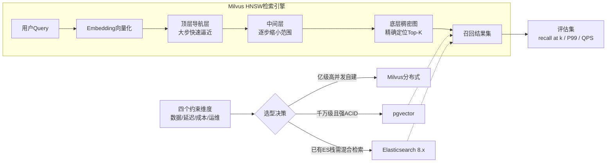

# 【Java 后端架构师】向量数据库在 RAG 中的选型与评估

> 适用场景：JD 核心技术。商品搜索、客服机器人、知识库问答都要用向量检索。架构师面临选型难题：Milvus、pgvector、Elasticsearch、Pinecone 用哪个？答案是"用数据规模、延迟要求、成本预算、团队能力四个约束驱动选型，用标注评测集跑横向对比验证"，不靠"听说好用"。

## 一、概念层：ANN 算法与向量库分类

向量检索的核心是 ANN（Approximate Nearest Neighbor）。精确 KNN 是 O(N)，亿级数据不可行，必须用近似算法。

| 索引算法 | 原理 | 召回率 | 内存 | 构建速度 | 适用场景 |
|---------|------|--------|------|---------|---------|
| **Flat** | 暴力扫描 | 100% | 高 | 快 | 数据少（< 10万）要精确 |
| **HNSW** | 多层导航图 | 95%+ | 很高（图结构） | 慢 | 高召回低延迟，主流选择 |
| **IVF_FLAT** | K-means 聚类 | 90%+ | 中 | 中 | 均衡，大规模 |
| **IVF_PQ** | 聚类 + 乘积量化 | 85% | 极低（压缩 8-32 倍） | 中 | 内存受限超大规模 |
| **DiskANN** | 磁盘索引 | 92% | 低（数据在磁盘） | 慢 | 内存不够但数据大 |

**向量库分类**：

| 向量库 | 部署模式 | 适合规模 | 事务 | 混合检索 | 运维复杂度 |
|--------|---------|---------|------|---------|-----------|
| **Milvus** | 分布式自建 | 亿级 | 无 | 2.4+ 支持 | 高（依赖 etcd/MinIO/Pulsar） |
| **pgvector** | PG 扩展 | 千万级 | ACID | 需配合全文检索 | 低（复用 PG 运维） |
| **Elasticsearch** | 分布式自建 | 千万级 | 近实时 | 原生（dense_vector + BM25） | 中（已有 ES 栈则免费） |
| **Pinecone** | 托管 SaaS | 亿级 | 无 | 支持 | 极低（免运维但贵） |
| **Qdrant** | 单机/分布式 | 千万级 | 无 | 支持 | 中 |

## 二、机制层：HNSW 索引原理与参数

HNSW（Hierarchical Navigable Small World）是当前最主流的 ANN 算法，Milvus/pgvector/Qdrant 默认都支持。

```
Layer 2 (最稀疏):   A ──────────── E
                    │               │
Layer 1 (中等):     A ──── C ──── E ──── G
                    │      │       │      │
Layer 0 (最密):     A─B─C─D─E─F─G─H─I─J  (所有点都在这层)

查询：从顶层 entry point 开始，每层贪心搜索最近邻居，逐层下钻到 Layer 0 取 Top-K
```

**关键参数**：

```python
# Milvus HNSW 索引参数
index_params = {
    "index_type": "HNSW",
    "metric_type": "COSINE",              # 余弦相似度（文本场景常用）
    "params": {
        "M": 16,                          # 每个节点的最大连接数，越大召回越高内存越多
        "efConstruction": 200             # 构建时搜索宽度，越大索引质量越好但慢
    }
}

# 查询参数
search_params = {
    "params": {"ef": 64}                  # 查询时搜索宽度，精度优先调大，速度优先调小
}
```

**参数调优经验**：
- `M=16`：百万级数据，内存充足，默认值
- `M=32`：千万级，召回率优先
- `M=48`：高精度场景（医疗/法律）
- `efConstruction=200`：通用默认
- `ef` 查询时动态调：默认 64，要高召回调到 128-256

## 三、实战层：三大向量库建表对比

### 3.1 pgvector（PostgreSQL 扩展）

```sql
-- 安装扩展
CREATE EXTENSION IF NOT EXISTS vector;

-- 建表（向量字段 + metadata）
CREATE TABLE kb_chunks (
    id BIGSERIAL PRIMARY KEY,
    chunk_id VARCHAR(64) UNIQUE,
    content TEXT,
    embedding vector(1536),              -- 1536 维向量
    tenant_id VARCHAR(32),
    doc_id VARCHAR(64),
    version INT,
    updated_at TIMESTAMP
);

-- HNSW 索引（pgvector 0.5+ 支持）
CREATE INDEX idx_kb_embedding ON kb_chunks
    USING hnsw (embedding vector_cosine_ops)
    WITH (m = 16, ef_construction = 200);

-- 查询：先权限过滤再向量检索（pgvector 的好处是 SQL 灵活）
SELECT chunk_id, content, 1 - (embedding <=> $1::vector) AS score
FROM kb_chunks
WHERE tenant_id = $2                       -- 权限 pre-filter
  AND version = (SELECT MAX(version) FROM kb_chunks WHERE doc_id = kb_chunks.doc_id)
ORDER BY embedding <=> $1::vector           -- 余弦距离
LIMIT 10;

-- 设置查询时 ef（精度优先）
SET hnsw.ef_search = 128;
```

### 3.2 Milvus（分布式）

```python
# Milvus 2.x 建表（Python SDK 示例，Java SDK 同构）
from pymilvus import CollectionSchema, FieldSchema, DataType, Collection, utility

fields = [
    FieldSchema("chunk_id", DataType.VARCHAR, is_primary=True, max_length=64),
    FieldSchema("embedding", DataType.FLOAT_VECTOR, dim=1536),
    FieldSchema("tenant_id", DataType.VARCHAR, max_length=32),
    FieldSchema("doc_id", DataType.VARCHAR, max_length=64),
    FieldSchema("version", DataType.INT64),
]
schema = CollectionSchema(fields, enable_dynamic_field=True)
collection = Collection("kb_chunks", schema)

# HNSW 索引
collection.create_index("embedding", {
    "index_type": "HNSW",
    "metric_type": "COSINE",
    "params": {"M": 16, "efConstruction": 200}
})
# 标量字段索引（加速 filter）
collection.create_index("tenant_id")

# 加载到内存（查询前必须 load）
collection.load()

# 查询（带权限 filter）
results = collection.search(
    data=[query_vec],
    anns_field="embedding",
    param={"metric_type": "COSINE", "params": {"ef": 64}},
    limit=10,
    expr="tenant_id == 'jd'",              # 标量过滤
    output_fields=["chunk_id", "content"]
)
```

### 3.3 Elasticsearch 8.x（dense_vector）

```json
// 建索引 mapping
PUT kb_chunks {
  "mappings": {
    "properties": {
      "content": {"type": "text"},
      "embedding": {
        "type": "dense_vector",
        "dims": 1536,
        "index": true,
        "similarity": "cosine",
        "index_options": {"type": "hnsw", "m": 16, "ef_construction": 200}
      },
      "tenant_id": {"type": "keyword"}
    }
  }
}

// 混合检索：KNN 向量 + BM25 关键词（ES 原生优势）
POST kb_chunks/_search {
  "query": {
    "bool": {
      "must": [
        {"knn": {"query_vector": [...], "field": "embedding", "num_candidates": 100, "k": 10}},
        {"match": {"content": "退货政策"}}
      ],
      "filter": [{"term": {"tenant_id": "jd"}}]
    }
  }
}
```

## 四、实战层：选型评估方法论

### 4.1 评测集构建

```java
// 评测集：query + 相关文档标注（人工或 LLM 辅助生成）
public class EvalDataset {
    record EvalQuery(String queryId, String queryText, List<String> relevantDocIds) {}
    // 至少 100-1000 条，覆盖不同意图（事实型/推理型/多义型）
}

// 评估器：横向跑多向量库
@Service
public class VectorStoreBenchmark {

    private final List<VectorStore> candidates;  // [milvusStore, pgStore, esStore]

    public BenchmarkReport run(EvalDataset dataset) {
        BenchmarkReport report = new BenchmarkReport();
        for (VectorStore store : candidates) {
            // 1. 灌入相同数据
            store.bulkIndex(dataset.getAllChunks());

            // 2. 跑每条 query
            List<EvalQuery> queries = dataset.getQueries();
            int hits = 0;
            List<Long> latencies = new ArrayList<>();
            for (EvalQuery q : queries) {
                long start = System.nanoTime();
                List<Chunk> results = store.search(q.getQueryEmbedding(), 10);
                latencies.add((System.nanoTime() - start) / 1_000_000);

                // recall@10：Top-10 是否包含标注的相关文档
                Set<String> resultIds = results.stream().map(Chunk::getDocId).collect(toSet());
                if (q.getRelevantDocIds().stream().anyMatch(resultIds::contains)) {
                    hits++;
                }
            }
            report.add(store.getName(), BenchmarkMetric.builder()
                .recallAt10((double) hits / queries.size())
                .p99Latency(percentile(latencies, 99))
                .qps(queries.size() * 1000.0 / latencies.stream().mapToLong(Long::longValue).sum())
                .memoryUsage(store.getMemoryBytes())
                .build());
        }
        return report;
    }
}
```

### 4.2 选型决策矩阵

```java
// 根据约束自动推荐
public VectorStoreRecommender recommend(Requirements req) {
    if (req.getVectorCount() < 5_000_000 && req.isNeedTransaction()) {
        return pgvector();         // 千万以内 + 要 ACID
    }
    if (req.getVectorCount() > 100_000_000) {
        return milvus();           // 亿级必须分布式
    }
    if (req.isAlreadyUsingElasticsearch() && req.isNeedHybridSearch()) {
        return elasticsearch();    // 已有 ES 栈 + 混合检索
    }
    if (req.getOpsCapability() == LOW) {
        return pinecone();         // 不想运维选托管
    }
    return milvus();               // 默认大规模自建
}
```

**典型选型结论**（JD 场景）：

| 场景 | 数据规模 | 选型 | 理由 |
|------|---------|------|------|
| 客服知识库 | 千万级 chunk | pgvector | 复用现有 PG，ACID 保证，运维简单 |
| 商品语义搜索 | 亿级 SKU | Milvus | 分布式分片，HNSW 高召回，Java SDK 成熟 |
| 商品关键词+语义 | 千万级 | ES 8.x | 原生混合检索，复用搜索团队 ES 栈 |
| 快速 PoC | < 百万 | Pinecone | 免运维，快速验证 |

## 五、底层本质：为什么 HNSW 是主流

HNSW 的核心创新是"多层跳表式结构"——把向量组织成多层图，顶层稀疏（长距离连接，快速跨域），底层稠密（短距离连接，精确定位）。查询时像走楼梯，从顶层大步逼近目标区域，逐层精细到 Layer 0 取 Top-K。

相比 IVF（聚类）：
- **优势**：召回率更高（HNSW 95%+ vs IVF 90%），查询延迟更稳定
- **劣势**：内存占用大（要存图结构，约 1.5-2 倍向量大小），构建慢

相比 DiskANN：
- **优势**：全内存查询，延迟低（< 10ms）
- **劣势**：亿级数据内存吃紧（1 亿 × 1536 × 4 字节 = 600GB）

所以工程实践：千万级以内 HNSW（内存够），亿级用 IVF_PQ 或 DiskANN（省内存），超大规模分布式分片（Milvus）。

## 六、AI 工程化深挖

1. **RAG 场景向量库选型和 Embedding 模型怎么协同？**
   Embedding 模型决定维度（1536/768/384），维度影响向量库内存和检索速度。选型要一起评估：用 bge-large-zh（1024 维）+ Milvus HNSW，recall@10 95%，但内存是 bge-small（384 维）的 2.7 倍。按"recall 是否达标 + 成本是否可接受"反推维度。

2. **向量库的 index_freshness 怎么保证？**
   增量插入用 Milvus 的 upsert（软删除 + 插入），延迟秒级。大批量重建用"双 collection 切换"——新 collection 后台重建，建好后 atomic alias 切换，用户无感知。监控 index_freshness_seconds（文档更新到可检索延迟），超阈值告警。

3. **多租户向量库怎么隔离？**
   三级：(1) Collection 级（大租户独立 collection，物理隔离最强）；(2) Partition 级（Milvus partition，查询指定 partition）；(3) Metadata filter（tenant_id 过滤，最轻量）。JD 多商家场景用 partition + filter 双保险。

4. **向量库怎么和 LLM 网关协同做降级？**
   向量库 P99 超阈值（如 > 100ms）时降级：先降 ef（精度换速度），再降 Top-K（少召回），极端返回缓存结果或拒答。监控 recall@k 不能低于 0.8，否则降级反而让 RAG 失效。

5. **怎么做向量库的成本治理？**
   三个抓手：(1) 维度压缩（1536→768，用 Matryoshka embedding 或降维模型）；(2) 量化（HNSW + PQ，内存省 8 倍）；(3) 冷热分离（热数据内存 HNSW，冷数据磁盘 DiskANN）。监控 cost_per_query = 内存成本 / QPS。

## 七、记忆口诀与面试现场表达

### 1 分钟记忆口诀

抓 **"算法、规模、混合、评测"** 四个词。

- **算法**：HNSW（图、高召回高内存）、IVF（聚类、均衡）、PQ（量化、省内存）
- **规模**：千万以内 pgvector，亿级 Milvus，已有 ES 栈用 ES 8.x
- **混合**：向量（语义）+ BM25（关键词），ES 原生支持最优
- **评测**：recall@k、qps、p99_latency，标注集横向对比

### 面试现场 60 秒回答

> 向量库选型我用四约束驱动：数据规模、延迟要求、成本预算、运维能力。算法层 HNSW 是主流（多层导航图，召回 95%+ 延迟 < 10ms），M=16/efConstruction=200 是默认参数，查询 ef 动态调。选型结论：千万级以内且要 ACID 选 pgvector（复用 PG，SQL 灵活），亿级自建选 Milvus（分布式分片，Java SDK 成熟），已有 ES 栈且要混合检索选 ES 8.x dense_vector。评估方法建 100-1000 条标注评测集，跑 recall@10、qps、p99_latency、memory 横向对比，差 5% 以内优先选运维简单的。最容易翻车的是"听说好用就选"——不跑评测集，上线发现召回率 70% 或内存爆了。

## 常见考点

1. **HNSW 为什么比 IVF 召回率高？**——HNSW 是图结构，查询时从顶层逐层下钻，能跨区域快速逼近，且 ef 参数动态控制搜索宽度。IVF 依赖聚类质量，簇边界附近的向量可能漏召回。
2. **Milvus 和 pgvector 怎么选？**——千万级以内 + 要事务选 pgvector，亿级 + 高并发选 Milvus。关键看数据是否会超单机内存。
3. **向量维度影响什么？**——维度越高（1536）精度越好但内存和计算成本翻倍。要按 recall@k 评测是否值得成本，384 维 vs 1536 维 recall 差 3-5%，但成本差 4 倍。
4. **什么是混合检索？**——向量（语义相似）+ BM25（关键词匹配）并行检索，RRF 融合。比单路召回率高 15-30%。ES 8.x 原生支持，Milvus 2.4+ 支持，pgvector 要配合全文检索插件。

## 结构化回答

**30 秒电梯演讲：** 向量库选型的本质是在数据规模、延迟、成本、运维能力四个约束下做取舍。Milvus（分布式、亿级、HNSW/IVF）适合大规模自建；pgvector（PG 扩展、ACID、< 千万级）适合中小规模且已有 PG；Elasticsearch（8.x dense_vector）适合已有 ES 栈且要混合检索。评估的核心是用标注评测集跑召回率/延迟/成本三指标横向对比，不靠听说好用

**展开框架：**
1. **三大索引算法** — HNSW（图、高召回高内存）、IVF_FLAT（聚类、均衡）、IVF_PQ（乘积量化、省内存低召回）
2. **选型四要素** — 数据规模（千万 vs 亿级）、延迟要求（ms vs s）、成本（内存 vs 磁盘）、运维能力（自建 vs 托管）
3. **评测三指标** — recall@k（召回率）、qps（吞吐）、p99_latency（延迟）

**收尾：** 以上是我的整体思路。您想继续深入聊——HNSW 的 M 和 efConstruction 怎么调？

## 流程图



## 视频脚本

> 预计时长：1 分 30 秒 | 由浅入深

| 时间 | 画面/字幕 | 口播台词 | 讲解要点 |
|------|----------|----------|----------|
| 0:00 | 标题卡：向量数据库在 RAG 中的选型与评估 | "这题一句话：向量库选型的本质是在数据规模、延迟、成本、运维能力四个约束下做取舍。" | 开场钩子 |
| 0:15 | 三大索引算法示意/对比图 | "HNSW（图、高召回高内存）、IVF_FLAT（聚类、均衡）、IVF_PQ（乘积量化、省内存低召回）" | 三大索引算法要点 |
| 0:40 | 选型四要素示意/对比图 | "数据规模（千万 vs 亿级）、延迟要求（ms vs s）、成本（内存 vs 磁盘）、运维能力（自建 vs 托管）" | 选型四要素要点 |
| 1:25 | 总结卡 | "记住：三索引。下期见。" | 收尾 |

## 苏格拉底式面试追问

这组追问训练你在面试现场一层层逼近本质。每一问先回答"为什么"，再回答"怎么做"，最后回答"如何证明"。

| 追问层级 | 面试官可能这样问 | 高分回答方向 |
|----------|------------------|--------------|
| 目标追问 | 你怎么判断一个业务"必须上向量库"而不是用 ES BM25？ | 用 query 日志统计"无结果率"和"语义相关但关键词不匹配"的占比，超过 15% 才值得引入向量检索。商品标题关键词明确的（如"iPhone 15"）BM25 够用，长尾自然语言 query（"适合送女朋友的口红"）才需要语义 |
| 证据追问 | 你怎么证明现在的向量库召回率真的够用？ | 建 500-1000 条标注评测集（query + 相关 chunk），跑 recall@10、MRR、permission_filter_miss（权限过滤后误删的比例），横向对比 pgvector/Milvus/ES。差 5% 以内优先选运维简单的 |
| 边界追问 | HNSW 万能吗？什么场景你不会选 HNSW？ | 亿级数据内存吃紧时不选 HNSW（图结构占 1.5-2 倍向量内存）。换 IVF_PQ（量化压缩 8 倍）或 DiskANN（磁盘索引）。冷数据归档也不用 HNSW（浪费内存） |
| 反例追问 | 给个向量库选错的真实反例？ | 早期图省事直接上 Milvus 自建，结果只有 50 万 chunk 还要运维 etcd/MinIO/Pulsar，运维成本是业务价值的 3 倍。后来迁回 pgvector，recall@10 差距 < 3%，运维降 80% |
| 风险追问 | 上线后最可能踩的坑是什么？ | 主动点出：多租户 partition filter 配错导致 A 租户搜到 B 租户数据（permission_filter_miss 飙升）；或 index_freshness_seconds 暴涨（双 collection 切换失败）；或 HNSW 内存爆 OOMKilled |
| 验证追问 | 你怎么证明选型上线后真的没出问题？ | 上线后监控 recall@10（在线用点击日志反推）、permission_filter_miss（应 < 0.01%）、index_freshness_seconds（应 < 60s）、p99_latency（应 < 50ms），连续观察 1 周覆盖流量峰谷 |
| 沉淀追问 | 团队多业务线都要用向量库，你怎么避免重复造轮子？ | 沉淀向量库接入 SDK（统一 init/search/upsert 接口）+ 评测集模板（每业务自填 query 标注）+ 成本看板（按 collection 拆 memory/qps/cost）+ HNSW 默认参数模板（M=16/efConstruction=200） |

### 现场对话示例

**面试官**：你说选 pgvector，但万一未来数据涨到亿级怎么办？现在不一步到位上 Milvus 会不会推倒重来？

**候选人**：我会先看业务增速预测。如果 12 个月内数据到不了 5000 万，pgvector HNSW 单机扛得住（实测千万级 p99 < 20ms）。超过再迁 Milvus。关键是 SDK 接口抽象——业务代码调 `vectorStore.search()`，底层切换不影响业务。迁移成本主要在建索引（亿级重建几小时），双 collection 并行跑 1 周对比 recall 再切。

**面试官**：迁移期间数据双写还是单写？

**候选人**：双写。CDC 监听 pgvector 的 binlog（或业务层双写），新数据同时写 pgvector 和 Milvus。读只走 pgvector。等 Milvus 数据追齐（对比 count 一致），灰度 5% 流量读 Milvus 对比 recall@10，达标后逐步切量到 100%，最后下线 pgvector。

**面试官**：HNSW 的 ef 参数你怎么定？业务说"准确率要 99%"，你怎么翻译成工程参数？

**候选人**：99% 是业务指标不是工程参数。我会建评测集，ef 从 64 起步逐步调大（128/256/512），跑 recall@10 曲线。发现 ef=200 时 recall@10 达到 96%，ef=512 才到 98%——边际收益递减。回去和业务对齐：96% 召回 + 上层 rerank 能不能接受？通常 recall 96% 配合业务兜底就够了，不一定非要 99%。

## 核心知识点图


