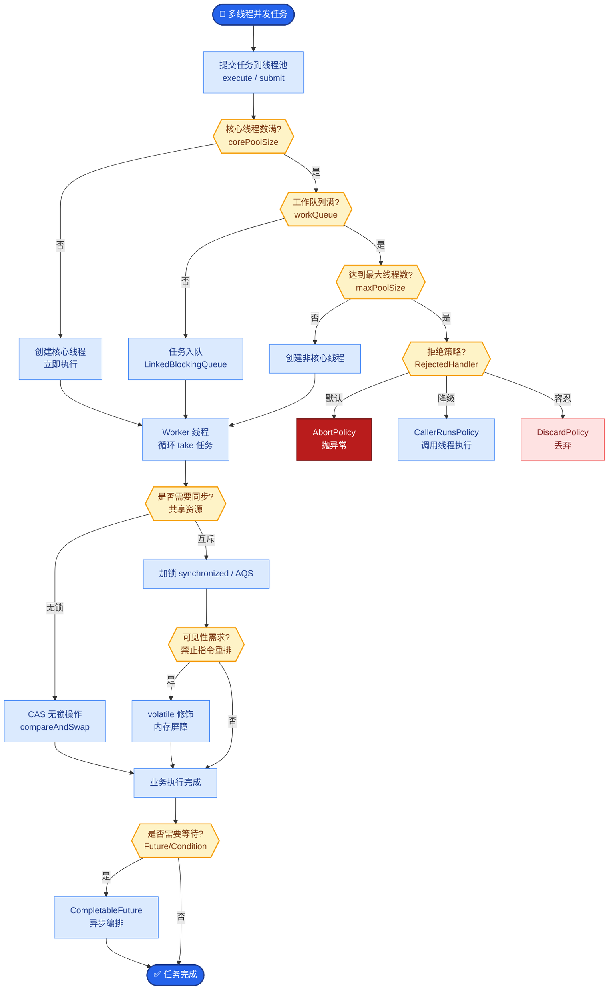

# 【Java 后端架构师】履约系统拆单、合单与路由策略

> 适用场景：JD 核心技术。用户下单买了 5 件商品——2 本图书（北京仓）、1 箱牛奶（冷链仓，上海）、1 台手机（第三方卖家）、1 件衣服（广州仓）。这 5 件必须拆成 4 个包裹分别发货，路由到最优仓库。架构师要设计的是一套"三维拆单 + 智能路由 + 合单优化"的履约引擎。

## 一、概念层：拆单三维模型

```
原始订单（5 件商品）
    │
    ├─ 维度1：商家拆单
    │   ├─ JD 自营（4 件：书2 + 牛奶1 + 衣服1）
    │   └─ 第三方卖家（1 件：手机）
    │
    ├─ 维度2：仓库拆单（JD 自营内部）
    │   ├─ 北京仓（书 2）
    │   ├─ 上海冷链仓（牛奶 1）
    │   └─ 广州仓（衣服 1）
    │
    └─ 维度3：属性拆单（同一仓库内）
        └─ 冷链 vs 常温不能混装（即使同仓也要拆）

最终拆成 4 个履约子单：
  子单1：书 × 2（北京仓发，常温）
  子单2：牛奶 × 1（上海冷链仓发，冷链）
  子单3：衣服 × 1（广州仓发，常温）
  子单4：手机 × 1（第三方卖家自发）
```

## 二、机制层：拆单算法

```java
@Service
@Slf4j
public class OrderSplitService {

    private final WarehouseClient warehouseClient;
    private final SkuAttributeService skuAttrService;

    /**
     * 三维拆单：商家 → 仓库 → 物流属性
     */
    public List<FulfillmentOrder> split(TradeOrder tradeOrder) {
        List<OrderItem> items = tradeOrder.getItems();

        // 第一维：按商家拆
        Map<String, List<OrderItem>> bySeller = items.stream()
            .collect(groupingBy(OrderItem::getSellerId));

        List<FulfillmentOrder> fulfillmentOrders = new ArrayList<>();

        for (Map.Entry<String, List<OrderItem>> sellerEntry : bySeller.entrySet()) {
            String sellerId = sellerEntry.getKey();
            List<OrderItem> sellerItems = sellerEntry.getValue();

            // 第二维：按仓库拆（查每个商品的覆盖仓库）
            Map<String, List<OrderItem>> byWarehouse = splitByWarehouse(
                sellerItems, tradeOrder.getShipTo());

            for (Map.Entry<String, List<OrderItem>> whEntry : byWarehouse.entrySet()) {
                String warehouseId = whEntry.getKey();
                List<OrderItem> whItems = whEntry.getValue();

                // 第三维：按物流属性拆（冷链/常温/大件不能混装）
                Map<LogisticsType, List<OrderItem>> byLogistics = whItems.stream()
                    .collect(groupingBy(i -> skuAttrService.getLogisticsType(i.getSkuId())));

                for (Map.Entry<LogisticsType, List<OrderItem>> logEntry : byLogistics.entrySet()) {
                    FulfillmentOrder fulfillment = buildFulfillmentOrder(
                        tradeOrder, sellerId, warehouseId,
                        logEntry.getKey(), logEntry.getValue());
                    fulfillmentOrders.add(fulfillment);
                }
            }
        }

        log.info("订单 {} 拆成 {} 个子单", tradeOrder.getId(), fulfillmentOrders.size());
        return fulfillmentOrders;
    }

    /**
     * 按仓库拆分：查每个商品的可用仓库，按仓库分组
     */
    private Map<String, List<OrderItem>> splitByWarehouse(
            List<OrderItem> items, Address shipTo) {
        Map<String, List<OrderItem>> result = new HashMap<>();

        for (OrderItem item : items) {
            // 查商品在哪些仓库有库存且覆盖收货地
            List<Warehouse> candidates = warehouseClient.findAvailableWarehouses(
                item.getSkuId(), item.getQuantity(), shipTo.getRegionCode());

            if (candidates.isEmpty()) {
                // 无仓库可发，标记缺货
                item.setStatus(OUT_OF_STOCK);
                continue;
            }

            // 选最优仓库（路由策略）
            Warehouse best = router.select(candidates, shipTo, item);
            result.computeIfAbsent(best.getId(), k -> new ArrayList<>()).add(item);
        }
        return result;
    }
}
```

## 三、机制层：仓库路由策略

```java
@Service
public class WarehouseRouter {

    private final DistanceService distanceService;
    private final LogisticsCostService costService;

    /**
     * 多目标路由：距离 + 时效 + 成本 + 库存健康度
     */
    public Warehouse select(List<Warehouse> candidates, Address shipTo, OrderItem item) {
        return candidates.stream()
            .map(w -> scoreWarehouse(w, shipTo, item))
            .max(Comparator.comparing(WarehouseScore::getTotalScore))
            .map(WarehouseScore::getWarehouse)
            .orElseThrow(() -> new NoWarehouseException("无可用仓库"));
    }

    private WarehouseScore scoreWarehouse(Warehouse w, Address shipTo, OrderItem item) {
        // 1. 距离分（越近越高，影响时效和成本）
        int distance = distanceService.calcDistance(w.getRegionCode(), shipTo.getRegionCode());
        double distanceScore = 1.0 / (1 + distance / 100.0);   // 100km 内高分

        // 2. 时效分（承诺到达时间）
        int estimatedDays = w.estimateDeliveryDays(distance);
        double timeScore = estimatedDays <= 1 ? 1.0 : (estimatedDays <= 3 ? 0.7 : 0.4);

        // 3. 成本分（运费）
        BigDecimal cost = costService.calcCost(w, shipTo, item);
        double costScore = cost.compareTo(BigDecimal.valueOf(10)) < 0 ? 1.0 : 0.5;

        // 4. 库存健康分（库存充裕的仓优先，避免拆单后缺货）
        int stock = w.getStock(item.getSkuId());
        double stockScore = stock > item.getQuantity() * 3 ? 1.0 : 0.6;

        // 加权总分（可配置权重）
        double total = 0.3 * distanceScore + 0.3 * timeScore
                     + 0.2 * costScore + 0.2 * stockScore;

        return new WarehouseScore(w, total, distanceScore, timeScore, costScore, stockScore);
    }
}
```

## 四、机制层：合单优化

```java
@Service
public class OrderMergeService {

    /**
     * 合单：同收货人 + 同仓库 + 同时段的多订单合并发货
     * 省运费，但增加单包裹丢失风险
     */
    @Scheduled(fixedDelay = 60_000)
    public void tryMerge() {
        // 查最近 30 分钟内待发货的子单
        List<FulfillmentOrder> pending = fulfillmentRepo.findPendingWithin(
            Duration.ofMinutes(30));

        // 按 (收货地址 + 仓库 + 物流类型) 分组
        Map<String, List<FulfillmentOrder>> groups = pending.stream()
            .collect(groupingBy(this::mergeKey));

        for (List<FulfillmentOrder> group : groups.values()) {
            if (group.size() > 1 && canMerge(group)) {
                // 合并发一个包裹
                FulfillmentOrder merged = mergeOrders(group);
                fulfillmentRepo.save(merged);
                metrics.counter("order.merged").increment();
            }
        }
    }

    private String mergeKey(FulfillmentOrder o) {
        return o.getShipTo().getHash() + "|" + o.getWarehouseId()
             + "|" + o.getLogisticsType();
    }

    private boolean canMerge(List<FulfillmentOrder> group) {
        // 合单约束：不能超重、不能超体积、不能跨商家
        double totalWeight = group.stream().mapToDouble(FulfillmentOrder::getWeight).sum();
        if (totalWeight > MAX_PACKAGE_WEIGHT) return false;

        long sellerCount = group.stream()
            .map(FulfillmentOrder::getSellerId).distinct().count();
        if (sellerCount > 1) return false;       // 不能跨商家

        return true;
    }
}
```

## 五、机制层：子单状态机

```java
public enum FulfillmentStatus {
    CREATED,          // 子单创建
    ALLOCATED,        // 已分配仓库
    PICKING,          // 拣货中
    PACKED,           // 已打包
    SHIPPED,          // 已发货
    IN_TRANSIT,       // 配送中
    DELIVERED,        // 已签收
    RETURNING,        // 退货中
    RETURNED,         // 已退货
    CANCELLED         // 已取消（缺货等）
}

// 子单状态机和订单状态机解耦
// 订单状态：待支付 → 已支付 → 部分发货 → 全部发货 → 已完成
// 子单状态：独立流转，多个子单状态汇总成订单状态
// 部分发货 = 至少一个子单 SHIPPED 但不是全部
```

## 六、底层本质：拆单是"约束满足问题"

一个订单的商品受三类硬约束：
1. **商家约束**：不同商家的商品物理上不在同一仓库，财务上独立结算
2. **仓库约束**：商品分布在多仓，一个仓发不了全部
3. **物流约束**：冷链/常温/大件/危险品包装和运输要求不同

拆单算法本质是"按约束分组"——把受相同约束（同商家+同仓库+同物流类型）的商品归到一组，每组一个子单。约束的优先级是商家 > 仓库 > 物流（先按最强的约束分，再在子集内细分）。

**路由的本质是"多目标优化"**：在满足硬约束（有库存+覆盖收货地）的候选仓库中，按多目标（距离/时效/成本/库存健康）加权打分选最优。权重可按业务策略调整（促销期时效优先，平时成本优先）。

**拆单 vs 合单的对立统一**：拆单是"化整为零"（让每个约束可独立满足），合单是"化零为整"（省运费）。先拆（满足约束）再合（在约束已满足的前提下优化成本）。合单只在"同约束子集"内合（同仓同物流同收货人），不跨约束。

## 七、AI 工程化深挖

1. **用 AI 优化仓库路由怎么做？**
   传统路由是规则打分。AI 增强：用历史履约数据训练模型，预测每个"仓库-收货地-商品"组合的时效和成本，比规则更准。强化学习可动态调权重（根据当前各仓负载和库存优化分配）。但模型决策要可解释（为什么选了 A 仓不选 B 仓），便于运营复盘。

2. **AI 预测拆单后缺货风险怎么做？**
   拆单时预测每个子单的缺货概率（基于仓库当前库存 + 在途订单 + 历史销量趋势）。高缺货风险的子单提前标记"预警"，运营介入调拨库存或改路由。监控 stockout_prediction_accuracy。

3. **LLM 辅助履约异常处理怎么做？**
   履约异常（爆仓/物流延迟/仓库停摆）时，LLM 分析异常影响面（影响多少子单）+ 推荐应对策略（改路由/延迟发货/分批发）。但执行由确定性代码做（改路由走标准 Router），LLM 只做建议。

4. **怎么做履约全链路 trace？**
   每个 子单生成 traceId，贯穿：拆单 → 仓库分配 → 拣货 → 打包 → 发货 → 配送 → 签收。每个环节有 span（耗时 + 结果）。用户问"我的包裹到哪了"时，查 trace 可视化展示全链路。

5. **拆单效果怎么评估？**
   核心指标：avg_split_count（平均拆单数，越少越好，说明商品布局合理）、fulfillment_cost_rate（履约成本/订单金额）、delivery_promise_achievement（时效达成率）、stockout_suborder_rate（缺货子单率）。拆单数过多要优化仓库布局（商品前置到更多区域仓）。

## 八、记忆口诀与面试现场表达

### 1 分钟记忆口诀

抓 **"三维拆、路由选、合单省、子单独立"** 四个词。

- **三维拆**：商家（seller_id）→ 仓库（覆盖收货地）→ 物流属性（冷链/常温/大件）
- **路由选**：候选仓多目标打分（距离 0.3 + 时效 0.3 + 成本 0.2 + 库存 0.2）
- **合单省**：同人 + 同仓 + 同时段合发，省运费
- **子单独立**：独立履约/独立售后，1 个子单缺货不阻塞其他

### 面试现场 60 秒回答

> 拆单我按三维模型——商家维度（不同 seller_id 的商品不能混发，财务独立结算）、仓库维度（查每个商品的有货仓库，按仓库分组）、物流属性维度（冷链/常温/大件/危险品不能混装）。拆单时机是下单时预拆（展示"将分 N 个包裹"），支付后正式生成履约子单。路由策略：查候选仓库（有库存 + 覆盖收货地），按多目标加权打分选最优——距离分 0.3（越近越高）+ 时效分 0.3（承诺到达天数）+ 成本分 0.2（运费）+ 库存健康分 0.2（库存充裕优先），权重可按业务调（促销期时效优先）。合单优化：同收货人 + 同仓 + 同时段（30 分钟内）的子单合并发货省运费，但不能跨商家、不能超重超体积。子单独立履约——独立拣货/打包/发货/配送/签收，独立售后（可只退其中一个包裹），1 个子单缺货不阻塞其他子单。原订单是交易单（支付依据），子单是履约单（发货依据），1:N 关系。监控 avg_split_count（平均拆单数）、delivery_promise_achievement（时效达成率）。

## 常见考点

1. **拆单在什么时候做？**——下单时预拆（展示拆单信息让用户知情），支付后正式拆生成子单。未支付不实际拆（省资源，可能取消）。
2. **合单和拆单矛盾吗？**——不矛盾。先拆（满足约束），再在"同约束子集"内合（同仓同物流同收货人）。合单是拆单后的成本优化，不跨约束。
3. **路由怎么处理仓库缺货？**——候选仓库只含有库存的。如果所有仓库都缺货，子单标记 OUT_OF_STOCK，不阻塞其他子单。可触发调拨（从他仓调货）或延迟发货。
4. **子单状态和订单状态怎么联动？**——子单独立流转（CREATED → SHIPPED → DELIVERED），订单状态汇总（全部子单 DELIVERED 才订单 COMPLETED；部分 SHIPPED 是 PARTIALLY_SHIPPED）。

## 核心流程图



## 结构化回答

**30 秒电梯演讲：** 履约系统拆单的本质是按商品属性和仓库能力把一个订单拆成多个履约子单——不同商家的商品分到不同子单（商家维度拆），同一订单里大件家电和图书在不同仓库的分到不同子单（仓库维度拆），冷链和常温必须分开（属性维度拆）。路由策略决定每个子单从哪个仓发货（就近/有货/成本最低）

**展开框架：**
1. **三维拆单** — 商家维度（不同 seller）、仓库维度（不同仓库）、属性维度（冷链/大件/危险品）
2. **路由策略** — 就近原则（距离最近的有货仓）、成本最优（运费最低）、时效优先（最快到达）
3. **拆单时机** — 下单后立即拆（同步）或支付后拆（异步，未支付不拆省资源）

**收尾：** 以上是我的整体思路。您想继续深入聊——拆单在什么时候做？


## 视频脚本

> 预计时长：2 分钟 | 由浅入深

| 时间 | 画面/字幕 | 口播台词 | 讲解要点 |
|------|----------|----------|----------|
| 0:00 | 标题卡：履约系统拆单、合单与路由策略 | "这题核心是——履约系统拆单的本质是按商品属性和仓库能力把一个订单拆成多个履约子单——不同商家的商品分到不同子单……" | 开场钩子 |
| 0:15 | 僐购平台收到你一个订单——有书（北京仓）、有生鲜类比图 | "打个比方：僐购平台收到你一个订单——有书（北京仓）、有生鲜。" | 核心类比 |
| 0:40 | 三维拆单示意/对比图 | "商家维度（不同 seller）、仓库维度（不同仓库）、属性维度（冷链/大件/危险品）" | 三维拆单要点 |
| 1:05 | 路由策略示意/对比图 | "就近原则（距离最近的有货仓）、成本最优（运费最低）、时效优先（最快到达）" | 路由策略要点 |
| 1:55 | 总结卡 | "记住：三维拆单。下期见。" | 收尾 |

## 苏格拉底式面试追问

这组追问训练你在面试现场一层层逼近本质。每一问先回答"为什么"，再回答"怎么做"，最后回答"如何证明"。

| 追问层级 | 面试官可能这样问 | 高分回答方向 |
|----------|------------------|--------------|
| 目标追问 | 拆单为什么必须三维（商家+仓库+属性）？合并成一单发不行吗？ | 硬约束：不同商家物理不在同仓（混发不了）、财务独立结算（不能混账）、冷链常温包装不同（混装违规）。判断依据：把"能不能混发"抽象成约束满足问题，三维是覆盖所有硬约束的最小集。少一维都可能违规 |
| 证据追问 | 你怎么证明拆单算法真的拆对了？ | 监控 split_violation_count（拆单违规数——如冷链和常温混装的子单，应 = 0）、avg_split_count（平均拆单数，反映仓库布局合理性）、delivery_promise_achievement（时效达成率）。traceId 贯穿拆单-路由-发货，能回溯每个子单的拆单理由 |
| 边界追问 | 合单和拆单矛盾吗？先拆后合会不会拆了白拆？ | 不矛盾。拆单是满足硬约束（不同商家/仓库/物流），合单是在"同约束子集"内优化成本（同仓同收货人同物流类型的子单合发一个包裹省运费）。合单不跨约束——已经按约束拆开的子单合的时候还是同仓同物流，不违反硬约束 |
| 反例追问 | 给一个拆单拆错的真实反例？ | 冷链商品和常温商品在同仓（区域仓同时存两类），拆单算法只看仓库维度没看物流属性，把它们合成一子单。结果冷链车发了常温商品（运费浪费）或常温车发了冷链商品（生鲜坏了）。根因：拆单顺序错了——应该先按物流属性拆再按仓库。修复：三维顺序固化（商家→属性→仓库）|
| 风险追问 | 路由策略选了"成本最低"的仓，但那个仓库存只够这一单，下一个订单就没货了。贪婪路由会饿死后续订单怎么办？ | 路由不能纯贪婪。打分要加 stock_health（库存充裕度）——库存接近阈值的仓降分。或全局视角——批量订单路由时用二分图匹配（订单-仓库最优分配），而非单订单贪婪。监控 stockout_after_route（路由后缺货率）|
| 验证追问 | 路由策略改了（从就近改成成本优先），怎么验证没出问题？ | A/B 测试——5% 订单用新策略，对比 delivery_promise_achievement（时效）、fulfillment_cost_rate（履约成本）、stockout_suborder_rate（缺货）。每档跑 7 天覆盖周期。任一指标退化超阈值回滚。监控 route_strategy_diff（新旧策略选仓不同的比例）|
| 沉淀追问 | 多业务线（自营/第三方/跨境）都要履约，你怎么避免每业务重写拆单？ | 沉淀通用 FulfillmentEngine——拆单三维模型（商家/仓库/物流属性）+ 路由策略可插拔（业务声明权重）+ 子单状态机通用。业务只注册"商品→仓库覆盖""商品→物流类型"的查询接口。监控按业务拆 avg_split_count 和 delivery_promise_achievement |

### 现场对话示例

**面试官**：你说三维拆单顺序是商家→属性→仓库，但用户下单时还没确定收货地（拼团场景），仓库维度怎么拆？

**候选人**：这是预拆单的边界。拼团未成团时只按商家+属性预拆（展示"将分 N 个包裹"），仓库路由等收货地确定后再算。成团后正式拆单走完整三维。监控 predelivery_to_final_diff（预拆和正式拆的子单数差异，应小）。如果差异大说明预拆信息不准，要优化预拆逻辑（如默认按用户默认收货地预拆）。

**面试官**：子单维度独立履约，1 个子单缺货不阻塞其他。但用户买的是"套装"（手机+手机壳配套卖），手机壳缺货手机单独发，用户拿到手机没壳不能用怎么办？

**候选人**：套装是特殊约束——套装商品必须同子单（绑定关系），不能拆。拆单算法在三维之外加第四维"套装绑定"（套装内的商品强制同子单）。套装中任一商品缺货则整个套装子单标记延迟发货或取消（不能部分发）。监控套装拆分错误（split_suit_violation，应 = 0）。这是业务约束凌驾通用拆单逻辑。

**面试官**：路由算法多目标打分，权重（距离 0.3 + 时效 0.3 + 成本 0.2 + 库存 0.2）怎么调？

**候选人**：权重不能拍脑袋，要按业务策略和 A/B 调。大促前时效优先（权重调成 0.5），平时成本优先（成本 0.4）。A/B 验证——不同权重组合跑 1 周对比 delivery_promise_achievement 和 fulfillment_cost_rate，选 Pareto 最优。权重要可配置（配置中心动态调）不发版。监控 route_strategy_change_frequency（频繁调权说明策略不稳）。


