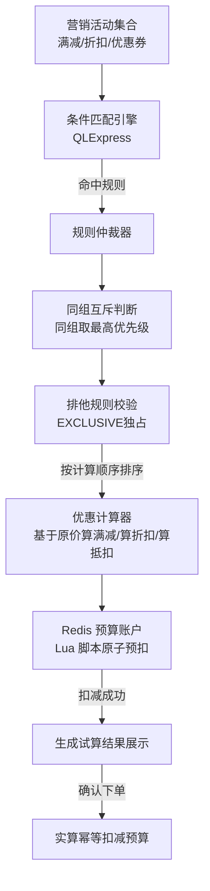

# 【Java 后端架构师】营销活动系统的规则冲突与预算控制

> 适用场景：JD 核心技术。双 11 大促同时有满减（满 200 减 30）、优惠券（满 300 减 50）、会员折扣（9 折）、店铺红包（10 元）。用户下了 350 元的单，能叠加几个？按什么顺序算？活动预算超了怎么办？架构师要设计的是一套"规则仲裁 + 预算原子控制"的营销引擎。

## 一、概念层：规则关系模型

| 关系 | 含义 | 示例 |
|------|------|------|
| **叠加** | 多规则同时生效 | 满减 + 会员折扣 |
| **互斥** | 同组只生效一个 | 两张满减券只能用一张 |
| **排他** | 生效后其他全不生效 | 某特价活动独占，其他优惠失效 |
| **依赖** | A 生效才能用 B | 满减后才能用券 |

```
规则仲裁示例（用户下单 350 元）：
  规则A: 满 200 减 30    priority=10, group=FULL_REDUCTION, 叠加
  规则B: 满 300 减 50    priority=20, group=FULL_REDUCTION, 互斥（与A）
  规则C: 会员 9 折       priority=15, group=DISCOUNT, 叠加
  规则D: 红包 10 元      priority=5,  group=COUPON, 叠加

仲裁过程：
  1. 按 group 分组：FULL_REDUCTION{A,B}, DISCOUNT{C}, COUPON{D}
  2. 同组互斥取优先级高：FULL_REDUCTION 选 B（priority=20）
  3. 生效集：{B, C, D}
  4. 按计算顺序：满减(B)→折扣(C)→券(D)
     - 满 300 减 50：350 - 50 = 300
     - 会员 9 折：300 × 0.9 = 270
     - 红包 10：270 - 10 = 260
  5. 最终优惠：350 - 260 = 90 元
```

## 二、机制层：规则引擎实现

### 2.1 规则模型

```sql
CREATE TABLE t_marketing_rule (
    id BIGINT PRIMARY KEY,
    rule_name VARCHAR(100),
    rule_type VARCHAR(20),         -- FULL_REDUCTION/DISCOUNT/COUPON/GIFT
    condition_expr VARCHAR(500),   -- 条件表达式（QLExpress）："amount >= 200"
    action_expr VARCHAR(500),      -- 动作表达式："deduct(30)"
    priority INT,                  -- 优先级（大的先生效）
    group_id VARCHAR(30),          -- 互斥组（同组只生效一个）
    exclusivity VARCHAR(10),       -- SHARED(共享) / EXCLUSIVE(排他)
    budget_account_id BIGINT,      -- 预算账户
    status VARCHAR(10),            -- ACTIVE / INACTIVE
    start_time DATETIME,
    end_time DATETIME,
    INDEX idx_status_time (status, start_time, end_time)
);
```

### 2.2 规则仲裁器

```java
@Service
public class RuleArbitrator {

    private final RuleRepo ruleRepo;
    private final QLExpressEngine expressEngine;   // 表达式引擎

    /**
     * 仲裁：从所有命中规则中选出最终生效集
     */
    public List<Rule> arbitrate(MarketingContext ctx) {
        // 1. 加载所有 ACTIVE 且在有效期内的规则
        List<Rule> candidates = ruleRepo.findActive(ctx.getUserId(), ctx.getNow());

        // 2. 条件过滤：哪些规则的条件命中
        List<Rule> matched = candidates.stream()
            .filter(r -> matchCondition(r, ctx))
            .collect(toList());

        // 3. 按 group 互斥：同 group 取优先级最高
        Map<String, Rule> byGroup = new HashMap<>();
        for (Rule r : matched) {
            if (r.getGroupId() == null) continue;       // 无 group 不互斥
            Rule existing = byGroup.get(r.getGroupId());
            if (existing == null || r.getPriority() > existing.getPriority()) {
                byGroup.put(r.getGroupId(), r);
            }
        }
        // 互斥组里被淘汰的规则移除
        matched = matched.stream()
            .filter(r -> r.getGroupId() == null
                      || byGroup.get(r.getGroupId()) == r)
            .collect(toList());

        // 4. 排他检查：EXCLUSIVE 规则生效则其他全失效
        Optional<Rule> exclusive = matched.stream()
            .filter(r -> r.isExclusive())
            .max(Comparator.comparing(Rule::getPriority));
        if (exclusive.isPresent()) {
            matched = List.of(exclusive.get());
        }

        // 5. 按计算顺序排序（满减→折扣→券）
        matched.sort(Comparator.comparingInt(Rule::calcOrder));

        return matched;
    }

    private boolean matchCondition(Rule rule, MarketingContext ctx) {
        try {
            return expressEngine.eval(rule.getConditionExpr(), ctx.getVars());
        } catch (Exception e) {
            log.error("规则条件求值失败 rule={}", rule.getId(), e);
            return false;
        }
    }
}
```

### 2.3 优惠计算器

```java
@Service
public class DiscountCalculator {

    /**
     * 按固定顺序计算优惠
     */
    public DiscountResult calculate(MarketingContext ctx, List<Rule> rules) {
        BigDecimal originalAmount = ctx.getAmount();      // 350
        BigDecimal currentAmount = originalAmount;

        List<AppliedDiscount> applied = new ArrayList<>();

        for (Rule rule : rules) {
            BigDecimal before = currentAmount;
            currentAmount = applyRule(rule, currentAmount, ctx);

            applied.add(new AppliedDiscount(
                rule.getId(), rule.getRuleName(),
                before.subtract(currentAmount),  // 本规则优惠金额
                before, currentAmount));
        }

        return DiscountResult.builder()
            .originalAmount(originalAmount)       // 350
            .finalAmount(currentAmount)           // 260
            .totalDiscount(originalAmount.subtract(currentAmount))  // 90
            .appliedRules(applied)
            .build();
    }

    private BigDecimal applyRule(Rule rule, BigDecimal amount, MarketingContext ctx) {
        switch (rule.getRuleType()) {
            case FULL_REDUCTION:
                // 满 300 减 50
                return amount.subtract(rule.getDeductAmount());
            case DISCOUNT:
                // 会员 9 折
                return amount.multiply(rule.getDiscountRate()).setScale(2, HALF_UP);
            case COUPON:
                // 红包 10 元
                BigDecimal after = amount.subtract(rule.getDeductAmount());
                return after.compareTo(BigDecimal.ZERO) > 0 ? after : BigDecimal.ZERO;
            default:
                return amount;
        }
    }
}
```

## 三、机制层：预算账户原子扣减

```java
@Service
@Slf4j
public class BudgetAccount {

    private final RedisTemplate<String, String> redis;

    /**
     * 预算扣减：Redis 原子 DECR 防超发
     * 返回 false 说明预算不足
     */
    public boolean deduct(Long accountId, BigDecimal amount) {
        String key = "budget:" + accountId;
        // Lua 脚本保证"检查余额 + 扣减"原子性
        String luaScript = """
            local remaining = tonumber(redis.call('GET', KEYS[1]) or '0')
            local deduct = tonumber(ARGV[1])
            if remaining >= deduct then
                redis.call('DECRBY', KEYS[1], deduct)
                return 1
            else
                return 0
            end
            """;
        Long result = redis.execute(new DefaultRedisScript<>(luaScript, Long.class),
            List.of(key), amount.toPlainString());

        if (result == null || result == 0) {
            metrics.counter("budget.insufficient", "account", String.valueOf(accountId)).increment();
            return false;       // 预算不足
        }
        return true;
    }

    /**
     * 释放预算（订单取消/超时）
     */
    public void release(Long accountId, BigDecimal amount) {
        String key = "budget:" + accountId;
        redis.opsForValue().increment(key, amount.doubleValue());
    }

    /**
     * 预扣（试算时占位，TTL 5 分钟）
     */
    public boolean preDeduct(Long accountId, BigDecimal amount, Duration ttl) {
        if (deduct(accountId, amount)) {
            // 预扣记录，超时自动释放
            String preKey = "budget:pre:" + accountId + ":" + ThreadLocalRandom.current().nextInt();
            redis.opsForValue().set(preKey, amount.toPlainString(), ttl);
            return true;
        }
        return false;
    }
}
```

## 四、机制层：试算与实算

```java
@Service
public class MarketingService {

    /**
     * 试算：加购/结算页展示优惠（不扣预算）
     */
    public DiscountResult trialCalc(MarketingContext ctx) {
        List<Rule> rules = ruleArbitrator.arbitrate(ctx);
        return discountCalculator.calculate(ctx, rules);
    }

    /**
     * 实算：下单时扣预算
     */
    @Transactional
    public DiscountResult actualCalc(MarketingContext ctx, String orderId) {
        List<Rule> rules = ruleArbitrator.arbitrate(ctx);
        DiscountResult result = discountCalculator.calculate(ctx, rules);

        // 扣预算（幂等：同 orderId 不重复扣）
        for (Rule rule : rules) {
            if (rule.getBudgetAccountId() == null) continue;
            BigDecimal deductAmount = result.getDiscountByRule(rule.getId());
            String idempotentKey = "budget:used:" + orderId + ":" + rule.getId();
            if (redis.opsForValue().setIfAbsent(idempotentKey, "1", Duration.ofDays(7))) {
                if (!budgetAccount.deduct(rule.getBudgetAccountId(), deductAmount)) {
                    // 预算不足，回滚已扣的
                    rollbackBudget(rules, result, rule.getId());
                    throw new BudgetExhaustedException("活动 " + rule.getRuleName() + " 预算不足");
                }
            }
        }
        return result;
    }

    /**
     * 订单取消：释放预算
     */
    public void onOrderCancelled(String orderId) {
        List<BudgetUsage> usages = budgetUsageRepo.findByOrderId(orderId);
        for (BudgetUsage u : usages) {
            budgetAccount.release(u.getAccountId(), u.getAmount());
        }
    }
}
```

## 五、底层本质：规则仲裁是约束满足问题

营销规则的本质是"带约束的规则匹配"：

1. **条件匹配**（哪些规则命中）：`amount >= 200 && user.isVip()`
2. **互斥约束**（同组取一）：满减券 A 和 B 只能用一张
3. **优先级约束**（先算谁）：满减基于原价，折扣基于满减后
4. **预算约束**（够不够扣）：活动预算剩余 >= 优惠金额

**预算超发的根因**：传统数据库 `UPDATE budget SET remaining = remaining - 30 WHERE id = 1 AND remaining >= 30` 虽然原子，但高并发下性能差（行锁）。Redis Lua 脚本（check + decr 原子）性能好但需要和数据库对账兜底（Redis 可能丢数据）。生产实践：Redis 实时扣减 + 定时同步到 DB + T+1 对账。

**试算和实算 gap 的本质**：试算时不扣预算（只是展示），实算时才扣。并发下多个用户试算时都看到"有预算"，实算时第一个扣成功、后续失败。体验差但正确（宁可实算失败也不能超发）。优化：试算时预扣（TTL 5 分钟），下单确认扣，超时释放。代价是预扣未下单的用户占了预算 5 分钟。

## 六、AI 工程化深挖

1. **用 AI 优化营销规则配置怎么做？**
   分析历史订单数据，发现"满 200 减 30 + 会员 9 折"组合的转化率最高。AI 推荐规则组合和预算分配给运营。但最终配置由运营确认，AI 只做建议。监控 rule_conversion_rate（规则带来的转化提升）。

2. **怎么用 AI 检测薅羊毛？**
   营销活动常被羊毛党攻击（批量注册账号领券）。AI 分析行为特征（注册时间、下单频率、收货地址聚集度），高风险账号限制领券或要求验证。监控 fraud_account_rate。

3. **LLM 辅助运营创建营销规则怎么做？**
   运营用自然语言描述"我想做一个满 300 减 50 的活动，限新用户，预算 10 万"。LLM 翻译成规则配置（条件表达式 + 动作 + 预算）。但规则要人工 review 后才生效（防 LLM 配错）。

4. **个性化优惠怎么用 AI？**
   传统规则对所有用户一样。AI 增强：按用户画像（购买力/价格敏感度/复购概率）动态调整优惠力度——高价值用户给更大优惠（优惠券面额更大），低价值用户少给。但要有预算控制防 AI 发太多。

5. **营销规则怎么 A/B 测试？**
   实验平台分流：A 组用规则集 v1，B 组用 v2，对比转化率/客单价/ROI。规则版本化，灰度发布。监控每个规则集的业务指标，优胜劣汰。

## 七、记忆口诀与面试现场表达

### 1 分钟记忆口诀

抓 **"规则仲裁、优先级排序、预算原子、试算实算"** 四个词。

- **规则仲裁**：条件匹配 → group 互斥（同组取优先级高）→ exclusivity 排他 → 计算顺序排序
- **优先级**：满减（基于原价）→ 折扣（满减后）→ 券（抵扣），顺序影响金额
- **预算原子**：Redis Lua 脚本（check + decr 原子）防超发，幂等键防重复扣
- **试算实算**：试算展示不扣预算，实算才扣，gap 用预扣（TTL）缓解

### 面试现场 60 秒回答

> 营销系统核心是规则仲裁 + 预算控制。规则用 QLExpress 表达式引擎声明条件和动作（"amount>=200 → deduct(30)"），配置化不发版。仲裁四步：条件匹配筛命中规则、同 group 互斥取优先级最高、EXCLUSIVE 排他规则独占、按计算顺序排序（满减基于原价 → 折扣基于满减后 → 券抵扣）。预算控制用 Redis Lua 脚本原子扣减（check remaining >= deduct + DECRBY 在一个脚本里），防高并发超发。幂等键（orderId + ruleId）防重复扣。试算（加购展示）不扣预算，实算（下单）才扣，gap 用预扣（TTL 5 分钟占位）缓解——试算时预扣，下单确认扣，超时释放。订单取消释放预算（INCR 回去）。规则变更运营在后台配置，状态 ACTIVE/INACTIVE 切换，支持时间窗（start_time/end_time）。双 11 大促前做容量压测，预算账户分片（按活动 ID hash 到不同 Redis 实例）防热点。

## 八、常见考点

1. **规则引擎选型？**——简单满减/折扣用 QLExpress/Aviator（轻量表达式引擎）；复杂嵌套条件用 Drools（功能全但重）。JD 自研轻量引擎 + 配置化。
2. **预算超发怎么防？**——Redis Lua 脚本原子（check + decr），不用数据库行锁（性能差）。Redis 可能丢数据，T+1 和 DB 对账兜底。
3. **互斥和排他区别？**——互斥是同 group 只生效一个（两张满减券选一张）；排他是生效后其他全不生效（某特价活动独占）。
4. **试算实算不一致怎么办？**——试算展示"预计优惠"，实算预算没了优惠变小。预扣缓解（试算占位 5 分钟）。极端情况实算失败提示"活动已结束"。

## 结构化回答

**30 秒电梯演讲：** 营销活动系统的核心是规则优先级仲裁 + 预算账户原子扣减。多个优惠（满减/优惠券/折扣/赠品）可能同时命中，必须按优先级和互斥规则决定哪些生效。预算是硬约束——每个活动有预算账户，扣减必须原子（防超发），用 Redis CAS 或数据库乐观锁保证

**展开框架：**
1. **规则类型** — 满减、折扣、优惠券、满赠、包邮，各有条件表达式
2. **优先级仲裁** — 规则按 priority 排序，高优先级先生效，互斥规则只生效一个
3. **叠加策略** — 可叠加（满减+折扣）、互斥（两张券只能用一张）、排他（活动 exclusivity 独占）

**收尾：** 以上是我的整体思路。您想继续深入聊——规则引擎选 Drools 还是自研？

## 流程图



## 视频脚本

> 预计时长：2 分钟 | 由浅入深

| 时间 | 画面/字幕 | 口播台词 | 讲解要点 |
|------|----------|----------|----------|
| 0:00 | 标题卡：营销活动系统的规则冲突与预算控制 | "这题一句话：营销活动系统的核心是规则优先级仲裁 + 预算账户原子扣减。" | 开场钩子 |
| 0:15 | 像商场的促销结算——你有满 200 减 30 的类比图 | "打个比方：像商场的促销结算——你有满 200 减 30 的。" | 核心类比 |
| 0:40 | 规则类型示意/对比图 | "满减、折扣、优惠券、满赠、包邮，各有条件表达式" | 规则类型要点 |
| 1:05 | 优先级仲裁示意/对比图 | "规则按 priority 排序，高优先级先生效，互斥规则只生效一个" | 优先级仲裁要点 |
| 1:30 | 叠加策略示意/对比图 | "可叠加（满减+折扣）、互斥（两张券只能用一张）、排他（活动 exclusivity 独占）" | 叠加策略要点 |
| 1:55 | 总结卡 | "记住：规则引擎。下期见。" | 收尾 |

## 苏格拉底式面试追问

这组追问训练你在面试现场一层层逼近本质。每一问先回答"为什么"，再回答"怎么做"，最后回答"如何证明"。

| 追问层级 | 面试官可能这样问 | 高分回答方向 |
|----------|------------------|--------------|
| 目标追问 | 营销规则为什么要搞规则引擎，硬编码 if-else 不是更快吗？ | 硬编码每次改规则要发版（运营等不及）。规则引擎配置化运营自助改（不发版），条件→动作抽象成表达式（QLExpress）。判断依据：规则变更频率——大促期间每天改规则，硬编码发版成本不可接受 |
| 证据追问 | 你怎么证明预算没超发？ | 监控 budget_overdraw_count（预算扣成负数的次数，应 = 0）、budget_reconcile_diff（Redis 扣减 vs DB 实际的差异，T+1 对账）、false_budget_success（标记扣成功但实际没扣的）。每笔扣减有 orderId+ruleId 幂等键可追溯 |
| 边界追问 | Redis Lua 脚本原子扣减防超发，但 Redis 挂了怎么办？预算数据丢了不就是超发吗？ | Redis 持久化（RDB+AOF）兜底恢复；Redis 主从切换有秒级数据丢失窗口。极端情况靠 DB 兜底——Redis 扣减后异步写 DB，T+1 对账以 DB 为准。如果 Redis 丢了 DB 还在，对账发现 Redis 余额和 DB 不一致，以 DB 重置 Redis |
| 反例追问 | 给一个预算超发的真实反例？ | 双 11 大促用户疯狂下单，预算 Redis 单 key 成热点（10 万 QPS 打同一个 budget:123），Redis 单线程扛不住响应变慢，部分扣减请求超时被当成失败重试，重试时余额已变导致超扣。根因：热点 key。修复：预算账户分片（budget:123:0~9 共 10 个子账户，hash 分散），扣减时合并校验 |
| 风险追问 | 试算预扣 TTL 5 分钟占预算，但用户预扣后没下单（逛别的去了），预算被占 5 分钟其他用户用不了怎么办？ | 试算预扣是"软占"——占 5 分钟是为了用户体验（下单时大概率有预算）。如果预算充足不预扣也行（直接实算时扣）。只在预算紧张（剩余 < 20%）时启用预扣防超发。监控 budget_waste_rate（预扣但未下单的浪费比例），过高调短 TTL |
| 验证追问 | 规则仲裁顺序（满减→折扣→券）改了，怎么验证没算错钱？ | 对账——T+1 比对营销系统算的金额 vs 订单系统实收金额，diff_count 应 = 0。再加单元测试覆盖典型组合（满减+券/折扣+券/排他）。线上灰度时监控 discount_amount_anomaly（优惠金额异常波动，可能算法错）|
| 沉淀追问 | 多业务线（电商/外卖/旅行）都要营销规则，你怎么避免每业务重写？ | 沉淀通用 RuleEngine——条件表达式（QLExpress）+ 仲裁器（group 互斥/exclusive 排他/优先级）+ 预算账户通用。业务只注册规则类型和计算顺序。提供规则配置后台运营自助。监控按业务拆 budget_overdraw_count 定位弱实现 |

### 现场对话示例

**面试官**：你说 Redis Lua 脚本原子扣减，但如果扣减成功但 INCR 回滚时 Redis 网络抖动了，回滚失败怎么办？

**候选人**：扣减和回滚不是配对的——扣减成功后事务提交了就是真扣了。回滚是"释放"（订单取消时 INCR 回去）。如果回滚失败（INCR 网络问题），预算就少了这部分。对策：(1) 回滚有重试队列，失败重试 3 次；(2) T+1 对账发现 Redis 余额 < DB 记录的差异自动补偿 INCR。监控 release_failure_count 和 reconcile_budget_leak（预算泄漏）。

**面试官**：EXCLUSIVE 排他规则生效后其他全失效，但用户在结算页看到"已享优惠 X 元"是包含了其他规则的，下单时突然变成只剩排他规则的优惠，体验差怎么办？

**候选人**：试算和实算必须用同一套仲裁逻辑。试算时就跑完整仲裁（包括 EXCLUSIVE 排他），展示的就是最终生效的优惠集，不让用户看到"虚假优惠"。如果试算时排他规则还没命中（条件没满足），下单时命中了（如凑单达门槛），优惠变化要主动提示用户"您新增的满减已触发，优惠从 X 变 Y，确认？"。不能静默改。监控 trial_actual_diff（试算实算优惠差异，业务可接受范围内）。

**面试官**：预算账户分片（budget:123:0~9）扣减时，怎么知道用户该扣哪个子账户？

**候选人**：用户 hash 到固定子账户（hash(userId) % 10），保证同一用户每次扣同一子账户（避免重复扣）。但问题：某子账户余额不足时其他子账户还有钱，用户被误拒。解决：先查"本用户子账户"够不够，不够再向其他子账户"借"（跨子账户扣减，要跨片事务）。或者更简单——分片只用于写热点分散，查询时合并所有子账户余额判断。监控 cross_shard_borrow_rate（跨片借用的比例，过高说明分片不均）。


