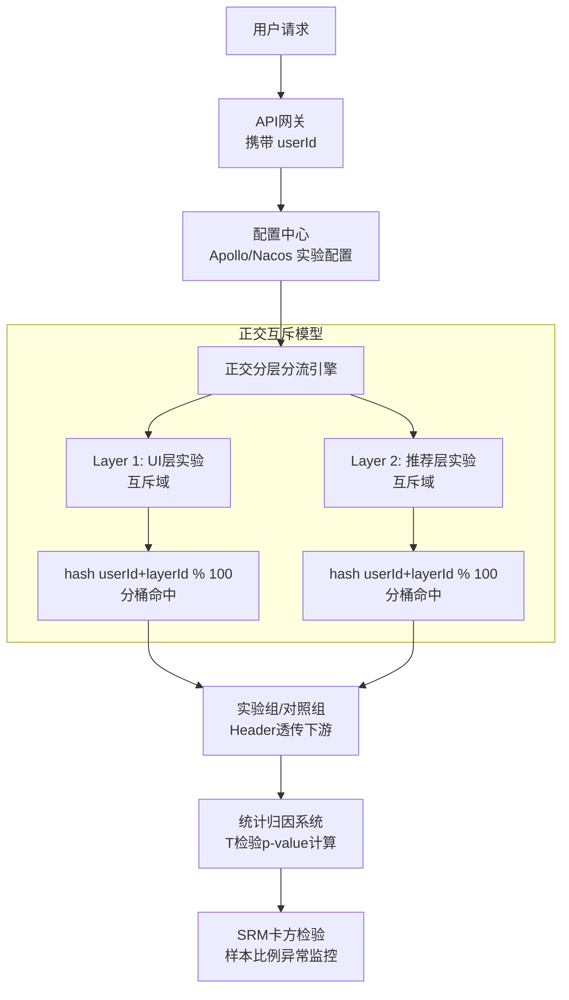

# 【Java 后端架构师】增长实验平台的分流、互斥与归因

> 适用场景：JD 核心技术。推荐团队想验证"新的推荐算法是否提升 CTR"，UI 团队想验证"新版商品卡片是否提升转化率"。两个实验同时跑，怎么保证不互相干扰？结果怎么统计才可信？架构师要设计的是一套"正交分流 + 互斥控制 + 统计归因"的实验平台。

## 一、概念层：正交分层分流模型

```
用户 userId = "user_888"

Layer 1（UI 层，正交于其他层）：
  hash("user_888" + "UI_LAYER") % 100 = 37
  实验 A（新版卡片）覆盖 [0, 5)    → 桶 37 不命中，进默认组
  实验 B（新版导航）覆盖 [5, 10)   → 桶 37 不命中

Layer 2（推荐层，正交于 UI 层）：
  hash("user_888" + "REC_LAYER") % 100 = 72    ← 不同 hash 结果
  实验 C（新算法）覆盖 [0, 10)     → 桶 72 不命中
  实验 D（多样性增强）覆盖 [70, 80) → 桶 72 命中！进实验组

Layer 3（营销层）：
  hash("user_888" + "MKT_LAYER") % 100 = 15
  ...独立分桶

结果：user_888 在 UI 层进默认组、推荐层进实验 D、营销层独立分桶
     三层互不干扰（正交），同层只进一个实验（互斥）
```

## 二、机制层：分流实现

```java
@Service
public class ExperimentRouter {

    private final ExperimentConfigService configService;

    /**
     * 分流：决定用户在每个层进入哪个实验组
     */
    public ExperimentAssignment assign(String userId) {
        ExperimentAssignment assignment = new ExperimentAssignment();
        List<Layer> layers = configService.getActiveLayers();

        for (Layer layer : layers) {
            // 每层独立哈希（保证层间正交）
            int bucket = hashBucket(userId, layer.getId());
            Experiment experiment = findExperiment(layer, bucket);

            if (experiment != null) {
                // 层内互斥：同一用户在层内只进一个实验
                String group = assignGroup(userId, experiment);
                assignment.add(layer.getId(), experiment.getId(), group);
            } else {
                assignment.add(layer.getId(), "default", "control");
            }
        }
        return assignment;
    }

    /**
     * 哈希分桶：MurmurHash3（分布均匀）+ 取模
     */
    private int hashBucket(String userId, String layerId) {
        String key = userId + ":" + layerId;
        return Math.abs(MurmurHash3.hash(key)) % 100;
    }

    /**
     * 组分配：实验组 vs 对照组
     */
    private String assignGroup(String userId, Experiment exp) {
        // 用不同 hash 决定组（实验组/对照组）
        int groupBucket = Math.abs(
            MurmurHash3.hash(userId + ":" + exp.getId() + ":group")) % 100;
        if (groupBucket < exp.getTreatmentPercent()) {
            return "treatment";          // 实验组
        }
        return "control";                // 对照组
    }
}
```

## 三、机制层：实验配置模型

```java
@Data
public class Layer {
    private String id;                  // "UI_LAYER"
    private String name;
    private String description;
}

@Data
public class Experiment {
    private String id;                  // "exp_card_v2"
    private String layerId;
    private String name;
    private int bucketStart;            // [0, 5) 覆盖桶 0-4
    private int bucketEnd;              // 5
    private int treatmentPercent;       // 实验组比例 50（组内再分实验/对照）
    private String status;              // DRAFT / RUNNING / STOPPED
    private LocalDate startDate;
    private LocalDate endDate;
    private List<Metric> targetMetrics; // 关注指标（CTR/转化率/GMV）
}
```

## 四、机制层：归因与统计检验

```java
@Service
public class ExperimentAnalyzer {

    /**
     * 分析实验结果：增量 + 显著性 + 置信区间
     */
    public AnalysisReport analyze(String experimentId) {
        // 1. 拉取实验组和对照组的指标数据
        MetricData treatment = metricRepo.findByExperiment(experimentId, "treatment");
        MetricData control = metricRepo.findByExperiment(experimentId, "control");

        // 2. SRM 检查（样本比例偏差）
        double expectedRatio = 0.5;
        double actualRatio = (double) treatment.getSampleSize()
            / (treatment.getSampleSize() + control.getSampleSize());
        double chiSquare = calcChiSquare(treatment.getSampleSize(),
            control.getSampleSize(), expectedRatio);
        boolean srmViolation = chiSquare > 3.84;   // p < 0.05
        if (srmViolation) {
            log.warn("SRM 异常！配置 50/50 实际 {}", actualRatio);
        }

        // 3. 增量计算
        double treatmentMean = treatment.getConversionRate();   // 0.12
        double controlMean = control.getConversionRate();       // 0.10
        double lift = (treatmentMean - controlMean) / controlMean;  // +20%

        // 4. T 检验（显著性）
        double pValue = tTest(treatment.getSamples(), control.getSamples());
        boolean significant = pValue < 0.05;

        // 5. 置信区间
        double[] ci = confidenceInterval(treatment, control, 0.95);

        return AnalysisReport.builder()
            .treatmentRate(treatmentMean)
            .controlRate(controlMean)
            .liftPercent(lift * 100)
            .pValue(pValue)
            .significant(significant)
            .confidenceInterval(ci)
            .srmViolation(srmViolation)
            .sampleSize(treatment.getSampleSize() + control.getSampleSize())
            .recommendation(decideRecommendation(significant, lift, srmViolation))
            .build();
    }

    private String decideRecommendation(boolean sig, double lift, boolean srm) {
        if (srm) return "SRM 异常，数据不可信，需排查";
        if (sig && lift > 0) return "全量上线（显著正向）";
        if (sig && lift < 0) return "停止（显著负向）";
        return "继续观察（不显著）";
    }
}
```

## 五、机制层：指标上报与分流日志

```java
@Service
public class ExperimentLogger {

    /**
     * 每次 API 请求带分流信息，落日志供离线归因
     */
    public void logExposure(String userId, String experimentId, String group) {
        // 落到大数据（Kafka → 数仓），离线 JOIN 业务指标算增量
        logJson.writeObject(LogEvent.builder()
            .userId(userId)
            .experimentId(experimentId)
            .group(group)
            .timestamp(System.currentTimeMillis())
            .build());
    }
}

// 业务埋点带分流信息
// { event: "click_product", userId: "888",
//   experiments: {"REC_LAYER": "exp_new_algo: treatment"} }
// 离线按 experimentId + group 分组算 CTR/转化率
```

## 六、底层本质：因果推断而非相关分析

实验平台的本质是"建立因果关系"——新算法 X 导致了转化率提升 Y。相关性分析（看数据发现 X 和 Y 相关）无法排除混杂因素（可能是周末效应、可能是其他实验干扰）。A/B 实验通过随机分流控制了混杂因素，使得"实验组和对照组的唯一差异就是实验变量"，从而建立因果。

**正交分层的数学基础**：如果只用 userId 哈希，不同实验的分桶结果会高度相关（同用户在所有实验都进同一桶）。加入 layerId 后，每层独立哈希，桶分布相互独立（正交）。这保证了 UI 层实验和推荐层实验的效果可以独立归因，不互相污染。

**SRM 的本质**：分流配置 50/50 但实际样本比例偏离（如 48/52），说明分流过程有 bug 或偏差（某个浏览器版本的用户被过滤）。SRM 下所有归因都不可信，必须先修分流 bug。

**统计显著性的意义**：p-value < 0.05 表示"如果实验无效，观察到这个增量（或更极端）的概率 < 5%"。低 p-value 让我们有信心拒绝"实验无效"的零假设。但 p-value 不等于效果大小（小样本可能 p-value 显著但增量微小无业务价值）。

## 七、AI 工程化深挖

1. **AI 怎么辅助实验设计？**
   LLM 根据业务目标（提升 CTR）推荐实验变量（改卡片布局/改文案/改推荐算法）和指标。但实验设计要人审核——AI 可能推荐不可行的方案。监控 experiment_success_rate（实验正向比例）。

2. **怎么用 AI 做实验结果解读？**
   实验报告是数据（增量/p-value/置信区间），LLM 翻译成业务语言（"新算法使 CTR 提升 20%，统计显著，建议全量"）。但要标注数据来源和置信度，不能 LLM 自由发挥。

3. **多变量实验（MVT）怎么分析？**
   同时改 UI + 算法 + 文案，传统 A/B 分析不了交互效应。AI 可用（方差分析 ANOVA 或机器学习模型分解各因素贡献）。但 MVT 样本量指数增长（3 因素 × 2 水平 = 8 组），通常拆成多个独立 A/B。

4. **实验平台怎么做实时分流？**
   分流配置存配置中心（Apollo/Nacos），网关实时读取。用户请求带 userId，网关按配置分流。配置变更（实验停止/启动）秒级生效。分流结果写请求 header 透传到下游。

5. **怎么防止实验干扰生产系统？**
   实验组的代码路径要和对照组隔离（feature flag 控制）。实验组出 bug 不能影响对照组。实验配置支持"紧急停止"（一键把所有用户切回对照组）。监控实验组 error_rate。

## 八、记忆口诀与面试现场表达

### 1 分钟记忆口诀

抓 **"正交分层、互斥域、p-value、SRM 检查"** 四个词。

- **正交分层**：layerId 独立哈希，层间正交不干扰
- **互斥域**：同层内同用户只进一个实验
- **p-value**：< 0.05 统计显著，增量（实验组-对照组）/ 对照组
- **SRM 检查**：卡方检验发现分流比例异常

### 面试现场 60 秒回答

> 实验平台用正交分层分流模型。每层用 hash(userId + layerId) % 100 独立分桶——加 layerId 保证层间正交（UI 层和推荐层互不干扰），同层内多个实验覆盖不同桶段实现互斥（同用户只进一个实验）。实验组/对照组用 group hash 再分。分流配置存配置中心，网关实时读取，配置变更秒级生效，分流结果写 header 透传。归因三步：增量（实验组转化率 - 对照组）/ 对照组，T 检验算 p-value < 0.05 为显著，95% 置信区间。SRM 检查用卡方检验——配置 50/50 但实际偏差超阈值说明分流 bug，数据不可信。样本量用 power analysis 算最小值，至少跑 7 天覆盖周一到周日。监控 experiment_count、srm_violation_rate、significant_rate。实验组代码用 feature flag 隔离，出 bug 一键切回对照组。

## 常见考点

1. **正交和互斥区别？**——正交是不同层独立（UI 实验和推荐实验可同时跑）；互斥是同层内只能进一个实验（两个 UI 实验不能同时做）。正交靠 layerId 哈希，互斥靠桶段不重叠。
2. **SRM 怎么检测？**——卡方检验。配置 50/50 实际 48/52，卡方值 > 3.84（p<0.05）判定异常。SRM 下归因不可信。
3. **实验跑多久？**——至少 7 天（覆盖工作日/周末周期）。长期实验要注意 novelty effect（新鲜感退去效果衰减）和 seasonality（季节性波动）。
4. **p-value 显著但增量小怎么办？**——p-value 显著只说明"效果存在"，不说明"效果大"。增量 0.1% 即使显著也无业务价值。要看业务意义（GMV 提升是否覆盖开发成本）。

## 结构化回答

**30 秒电梯演讲：** 增长实验平台的本质是用分流哈希把用户分桶、用互斥域避免干扰、用统计显著性归因。分流是 userId 哈希到 [0,100) 的桶，实验组对照组各占 N%。互斥域避免多个实验互相干扰（A 实验改 UI、B 实验也改 UI 会污染）。归因用假设检验（p-value < 0.05 才可信）+ 增量计算（实验组转化率 - 对照组）

**展开框架：**
1. **分流哈希** — userId + 实验层 hash 到 [0,100)，保证同一用户始终同一桶
2. **正交分层** — layer_1 做 UI 实验、layer_2 做推荐实验，互不干扰
3. **互斥域** — 同 layer 内多个实验互斥（同一用户只能进一个实验）

**收尾：** 以上是我的整体思路。您想继续深入聊——分流哈希为什么要带 layerId？

## 流程图



## 视频脚本

> 预计时长：1 分 30 秒 | 由浅入深

| 时间 | 画面/字幕 | 口播台词 | 讲解要点 |
|------|----------|----------|----------|
| 0:00 | 标题卡：增长实验平台的分流、互斥与归因 | "这题一句话：增长实验平台的本质是用分流哈希把用户分桶、用互斥域避免干扰、用统计显著性归因。" | 开场钩子 |
| 0:15 | 分流哈希示意/对比图 | "userId + 实验层 hash 到 [0,100)，保证同一用户始终同一桶" | 分流哈希要点 |
| 0:40 | 正交分层示意/对比图 | "layer_1 做 UI 实验、layer_2 做推荐实验，互不干扰" | 正交分层要点 |
| 1:25 | 总结卡 | "记住：分流。下期见。" | 收尾 |

## 苏格拉底式面试追问

这组追问训练你在面试现场一层层逼近本质。每一问先回答"为什么"，再回答"怎么做"，最后回答"如何证明"。

| 追问层级 | 面试官可能这样问 | 高分回答方向 |
|----------|------------------|--------------|
| 目标追问 | 实验平台为什么不能直接用线上日志做归因（看新算法上线前后转化率对比），非要搞分流？ | 前后对比有混杂因素（周末/促销/季节性），无法建立因果。A/B 分流控制变量——同一时段实验组和对照组唯一差异是实验变量，才能归因。这是"看相关"和"证因果"的根本区别 |
| 证据追问 | 你怎么证明实验结果可信，不是随机噪音？ | 三道校验：(1) SRM 检查（卡方检验分流比例，p>0.05 才算正常）；(2) p-value < 0.05（统计显著）；(3) 置信区间不跨零。三者都过才下结论。监控 srm_violation_rate（应 < 1%）和 experiment_without_significance（不显著但被采纳的实验数）|
| 边界追问 | 正交分层能跑无数个实验吗？层数太多会不会互相干扰？ | 层数理论上无限（每层独立哈希），但实践有上限——每层实验变量会"渗透"到其他层（如 UI 层改按钮影响推荐层 CTR）。一般 5-10 层够用。跨层归因要小心——如果发现 A 层的实验效果依赖 B 层配置，说明有交互效应，要 MVT 分析 |
| 反例追问 | 给一个 SRM 检测救了业务的真实反例？ | 实验配置 50/50，但实际样本 48/52（实验组少 2%）。归因显示"新算法 CTR +15%"。SRM 触发告警，排查发现新算法代码在低版本浏览器崩溃，这部分用户被静默过滤（实验组少）。如果不查 SRM 就会错误全量上线一个有 bug 的算法。监控 srm_to_incident（SRM 救场次数）|
| 风险追问 | p-value < 0.05 就上线，但如果增量很小（0.1%）统计显著但无业务价值怎么办？ | p-value 显著只说明"效果存在"，不说明"效果大"。要看业务意义——增量 0.1% CTR 即使显著也不值得全量（开发成本不覆盖）。要设最小可检测效应（MDE）——业务方声明"低于 1% 提升不算"，实验设计时算样本量要够检测 1%。监控 trivial_lift_launch（微小增量上线数）|
| 验证追问 | 分流哈希稳定吗？同一用户每次访问进同一实验组？ | MurmurHash + userId 确定性哈希——同一 userId 永远算出同一桶。验证：抽样 1000 用户，多次调用分流 API，group 结果必须一致。监控 assignment_instability_rate（用户跨请求 group 不一致的比例，应 = 0，非零说明 hash 有 bug）|
| 沉淀追问 | 多团队（推荐/UI/营销）都要做实验，你怎么避免每团队各搞一套？ | 沉淀通用 ExperimentPlatform——正交分层模型 + 分流 SDK + 归因报告自动化。业务只声明实验变量和指标。提供实验目录（避免重复实验）和互斥域管理（防同层冲突）。监控 experiment_count_by_team 和 cross_layer_interference_alert |

### 现场对话示例

**面试官**：你说至少跑 7 天，但有些实验（如改按钮颜色）3 天数据就显著了，为什么要等 7 天？

**候选人**：统计显著不等于业务稳定。3 天可能没覆盖周末（用户行为不同），周一上线周三显著可能是"工作日效应"不是真效果。7 天覆盖完整周期，排除周期性波动。更严谨的做法是跑 14 天（两个完整周期）。对于 novelty effect（新鲜感）强的实验（如新功能）要跑 30 天看效果衰减。监控 day1_to_day7_lift_decay（首日到第7天增量衰减）。

**面试官**：实验组用户投诉"功能难用"，但归因显示转化率提升，要不要全量？

**候选人**：定量指标（转化率）和定性反馈（投诉）冲突时不能只看数字。投诉说明用户体验受损——可能是转化率提升但用户难受（如强制弹窗转化高但烦人）。要拆看投诉用户的画像，如果是高价值用户投诉，即使整体转化涨也不能全量。实验结论要定量+定性综合判断，不能盲信 p-value。监控 complaint_per_user（实验组 vs 对照组投诉率）。

**面试官**：MVT（多变量实验）3 因素 2 水平要 8 组，样本量指数增长，怎么破？

**候选人**：MVT 样本量 = 单因素实验 × 组数，8 组就是 8 倍样本。破法：(1) 拆成多个独立 A/B（每个因素单独实验，正交分层保证互不干扰）；(2) 部分析因（Fractional Factorial）——只跑部分组合（如 8 组里跑 4 组代表性组合）降低样本；(3) 如果真要交互效应分析，用 ML 模型（如 XGBoost）拟合各因素贡献。监控 mvt_experiment_count（MVT 实验占比，高说明样本压力大）。
