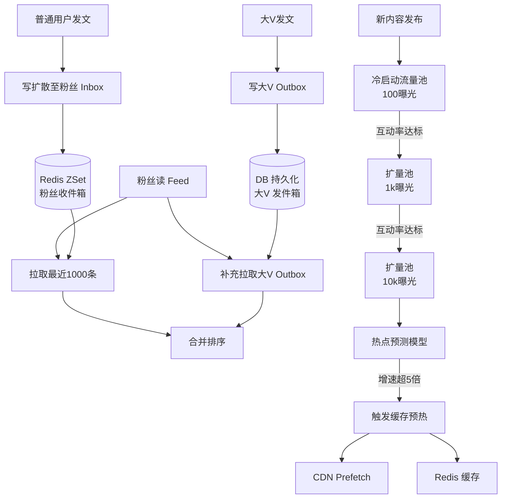

# 【Java 后端架构师】内容 Feed 冷启动与热点扩散

> 适用场景：JD 核心技术。内容社区（种草/直播/短视频）的 Feed 流——大 V 发内容要秒级推给百万粉丝，新创作者的内容要被看到（冷启动），爆文要抗住突发流量。架构师要设计的是一套"推拉结合 + 冷启动流量池 + 热点扩散控制"的 Feed 系统。

## 一、概念层：推拉结合模型

```
普通用户发文（粉丝 < 1万）→ 写扩散（推）
  作者发内容 → 写入关注者的 inbox
  粉丝刷 Feed → 读自己的 inbox（O(1)）

大 V 发文（粉丝 > 1万）→ 读扩散（拉）
  作者发内容 → 只写自己的 outbox
  粉丝刷 Feed → 读 inbox + 实时拉关注的大 V outbox（合并）
```

## 二、机制层：推模式（写扩散）

```java
@Service
@Slf4j
public class FeedPushService {

    private final RedisTemplate<String, String> redis;
    private final FollowService followService;

    private static final int INBOX_MAX_SIZE = 1000;     // inbox 最近 1000 条

    /**
     * 发内容：写扩散到所有粉丝的 inbox
     */
    public void publish(Content content) {
        String authorId = content.getAuthorId();
        int fanCount = followService.getFanCount(authorId);

        if (fanCount > 10000) {
            // 大 V：不推，只写 outbox，粉丝读时拉
            redis.opsForList().leftPush("outbox:" + authorId, content.getId());
            redis.opsForList().trim("outbox:" + authorId, 0, 999);    // 保留最近 1000
            return;
        }

        // 普通用户：推到所有粉丝 inbox
        List<String> fanIds = followService.getFanIds(authorId);
        long score = System.currentTimeMillis();

        // 管道批量写（减少 RTT）
        redis.executePipelined((RedisCallback<Object>) connection -> {
            for (String fanId : fanIds) {
                String inboxKey = "inbox:" + fanId;
                // ZSet：member=contentId, score=timestamp
                connection.zAdd(inboxKey.getBytes(), score,
                    content.getId().getBytes());
                // 限制 inbox 大小（保留最近 1000 条）
                connection.zRemRangeByRank(inboxKey.getBytes(), 0,
                    -INBOX_MAX_SIZE - 1);
            }
            return null;
        });

        metrics.counter("feed.push", "fans", String.valueOf(fanCount))
            .increment(fanCount);
    }
}
```

## 三、机制层：拉模式（读时聚合）

```java
@Service
public class FeedPullService {

    private final FollowService followService;

    /**
     * 大 V 粉丝读 Feed：inbox + 实时拉关注的大 V outbox，合并排序
     */
    public List<String> getFeed(String userId, long maxScore, int count) {
        // 1. 读自己的 inbox（普通用户推过来的）
        Set<String> inboxContent = redis.opsForZSet()
            .reverseRangeByScore("inbox:" + userId, 0, maxScore, 0, count);

        // 2. 找关注的大 V（> 1万粉的不推）
        List<String> bigVIds = followService.getFollowingBigV(userId);

        // 3. 拉大 V 的 outbox
        Set<Content> allContent = new TreeSet<>(Comparator
            .comparingLong(Content::getTimestamp).reversed());
        allContent.addAll(parseContents(inboxContent));

        for (String bigVId : bigVIds) {
            // 拉大 V 最近 N 条
            List<String> outbox = redis.opsForList()
                .range("outbox:" + bigVId, 0, count - 1);
            allContent.addAll(fetchContents(outbox));
        }

        // 4. 排序取 Top-N
        return allContent.stream().limit(count)
            .map(Content::getId).collect(toList());
    }
}
```

## 四、机制层：冷启动流量池

```java
@Service
public class ColdStartService {

    /**
     * 新内容冷启动：多级流量池逐步扩量
     * 100 → 1k → 10k → 100k（按互动率晋升）
     */
    public void distribute(Content content) {
        // 初始进 100 曝光池
        content.setExposurePool(100);
        content.setPoolStage(0);    // 第 0 级
        contentRepo.save(content);

        // 推给初始流量池（基于兴趣标签匹配的用户）
        List<String> seedUsers = recommendByInterest(content.getTags(), 100);
        pushToInbox(seedUsers, content);
    }

    /**
     * 定时评估：互动率达标的晋升到下一级池
     */
    @Scheduled(fixedDelay = 5 * 60_000)      // 每 5 分钟评估
    public void promoteContent() {
        List<Content> candidates = contentRepo.findInEvaluationPool();
        int[] poolSizes = {100, 1000, 10000, 100000, 1000000};

        for (Content c : candidates) {
            double ctr = calcCTR(c);            // 互动率（点击/完播/点赞）
            double threshold = getThreshold(c.getPoolStage());

            if (ctr >= threshold) {
                // 互动达标，晋升下一级
                int nextStage = c.getPoolStage() + 1;
                if (nextStage < poolSizes.length) {
                    int nextPool = poolSizes[nextStage];
                    List<String> users = recommendByInterest(c.getTags(),
                        nextPool - c.getExposurePool());
                    pushToInbox(users, c);
                    c.setPoolStage(nextStage);
                    c.setExposurePool(nextPool);
                    metrics.counter("content.promote", "stage",
                        String.valueOf(nextStage)).increment();
                }
            } else {
                // 互动不达标，停止扩量
                c.setPoolStage(-1);     // 退出流量池
            }
            contentRepo.save(c);
        }
    }
}
```

## 五、机制层：热点扩散控制

```java
@Service
@Slf4j
public class HotContentService {

    private final RedisTemplate<String, String> redis;
    private final CDNClient cdnClient;

    private static final long HOT_THRESHOLD = 10000;   // 10k 阅读/小时
    private static final long TREND_THRESHOLD = 5.0;   // 5 倍增速

    /**
     * 实时检测热点：阅读/互动增速超阈值
     */
    @Scheduled(fixedDelay = 30_000)
    public void detectHot() {
        List<Content> candidates = contentRepo.findRecentlyPublished();
        for (Content c : candidates) {
            double currentRate = getViewRate(c.getId(), Duration.ofMinutes(30));
            double baselineRate = getViewRate(c.getId(),
                Duration.between(c.getPublishedAt().minusHours(2),
                    c.getPublishedAt().minusMinutes(30)));

            if (baselineRate > 0 && currentRate / baselineRate > TREND_THRESHOLD) {
                promoteToHot(c);
            }
        }
    }

    /**
     * 热点处理：缓存预热 + CDN 推送 + 限流
     */
    private void promoteToHot(Content content) {
        log.info("热点内容检出: {} 增速超阈值", content.getId());

        // 1. 缓存预热（从 DB 加载到 Redis，防击穿）
        redis.opsForValue().set("hot:content:" + content.getId(),
            JsonUtils.stringify(content), Duration.ofHours(1));

        // 2. CDN 推送（静态资源边缘缓存）
        cdnClient.prefetch(content.getMediaUrls());

        // 3. 加入选秀池加速扩量
        content.setPoolStage(Math.max(content.getPoolStage(), 3));    // 跳到 10k 池

        // 4. 限流降级（热点评论/点赞走异步）
        rateLimiter.addRule("content:" + content.getId(), 1000);     // 1000 QPS 上限

        metrics.counter("hot.detected").increment();
    }
}
```

## 六、机制层：两类 Feed 流

```java
@Service
public class FeedService {

    /**
     * 关注流（时间序）：推拉结合
     */
    public List<Content> getFollowingFeed(String userId, String cursor, int size) {
        return feedPullService.getFeed(userId, parseCursor(cursor), size);
    }

    /**
     * 推荐流（兴趣排序）：召回 + 重排
     */
    public List<Content> getRecommendFeed(String userId, String cursor, int size) {
        // 1. 召回（多路）
        List<String> recalled = new ArrayList<>();
        recalled.addAll(recallByInterest(userId, size * 3));    // 兴趣召回
        recalled.addAll(recallByCF(userId, size * 2));          // 协同过滤
        recalled.addAll(recallColdStart(size));                 // 冷启动内容混排

        // 2. 重排（模型打分）
        List<Content> contents = fetchContents(recalled);
        contents.sort(Comparator.comparingDouble(
            c -> -recommendModel.score(userId, c)));

        // 3. 多样性打散（同类内容不连续）
        return diversify(contents, size);
    }
}
```

## 七、底层本质：推拉 trade-off 的数学模型

推模式的成本：发文时 O(粉丝数) 次写。
拉模式的成本：读 Feed 时 O(关注大 V 数) 次读。

**推拉边界的选择**：设推模式单次写成本 W，拉模式单次读成本 R。用户日均发文 F 次、日均读 Feed G 次、粉丝数 N、关注大 V 数 M。

- 推模式日成本：F × N × W（发文推给所有粉丝）
- 拉模式日成本：G × M × R（每次读拉所有大 V）

当 F × N × W > G × M × R 时，拉模式更优。通常大 V（N 大）用拉，普通用户（N 小）用推。边界 1 万粉丝是经验值（具体按 QPS 监控调）。

**冷启动流量池的本质是"探索-利用"（Exploration-Exploitation）**：新内容没有互动数据（探索阶段），给少量曝光池观察互动率；互动好的扩量（利用阶段，把好内容推给更多人）。这是多臂老虎机（Bandit）思想在内容分发中的应用。

**热点扩散的本质是"突发流量预测 + 资源预热"**：内容热度有自激励性（越火越推越多曝光），增速超阈值意味着即将爆发。提前预热缓存和 CDN，避免爆发时回源击穿。这是"主动缓存"（predictive caching）模式。

## 八、AI 工程化深挖

1. **推荐流用什么模型？**
   召回层：双塔模型（用户塔 + 内容塔，embedding 近邻召回）。重排层：DNN（特征交叉 + 序列建模）。冷启动内容用多臂老虎机（UCB/Thompson Sampling）平衡探索和利用。

2. **LLM 怎么做内容理解？**
   LLM 生成内容标签（"美妆/口红/测评"）、摘要（用于推荐卡展示）、兴趣分类。比传统 NLP（TF-IDF/关键词）更准。但 LLM 推理慢，离线批量处理而非在线实时。

3. **怎么做 Feed 的多样性？**
   同类内容连续出现体验差（连刷 10 条都是手机测评）。重排后做 MMR（Maximal Marginal Relevance）打散——相似度高的内容降低分数。或规则约束（同类内容间隔至少 3 条）。

4. **怎么用 AI 预测热点？**
   分析内容发布初期（前 30 分钟）的互动增速 + 作者历史表现 + 话题热度，训练模型预测是否会爆。高预测概率的提前预热。监控 hot_prediction_accuracy。

5. **Feed 流怎么做 A/B 测试？**
   实验平台分流：A 组用推荐算法 v1，B 组用 v2。指标：CTR、停留时长、互动率、次日留存。注意 SRM 检查。新算法要跑 7 天以上覆盖周期效应。

## 九、记忆口诀与面试现场表达

### 1 分钟记忆口诀

抓 **"推拉结合、流量池、热点预热、两类流"** 四个词。

- **推拉结合**：普通用户（<1万粉）推（写扩散 inbox），大 V 拉（读时聚合 outbox）
- **流量池**：冷启动多级池（100→1k→10k→100k），按互动率（CTR/完播）晋升
- **热点预热**：增速超阈值触发缓存预热 + CDN + 限流
- **两类流**：关注流（时间序推拉）+ 推荐流（召回+重排）

### 面试现场 60 秒回答

> Feed 流我用推拉结合——普通用户（< 1 万粉）发文写扩散到粉丝 inbox（Redis ZSet，member=contentId，score=timestamp，限 1000 条），粉丝读 Feed 直接读 inbox O(1)。大 V（> 1 万粉）发文只写自己 outbox（推千万粉不可行），粉丝读时实时拉 inbox + 关注大 V 的 outbox 合并排序。冷启动用多级流量池——新内容进 100 曝光池（基于兴趣标签匹配的种子用户），每 5 分钟评估互动率（CTR/完播率/点赞），达标晋升下一级（1k→10k→100k），像漏斗逐步扩量。热点检测：实时算阅读增速（当前 30 分钟 vs 基线），增速超 5 倍触发缓存预热（DB→Redis）+ CDN prefetch + 限流降级（评论/点赞走异步）。两类 Feed：关注流（时间序推拉结合）+ 推荐流（多路召回：兴趣/协同过滤/冷启动混排 → DNN 重排 → MMR 多样性打散）。推拉边界按 QPS 监控动态调，监控 feed_push_latency、inbox_size、pool_promotion_rate。

## 十、常见考点

1. **推模式和拉模式怎么选？**——粉丝数小的推（写扩散），粉丝数大的拉（读扩散）。边界约 1 万粉（经验值，按系统负载调）。推拉结合是主流。
2. **冷启动流量池怎么设计？**——多级池（100→1k→10k），按互动率晋升/淘汰。新内容给初始曝光观察数据，好的扩量差的停。本质是 explore-exploit。
3. **热点怎么防击穿？**——增速阈值检测 + 缓存预热（提前加载到 Redis）+ CDN 推送 + 限流降级（评论/点赞异步化）。不靠"被动缓存miss回源"。
4. **inbox 为什么用 ZSet？**——ZSet 按分数（timestamp）排序，支持范围查询（ZRANGEBYSCORE 取最近 N 条），天然适合时间线。限制大小（zremrangebyrank 保留最近 1000 条）。

## 结构化回答

**30 秒电梯演讲：** 内容 Feed 的核心是推拉结合 + 冷启动策略 + 热点扩散控制。推模式（写扩散）适合小粉丝量，拉模式（读扩散）适合大粉丝量。新内容冷启动靠推荐流量池 + 兴趣标签匹配。热点内容靠缓存预热 + 限流降级防击穿

**展开框架：**
1. **推拉结合** — 普通用户发推（写扩散到粉丝 inbox），大 V 发拉（粉丝读时实时拉）
2. **冷启动** — 新内容进推荐流量池（100 曝光），互动好则扩量到下一级池
3. **热点扩散** — 热度阈值触发缓存预热 + CDN + 限流

**收尾：** 以上是我的整体思路。您想继续深入聊——推拉边界怎么定？

## 流程图



## 视频脚本

> 预计时长：2 分钟 | 由浅入深

| 时间 | 画面/字幕 | 口播台词 | 讲解要点 |
|------|----------|----------|----------|
| 0:00 | 标题卡：内容 Feed 冷启动与热点扩散 | "这题一句话：内容 Feed 的核心是推拉结合 + 冷启动策略 + 热点扩散控制。" | 开场钩子 |
| 0:15 | 像快递分拣——普通包裹走标准流程（拉模式类比图 | "打个比方：像快递分拣——普通包裹走标准流程（拉模式。" | 核心类比 |
| 0:40 | 推拉结合示意/对比图 | "普通用户发推（写扩散到粉丝 inbox），大 V 发拉（粉丝读时实时拉）" | 推拉结合要点 |
| 1:05 | 冷启动示意/对比图 | "新内容进推荐流量池（100 曝光），互动好则扩量到下一级池" | 冷启动要点 |
| 1:30 | 热点扩散示意/对比图 | "热度阈值触发缓存预热 + CDN + 限流" | 热点扩散要点 |
| 1:55 | 总结卡 | "记住：推拉结合。下期见。" | 收尾 |

## 苏格拉底式面试追问

这组追问训练你在面试现场一层层逼近本质。每一问先回答"为什么"，再回答"怎么做"，最后回答"如何证明"。

| 追问层级 | 面试官可能这样问 | 高分回答方向 |
|----------|------------------|--------------|
| 目标追问 | 推拉边界 1 万粉是拍脑袋定的吗？怎么算才科学？ | 数学推导。推模式日成本 = F×N×W（发文次数×粉丝数×单次写）；拉模式日成本 = G×M×R（读次数×关注大V数×单次读）。当 F×N×W > G×M×R 时拉更优。N（粉丝数）是关键变量，按历史 QPS 监控算边界。1 万是经验值，实际按系统负载压测调 |
| 证据追问 | 你怎么证明推拉结合真的扛住了大 V 发文？ | 监控 feed_push_latency（推模式发文延迟，应 < 500ms）、inbox_size（用户 inbox 大小，超 1000 触发淘汰）、feed_pull_qps（拉模式读 QPS）。大 V 发文时看 outbox 写入延迟和粉丝读 Feed 聚合延迟。压测：模拟千万粉大 V 发文，看推模式是否雪崩 |
| 边界追问 | 大 V 发文走拉模式，但大 V 粉丝也是普通用户发文走推。一个用户既关注大 V 又关注普通用户，他读 Feed 怎么聚合？ | 混合聚合。用户读 Feed：先读自己的 inbox（普通用户推过来的，O(1)），再拉关注的大 V 的 outbox（M 次查），合并按时间排序取 Top-N。读成本 = O(inbox) + O(M)。M（关注大V数）一般 < 50，可控 |
| 反例追问 | 给一个 Feed 推模式雪崩的真实反例？ | 大 V（5000 万粉）发文时误进了推模式（粉丝数统计延迟，实际超 1 万但缓存还是 9000），触发写扩散到 5000 万 inbox，Redis 集群被打爆，全站 Feed 卡顿 10 分钟。根因：粉丝数判断用了缓存脏数据。修复：粉丝数判断加安全边界（缓存 9000 时按 1 万算走拉）。监控 push_overflow_alert |
| 风险追问 | 冷启动流量池新内容进 100 曝光池，但如果内容低质（标题党），给 100 人曝光后没人互动就被淘汰，创作者抱怨"没流量"怎么办？ | 冷启动是"探索"——给初始曝光看数据反馈。低质内容淘汰是设计如此（不浪费更多流量）。但创作者教育要跟上——告知"互动率达标才会扩量"，引导优化内容。监控 cold_start_content_complaint（创作者投诉），高则优化流量池规则或加创作者扶持计划 |
| 验证追问 | 热点检测增速阈值 5 倍，怎么验证这个阈值合理？ | 看历史热点内容的增速分布——真热点增速普遍 > 5 倍，非热点 < 3 倍，5 倍是分界点。验证：跑离线数据标注"哪些内容后来真爆了"，算增速阈值对真热点的召回率和误报率。监控 hot_detection_precision（应 > 80%）和 hot_detection_recall |
| 沉淀追问 | 多内容业务（图文/视频/直播）都要 Feed，你怎么避免每业务重写推拉？ | 沉淀通用 FeedEngine——推拉路由（按粉丝数自动选）+ inbox/outbox 抽象 + 冷启动流量池通用。业务只声明内容类型和推荐模型。提供 feed_trace 看板（contentId 全链路推送轨迹）。监控按业务拆 feed_push_latency 和 pool_promotion_rate |

### 现场对话示例

**面试官**：你说 inbox 限 1000 条，超出淘汰旧的。但如果用户 3 天没上线，再上线时想看 3 天前关注人的内容怎么办？

**候选人**：inbox 是"最近 1000 条"的时间线，超出的内容不在 inbox 里。用户长时间不上线再回来，inbox 拉的是最近 1000 条（可能覆盖几小时内的），更早的丢失。对策：inbox 不够时补充拉 outbox（关注人的最近发文），合并排序。或推荐流（基于兴趣召回历史内容）兜底。监控 inbox_miss_rate（用户读 Feed 时内容不足需要回填的比例）。

**面试官**：大 V 发文走拉模式，但大 V 自己也想看自己发了什么，怎么处理？

**候选人**：大 V 的发文同时写入自己的 outbox 和"已发布"列表。大 V 看自己的 Feed 时，inbox（粉丝推过来的）+ 自己 outbox 合并。看自己已发布内容走独立的"我的主页"接口（不走 Feed），直接查自己的 outbox 全量。这是"消费 Feed"和"个人主页"分离——前者按时间线/兴趣排序，后者按作者维度全量。

**面试官**：冷启动流量池新内容给 100 人曝光，但这 100 人怎么选？给错人了互动率低被误判为低质怎么办？

**候选人**：种子用户选择要精准——按内容标签（如"美妆"）匹配兴趣用户，且选"高互动倾向"的用户（历史点赞率高）。不是随机 100 人。如果种子选错了（如把美妆内容推给科技爱好者），互动率低被淘汰是真冤枉。所以冷启动的内容理解和标签提取很关键——用 LLM 离线生成内容标签。监控 cold_start_mislabel_rate（内容标签错误率）。

## 核心知识点图


