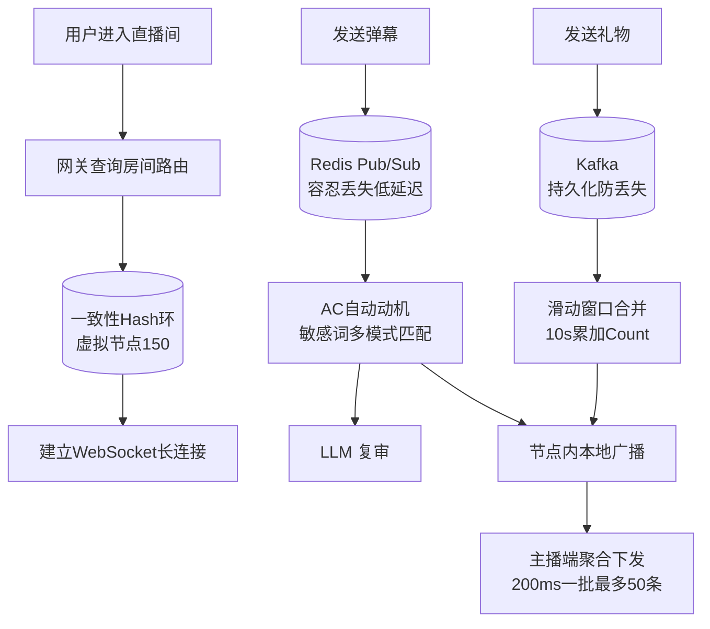

# 【Java 后端架构师】直播间高并发弹幕与礼物链路

> 适用场景：JD 直播带货（京东直播）。主播开播瞬间几万观众涌入，弹幕 QPS 破万，礼物连击刷屏。架构师要设计的是"房间分片 + 消息总线 + 礼物连击合并 + 敏感词过滤"的实时互动链路。

## 一、概念层：整体架构

```
观众 WebSocket → 网关（查房间路由）→ 房间节点（hash 路由）
                                         ↓
                                    本地 session 表
                                         ↓
弹幕：Redis Pub/Sub（房间频道）→ 各节点订阅 → 本地广播
礼物：Kafka（礼物 topic）→ 消费 → 连击合并 → 下发
```

## 二、机制层：房间分片路由

```java
@Service
public class RoomRouterService {

    private final ConsistentHash<String> hashRing;      // 一致性 hash 环
    private final RedisTemplate<String, String> redis;

    /**
     * 网关：用户进入房间，返回该房间所在节点
     */
    public String routeNode(String roomId) {
        // 先查缓存
        String cached = redis.opsForValue().get("room:node:" + roomId);
        if (cached != null) return cached;

        // 一致性 hash 计算节点
        String node = hashRing.get(roomId);
        redis.opsForValue().set("room:node:" + roomId, node,
            Duration.ofMinutes(5));
        return node;
    }

    /**
     * 节点扩容时重新分配房间
     */
    public void onNodeAdd(String newNode) {
        hashRing.addNode(newNode);
        // 通知受影响房间迁移
        List<String> affected = hashRing.getMigrationRange(newNode);
        for (String roomId : affected) {
            redis.delete("room:node:" + roomId);    // 让路由重新计算
            notifyMigration(roomId, newNode);
        }
    }
}

/**
 * 一致性 hash（虚拟节点 150）
 */
public class ConsistentHash<T> {
    private final TreeMap<Integer, T> ring = new TreeMap<>();
    private static final int VIRTUAL_NODES = 150;

    public void addNode(T node) {
        for (int i = 0; i < VIRTUAL_NODES; i++) {
            int hash = hash(node.toString() + "-vn" + i);
            ring.put(hash, node);
        }
    }

    public T get(String key) {
        if (ring.isEmpty()) return null;
        int hash = hash(key);
        // 顺时针找第一个节点
        Map.Entry<Integer, T> entry = ring.ceilingEntry(hash);
        return entry != null ? entry.getValue() : ring.firstEntry().getValue();
    }
}
```

## 三、机制层：弹幕消息总线（Redis Pub/Sub）

```java
@Service
@Slf4j
public class DanmakuService {

    private final RedisMessageListenerContainer listenerContainer;
    private final SessionManager sessionManager;       // 本节点的 session 表
    private final AcTrieSensitiveFilter sensitiveFilter;
    private final RateLimiter rateLimiter;

    /**
     * 节点启动：订阅本节点负责的房间频道
     */
    public void subscribeRooms(List<String> roomIds) {
        for (String roomId : roomIds) {
            ChannelTopic topic = new ChannelTopic("danmaku:room:" + roomId);
            listenerContainer.addMessageListener((message, pattern) -> {
                Danmaku danmaku = JsonUtils.parse(message.getMessage(),
                    Danmaku.class);
                // 本地广播给该房间在本节点的所有连接
                broadcast(danmaku);
            }, topic);
        }
    }

    /**
     * 观众发弹幕：限流 + 敏感词过滤 + 发布到频道
     */
    public void send(Danmaku danmaku) {
        String userId = danmaku.getUserId();
        String roomId = danmaku.getRoomId();

        // 1. 用户级限流（每秒 3 条）
        if (!rateLimiter.tryAcquire("danmaku:user:" + userId, 3, 1)) {
            throw new BizException("发送太频繁");
        }

        // 2. 敏感词过滤（AC 自动机）
        if (sensitiveFilter.contains(danmaku.getText())) {
            log.warn("敏感词拦截: userId={} text={}", userId,
                danmaku.getText());
            throw new BizException("内容违规");
        }

        // 3. 消息长度限制
        if (danmaku.getText().length() > 50) {
            throw new BizException("弹幕过长");
        }

        // 4. 发布到房间频道（所有订阅该房间的节点都会收到）
        redis.convertAndSend("danmaku:room:" + roomId,
            JsonUtils.stringify(danmaku));
    }

    /**
     * 本地广播：遍历本节点该房间的所有 session
     */
    private void broadcast(Danmaku danmaku) {
        List<WebSocketSession> sessions = sessionManager
            .getByRoom(danmaku.getRoomId());
        for (WebSocketSession session : sessions) {
            try {
                session.sendMessage(new TextMessage(
                    JsonUtils.stringify(danmaku)));
            } catch (IOException e) {
                sessionManager.remove(session.getId());
            }
        }
    }
}
```

## 四、机制层：礼物连击队列（滑动窗口合并）

```java
@Service
@Slf4j
public class GiftComboService {

    private final RedisTemplate<String, String> redis;
    private final KafkaTemplate<String, String> kafka;

    private static final long COMBO_WINDOW_MS = 10_000;    // 10 秒连击窗口
    private static final long FLUSH_INTERVAL_MS = 500;     // 500ms 刷新一次

    /**
     * 送礼：写 Kafka（可靠）+ 累加连击计数
     */
    public void send(Gift gift) {
        // 1. 礼物消息写 Kafka（保证不丢，涉及钱）
        kafka.send("gift-topic", gift.getRoomId(),
            JsonUtils.stringify(gift));

        // 2. 累加连击（滑动窗口）
        String comboKey = "gift:combo:" + gift.getRoomId()
            + ":" + gift.getGiftId();
        redis.opsForValue().increment(comboKey);           // count++
        redis.expire(comboKey, COMBO_WINDOW_MS,
            TimeUnit.MILLISECONDS);                        // 10s 后自动过期
    }

    /**
     * 定时刷新连击：每 500ms 扫描活跃 combo 下发
     */
    @Scheduled(fixedDelay = FLUSH_INTERVAL_MS)
    public void flushCombos() {
        // 扫描最近有变动的 combo key（用 Sorted Set 记录活跃 combo）
        Set<String> activeCombos = redis.opsForZSet()
            .rangeByScore("gift:active_combos",
                System.currentTimeMillis() - FLUSH_INTERVAL_MS,
                System.currentTimeMillis());

        for (String comboKey : activeCombos) {
            String countStr = redis.opsForValue().get(comboKey);
            if (countStr == null) continue;                // 已过期

            int count = Integer.parseInt(countStr);
            String[] parts = comboKey.split(":");
            String roomId = parts[2];
            String giftId = parts[3];

            // 下发连击消息（合并后的）
            ComboMessage msg = new ComboMessage(roomId, giftId, count);
            redis.convertAndSend("gift:room:" + roomId,
                JsonUtils.stringify(msg));
        }
    }
}
```

## 五、机制层：敏感词过滤（AC 自动机）

```java
/**
 * AC 自动机：多模式匹配 O(n)，比逐个 contains 快百倍
 */
public class AcTrieSensitiveFilter {

    private final AcTrieNode root = new AcTrieNode();

    public void init(List<String> words) {
        // 1. 构建 Trie
        for (String word : words) {
            AcTrieNode node = root;
            for (char c : word.toCharArray()) {
                node = node.children.computeIfAbsent(c,
                    k -> new AcTrieNode());
            }
            node.isEnd = true;
        }
        // 2. 构建 fail 指针（BFS）
        buildFailPointer();
    }

    public boolean contains(String text) {
        AcTrieNode node = root;
        for (char c : text.toCharArray()) {
            while (node != root && !node.children.containsKey(c)) {
                node = node.fail;       // fail 指针跳转
            }
            node = node.children.getOrDefault(c, root);
            if (node.isEnd) return true;
        }
        return false;
    }

    private void buildFailPointer() {
        Queue<AcTrieNode> queue = new LinkedList<>();
        for (AcTrieNode child : root.children.values()) {
            child.fail = root;
            queue.offer(child);
        }
        while (!queue.isEmpty()) {
            AcTrieNode curr = queue.poll();
            for (Map.Entry<Character, AcTrieNode> e
                : curr.children.entrySet()) {
                AcTrieNode fail = curr.fail;
                while (fail != root && !fail.children.containsKey(e.getKey())) {
                    fail = fail.fail;
                }
                e.getValue().fail = fail.children.getOrDefault(e.getKey(), root);
                queue.offer(e.getValue());
            }
        }
    }
}
```

## 六、机制层：主播端聚合下发

```java
/**
 * 主播端：消息太多不能每条都收，按批次聚合
 */
@Service
public class StreamerAggregator {

    private final Map<String, BlockingQueue<Danmaku>> buffers
        = new ConcurrentHashMap<>();

    /**
     * 收到弹幕先入 buffer
     */
    public void buffer(Danmaku danmaku) {
        buffers.computeIfAbsent(danmaku.getRoomId(),
            k -> new LinkedBlockingQueue<>(1000))   // 最多缓冲 1000 条
            .offer(danmaku);
    }

    /**
     * 每 200ms 聚合一批下发（最多 50 条）
     */
    @Scheduled(fixedDelay = 200)
    public void flushBatch() {
        for (Map.Entry<String, BlockingQueue<Danmaku>> e
            : buffers.entrySet()) {
            List<Danmaku> batch = new ArrayList<>(50);
            e.getValue().drainTo(batch, 50);
            if (!batch.isEmpty()) {
                sendToStreamer(e.getKey(), batch);
            }
        }
    }
}
```

## 七、底层本质：写放大与读放大

直播间的核心矛盾是**写放大**和**读放大**。

**写放大**：百万观众中哪怕只有 1% 发弹幕，也是 1 万 QPS。每条要广播给其他 99 万人 = 1 万 × 99 万 = 10 亿次"广播"。必须分片——每个节点只负责一部分观众，节点内本地广播（O(节点内连接数)），节点间靠 Pub/Sub 转发一次。

**读放大（礼物连击）**：热门礼物刷屏时，每秒上千次渲染。前端扛不住。靠滑动窗口合并——10 秒内的同款礼物累加成"送了 N 个"，渲染从 N 次降到 1 次。

**为什么弹幕走 Pub/Sub 礼物走 Kafka？** 弹幕容忍丢（少几条不影响体验），Pub/Sub 无 ack 低延迟（< 10ms）。礼物涉及钱不能丢，Kafka 有 ack + 持久化 + 重放，延迟稍高（几十 ms）但可靠。这是**消息可靠性 vs 延迟**的 trade-off。

**一致性 hash 的本质**：传统 hash（hash(roomId) % N）在节点扩容时几乎所有 key 都要重映射。一致性 hash 让节点加入/退出只影响相邻段（约 1/N 的 key 迁移），减少迁移成本。虚拟节点解决数据倾斜（让 hash 分布更均匀）。

## 八、AI 工程化深挖

1. **弹幕内容审核怎么用 AI？** 规则（AC 自动机敏感词）+ LLM 兜底。规则快但召回低（变体如"米\*兔"漏检），LLM 准但慢（100ms+）。规则先过滤 99%，疑似难判的送 LLM 复审。监控 audit_pass_rate。

2. **怎么用 LLM 做弹幕情感分析？** 实时统计直播间情绪（正向/负向/中性比例）。负向比例突增可能主播说了不当言论或商品有问题，触发告警。但 LLM 推理慢，用轻量模型（BERT 微调）而非大 LLM。

3. **怎么个性化弹幕展示？** 给用户看 ta 关注的人/同好发的弹幕优先展示（像抖音评论的"关注的人"）。需要实时计算用户关系图 + 弹幕排序。LLM 可生成"精选弹幕"摘要（"大家都在问尺码"）。

4. **怎么用 AI 检测刷屏机器人？** 异常模式检测：同一 IP 高频发同质内容（机器人特征）。训练分类模型（特征：发送频率/内容相似度/账号年龄）。命中的限流或封禁。监控 bot_block_rate。

5. **直播带货怎么用 AI 提转化？** 实时分析弹幕意图（"想买/疑问/比价"），主播端提示"现在有 50 人在问尺码"，引导主播讲解。LLM 实时摘要弹幕热点。监控 conversion_lift。

## 九、记忆口诀与面试现场表达

### 1 分钟记忆口诀

抓 **"分片、总线、连击、敏感词"** 四个词。

- **分片**：一致性 hash（虚拟节点 150），roomId → 节点，节点内本地广播
- **总线**：弹幕 Redis Pub/Sub（低延迟），礼物 Kafka（可靠）
- **连击**：滑动窗口 10s 合并，count 累加，500ms 刷新
- **敏感词**：AC 自动机 O(n) 多模式匹配

### 面试现场 60 秒回答

> 直播弹幕我用房间分片 + 消息总线。用户进直播间，网关查"房间→节点"路由表（一致性 hash，虚拟节点 150 解决倾斜），返回节点 IP，用户 WebSocket 连该节点。节点维护"本节点连到该房间的所有 session"表。弹幕发送时走 Redis Pub/Sub（房间频道），所有订阅该房间的节点收到后本地广播——这是节点间一次转发 + 节点内 O(连接数) 广播，避免单点百万广播。弹幕走 Pub/Sub 因为容忍丢、要低延迟（<10ms）。礼物走 Kafka 因为涉及钱不能丢，有 ack + 持久化。礼物连击用滑动窗口合并——key=gift:combo:{roomId}:{giftId}，10 秒内累加 count，定时 500ms 扫描刷新下发，把 N 次渲染合并成 1 次。敏感词用 AC 自动机（多模式匹配 O(n)，比逐个 contains 快百倍）+ LLM 兜底复审。主播端聚合下发——不是每条都收，200ms 一批最多 50 条。用户级限流（令牌桶每秒 3 条）防刷屏。节点扩容时一致性 hash 只迁移相邻段。监控 broadcast_latency、combo_count、sensitive_block_rate。

## 十、常见考点

1. **房间分片怎么做的？**——一致性 hash。roomId hash 到环上找最近节点。虚拟节点 150 解决倾斜。扩容只迁移相邻段（约 1/N）。路由表存 Redis（TTL 5 分钟）。
2. **弹幕和礼物为什么分通道？**——弹幕容忍丢走 Pub/Sub（低延迟 <10ms 无 ack），礼物涉及钱走 Kafka（ack + 持久化 + 重放，延迟几十 ms 但可靠）。
3. **礼物连击怎么实现？**——Redis 滑动窗口。key=gift:combo:{roomId}:{giftId}，increment 累加，expire 10s 过期。定时 500ms 扫描活跃 combo 下发合并结果。N 次渲染合并 1 次。
4. **敏感词怎么过滤？**——AC 自动机（多模式匹配 O(n)，构建 Trie + fail 指针）。规则快但召回低，LLM 兜底复审疑似内容。
5. **百万观众怎么扛？**——分片（每节点扛一部分观众）+ 本地广播（节点内 O(连接数)）+ 主播端聚合（200ms 一批）。单节点扛不住才分片。

## 结构化回答

**30 秒电梯演讲：** 直播弹幕的核心是房间分片 + 多级消息总线 + 礼物连击合并。百万级观众的消息不能全走 DB，靠 Redis Pub/Sub + 房间分片把消息路由到对应连接节点。礼物连击（combo）靠滑动窗口合并，减少渲染压力

**展开框架：**
1. **房间分片** — roomId hash 到固定节点，节点内本地广播
2. **消息总线** — Redis Pub/Sub 或 Kafka 做节点间消息分发
3. **礼物连击** — 滑动窗口（10s）合并同款礼物，combo count

**收尾：** 以上是我的整体思路。您想继续深入聊——房间怎么分片？

## 流程图



## 视频脚本

> 预计时长：1 分 30 秒 | 由浅入深

| 时间 | 画面/字幕 | 口播台词 | 讲解要点 |
|------|----------|----------|----------|
| 0:00 | 标题卡：直播间高并发弹幕与礼物链路 | "这题一句话：直播弹幕的核心是房间分片 + 多级消息总线 + 礼物连击合并。" | 开场钩子 |
| 0:15 | 房间分片示意/对比图 | "roomId hash 到固定节点，节点内本地广播" | 房间分片要点 |
| 0:40 | 消息总线示意/对比图 | "Redis Pub/Sub 或 Kafka 做节点间消息分发" | 消息总线要点 |
| 1:25 | 总结卡 | "记住：房间分片。下期见。" | 收尾 |

## 苏格拉底式面试追问

这组追问训练你在面试现场一层层逼近本质。每一问先回答"为什么"，再回答"怎么做"，最后回答"如何证明"。

| 追问层级 | 面试官可能这样问 | 高分回答方向 |
|----------|------------------|--------------|
| 目标追问 | 弹幕为什么走 Redis Pub/Sub 礼物走 Kafka？统一走 Kafka 不行吗？ | 弹幕容忍丢（少几条不影响体验）要低延迟（< 10ms），Pub/Sub 无 ack 最快。礼物涉及钱不能丢，Kafka 有 ack + 持久化。统一 Kafka 会让弹幕延迟升到几十 ms（同步刷盘），百万 QPS 下成本翻倍。这是"可靠性 vs 延迟"的精准取舍 |
| 证据追问 | 你怎么证明弹幕没大面积丢、礼物没丢？ | 监控 message_loss_rate（弹幕丢失率，应 < 1%，超过说明 Pub/Sub 丢消息）、gift_loss_count（礼物丢失数，应 = 0，Kafka 保证至少一次）、broadcast_latency_p99（广播延迟 P99，应 < 50ms）、combo_count_accuracy（连击合并准确性，对比累加值和下发值）|
| 边界追问 | 一致性 hash 分片，节点扩容时迁移过程中用户消息会丢吗？ | 会丢少量。扩容时部分房间从 A 节点迁到 B 节点，迁移期间用户连的还是 A 节点但路由表已指向 B，消息发到 B 用户收不到。对策：迁移有 overlap 期——A 和 B 都订阅该房间频道一段时间，用户切到 B 后再断 A。监控 migration_message_loss（迁移期丢消息数）|
| 反例追问 | 给一个礼物连击合并出 bug 的真实反例？ | 滑动窗口 10 秒过期，但用户在第 9.9 秒送礼，第 10.1 秒再送——本应是连击（连续送同款），但窗口过期被算成两次独立送礼。用户看到的"99 连击"变成"50 连击 + 49 连击"。根因：窗口边界处理粗糙。修复：窗口续期（每次送礼重置 10 秒 TTL），连续送就连续续期。监控 combo_break_rate（连击被打断率）|
| 风险追问 | 百万观众直播间，单节点扛一部分连接，但如果某房间刚好 hash 到的节点挂了，百万用户全断怎么办？ | 节点挂了路由表失效，用户重连时网关重新查路由（一致性 hash 找下一个节点），秒级切换。但切换瞬间百万用户同时重连会雪崩（重连风暴）。对策：客户端随机退避重连（避免同步），网关限流接受重连。监控 reconnect_storm_alert |
| 验证追问 | 敏感词 AC 自动机真的拦住了所有违规内容吗？ | AC 自动机只拦词典内的词，变体（"米\*兔""mìe兔"）漏检。监控 sensitive_bypass_rate（违规内容突破率，应 < 0.1%）。补充：LLM 复审疑似内容（AC 自动机 + 关键词模糊匹配触发 LLM 判断）。线上有用户举报违规的 case 进词典和 LLM 训练样本持续优化 |
| 沉淀追问 | 多直播业务（带货/游戏/教育）都要弹幕礼物，你怎么避免重复造轮子？ | 沉淀通用 LiveInteractionSDK——房间分片 + Pub/Sub 总线 + 礼物连击 + 敏感词过滤通用。业务只声明房间类型和礼物配置。提供 broadcast_latency 看板按业务对比。共享敏感词词典（统一更新）。监控按业务拆 message_loss_rate 和 gift_loss_count |

### 现场对话示例

**面试官**：你说弹幕走 Pub/Sub 容忍丢，但如果用户发的弹幕是重要内容（如"主播能不能再讲一遍"）丢了体验差怎么办？

**候选人**：弹幕的"重要性"难判定——所有用户都觉得自己发的弹幕重要。所以统一按"容忍丢"处理（Pub/Sub），但降低丢的概率：Pub/Sub 多订阅者时用 Redis Streams（持久化 + 消费确认）替代纯 Pub/Sub，消息保留一段时间用户重连可补拉。监控 user_perceived_loss_rate（用户投诉丢消息的比例，应 < 0.5%）。真不能丢的场景（提问/客服）走单独通道（Kafka）。

**面试官**：礼物连击 10 秒窗口，但如果主播搞"礼物接力活动"（连续 1 分钟不断送礼），窗口怎么处理？

**候选人**：连击窗口是"最后一次送礼后 10 秒内无新礼物的合并窗口"。连续送就连续续期（每次送礼重置 TTL），连续 1 分钟就是 60 秒的连击（count 持续累加）。前端实时展示"X 连击！"（每 500ms 刷新一次 count 下发）。窗口结束（连续 10 秒无新送礼）发最终"X 连击达成"。监控 max_combo_duration（最长连击时长，异常长可能是刷量）。

**面试官**：百万观众同时发弹幕，AC 自动机过滤会不会成为瓶颈（每条消息都要匹配）？

**候选人**：AC 自动机是 O(n)（n 是消息长度），比逐个 contains 快百倍。单节点百万 QPS 时 AC 自动机 CPU 占用 < 10%（实测）。但如果词典超大（百万词），内存和构建时间有压力。优化：词典分级——常用敏感词（1000 个）放热 AC 自动机实时匹配，长尾词典（百万）放布隆过滤器快速排除。监控 sensitive_filter_latency（应 < 1ms）和 cpu_usage_on_filter。


