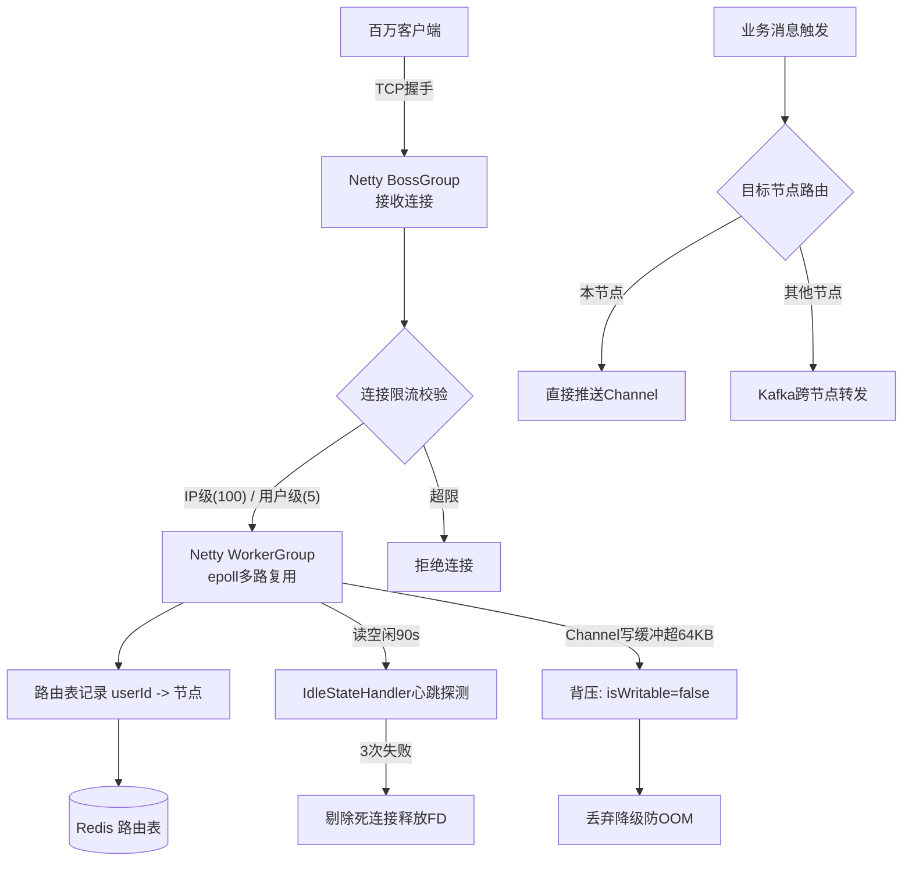
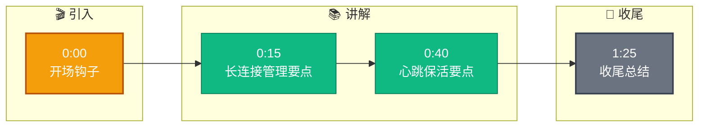

# 【Java 后端架构师】WebSocket 网关与长连接治理

> 适用场景：JD 实时消息（IM/直播/订单状态推送/物流跟踪）。百万用户同时在线，每个一条 WebSocket 长连接。架构师要设计的是"Netty 长连接管理 + 心跳保活 + 连接限流 + 水平扩展"的网关。

## 一、概念层：整体架构

```
客户端 WebSocket → LB（四层）→ 网关节点（Netty，水平扩展）
                                    ↓
                              ChannelGroup（本节点所有连接）
                                    ↓
                    心跳检测（IdleStateHandler）+ 限流 + 路由表

发送消息：查路由表（userId → 节点）→ MQ 发到目标节点 → 本地推送
```

## 二、机制层：Netty 长连接管理

```java
/**
 * Netty WebSocket Server：管理百万长连接
 */
public class WebSocketServer {

    public static void main(String[] args) throws Exception {
        EventLoopGroup bossGroup = new NioEventLoopGroup(1);     // 接收连接
        EventLoopGroup workerGroup = new NioEventLoopGroup();    // 处理 IO（默认 CPU*2）

        ServerBootstrap b = new ServerBootstrap();
        b.group(bossGroup, workerGroup)
         .channel(NioServerSocketChannel.class)
         .option(ChannelOption.SO_BACKLOG, 1024)                 // 连接队列
         .childOption(ChannelOption.TCP_NODELAY, true)
         .childOption(ChannelOption.SO_KEEPALIVE, true)
         .childHandler(new ChannelInitializer<SocketChannel>() {
             @Override
             protected void initChannel(SocketChannel ch) {
                 ChannelPipeline p = ch.pipeline();
                 // 空闲检测：90s 无读触发心跳
                 p.addLast(new IdleStateHandler(90, 0, 0,
                     TimeUnit.SECONDS));
                 p.addLast(new HttpServerCodec());
                 p.addLast(new HttpObjectAggregator(65536));
                 p.addLast(new WebSocketServerProtocolHandler("/ws"));
                 p.addLast(new WebSocketMessageHandler());
             }
         });

        ChannelFuture f = b.bind(8080).sync();
        f.channel().closeFuture().sync();
    }
}

/**
 * 连接管理：ChannelGroup + 路由表
 */
@Component
public class SessionManager {

    private final ChannelGroup channelGroup =
        new DefaultChannelGroup(GlobalEventExecutor.INSTANCE);
    private final Map<Long, Channel> userChannels =
        new ConcurrentHashMap<>();        // userId → channel
    private final RedisTemplate<String, String> redis;

    private static final String NODE_ID = "node-" + UUID.randomUUID();

    /**
     * 连接建立：注册到路由表
     */
    public void onConnect(Long userId, Channel channel) {
        channelGroup.add(channel);
        userChannels.put(userId, channel);
        // 写路由表：userId → 本节点
        redis.opsForValue().set("ws:route:" + userId, NODE_ID,
            Duration.ofMinutes(5));
    }

    /**
     * 连接断开：清理路由
     */
    public void onDisconnect(Long userId) {
        userChannels.remove(userId);
        redis.delete("ws:route:" + userId);
    }

    /**
     * 本地推送：给本节点的用户发消息
     */
    public boolean sendToLocal(Long userId, String message) {
        Channel channel = userChannels.get(userId);
        if (channel == null || !channel.isActive()) return false;
        channel.writeAndFlush(new TextWebSocketFrame(message));
        return true;
    }
}
```

## 三、机制层：心跳保活（IdleStateHandler）

```java
/**
 * 消息处理器：心跳检测 + 业务处理
 */
@ChannelHandler.Sharable
public class WebSocketMessageHandler extends
    SimpleChannelInboundHandler<TextWebSocketFrame> {

    private static final int MAX_IDLE_COUNT = 3;        // 3 次空闲断开
    private final AtomicInteger idleCounter = new AtomicInteger();

    @Override
    public void userEventTriggered(ChannelHandlerContext ctx, Object evt) {
        if (evt instanceof IdleStateEvent) {
            // 90s 无读：心跳探测
            int count = idleCounter.incrementAndGet();
            if (count >= MAX_IDLE_COUNT) {
                // 3 次空闲（270s 无响应）：断开死连接
                ctx.close();
                metrics.counter("ws.idle.disconnect").increment();
            } else {
                // 发心跳探测
                ctx.writeAndFlush(new TextWebSocketFrame(
                    "{\"type\":\"ping\"}"));
            }
        }
    }

    @Override
    protected void channelRead0(ChannelHandlerContext ctx,
        TextWebSocketFrame frame) {
        String text = frame.text();
        JsonObject msg = JsonParser.parseString(text).getAsJsonObject();
        String type = msg.get("type").getAsString();

        if ("pong".equals(type)) {
            // 客户端心跳响应：重置计数器
            idleCounter.set(0);
            return;
        }

        // 业务消息处理
        idleCounter.set(0);     // 任何消息都重置
        businessHandler.handle(ctx, msg);
    }

    @Override
    public void exceptionCaught(ChannelHandlerContext ctx, Throwable cause) {
        log.error("WebSocket 异常", cause);
        ctx.close();
    }
}
```

## 四、机制层：连接限流

```java
/**
 * 连接限流：IP 级 + 用户级 + 建连频率
 */
@Component
public class ConnectionRateLimiter {

    private final RedisTemplate<String, String> redis;

    private static final int MAX_CONN_PER_IP = 100;        // 单 IP 最多 100 连接
    private static final int MAX_CONN_PER_USER = 5;        // 单用户最多 5 连接
    private static final int MAX_CONNECT_RATE = 10;        // 单 IP 每秒最多 10 次建连

    public boolean tryAccept(String clientIp, Long userId) {
        // 1. 建连频率限流（令牌桶）
        String rateKey = "ws:rate:" + clientIp;
        Long count = redis.opsForValue().increment(rateKey);
        if (count == 1) redis.expire(rateKey, 1, TimeUnit.SECONDS);
        if (count > MAX_CONNECT_RATE) {
            log.warn("建连频率超限: ip={}", clientIp);
            return false;
        }

        // 2. IP 级连接数限制
        Long ipConn = redis.opsForValue().increment("ws:conn:ip:" + clientIp);
        if (ipConn > MAX_CONN_PER_IP) {
            redis.opsForValue().decrement("ws:conn:ip:" + clientIp);
            log.warn("IP 连接数超限: ip={}", clientIp);
            return false;
        }

        // 3. 用户级连接数限制
        if (userId != null) {
            Long userConn = redis.opsForValue()
                .increment("ws:conn:user:" + userId);
            if (userConn > MAX_CONN_PER_USER) {
                redis.opsForValue().decrement("ws:conn:user:" + userId);
                log.warn("用户连接数超限: userId={}", userId);
                return false;
            }
        }

        return true;
    }

    public void onDisconnect(String clientIp, Long userId) {
        redis.opsForValue().decrement("ws:conn:ip:" + clientIp);
        if (userId != null) {
            redis.opsForValue().decrement("ws:conn:user:" + userId);
        }
    }
}
```

## 五、机制层：背压（Backpressure）

```java
/**
 * 背压：防止发送过快导致写缓冲溢出 OOM
 */
@Component
public class BackpressureHandler {

    private static final int HIGH_WATER_MARK = 64 * 1024;    // 64KB 高水位

    public boolean sendSafely(Channel channel, String message) {
        // 1. 检查 channel 是否可写（写缓冲是否超过高水位）
        if (!channel.isWritable()) {
            // 写缓冲已满：丢弃或降级
            log.warn("Channel 不可写，丢弃消息: remote={}",
                channel.remoteAddress());
            metrics.counter("ws.backpressure.drop").increment();
            return false;
        }

        // 2. 配置高水位
        channel.config().setWriteBufferHighWaterMark(HIGH_WATER_MARK);

        // 3. 发送
        channel.writeAndFlush(new TextWebSocketFrame(message));
        return true;
    }
}
```

## 六、机制层：跨节点消息路由

```java
/**
 * 发送消息：查路由表，跨节点走 MQ
 */
@Service
public class MessageRouter {

    private final SessionManager sessionManager;
    private final KafkaTemplate<String, String> kafka;
    private final RedisTemplate<String, String> redis;

    public void send(Long userId, String message) {
        // 1. 查用户所在节点
        String nodeId = redis.opsForValue().get("ws:route:" + userId);

        if (NODE_ID.equals(nodeId)) {
            // 本节点：直接推送
            sessionManager.sendToLocal(userId, message);
        } else if (nodeId != null) {
            // 其他节点：走 MQ
            RouteMessage routeMsg = new RouteMessage(nodeId, userId, message);
            kafka.send("ws-route-topic", nodeId,
                JsonUtils.stringify(routeMsg));
        } else {
            // 离线：存离线消息
            offlineMessageService.save(userId, message);
        }
    }
}

/**
 * 监听 MQ：收到路由到本节点的消息
 */
@KafkaListener(topics = "ws-route-topic")
public void onRouteMessage(String data) {
    RouteMessage msg = JsonUtils.parse(data, RouteMessage.class);
    if (NODE_ID.equals(msg.getNodeId())) {
        sessionManager.sendToLocal(msg.getUserId(), msg.getMessage());
    }
}
```

## 七、底层本质：NIO 与连接治理的本质

**Netty NIO 的本质**：传统 BIO（阻塞 IO）每个连接占一个线程，万连接 = 万线程（线程切换开销爆炸）。NIO 靠 epoll/kqueue 多路复用——一个线程管理上万连接（事件驱动：连接有数据才处理）。Netty 的 workerGroup（默认 CPU*2 线程）管所有连接的 IO，单机轻松 10 万+ 连接。

**心跳的本质**：TCP 连接可能"假死"——对端断电/网络中断，但 FIN 包没发出，服务端以为连接还在（占资源）。心跳探测（90 秒无读触发）主动检测对端是否存活。3 次失败（270 秒）确认死连接，主动断开释放资源。间隔太短浪费带宽，太长死连接占资源久。90 秒是经验值（小于 NAT 超时通常 120 秒）。

**连接限流的本质**：恶意客户端可疯狂建连耗尽 FD（每连接占一个文件描述符）。单机 FD 上限（默认 1024，可调到 100 万）。IP 级限流（100 连接）防单 IP 耗尽，用户级（5 连接）防账号被盗刷，建连频率（10/秒）防 SYN flood 式攻击。

**背压的本质**：Netty 写是异步的（写到 ChannelBuffer），如果生产（服务端写）快于消费（客户端读），缓冲堆积 OOM。Channel.isWritable() 检查写缓冲是否超过高水位（默认 32KB），超了就丢弃或降级。这是**反压**——慢消费者反过来限制快生产者。

## 八、AI 工程化深挖

1. **怎么用 AI 预测连接负载？** 分析历史在线曲线（按小时/天/事件），LSTM 预测未来 1 小时连接数。预测峰值提前扩容。预测准确率 > 90% 可节省 20% 资源。

2. **怎么用 AI 检测异常连接？** 异常模式：单 IP 高频建连、短时间大量连接来自同一网段、连接后不发心跳。训练异常检测模型（Isolation Forest），命中的封禁。

3. **LLM 怎么集成到长连接？** IM 场景——用户消息走 WebSocket 到网关，网关转 LLM 推理（流式响应）。LLM 流式输出通过 WebSocket 推回客户端（SSE 类似）。注意 LLM 慢，要异步不阻塞 IO 线程。

4. **怎么用 AI 做连接质量评估？** 分析心跳延迟/丢包率/重连次数，给连接打分。质量差的主动迁移到更好节点或提示用户切网络。

5. **怎么用 LLM 分析网关日志？** 网关日志海量（百万连接），人工排查难。LLM 总结"今天连接异常集中在 XX 网段，原因是 XX 运营商路由问题"。运维提效。

## 九、记忆口诀与面试现场表达

### 1 分钟记忆口诀

抓 **"Netty、心跳、限流、路由"** 四个词。

- **Netty**：NIO epoll 多路复用，单机 10-50 万连接，workerGroup CPU*2 线程
- **心跳**：IdleStateHandler 90s 读空闲探测，3 次失败断开死连接
- **限流**：IP 级（100 连接）+ 用户级（5 连接）+ 建连频率（10/秒）
- **路由**：userId → 节点（Redis 路由表），跨节点走 MQ

### 面试现场 60 秒回答

> WebSocket 网关用 Netty NIO——bossGroup 接连接（1 线程），workerGroup 处理 IO（CPU*2 线程），靠 epoll 多路复用单线程管万连接，单机扛 10-50 万长连接。心跳用 IdleStateHandler——90 秒读空闲触发心跳探测（发 ping），3 次失败（270 秒）确认死连接主动断开。90 秒小于 NAT 超时（120 秒）。连接限流三层：IP 级（单 IP 100 连接）+ 用户级（单用户 5 连接）+ 建连频率（单 IP 每秒 10 次），防恶意连接耗尽 FD。背压用 Channel.isWritable()——写缓冲超 64KB 高水位丢弃消息防 OOM。水平扩展：用户连任意节点，路由表（Redis key=ws:route:userId value=nodeId，TTL 5 分钟）记录 userId → 节点。发送消息查路由——本节点直接推，其他节点走 Kafka 路由。离线存离线消息表上线补发。监控 connection_count、heartbeat_failure_rate、backpressure_drop_rate。调优：ulimit -n 1000000 调大 FD、ByteBuf 池化（PooledByteBufAllocator）、堆外内存减少 GC。

## 十、常见考点

1. **单机支撑多少连接？**——10-50 万（内存/FD 限制）。每连接约 4KB（ByteBuf），10 万 ≈ 400MB。调 ulimit -n、堆外内存、ByteBuf 池化。
2. **心跳怎么设计？**——IdleStateHandler 90s 读空闲触发探测，3 次失败（270s）断开。间隔 < NAT 超时（120s）。
3. **怎么防恶意连接？**——三层限流：IP 级（100 连接）+ 用户级（5 连接）+ 建连频率（10/秒）。令牌桶实现。
4. **网关怎么扩展？**——水平扩展，用户连任意节点。路由表（Redis）记录 userId → 节点。跨节点消息走 MQ 路由。
5. **背压怎么处理？**——Channel.isWritable() 检查写缓冲水位。超 64KB 高水位丢弃或降级，防 OOM。慢消费者反压快生产者。

## 结构化回答

**30 秒电梯演讲：** WebSocket 网关的核心是Netty 长连接管理 + 心跳保活 + 连接限流。百万长连接靠 Netty 的 NIO（单机 10 万+ 连接）。心跳检测（idle handler）剔除死连接。连接限流（IP/用户级）防恶意连接耗尽资源

**展开框架：**
1. **长连接管理** — Netty NioServerSocketChannel + ChannelGroup
2. **心跳保活** — IdleStateHandler（读空闲 90s 触发心跳，3 次失败断开）
3. **连接限流** — IP/用户级令牌桶（单 IP 最多 100 连接）

**收尾：** 以上是我的整体思路。您想继续深入聊——单机支撑多少连接？

## 流程图



## 视频脚本

> 预计时长：1 分 30 秒 | 由浅入深

| 时间 | 画面/字幕 | 口播台词 | 讲解要点 |
|------|----------|----------|----------|
| 0:00 | 标题卡：WebSocket 网关与长连接治理 | "这题一句话：WebSocket 网关的核心是Netty 长连接管理 + 心跳保活 + 连接限流。" | 开场钩子 |
| 0:15 | 长连接管理示意/对比图 | "Netty NioServerSocketChannel + ChannelGroup" | 长连接管理要点 |
| 0:40 | 心跳保活示意/对比图 | "IdleStateHandler（读空闲 90s 触发心跳，3 次失败断开）" | 心跳保活要点 |
| 1:25 | 总结卡 | "记住：长连接。下期见。" | 收尾 |

### 视频流程图



## 苏格拉底式面试追问

这组追问训练你在面试现场一层层逼近本质。每一问先回答"为什么"，再回答"怎么做"，最后回答"如何证明"。

| 追问层级 | 面试官可能这样问 | 高分回答方向 |
|----------|------------------|--------------|
| 目标追问 | 为什么选 WebSocket 长连接而不是 HTTP 轮询/SSE？ | WebSocket 双向（服务端可主动推）、低开销（一次握手后复用连接）、低延迟（无轮询间隔）。HTTP 轮询浪费带宽（无消息也问），SSE 只能单向（服务端推客户端不能上行）。IM/订单状态推送这类双向实时场景必须 WebSocket |
| 证据追问 | 你怎么证明百万长连接真的扛住了、没大面积断？ | 监控 online_connection_count（在线连接数，应稳定接近预期）、heartbeat_failure_rate（心跳失败率，应 < 0.5%，超了说明大量死连接未清理）、reconnect_storm_count（重连风暴次数，应 = 0）、backpressure_drop_rate（背压丢消息率，应 < 0.1%，超了说明下游消费不动）、cross_node_route_latency（跨节点路由延迟，应 < 50ms）|
| 边界追问 | IdleStateHandler 90 秒读空闲、3 次失败断开，这阈值怎么定？ | 90 秒 < NAT 超时（运营商通常 120 秒）——超过 NAT 会断链，心跳白做。3 次失败（270 秒）= 容忍短暂网络抖动（手机切 WiFi 抖动 30 秒），不是一抖动就断。客户端 30 秒主动发一次心跳（3:1 比例），服务端 90 秒没收到业务消息才探测。监控 heartbeat_failure_rate 看阈值是否合理（过高说明误杀）|
| 反例追问 | 给一个背压丢消息导致业务故障的反例？ | 某大 V 直播间百万在线，主播推一条消息要推给百万连接。某节点 10 万连接，写缓冲瞬间堆积（isWritable=false），网关按设计丢弃消息（防 OOM）。结果这 10 万用户没收到消息，投诉。根因：广播没分级。修复：广播走异步 MQ 分批推送（每批 1 万），超时未推的下发"稍后查看"。监控 broadcast_loss_rate 按房间拆 |
| 风险追问 | 网关节点扩容/缩容时已有连接怎么办？缩容会不会把用户全断了？ | 缩容风险大——直接停节点，连到该节点的用户全断，百万用户重连风暴。对策：优雅下线——先从 LB 摘流量（新连接不来），给存量连接发"请重连"通知，客户端收到后主动断 + 随机退避重连（避免同步）。监控 graceful_shutdown_success_rate 和 reconnect_peak_qps |
| 验证追问 | 跨节点路由（A 用户在节点 1，B 发消息给 A）真的能可靠送达吗？ | 发送方查路由表（Redis ws:route:userId → nodeId），目标节点和本节点不一致走 Kafka。Kafka at-least-once，但 WebSocket 推送可能失败（连接刚断）。兜底：推送失败存离线消息表，用户上线补发。监控 route_message_loss_count（路由丢消息数，应 = 0）和 offline_message_count（离线消息堆积）|
| 沉淀追问 | 多业务都要长连接（IM/直播/订单推送），怎么避免每业务自建网关？ | 沉淀通用 WebSocketGateway——连接管理 + 心跳 + 限流 + 路由通用，业务只声明消息协议和路由 key（如订单推送按 userId 路由，直播按 roomId 路由）。提供 connection_count 看板按业务拆。共享限流策略（防某业务暴增影响其他业务）|

### 现场对话示例

**面试官**：你说单机扛 10-50 万长连接，但每连接占 4KB ByteBuf，10 万就是 400MB。如果突发流量百万用户同时在线，单机扛得住吗？

**候选人**：单机扛不住——百万连接 4GB 内存 + FD 占用。百万并发必须水平扩展（多台网关节点）。容量规划按"单机 10 万连接 × N 节点"算，百万在线需要 10 节点。突发流量用 K8s HPA（CPU > 70% 自动扩容）。监控 connection_count 每节点，超 8 万预警（留余量）。扩容不是无上限——路由表（Redis）和跨节点 MQ 也有压力，百万在线下路由表 100 万 key 占 Redis 内存几百 MB，可承受。

**面试官**：客户端 30 秒发一次心跳，百万在线每秒 3.3 万次心跳，这压力网关扛得住吗？

**候选人**：心跳是轻量消息（几十字节 ping/pong），Netty NIO 处理心跳是事件驱动（不占业务线程），3.3 万 QPS 心跳单节点轻松扛（CPU 占用 < 5%）。真正的压力不是心跳本身，而是心跳触发的 IdleStateHandler 检查——但这是 in-memory 操作（检查 lastReadTime），O(1) 复杂度。监控 heartbeat_cpu_usage（应 < 10%）和 heartbeat_latency（应 < 5ms）。

**面试官**：用户在 WiFi 和 4G 之间切换，IP 变了，连接怎么处理？

**候选人**：IP 变了 TCP 连接会断（TCP 四元组变了）。客户端检测到网络变化主动重连，用 userId 鉴权（不是 IP）。服务端识别同一 userId 的新连接，替换旧 session（旧连接可能还没断，靠心跳超时清理）。重连后路由表更新（userId → 新节点）。风险：双连接期间消息可能推到旧连接（用户看不到）。兜底：客户端重连时拉取"最近 N 条消息"补全。监控 network_switch_reconnect_rate（网络切换重连率）。


