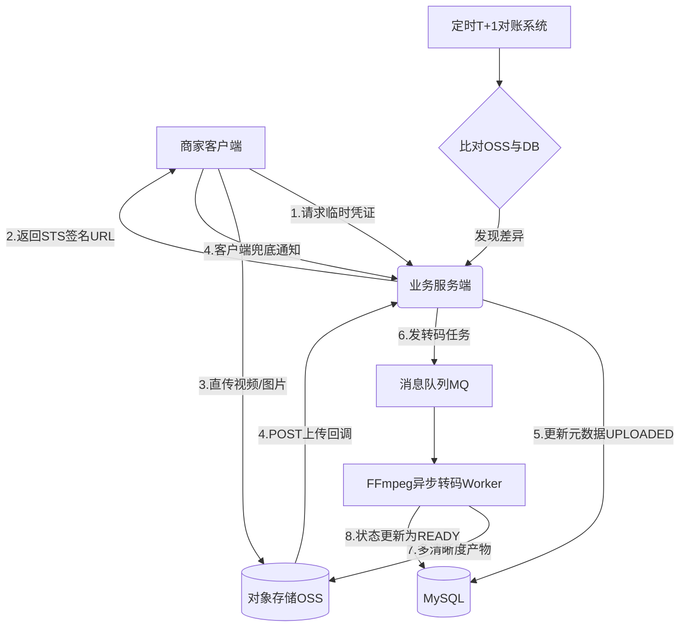

# 【Java 后端架构师】对象存储回调、转码与元数据一致性

> 适用场景：JD 商品图片/视频上传。商家上传 GB 级商品视频，不能经过服务端转发（耗尽带宽）。架构师要设计的是"客户端直传 + 上传回调 + 异步转码 + 元数据对账"的对象存储方案。

## 一、概念层：上传流程

```
客户端 ← 服务端发 STS 签名 URL（15 分钟有效）
    ↓
客户端直传对象存储（PUT，不经过服务端）
    ↓
对象存储上传成功 → POST 回调服务端（fileId, size, customParams）
    ↓
服务端更新 DB 元数据（状态 UPLOADED）→ 发转码任务到 MQ
    ↓
转码 worker 消费 → FFmpeg/图片库转码 → 更新 DB（状态 READY）

一致性兜底：T+1 对账（扫对象存储 vs DB 比对）
```

## 二、机制层：STS 签名 URL（客户端直传）

```java
@Service
public class UploadTokenService {

    private final OssClient ossClient;

    /**
     * 生成 STS 签名 URL：客户端用这个 URL 直传
     */
    public UploadToken generateToken(String userId, String fileExt) {
        String fileId = generateFileId();
        String objectKey = "uploads/" + fileId + "." + fileExt;

        // 生成临时签名 URL（15 分钟有效，限 PUT 操作）
        String signedUrl = ossClient.generatePresignedPutUrl(
            objectKey,
            Duration.ofMinutes(15),
            500 * 1024 * 1024L      // 最大 500MB
        );

        // 记录待上传任务（回调时校验）
        uploadTaskRepo.save(new UploadTask(fileId, userId, objectKey,
            UploadStatus.TOKEN_ISSUED, System.currentTimeMillis()));

        return new UploadToken(fileId, signedUrl, objectKey);
    }
}
```

## 三、机制层：上传回调处理

```java
@Service
@Slf4j
public class UploadCallbackController {

    private final FileMetaRepo fileRepo;
    private final UploadTaskRepo taskRepo;
    private final KafkaTemplate<String, String> kafka;

    /**
     * 对象存储回调接口（上传成功后调用）
     * 对象存储 POST：{bucket, key, size, etag, customParams:{fileId}}
     */
    @PostMapping("/api/upload/callback")
    public CallbackResponse callback(@RequestBody CallbackRequest req) {
        String fileId = req.getCustomParams().get("fileId");
        String objectKey = req.getKey();
        long size = req.getSize();

        log.info("上传回调: fileId={} key={} size={}", fileId,
            objectKey, size);

        // 1. 校验任务存在（防伪造回调）
        UploadTask task = taskRepo.findByFileId(fileId);
        if (task == null) {
            log.warn("回调任务不存在，可能是伪造: fileId={}", fileId);
            return CallbackResponse.fail("invalid fileId");
        }

        // 2. 幂等检查（防重复回调）
        if (task.getStatus() == UploadStatus.UPLOADED
            || task.getStatus() == UploadStatus.TRANSCODING) {
            log.info("回调已处理，跳过: fileId={}", fileId);
            return CallbackResponse.success();
        }

        // 3. 更新元数据
        FileMeta meta = new FileMeta(fileId, task.getUserId(),
            objectKey, size, FileStatus.UPLOADED);
        fileRepo.save(meta);

        // 4. 触发异步转码
        kafka.send("transcode-topic", fileId,
            JsonUtils.stringify(new TranscodeTask(fileId, objectKey,
                size, detectMediaType(objectKey))));

        // 5. 更新任务状态
        taskRepo.updateStatus(fileId, UploadStatus.UPLOADED);

        metrics.counter("upload.callback.success").increment();
        return CallbackResponse.success();
    }
}
```

## 四、机制层：异步转码（图片/视频）

```java
/**
 * 转码 worker：图片缩放/视频转 H.264
 */
@Service
@Slf4j
public class TranscodeService {

    private final OssClient ossClient;
    private final FileMetaRepo fileRepo;
    private final FfmpegClient ffmpeg;

    @KafkaListener(topics = "transcode-topic")
    public void transcode(TranscodeTask task) {
        String fileId = task.getFileId();

        try {
            fileRepo.updateStatus(fileId, FileStatus.TRANSCODING);

            String mediaType = task.getMediaType();
            if (mediaType.startsWith("image/")) {
                transcodeImage(task);
            } else if (mediaType.startsWith("video/")) {
                transcodeVideo(task);
            }

            fileRepo.updateStatus(fileId, FileStatus.READY);
            metrics.counter("transcode.success").increment();

        } catch (Exception e) {
            log.error("转码失败: fileId={}", fileId, e);
            fileRepo.updateStatus(fileId, FileStatus.TRANSCODE_FAILED);
            metrics.counter("transcode.failed").increment();
        }
    }

    /**
     * 图片转码：生成多尺寸缩略图
     */
    private void transcodeImage(TranscodeTask task) {
        String originalKey = task.getObjectKey();
        String fileId = task.getFileId();

        int[] sizes = {100, 300, 600, 1200};     // 缩略图尺寸

        for (int size : sizes) {
            String thumbKey = "thumbnails/" + fileId + "_" + size + ".webp";
            // 下载原图 → 缩放 → 转 WebP → 上传
            try (InputStream input = ossClient.download(originalKey)) {
                BufferedImage img = ImageIO.read(input);
                BufferedImage resized = resize(img, size);
                byte[] webp = convertToWebP(resized);
                ossClient.upload(thumbKey, webp);
            }
        }
    }

    /**
     * 视频转码：H.264 + 多清晰度
     */
    private void transcodeVideo(TranscodeTask task) {
        String fileId = task.getFileId();
        String originalKey = task.getObjectKey();

        // FFmpeg 转码：1080p → 720p + 480p
        String[] resolutions = {"1280x720", "854x480"};

        for (String resolution : resolutions) {
            String transcodeKey = "videos/" + fileId + "_"
                + resolution + ".mp4";

            // FFmpeg 命令：转 H.264 + 调整分辨率
            ffmpeg.transcode(originalKey, transcodeKey,
                "libx264", resolution, "medium", "23");  // CRF 23
        }
    }
}
```

## 五、机制层：元数据一致性对账

```java
/**
 * T+1 对账：扫对象存储和 DB 比对，发现不一致修复
 */
@Service
@Slf4j
public class FileReconcileService {

    private final OssClient ossClient;
    private final FileMetaRepo fileRepo;

    @Scheduled(cron = "0 0 2 * * ?")       // 每天凌晨 2 点
    public void reconcile() {
        // 1. 扫对象存储所有文件
        Iterator<OssObject> ossIter = ossClient.listObjects("uploads/");

        while (ossIter.hasNext()) {
            OssObject obj = ossIter.next();
            String key = obj.getKey();

            // 2. 查 DB 是否有对应元数据
            FileMeta meta = fileRepo.findByStoragePath(key);

            if (meta == null) {
                // 对象存储有但 DB 没有：回调丢失，补录
                log.warn("对账发现孤儿文件，补录: key={}", key);
                repairMetadata(obj);
            } else if (meta.getStatus() == FileStatus.UPLOADED
                && System.currentTimeMillis() - meta.getCreateTime()
                > 30 * 60_000) {
                // 上传后 30 分钟还在 UPLOADED：转码任务丢失，重发
                log.warn("对账发现未转码，重发: fileId={}",
                    meta.getFileId());
                resendTranscode(meta);
            }
        }

        // 3. 反向检查：DB 有但对象存储没有的（已删文件清理 DB）
        List<FileMeta> orphans = fileRepo.findOrphansInDB();
        for (FileMeta meta : orphans) {
            log.warn("对账发现 DB 孤儿记录，清理: fileId={}",
                meta.getFileId());
            fileRepo.delete(meta.getFileId());
        }
    }
}
```

## 六、机制层：回调失败兜底

```java
/**
 * 回调失败兜底：客户端上传完也通知服务端
 * 防止对象存储回调丢失导致文件"上传成功但 DB 无记录"
 */
@Service
public class ClientNotifyService {

    /**
     * 客户端上传完后主动通知（兜底回调）
     */
    @PostMapping("/api/upload/notify")
    public void clientNotify(@RequestBody NotifyRequest req) {
        // 复用回调处理逻辑
        callbackService.callback(req.toCallbackRequest());
    }
}
```

## 七、底层本质：直传与一致性的本质

**客户端直传的本质**：传统上传（客户端 → 服务端 → 对象存储）服务端要接收完整文件再转发，带宽翻倍且耗尽服务端带宽。直传（客户端 → 对象存储）省去服务端转发，服务端只处理元数据。关键安全问题是授权——不能给客户端永久 AK/SK（泄露风险）。用 STS 临时 token（15 分钟有效 + 限制操作 + 限制 key），最小权限原则。

**回调的本质**：对象存储上传成功后主动通知服务端。这是**事件驱动**——服务端不需要轮询对象存储检查文件是否上传完。回调带自定义参数（fileId），服务端据此更新 DB。回调可能失败（网络/服务端宕机），对象存储自动重试（3 次）。极端情况重试都失败，靠客户端兜底通知（上传完客户端也调服务端）+ T+1 对账兜底。

**异步转码的本质**：转码是 CPU 密集（FFmpeg 转视频要分钟级）。同步转码会让回调接口超时（用户等待）。异步发 MQ，转码 worker 消费执行。用户看到的是"上传成功，转码中"，转码完异步通知。这是**读写分离**的变体——上传（快）和转码（慢）分离。

**元数据一致性的本质**：文件在对象存储，元数据在 DB，两者可能不一致（上传成功回调失败 = 对象存储有文件但 DB 无记录；转码失败 = DB 状态卡在 TRANSCODING）。靠三层保证：
1. **状态机**：UPLOADED→TRANSCODING→READY，每步幂等更新。
2. **回调 + 客户端兜底**：双通道保证回调不丢。
3. **T+1 对账**：扫对象存储和 DB 比对，发现不一致修复（孤儿文件补录、未转码重发）。

**为什么不用分布式事务？** 跨对象存储（HTTP API）和 DB（事务）的分布式事务成本高（两阶段提交、锁）。用**最终一致性**（回调 + 重试 + 对账）性能好，容忍短暂不一致。

## 八、AI 工程化深挖

1. **怎么用 AI 做智能转码？** 传统固定参数（CRF 23）。AI 根据视频内容（运动剧烈/静态）动态调参数——运动多的用低压缩保质量，静态的用高压缩省带宽。降低 30% 存储成本。

2. **怎么用 AI 生成缩略图？** 传统取视频第一帧或图片中心裁剪。AI 识别画面主体（人脸/商品），智能裁剪到主体居中。提升缩略图点击率。

3. **怎么用 LLM 做文件描述生成？** 上传后 LLM 看图/视频生成描述（"红色连衣裙模特图"），用于搜索/推荐。比人工打标签高效。

4. **怎么用 AI 预测转码耗时？** 根据文件大小/分辨率/帧率/编码格式预测转码时间。超阈值（如 > 10 分钟）告警或拆分。提升转码队列管理。

5. **怎么用 AI 检测异常上传？** 异常模式：单账号高频上传/大量重复文件（刷量）/异常文件类型。AI 检测限流。

## 九、记忆口诀与面试现场表达

### 1 分钟记忆口诀

抓 **"直传、回调、转码、对账"** 四个词。

- **直传**：STS 签名 URL（15 分钟），客户端直传对象存储省服务端带宽
- **回调**：对象存储 POST callback 通知服务端，重试 3 次 + 客户端兜底
- **转码**：异步 MQ + FFmpeg/图片库，状态 UPLOADED→TRANSCODING→READY
- **对账**：T+1 扫对象存储 vs DB 比对，孤儿文件补录/未转码重发

### 面试现场 60 秒回答

> 对象存储我用客户端直传 + 回调 + 异步转码 + 对账。客户端直传——服务端发 STS 签名 URL（临时 token，15 分钟有效，限 PUT 指定 key + 最大 500MB），客户端用这个 URL 直接 PUT 到对象存储，不经过服务端（省服务端带宽，避免 GB × 万用户耗尽带宽）。不用永久 AK/SK（泄露风险），STS 最小权限。上传成功后对象存储 POST 回调服务端（带 fileId/size），服务端校验任务存在（防伪造）+ 幂等检查（防重复）+ 更新 DB 元数据状态为 UPLOADED + 发转码任务到 MQ。回调失败对象存储自动重试 3 次，极端情况靠客户端兜底通知（上传完客户端也调服务端）。异步转码——转码 worker 消费 MQ，图片生成多尺寸缩略图（WebP），视频用 FFmpeg 转 H.264 多清晰度（720p/480p）。转码是 CPU 密集（分钟级），异步不阻塞上传接口。状态机 UPLOADED→TRANSCODING→READY。元数据一致性三层保证：状态机（每步幂等）+ 回调和客户端兜底双通道（回调不丢）+ T+1 对账（扫对象存储和 DB 比对，孤儿文件补录、未转码重发）。不用分布式事务（跨 HTTP API 和 DB 成本高），用最终一致性。监控 callback_success_rate、transcode_duration、reconcile_orphan_count。

## 十、常见考点

1. **客户端为什么直传？**——省服务端带宽。大文件经过服务端转发带宽翻倍。直传对象存储，服务端只处理元数据。用 STS 临时授权（15 分钟有效 + 限制 key/size）。
2. **回调失败怎么办？**——对象存储自动重试 3 次。仍失败靠客户端兜底通知（上传完客户端也调服务端）+ T+1 对账兜底。
3. **转码为什么异步？**——CPU 密集（FFmpeg 转视频分钟级）。同步会让回调接口超时。异步发 MQ，转码 worker 消费执行。
4. **元数据怎么一致？**——三层：状态机（UPLOADED→TRANSCODING→READY 幂等）+ 回调和客户端兜底双通道 + T+1 对账（扫对象存储 vs DB）。
5. **STS 签名 URL 安全吗？**——临时 token（15 分钟过期），限制操作（只能 PUT 指定 key）+ 大小限制。不用永久 AK/SK 给客户端（泄露风险）。

## 结构化回答

**30 秒电梯演讲：** 对象存储回调的核心是上传回调 + 异步转码 + 元数据最终一致。客户端直传对象存储（省服务端带宽），上传成功后对象存储回调服务端。转码（图片缩放/视频转 H.264）异步触发，转码完更新元数据。元数据一致性靠回调 + 状态机 + 对账保证

**展开框架：**
1. **客户端直传** — 服务端发签名 URL，客户端直传对象存储（省服务端带宽）
2. **上传回调** — 对象存储上传成功后回调服务端（POST callback）
3. **异步转码** — 图片缩放/视频转码，转码完更新元数据

**收尾：** 以上是我的整体思路。您想继续深入聊——客户端怎么直传？

## 流程图



## 视频脚本

> 预计时长：1 分 30 秒 | 由浅入深

| 时间 | 画面/字幕 | 口播台词 | 讲解要点 |
|------|----------|----------|----------|
| 0:00 | 标题卡：对象存储回调、转码与元数据一致性 | "这题一句话：对象存储回调的核心是上传回调 + 异步转码 + 元数据最终一致。" | 开场钩子 |
| 0:15 | 客户端直传示意/对比图 | "服务端发签名 URL，客户端直传对象存储（省服务端带宽）" | 客户端直传要点 |
| 0:40 | 上传回调示意/对比图 | "对象存储上传成功后回调服务端（POST callback）" | 上传回调要点 |
| 1:25 | 总结卡 | "记住：客户端直传。下期见。" | 收尾 |

## 苏格拉底式面试追问

这组追问训练你在面试现场一层层逼近本质。每一问先回答"为什么"，再回答"怎么做"，最后回答"如何证明"。

| 追问层级 | 面试官可能这样问 | 高分回答方向 |
|----------|------------------|--------------|
| 目标追问 | 为什么要客户端直传？服务端转发不就是多一层吗？ | 大文件（GB 级）经服务端转发，服务端带宽翻倍（接收 + 转发），且万用户并发上传会瞬间打满服务端带宽。客户端直传对象存储省去服务端转发，服务端只处理元数据（几 KB）。成本算账：1GB 文件 × 万用户 = 10TB，直传省下服务端这 10TB 流量。这是"重计算下沉到存储层"的设计 |
| 证据追问 | 你怎么证明回调没大面积丢、元数据和实际文件一致？ | 监控 callback_success_rate（回调成功率，应 > 99.9%，低于说明回调链路有问题）、callback_retry_count（回调重试次数，每次重试都是一次回调失败的补救）、transcode_duration_p99（转码耗时 P99，应 < 业务预期如视频 5 分钟）、reconcile_orphan_count（对账发现的孤儿文件数，应 < 总量 0.1%，超了说明回调丢失多）、transcode_failed_count（转码失败数，应 < 1%）|
| 边界追问 | STS 签名 URL 15 分钟有效期——这时间怎么定？ | 15 分钟是 trade-off：太短用户上传大文件没传完 URL 过期（GB 文件上传可能要 10 分钟），太长 URL 被截获后滥用风险大（恶意用户拿 URL 上传垃圾文件占存储）。15 分钟覆盖大多数大文件上传时间 + 安全窗口。超时兜底：客户端检测 URL 过期重新申请（断点续传）。监控 sts_expire_before_upload_count（URL 过期前未上传完的次数，过高说明时间太短）|
| 反例追问 | 给一个回调丢失导致文件"上传成功但 DB 无记录"的反例？ | 用户上传完视频，对象存储回调服务端，但服务端正在发布（重启中），回调失败。对象存储重试 3 次都失败（服务端还没起来）。结果：对象存储有文件，DB 无记录——文件成了"孤儿"。用户看到"上传失败"但实际文件已存（占存储费）。修复：T+1 对账扫对象存储和 DB 比对，发现孤儿补录元数据。客户端兜底通知（上传完客户端也调服务端）。监控 reconcile_orphan_count |
| 风险追问 | 转码 worker 挂了，堆积大量转码任务怎么办？ | 转码任务在 MQ（Kafka）堆积。worker 重启后消费堆积——但如果堆积太多（10 万任务），恢复慢，用户等转码等到超时。对策：转码 worker 水平扩展（多实例消费）+ 优先级队列（VIP 用户/付费用户优先转码）+ 转码超时降级（视频直接用原文件，不转码多清晰度）。监控 transcode_backlog_count（转码堆积数，应 < 1000）和 transcode_queue_lag（队列延迟）|
| 验证追问 | T+1 对账真的发现了所有不一致吗？每天一次够吗？ | T+1 对账有窗口期——当天上传的文件如果回调丢失，要到第二天对账才发现（24 小时延迟）。高频场景（如商家批量上传商品图）一天可能丢几百个回调。优化：增量对账——每小时扫最近 2 小时上传的文件（缩小窗口），T+1 全量对账兜底。监控 reconcile_diff_rate（对账差异率，应 < 0.1%）和 time_to_repair（发现到修复的时长，应 < 1 小时）|
| 沉淀追问 | 多业务都要文件上传（商品图/评价视频/身份认证），怎么避免重复造轮子？ | 沉淀通用 FileServiceSDK——STS 签发 + 回调处理 + 异步转码 + 对账通用，业务只声明文件类型（图片/视频）和转码规格。提供 callback_success_rate 和 transcode_duration 看板按业务拆。共享转码 worker 池（多业务复用降低成本）。监控按业务拆 storage_cost（存储成本）和 transcode_cost（转码成本）|

### 现场对话示例

**面试官**：你说客户端直传省服务端带宽，但 STS 签名 URL 也是服务端发的，签名服务不也是瓶颈？

**候选人**：签名服务是轻量计算（生成 token 几毫秒），不像文件转发那样占带宽。单实例轻松扛万 QPS 签名请求。真正的瓶颈是网络带宽不是 CPU。而且签名服务可以水平扩展（无状态），扛百万 QPS 没问题。监控 sts_issue_latency（签名签发延迟，应 < 10ms）和 sts_issue_qps。如果签名服务真成瓶颈，可以预签名（客户端登录时批量签发多个 URL 缓存）。

**面试官**：转码异步用 Kafka，但如果同一条转码消息被重复消费（Kafka at-least-once），同一个文件被转码两次怎么办？

**候选人**：转码本身是幂等的——同一个文件转码两次，输出文件 key 相同（videos/{fileId}_720p.mp4），第二次覆盖第一次（对象存储 PUT 同 key 覆盖）。所以重复消费不会产生副作用（除了浪费转码资源）。更严格的幂等：转码前查 DB 状态，如果已经是 READY 或 TRANSCODING 就跳过（状态机 CAS）。监控 duplicate_transcode_count（重复转码次数，应接近 0）。成本上重复转码浪费 CPU，所以靠状态机前置检查避免。

**面试官**：对象存储回调可能被伪造（恶意用户直接调回调接口传假 fileId），怎么防？

**候选人**：回调接口要校验签名——对象存储回调时带签名头（用对象存储的 AK/SK 签名），服务端验签。伪造请求没有正确签名会被拒。另外业务校验——回调带的 fileId 必须在 upload_task 表存在（TOKEN_ISSUED 状态），不存在的是伪造。双保险：签名校验（防外部伪造）+ 任务存在校验（防重放/瞎构造）。监控 invalid_callback_count（无效回调数，应 = 0，非 0 说明有伪造尝试）。


