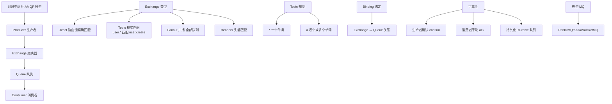
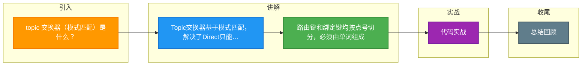

# topic 交换器（模式匹配）是什么？

**Topic 交换器**是 RabbitMQ 中最灵活的一种交换器类型，通过**模式匹配**将消息路由到匹配的队列。它解决了 Direct 交换器只能精确匹配 Routing Key 的问题，允许模糊匹配。

## 工作原理

Topic 交换器将 **routing key**（消息发送时指定）和 **binding key**（队列绑定时指定）都按点号（`.`）切分成单词，然后用特定的通配符进行匹配。

| 通配符 | 含义 | 匹配示例 | 
|--------|------|----------|
| `*` (星号) | 匹配**恰好一个**单词 | `order.*` 匹配 `order.create`，但不匹配 `order` 或 `order.create.vip` |
| `#` (井号) | 匹配**零个或多个**单词 | `order.#` 匹配 `order`、`order.create`、`order.create.vip` |

## 路由示例

**场景配置**：
- Exchange: `topic_exchange` (type=topic)
- 绑定关系：
  - 队列 `Q1` 绑定 key: `*.orange.*`
  - 队列 `Q2` 绑定 key: `*.*.rabbit`
  - 队列 `Q2` 绑定 key: `lazy.#`

**消息路由流程**：
```
消息 A: routing_key = "quick.orange.rabbit"
  → 匹配 Q1 (*.orange.*) ✓
  → 匹配 Q2 (*.*.rabbit) ✓
  → 结果: 同时投递给 Q1 和 Q2

消息 B: routing_key = "lazy.orange.elephant"
  → 匹配 Q1 (*.orange.*) ✓
  → 匹配 Q2 (lazy.#)    ✓
  → 结果: 同时投递给 Q1 和 Q2

消息 C: routing_key = "lazy.pink.rabbit"
  → 匹配 Q1 (失败，不匹配 orange)
  → 匹配 Q2 (*.*.rabbit) ✓
  → 匹配 Q2 (lazy.#)    ✓
  → 结果: 投递给 Q2 (注意：同一个队列收到一次，去重)

消息 D: routing_key = "quick.brown.fox"
  → 无匹配
  → 结果: 消息丢弃
```

### 路由拓扑示意图

```text
                         +------------------+
                         |  Topic Exchange  |
                         | (order_exchange) |
                         +--------+---------+
                                  |
       ---------------------------+---------------------------
       |                          |                           |
  Binding: order.create     Binding: order.#          Binding: *.vip
       |                          |                           |
       v                          v                           v
+-------------+           +-------------+           +-------------+
| Queue: Q1   |           | Queue: Q2   |           | Queue: Q3   |
| (Create)    |           | (All Order) |           | (VIP only)  |
+-------------+           +-------------+           +-------------+
```

## 实战案例
在微服务日志收集系统中，我们使用 Topic Exchange 接收不同服务日志。曾出现一条日志被重复消费导致数据库死锁，原因是 Routing Key 设为 `sys.error`，同时匹配了绑定 Key `*.error`（具体错误订阅）和 `#`（全量日志备份），这两个队列属于同一消费者组的两个不同实例，引发了并发竞争。

## 代码示例 (Java Spring Boot)
```java
// 生产者发送
// 场景：发送一个VIP用户的创建订单事件
String routingKey = "order.create.vip"; 
rabbitTemplate.convertAndSend("topic_exchange", routingKey, orderDto);

// 消费者绑定
// 场景1：只关注所有创建订单
@RabbitListener(bindings = @QueueBinding(
    value = @Queue(value = "order_create_queue", durable = "true"),
    exchange = @Exchange(value = "topic_exchange", type = ExchangeTypes.TOPIC),
    key = "order.create.*"
))
public void handleCreateOrder(OrderDto order) { }

// 场景2：关注所有VIP订单
@RabbitListener(bindings = @QueueBinding(
    value = @Queue(value = "vip_order_queue"),
    exchange = @Exchange(value = "topic_exchange", type = ExchangeTypes.TOPIC),
    key = "*.vip"
))
public void handleVipOrder(OrderDto order) { }
```

## 对比表格
| 交换器类型 | 路由规则 | 复杂度 | 适用场景 |
| :--- | :--- | :--- | :--- |
| **Direct** | 精确匹配 Routing Key | 低 | 简单的任务分发，点对点 |
| **Fanout** | 广播，忽略 Routing Key | 最低 | 广播通知，缓存同步 |
| **Topic** | 模式匹配 (`*`, `#`) | 高 | 多层级日志，多租户/地域路由 |
| **Headers** | 匹配 Header 键值对 | 中 | 复杂条件路由（较少用） |

## 适用场景

1.  **按业务层级订阅**：如 `logs.error.#` 订阅所有错误日志，`logs.*` 订阅所有一级日志。
2.  **多租户/分区分发**：`user.{userId}.command` 针对特定用户投递指令。


## 核心架构图



## 记忆要点

- Topic交换器基于模式匹配，解决了Direct只能精确匹配的问题。
- 路由键和绑定键均按点号切分，必须由单词组成。
- 通配符对比：*匹配恰好1个单词，而#匹配0或多个单词。
- 一条消息可同时匹配多个队列，但同一队列只投递一次。

## 结构化回答


**30 秒电梯演讲：** 像订阅邮件列表，可以用“科技.*”订阅所有科技类话题，或用“#.AI”订阅包含AI的所有话题。

**展开框架：**
1. **支持*（匹配一个** — 支持*（匹配一个单词）和#（匹配多个）通配符
2. **Routing** — Key和Binding Key进行模式匹配
3. **比Direct和** — 比Direct和Fanout更灵活

**收尾：** topic 交换器的 routing key 有长度限制吗？


## 视频脚本

> 预计时长：2 分钟 | 由浅入深

| 时间 | 画面/字幕 | 口播台词 | 讲解要点 |
|------|----------|----------|----------|
| "0:00 | 标题卡：topic 交换器（模式匹配）是什么 | "topic 交换器（模式匹配）是什么？一句话——像订阅邮件列表，可以用“科技.”订阅所有科技类话题，或用“#.AI”订阅包含AI的所有话题。"" | 开场钩子 |
| 0:40 | 概念动画/示意图 | "支持通配符匹配的灵活路由机制——像订阅邮件列表，可以用“科技.*”订阅所有科技类话题，或用“#.AI”订阅包含AI的所有话题" | 核心定义 |
| 1:20 | 要点1图解示意 | "解决了Direct只能精确匹配的问题。" | 要点1 |
| 2:00 | 总结卡 | "记住这几条，面试不慌。下期讲进阶追问。" | 收尾 |

### 视频流程图



