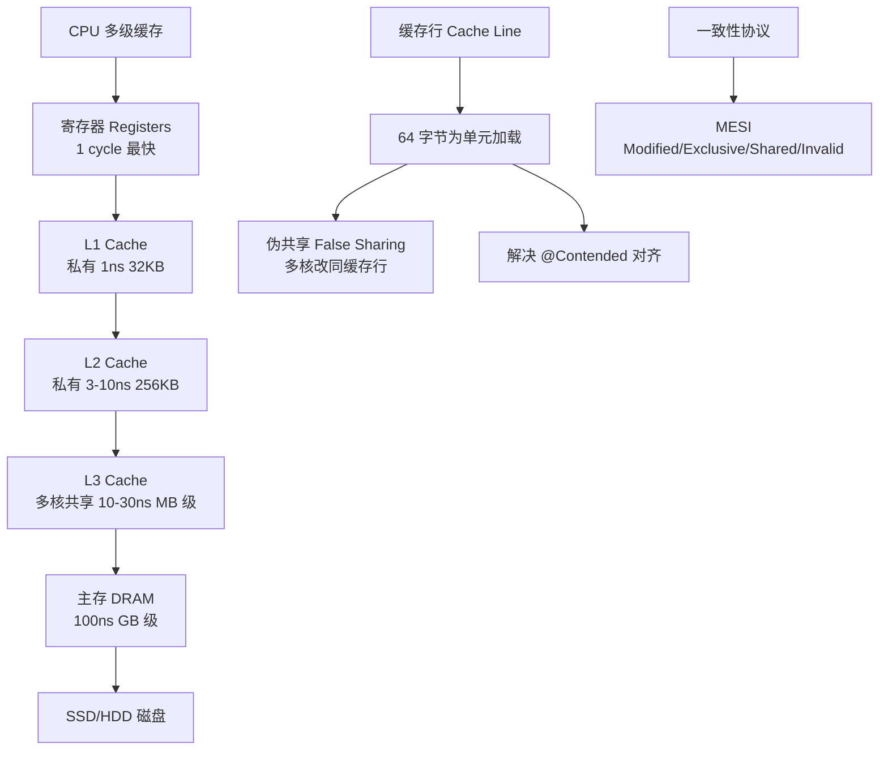
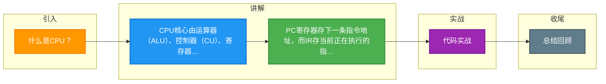

# 什么是CPU？

CPU（Central Processing Unit，中央处理器）是计算机的核心部件，负责执行指令和处理数据。

**主要组成部分：**

**1. 运算器（ALU - 算术逻辑单元）**
- 执行算术运算（加减乘除）和逻辑运算（与/或/非）
- 包含累加器、寄存器等

**2. 控制器（CU - Control Unit）**
- 从内存取指令
- 解码指令
- 控制执行
- 管理 PC（程序计数器）和 IR（指令寄存器）

**3. 寄存器**
- 通用寄存器：暂存数据
- PC（程序计数器）：存下一条指令地址
- IR（指令寄存器）：存当前指令
- PSW（程序状态字）：存状态标志

**4. 高速缓存**
- L1/L2/L3 多级缓存，缓解 CPU 与内存之间的速度差异

### 实战案例
在一次高并发 Java 服务压测中，发现 CPU 使用率飙升但吞吐量上不去。通过 `top -H -p` 查看，发现用户态 CPU 高，且主要耗在 `AtomicInteger.incrementAndGet()` 上。这是典型的**缓存行竞争**问题：多核 CPU 同时修改同一缓存行导致总线风暴。后来通过使用 `@Contended` 注解或填充字节解决，避免了伪共享。

### 代码示例 (C/C++ 汇编视角)
```c
// 简单的加法运算在 x86 汇编层面的体现
int a = 10, b = 20;
int c = a + b;

// 对应的汇编逻辑示意
MOV EAX, [a]    ; 控制器控制：从内存(或缓存)加载 a 到寄存器 EAX
ADD EAX, [b]    ; 运算器执行：将 b 的值加到 EAX
MOV [c], EAX   ; 控制器控制：将结果写回内存(或缓存)
```

### 对比表格
| 架构 | CISC (复杂指令集) | RISC (精简指令集) |
| :--- | :--- | :--- |
| **代表** | x86 (Intel/AMD) | ARM (手机/Mac), RISC-V |
| **指令长度** | 变长 (1-15字节) | 定长 (通常4字节) |
| **指令复杂度** | 复杂，一条指令可完成多步操作 | 简单，一条指令仅做一件事 |
| **功耗** | 较高，适合高性能计算 | 较低，适合移动/嵌入式设备 |
| **流水线效率** | 较难优化，易阻塞 | 易于超标量和流水线优化 |

**关键参数：**
- **位宽**：32位 CPU 一次处理 4 字节数据，64 位处理 8 字节
- **主频**：时钟频率，决定指令执行速度（如 3.0GHz）
- **核心数**：多核可并行处理多个任务
- **指令集**：x86（CISC）、ARM（RISC）等


## 核心架构图



## 记忆要点

- CPU核心由运算器(ALU)、控制器(CU)、寄存器和多级缓存构成。
- PC寄存器存下一条指令地址，而IR存当前正在执行的指令。
- 对比架构：CISC(如x86)指令复杂功耗高，而RISC(如ARM)精简低功耗。
- 高并发痛点：多核修改同一缓存行会导致伪共享，需加@Contended填充。

## 结构化回答

**30 秒电梯演讲：** 计算机的大脑，负责解释指令和运算数据。打个比方，就像公司的大老板，负责指挥各部门干活（控制）并亲自处理核心账目（运算）。

**展开框架：**
1. **CPU核心由运算器(ALU)、控制器(CU)、寄** — 存器和多级缓存构成。
2. **PC寄存器存下一条指令地址** — 而IR存当前正在执行的指令。
3. **对比架构** — CISC(如x86)指令复杂功耗高，而RISC(如ARM)精简低功耗。

**收尾：** 我在项目里踩过坑——在一次高并发 Java 服务压测中，发现 CPU 使用率飙升但吞吐量上不去。您想深入聊哪一段：原理、避坑还是对比选型？

## 视频脚本

> 预计时长：2 分钟 | 由浅入深

| 时间 | 画面/字幕 | 口播台词 | 讲解要点 |
|------|----------|----------|----------|
| 0:00 | 标题卡：什么是CPU | "什么是CPU？一句话——就像公司的大老板，负责指挥各部门干活（控制）并亲自处理核心账目（运算）。" | 开场钩子 |
| 0:40 | 概念动画/示意图 | "计算机的大脑，负责解释指令和运算数据——就像公司的大老板，负责指挥各部门干活（控制）并亲自处理核心账目（运算）" | 核心定义 |
| 1:20 | 要点1图解示意 | "CPU核心由运算器(ALU)、控制器(CU)、寄" | 要点1 |
| 2:00 | 总结卡 | "记住这几条，面试不慌。下期讲进阶追问。" | 收尾 |

### 视频流程图



