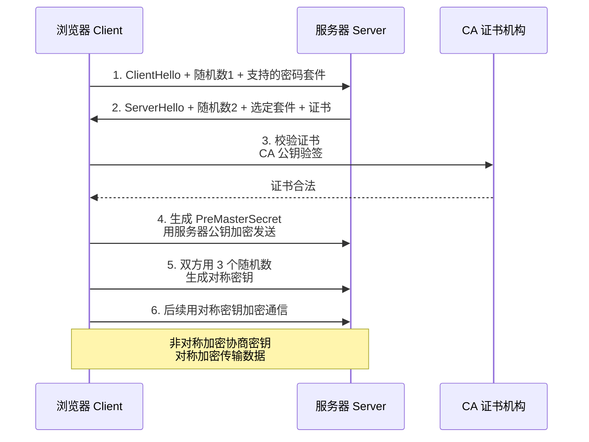

# 什么是HTTPS协议？

**HTTPS（HyperText Transfer Protocol Secure）**是 HTTP 的安全版本，在 HTTP 下层加入 SSL/TLS 加密层，保证数据传输的机密性、完整性和身份认证。

## HTTPS = HTTP + SSL/TLS

HTTPS 并非新协议，而是 HTTP 协议通信接口部分用 SSL/TLS 协议代替。

```text
+-------------------+
|   HTTP/1.1 / 2.0  |  (应用层，语义不变)
+---------+---------+
          |
+---------v---------+
|    SSL / TLS      |  (安全层：加密、解密、身份验证)
+---------+---------+
          |
+---------v---------+
|       TCP         |  (传输层)
+---------+---------+
          |
+---------v---------+
|        IP         |  (网络层)
+-------------------+
```

## 核心安全特性

| 特性 | 实现原理 | 解决的安全问题 |
|------|----------|----------------|
| **机密性** | 使用**对称加密**（如 AES、ChaCha20）加密传输数据。密钥通过**非对称加密**（如 RSA、ECDHE）协商。 | 防止数据被窃听（如嗅探、Wi-Fi 抓包）。 |
| **真实性** | 服务端持有**数字证书**，由受信任的 CA（证书颁发机构）签名。客户端验证证书合法性。 | 防止中间人攻击（伪装成服务器）。 |
| **完整性** | 使用 MAC（消息认证码）或 AEAD（如 GCM）对数据进行校验。 | 防止数据在传输过程中被篡改。 |

### 实战案例
某次上线后，部分安卓老机型用户反馈无法访问接口。排查发现是因为服务端配置 HTTPS 时禁用了 TLS 1.0/1.1，且 Cipher Suite 配置过于激进，不兼容旧版 OpenSSL 库。**教训**：为了兼容性，生产环境通常需要开启 TLS 1.2 支持并配置一套兼顾性能和兼容性的加密套件（如 `ECDHE-RSA-AES128-GCM-SHA256`）。

## 连接建立流程（简要）

1.  **TCP 三次握手**：建立可靠连接。
2.  **TLS 握手**：
    - 协商加密算法。
    - 验证服务器身份（证书链验证）。
    - 生成/交换会话密钥。
3.  **加密通信**：使用协商好的密钥对 HTTP 请求/响应进行加密传输。

## HTTP vs HTTPS

| 对比项 | HTTP | HTTPS |
|--------|------|-------|
| **协议** | `http://` | `https://` |
| **默认端口** | 80 | 443 |
| **数据形态** | 明文（可读） | 密文（乱码） |
| **证书需求** | 无 | 需要 CA 颁发的数字证书（需付费或免费申请，如 Let's Encrypt） |
| **性能** | 快（仅 TCP 握手） | 较慢（TCP 握手 + TLS 握手，消耗 CPU 进行加解密） |
| **SEO 优化** | 无权重提升 | 搜索引擎（如 Google、百度）给予更高排名权重 |

## 常见考点

1.  **HTTPS 比 HTTP 慢在哪里？如何优化？**
    - **慢的原因**：
        1.  **RTT 增加**：TLS 握手增加了额外的网络往返（TLS 1.2 是 2-RTT，TLS 1.3 是 1-RTT）。
        2.  **计算开销**：非对称加密计算消耗 CPU 资源。
    - **优化手段**：
        1.  使用 **TLS 1.3**（减少握手次数）。
        2.  启用 **HSTS**（强制使用 HTTPS，避免 302 跳转开销）。
        3.  使用 **Session Resumption**（会话复用），省去握手。
        4.  优化证书链大小，使用 OCSP Stapling。

2.  **既然有了 HTTPS，为什么很多网站还支持 HTTP？**
    - 兼容性（极老的设备）、性能（非敏感静态资源节省 CPU）、历史遗留问题。但目前主流趋势是全站 HTTPS。

3.  **HTTPS 可以防止流量被劫持吗？**
    - 可以防止**内容劫持**（如运营商插入广告），但无法完全隐藏**访问行为**（ISP 仍能看到你访问了哪个 IP 和域名，虽然看不到 URL 路径和内容）。配合 DNS over HTTPS (DoH) 可以进一步增强隐私。


## 核心架构图



## 记忆要点

- 本质是HTTP加上SSL/TLS安全层，默认端口从80变为443。
- 非对称加密(如RSA)用于协商密钥，而对称加密(如AES)用于加密数据。
- 三大特性：机密性(防窃听)、真实性(数字证书防中间人)、完整性(MAC防篡改)。
- 对比HTTP性能：因增加TLS握手(消耗RTT和CPU计算)而较慢，可用TLS 1.3优化。

## 结构化回答

**30 秒电梯演讲：** HTTP加SSL/TLS加密层，保障数据安全传输。打个比方，像寄信从透明信封换成了带防伪锁的保险箱，只有收件人能打开。

**展开框架：**
1. **本质是HTTP加上SSL/TLS安全层** — 默认端口从80变为443。
2. **非对称加密(如RSA)用于协商密钥** — 而对称加密(如AES)用于加密数据。
3. **三大特性** — 机密性(防窃听)、真实性(数字证书防中间人)、完整性(MAC防篡改)。

**收尾：** 我在项目里踩过坑——某次上线后，部分安卓老机型用户反馈无法访问接口。您想深入聊哪一段：原理、避坑还是对比选型？

## 视频脚本

> 预计时长：2 分钟 | 由浅入深

| 时间 | 画面/字幕 | 口播台词 | 讲解要点 |
|------|----------|----------|----------|
| 0:00 | 标题卡：什么是HTTPS协议 | "什么是HTTPS协议？一句话——像寄信从透明信封换成了带防伪锁的保险箱，只有收件人能打开。" | 开场钩子 |
| 0:40 | 概念动画/示意图 | "HTTP加SSL/TLS加密层，保障数据安全传输——像寄信从透明信封换成了带防伪锁的保险箱，只有收件人能打开" | 核心定义 |
| 1:20 | 要点1图解示意 | "默认端口从80变为443。" | 要点1 |
| 2:00 | 总结卡 | "记住这几条，面试不慌。下期讲进阶追问。" | 收尾 |
