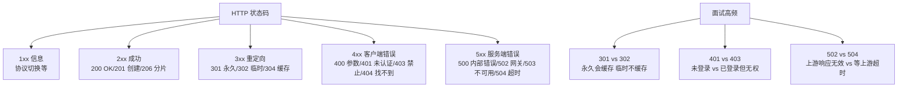
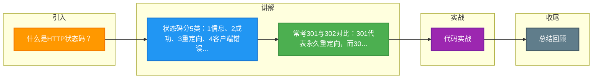

# 什么是HTTP状态码？

HTTP 状态码是服务器对客户端请求的响应标识，用 3 位数字表示，分为 5 大类：

**1xx 信息性**
- `100 Continue`：继续发送请求体
- `101 Switching Protocols`：协议切换（如升级 WebSocket）

**2xx 成功**
- `200 OK`：请求成功
- `201 Created`：资源创建成功
- `204 No Content`：成功但无返回内容
- `206 Partial Content`：范围请求成功（断点续传）

**3xx 重定向**
- `301 Moved Permanently`：永久重定向
- `302 Found`：临时重定向
- `304 Not Modified`：资源未修改，用浏览器缓存

**4xx 客户端错误**
- `400 Bad Request`：请求语法错误
- `401 Unauthorized`：未认证（需要登录）
- `403 Forbidden`：无权限访问
- `404 Not Found`：资源不存在
- `429 Too Many Requests`：请求频率超限

**5xx 服务器错误**
- `500 Internal Server Error`：服务器内部错误
- `502 Bad Gateway`：网关错误
- `503 Service Unavailable`：服务不可用
- `504 Gateway Timeout`：网关超时

**实战案例**：
在高并发抢购接口中，若服务端触发限流，应明确返回 `429` 而非直接 `503` 或 `502`，以便客户端（如前端）根据 Retry-After 头部进行指数退避重试，避免无效请求风暴。曾遇到 Nginx 代理因为上游超时直接报 `504`，实际上是因为业务代码死锁导致线程池耗尽，排查时应结合 GC 日志与线程堆栈。

**代码示例（Node.js 设置带状态码的响应）**：
```javascript
// 正确的限流响应，包含重试建议
res.status(429).set({
  'Retry-After': '60', // 告知客户端60秒后重试
  'X-RateLimit-Limit': '100'
}).json({ error: 'Too many requests' });

// 正确的空响应（如 OPTIONS 预检或 DELETE 成功）
res.status(204).end();
```


## 核心架构图



## 记忆要点

- 状态码分5类：1信息、2成功、3重定向、4客户端错误、5服务器错误。
- 常考301与302对比：301代表永久重定向，而302代表临时重定向。
- 区别权限类错误：401是未认证(没登录)，而403是禁止访问(无权限)。
- 实战要点：触发限流应返回429(配Retry-After头)，以便客户端指数退避。

## 结构化回答

**30 秒电梯演讲：** 三位数字代码，告诉客户端请求处理结果。打个比方，像快递单上的状态：已揽收（2xx）、查无此地（4xx）、站点爆仓（5xx）。

**展开框架：**
1. **状态码分5类** — 1信息、2成功、3重定向、4客户端错误、5服务器错误。
2. **常考301与302对比** — 301代表永久重定向，而302代表临时重定向。
3. **区别权限类错误** — 401是未认证(没登录)，而403是禁止访问(无权限)。

**收尾：** 我在项目里踩过坑——在高并发抢购接口中，若服务端触发限流，应明确返回 `429` 而非直接 `503` 或 `502`，以便客户端（如前端）根据 Retry-After 头部进行指数退避重试，避免无效请求风暴。您想深入聊哪一段：原理、避坑还是对比选型？

## 视频脚本

> 预计时长：2 分钟 | 由浅入深

| 时间 | 画面/字幕 | 口播台词 | 讲解要点 |
|------|----------|----------|----------|
| 0:00 | 标题卡：什么是HTTP状态码 | "什么是HTTP状态码？一句话——像快递单上的状态：已揽收（2xx）、查无此地（4xx）、站点爆仓（5xx）。" | 开场钩子 |
| 0:40 | 概念动画/示意图 | "三位数字代码，告诉客户端请求处理结果——像快递单上的状态：已揽收（2xx）、查无此地（4xx）、站点爆仓（5xx）" | 核心定义 |
| 1:20 | 状态码分5类示意 | "1信息、2成功、3重定向、4客户端错误、5服务器错误。" | 要点1 |
| 2:00 | 总结卡 | "记住这几条，面试不慌。下期讲进阶追问。" | 收尾 |

### 视频流程图



