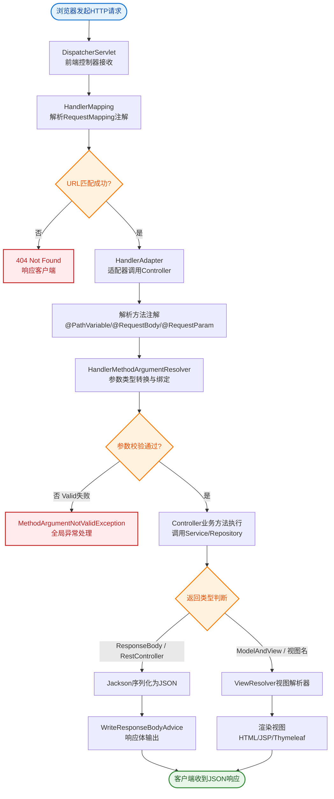
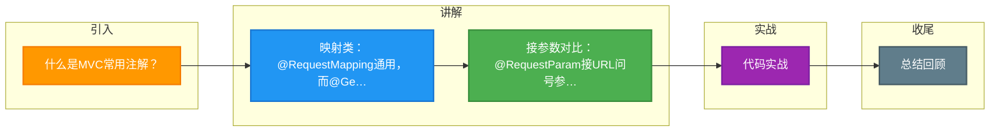

# 什么是MVC常用注解？

Spring MVC 常用注解用于简化 Web 层开发，将 HTTP 请求映射到 Java 方法。

## 核心流程架构

```text
┌─────────┐    1. Request     ┌──────────────────┐
│ Browser │ ─────────────────>│  DispatcherServlet│ (前端控制器)
└─────────┘                   └────────┬─────────┘
                                       │ 2. 根据URL查找
                              ┌────────▼─────────┐
                              │  HandlerMapping  │
                              │ (RequestMapping) │
                              └────────┬─────────┘
                                       │ 3. 返回执行链
                                       │ (Handler+Interceptor)
                              ┌────────▼─────────┐
                              │ HandlerAdapter   │ (适配器，调用Controller)
                              └────────┬─────────┘
                                       │ 4. 执行业务逻辑
                              ┌────────▼─────────┐
                              │   @Controller    │
                              │                  │
                              │ @RestController  │
                              └────────┬─────────┘
                                       │ 5. 返回 ModelAndView / Data
                              ┌────────▼─────────┐
                              │   ViewResolver   │ (视图解析器)
                              └────────┬─────────┘
                                       │ 6. 返回 View 对象
                              ┌────────▼─────────┐
                              │      View        │ (JSP/HTML/JSON)
                              └────────┬─────────┘
                                       │ 7. 渲染页面/数据
                                       └────────────────┘
```

## 常用注解详解

### 1. 请求映射类
- **@RequestMapping**：通用映射，支持类和方法级，可配置 method, params, headers。
- **@GetMapping / @PostMapping** 等：组合注解，语义更清晰。

### 2. 参数绑定类
- **@RequestParam**：绑定 URL 查询参数或表单数据。
- **@PathVariable**：绑定 URI 路径变量（如 `/user/{id}`）。
- **@RequestBody**：绑定请求体（通常用于 JSON）。
- **@RequestHeader**：绑定请求头信息。

**实战案例**：
在开发 RESTful API 时，前端传来 `userId` 为空字符串 `""`，若使用 `@RequestParam(required = false)` 且未指定 `defaultValue`，Spring 会尝试将其转换为 Integer 从而抛出 `NumberFormatException`。正确的做法是显式设置 `defaultValue` 或在业务层做空串判断。此外，若遇到中文乱码，需检查是否在 WebMvcConfigurer 中配置了 `StringHttpMessageConverter` 的字符集为 UTF-8。

**代码示例（参数校验与接收实战）**：
```java
@RestController
@RequestMapping("/api/users")
public class UserController {

    // 路径变量 + 必填参数校验
    @GetMapping("/{id}")
    public Result getUser(@PathVariable Long id, 
                          @RequestParam(value = "detail", defaultValue = "false") boolean isDetail) {
        // 业务逻辑
        return Result.ok(userService.findById(id, isDetail));
    }

    // JSON Body 接收 + 自动校验 (需开启 @Validated)
    @PostMapping
    public Result createUser(@Validated @RequestBody UserCreateDTO dto) {
        // 若 DTO 字段有 @NotBlank，校验失败会自动抛出 MethodArgumentNotValidException
        return Result.ok(userService.create(dto));
    }
}
```

**对比表格：参数接收注解区别**

| 注解 | 数据来源 | Content-Type 要求 | 典型应用场景 |
|------|----------|------------------|--------------|
| @RequestParam | URL Query / Form Data | application/x-www-form-urlencoded | 搜索过滤、表单提交 |
| @PathVariable | URL Path | 无 | RESTful 资源定位 (如 /user/1) |
| @RequestBody | Request Body | application/json (或 XML) | 复杂对象创建、POST 请求体 |
| @RequestHeader | HTTP Headers | 无 | 获取 Token、User-Agent |
| @CookieValue | Cookies | 无 | 获取 SessionID、追踪信息 |


## 核心流程图


## 记忆要点

- 映射类：@RequestMapping通用，而@GetMapping/@PostMapping是语义化的组合注解。
- 接参数对比：@RequestParam接URL问号参数，@PathVariable接URI路径变量。
- @RequestBody专用于绑定请求体(如JSON数据)。
- 实战避坑：参数用Integer时若前端传空串，必须设defaultValue防转换异常。

## 结构化回答


**30 秒电梯演讲：** 像餐厅菜单，你点的菜名（URL）直接对应后厨做菜的配方（方法）。

**展开框架：**
1. **@RestCon** — @RestController组合@Controller和@ResponseBody
2. **@Request** — @RequestMapping及变体映射URL路径
3. **@PathVar** — @PathVariable获取路径参数

**收尾：** 这是我实战中的理解，您想深入哪一段？


## 视频脚本

> 预计时长：2 分钟 | 由浅入深

| 时间 | 画面/字幕 | 口播台词 | 讲解要点 |
|------|----------|----------|----------|
| 0:00 | 标题卡：什么是MVC常用注解 | "什么是MVC常用注解？一句话——像餐厅菜单，你点的菜名（URL）直接对应后厨做菜的配方（方法）。" | 开场钩子 |
| 0:40 | 概念动画/示意图 | "用注解将URL请求映射到Java方法处理——像餐厅菜单，你点的菜名（URL）直接对应后厨做菜的配方（方法）" | 核心定义 |
| 1:20 | 映射类示意 | "@RequestMapping通用，而@GetMapping/@PostMapping是语义化的组合注解。" | 要点1 |
| 2:00 | 总结卡 | "记住这几条，面试不慌。下期讲进阶追问。" | 收尾 |

### 视频流程图



