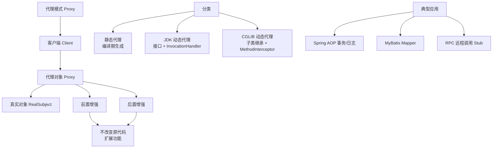

# 什么是代理模式应用？

## 代理模式的应用场景

代理模式的核心在于**控制访问**与**功能增强**。主要有四大典型应用：

### 1. 远程代理
为不同地址空间（远程服务器）的对象提供本地代表，隐藏网络通信细节。
- **应用**：Dubbo 服务引用、gRPC Stub、RMI。

### 2. 虚拟代理
通过延迟初始化，将开销大的对象创建推迟到真正需要时。
- **应用**：Hibernate 延迟加载、Spring `@Lazy` 注解、图片加载占位符。

### 3. 保护代理
基于权限控制对象的访问，通常在调用真实对象前进行校验。
- **应用**：Spring Security 方法级权限控制（`@PreAuthorize`）、Nacos 权限拦截。

### 4. 智能引用代理
访问对象时附加额外操作，如引用计数、日志记录、缓存、监控。
- **应用**：数据库连接池（连接复用）、MyBatis 一级/二级缓存、Spring AOP（事务、日志）。

**实战案例**：
在使用 Spring 事务时，遇到 `@Transactional` 注解失效的经典坑：在同一个类中，一个非事务方法调用了同类中的带事务方法。原因是 Spring AOP 默认使用 JDK 动态代理，外部调用时经过代理对象增强，而内部方法调用是 `this.method()`，绕过了代理对象。解决方法是将事务方法提取到另一个 Bean 中，或使用 `AopContext.currentProxy()` 获取代理对象进行调用。

**代码示例（动态代理实现简单的耗时统计）**：
```java
public class PerformanceProxy implements InvocationHandler {
    private Object target;

    public static Object bind(Object target) {
        return Proxy.newProxyInstance(
            target.getClass().getClassLoader(), 
            target.getClass().getInterfaces(), 
            new PerformanceProxy(target)
        );
    }

    @Override
    public Object invoke(Object proxy, Method method, Object[] args) throws Throwable {
        long start = System.currentTimeMillis();
        Object result = method.invoke(target, args);
        long cost = System.currentTimeMillis() - start;
        System.out.println(method.getName() + " cost time: " + cost + "ms");
        return result;
    }
}
```

**对比表格：JDK 动态代理 vs CGLIB**

| 特性 | JDK 动态代理 | CGLIB |
|------|--------------|-------|
| **实现原理** | 反射机制，实现接口 | 字节码操作（ASM），继承子类 |
| **类要求** | 必须实现至少一个接口 | 类不能是 final，方法不能是 final |
| **Spring 默认策略** | 优先使用（面向接口编程） | 若无接口则使用 CGLIB |
| **性能** | 生成代理快，执行稍慢（JDK8后优化显著） | 生成代理慢，执行快（适合单例） |
| **依赖** | JDK 原生支持 | 需引入第三方库（Spring Core 已包含） |


## 核心架构图



## 记忆要点

- 核心价值：通过代理实现控制访问与功能增强。
- 四大应用：远程代理(隐藏网络)、虚拟代理(延迟加载)、保护代理(权限)、智能引用(AOP)。
- 对比动态代理：JDK底层用反射(需接口)，而CGLIB用继承生成子类(不能是final)。
- 实战坑点：同类内部方法调用会绕过代理，导致Spring的@Transactional事务失效。

## 结构化回答

**30 秒电梯演讲：** 通过中间代理层控制对目标对象的访问。打个比方，像明星的经纪人，负责挡驾、安排行程、处理杂务。

**展开框架：**
1. **核心价值** — 通过代理实现控制访问与功能增强。
2. **四大应用** — 远程代理(隐藏网络)、虚拟代理(延迟加载)、保护代理(权限)、智能引用(AOP)。
3. **对比动态代理** — JDK底层用反射(需接口)，而CGLIB用继承生成子类(不能是final)。

**收尾：** 这三点都能配合实战聊。您想深入聊原理、对比还是避坑？

## 视频脚本

> 预计时长：2 分钟 | 由浅入深

| 时间 | 画面/字幕 | 口播台词 | 讲解要点 |
|------|----------|----------|----------|
| 0:00 | 标题卡：什么是代理模式应用 | "什么是代理模式应用？一句话——像明星的经纪人，负责挡驾、安排行程、处理杂务。" | 开场钩子 |
| 0:40 | 概念动画/示意图 | "通过中间代理层控制对目标对象的访问——像明星的经纪人，负责挡驾、安排行程、处理杂务" | 核心定义 |
| 1:20 | 核心价值示意 | "通过代理实现控制访问与功能增强。" | 要点1 |
| 2:00 | 总结卡 | "记住这几条，面试不慌。下期讲进阶追问。" | 收尾 |
