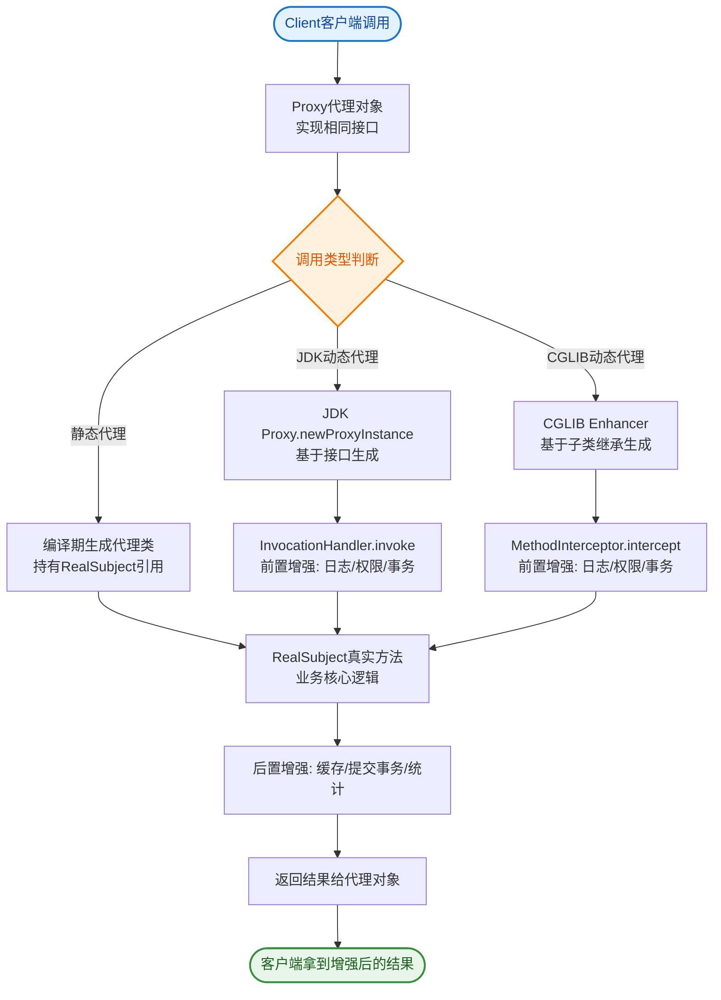

# 什么是代理模式结构图？

**代理模式结构图**——三个核心角色之间的继承与引用关系：

```
┌─────────────────────┐          ┌─────────────────────────┐
│   <<interface>>      │          │      RealSubject        │
│      Subject         │          │  (真实主题)              │
├─────────────────────┤          ├─────────────────────────┤
│ + request()          │◄─────────│ + request()              │
└──────────┬──────────┘          │  // 执行真实业务逻辑      │
           │ implements                       ▲
           │                                   │ holds reference
           │                                   │ (组合关系)
           │                      ┌────────────┴────────────┐
┌──────────┴──────────┐          │      Proxy              │
│      Proxy          │─────────►│  (代理)                  │
├─────────────────────┤          ├─────────────────────────┤
│ - realSubject       │          │ + request()              │
│   : RealSubject     │          │   preRequest()           │
│ + request()         │          │   realSubject.request()  │
└─────────────────────┘          │   postRequest()          │
                                 └─────────────────────────┘
```

## 角色职责

| 角色 | 职责 | 代码要点 |
|------|------|----------|
| **Subject** | 定义 request() 抽象方法 | 代理和真实对象都实现它 |
| **RealSubject** | 执行真正的业务逻辑 | 只关心核心业务 |
| **Proxy** | 控制访问 + 前后增强 | 持有 RealSubject 引用 |

## 类定义

```java
// Subject — 抽象主题
public interface Subject {
    void request();
}

// RealSubject — 真实主题，定义 Proxy 所代表的真实实体
public class RealSubject implements Subject {
    @Override
    public void request() {
        System.out.println("RealSubject: 执行真实业务");
    }
}

// Proxy — 代理，保存引用，提供与 Subject 相同接口
public class Proxy implements Subject {
    private RealSubject realSubject;  // 保存引用使代理可访问实体
    @Override
    public void request() {
        if (realSubject == null) realSubject = new RealSubject();
        preRequest();
        realSubject.request();   // 委托真实对象
        postRequest();
    }
}
```

## 关键设计原则

- 客户端只依赖 Subject 接口，不关心是 RealSubject 还是 Proxy
- Proxy 通过组合

### 1. 实战案例
在微服务架构中，为了解决细粒度服务导致的性能损耗（如大量HTTP调用），常使用本地代理模式缓存热点数据。例如，调用第三方“用户中心”API时，在本地代理层加入Caffeine缓存，若缓存命中则直接返回，未命中再调用RealSubject（远程RPC），从而降低网络开销和延时。

### 2. 代码示例（动态代理实战）
```java
// 使用 JDK 动态代理实现通用的耗时统计代理
public class PerformanceProxy implements InvocationHandler {
    private final Object target;

    public PerformanceProxy(Object target) {
        this.target = target;
    }

    @Override
    public Object invoke(Object proxy, Method method, Object[] args) throws Throwable {
        long start = System.currentTimeMillis();
        Object result = method.invoke(target, args); // 调用真实对象
        System.out.println(method.getName() + "耗时: " + (System.currentTimeMillis() - start) + "ms");
        return result;
    }

    // 创建代理实例
    public static <T> T create(T target) {
        return (T) Proxy.newProxyInstance(
            target.getClass().getClassLoader(), 
            target.getClass().getInterfaces(), 
            new PerformanceProxy(target)
        );
    }
}
```

### 3. 代理模式选型对比

| 特性 | 静态代理 | JDK 动态代理 | CGLIB 动态代理 |
| :--- | :--- | :--- | :--- |
| **实现方式** | 手写代理类，硬编码 | 反射机制，实现接口 | 字节码生成，继承子类 |
| **代理对象限制** | 需明确知道目标类 | 必须实现接口 | 类不能是 final，方法不能是 final |
| **性能** | 最高（无反射开销） | 中等（反射调用稍慢） | 较高（接近原生，但生成稍慢） |
| **Spring AOP 默认** | - | 优先使用（有接口时） | 无接口时使用 |
| **适用场景** | 逻辑简单，类少 | 面向接口编程 | 需代理无接口的类（如Controller） |


## 核心流程图


## 记忆要点

- 三大角色：Subject接口、RealSubject真实主题、Proxy代理。
- 代理与真实类的关系：都实现Subject接口，代理持有真实类的引用。
- 执行逻辑：Proxy在调用真实方法前后，附加pre和post增强逻辑。
- 设计原则：客户端只依赖Subject接口，不感知真实对象与代理的切换。

## 结构化回答

**30 秒电梯演讲：** 代理和真实对象实现同一接口，代理持有真实对象引用。打个比方，同一个接口（面孔），背后可能是真人，也可能是替身。

**展开框架：**
1. **三大角色** — Subject接口、RealSubject真实主题、Proxy代理。
2. **代理与真实类的关系** — 都实现Subject接口，代理持有真实类的引用。
3. **执行逻辑** — Proxy在调用真实方法前后，附加pre和post增强逻辑。

**收尾：** 我在项目里踩过坑——在微服务架构中，为了解决细粒度服务导致的性能损耗（如大量HTTP调用），常使用本地代理模式缓存热点数据。您想深入聊哪一段：原理、避坑还是对比选型？

## 视频脚本

> 预计时长：2 分钟 | 由浅入深

| 时间 | 画面/字幕 | 口播台词 | 讲解要点 |
|------|----------|----------|----------|
| 0:00 | 标题卡：什么是代理模式结构图 | "什么是代理模式结构图？一句话——同一个接口（面孔），背后可能是真人，也可能是替身。" | 开场钩子 |
| 0:40 | 概念动画/示意图 | "代理和真实对象实现同一接口，代理持有真实对象引用——同一个接口（面孔），背后可能是真人，也可能是替身" | 核心定义 |
| 1:20 | 三大角色示意 | "Subject接口、RealSubject真实主题、Proxy代理。" | 要点1 |
| 2:00 | 总结卡 | "记住这几条，面试不慌。下期讲进阶追问。" | 收尾 |
