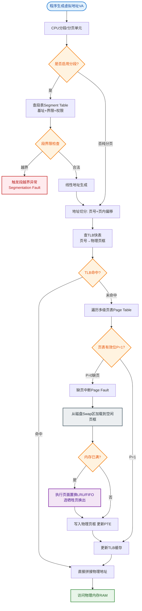

# 什么是内存分段和分页？作用是什么？

## 内存分段 vs 内存分页

两者都是操作系统内存管理的方式，旨在解决内存利用率与逻辑隔离问题。

---

### 内存分段

#### 原理
将内存划分为若干个长度不同的区域（段），如代码段、数据段、栈段等。每个段对应程序的逻辑单位。通过**段表** 映射逻辑地址到物理地址。

**逻辑地址结构**：`段号 | 段内偏移量`

#### 作用
1. **逻辑清晰**：符合程序员视角，方便代码和数据分离（编译器支持）。
2. **信息共享**：通过段表实现段的共享（如多个进程共享同一个动态链接库代码段）。
3. **动态增长**：段长可以根据需要动态伸缩（如堆栈段）。
4. **保护**：通过段表中的权限位（R/W/X）防止越界或非法操作。

#### 缺点
- **外部碎片**：段与段之间会产生难以利用的小块空闲内存，需要通过紧凑（整理）来解决，开销大。

---

### 内存分页

#### 原理
将内存和进程的地址空间划分为大小相等的块（页/页框），通常为 4KB。通过**页表** 建立虚拟页与物理页框的映射。

**逻辑地址结构**：`页号 | 页内偏移量`

**地址转换流程图**：
```
CPU 产生逻辑地址
      │
      ▼
┌─────────────────┐
│   页号 P        │ ────► 查页表 (MMU/TLB) ────► 得到物理页框号 F
├─────────────────┤                             │
│   偏移量 d       │ ──────────────────────────┘
└─────────────────┘
      │
      ▼
物理地址 = F * 页面大小 + d
```

#### 作用
1. **解决外部碎片**：由于内存按固定块分配，不存在外部碎片问题（仅最后一页有少量内部碎片）。
2. **虚拟内存实现**：利用缺页中断，将不常用的页换出到磁盘，实现比物理内存更大的地址空间。
3. **内存隔离**：每个进程有独立的页表，操作系统通过修改页表实现进程间的完全隔离。
4. **高效加载**：程序只需加载部分页即可运行，加载速度快。

#### 缺点
- **内部碎片**：进程最后一页通常装不满，造成平均 1/2 页大小的浪费。
- **页表开销**：页表占用内存较大（64位系统下更甚），需通过多级页表或哈希页表优化。

---

## 实战案例
在高并发 Java 服务（如处理大量请求的网关）中，由于每个线程都有独立的栈空间，且部分线程使用巨大的 `DirectByteBuffer`（堆外内存），容易导致物理内存耗尽而触发操作系统进行疯狂的 Swap 交换。**实战经验**：曾遇到因开启了 `-XX:MaxDirectMemorySize` 不当，导致堆外内存溢出，系统频繁缺页中断（Major Page Fault），CPU 飙升但吞吐量骤降。通过调整 `vm.swappiness=10` 和限制堆外内存，减少了页换入换出的抖动。

## 代码示例 (C语言 - 查看页面大小)
```c
#include <stdio.h>
#include <unistd.h>

int main() {
    long page_size = sysconf(_SC_PAGESIZE);
    printf("System page size: %ld bytes\n", page_size);
    return 0;
}
```

## 总结对比

| 特性 | 分段 | 分页 |
|------|------|------|
| **单位大小** | 变长（逻辑单位） | 定长（物理单位，如 4KB） |
| **碎片问题** | 外部碎片 | 内部碎片 |
| **共享与保护** | 容易（按逻辑段共享） | 困难（需页面物理连续对齐） |
| **地址空间** | 二维空间（段号+偏移） | 一维空间（线性地址） |
| **编译视角** | 用户/编译器可见 | 用户透明（OS 全权管理） |

## 常见考点
1. **TLB (快表) 的作用**：页表存放在内存中，每次访存需两次内存访问（查页表+取数据）。TLB 是高速缓存，用于加速虚拟地址到物理地址的转换。
2. **多级页表**：为何 64 位系统需要多级页表？（为了压缩页表大小，避免页表占用连续且巨大的内存空间）。
3. **缺页中断**：缺页中断属于“内中断”还是“外中断”？处理流程是怎样的？（页表项为无效 -> 触发中断 -> OS 调度磁盘 IO -> 更新页表 -> 恢复指令执行）。


## 核心流程图


## 记忆要点

- 分页定长无外部碎片，分段变长有外部碎片
- 分页通过页表映射解决外部碎片并实现虚拟内存
- 分段按逻辑划分(代码/数据段)，易于共享与保护
- 分页产生内部碎片，分段导致外部碎片需紧凑
- 页表驻留内存，需TLB加速地址转换避免双倍访存开销

## 结构化回答


**30 秒电梯演讲：** 分段像切面包（大小不一），分页像铺地砖（大小统一）。

**展开框架：**
1. **分段：逻辑单** — 逻辑单位，产生外部碎片，易共享
2. **分页：物理单** — 物理单位，无外部碎片，支持虚拟内存
3. **分页通过页表映射** — 分页通过页表映射，实现内存隔离

**收尾：** 这是我实战中的理解，您想深入哪一段？


## 视频脚本

> 预计时长：2 分钟 | 由浅入深

| 时间 | 画面/字幕 | 口播台词 | 讲解要点 |
|------|----------|----------|----------|
| 0:00 | 标题卡：什么是内存分段和分页？作用是什么 | "什么是内存分段和分页？作用是什么？一句话——分段像切面包（大小不一），分页像铺地砖（大小统一）。" | 开场钩子 |
| 0:40 | 概念动画/示意图 | "分段按逻辑划分（防外碎），分页按物理切块（防外碎）——分段像切面包（大小不一），分页像铺地砖（大小统一）" | 核心定义 |
| 1:20 | 分页定长无外部碎片示意 | "分段变长有外部碎片" | 要点1 |
| 2:00 | 总结卡 | "记住这几条，面试不慌。下期讲进阶追问。" | 收尾 |

### 视频流程图


