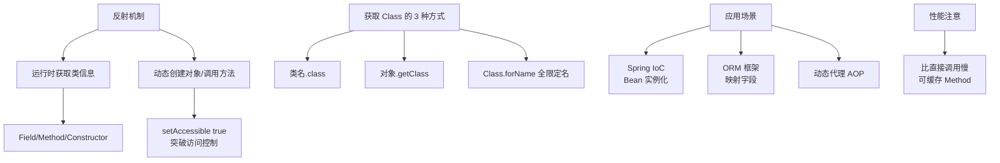

# 什么是反射的应用场合？

## 反射的应用场合

反射允许程序在运行时动态获取类的信息（属性、方法、注解）并调用对象的方法。Java 虽然是静态语言，但通过反射机制具备了一定的动态性。

### 典型应用场景

#### 1. 框架开发（核心场景）
- **依赖注入 (DI)**：Spring 框架通过反射读取配置（XML/注解），在运行时动态创建 Bean 实例，并利用反射将依赖注入到字段中（`Field.set()`）。
- **ORM 映射**：Hibernate/MyBatis 利用反射将数据库结果集（ResultSet）映射到 Java 对象属性。它通过解析字段名与列名的对应关系，自动调用 setter 方法。
- **动态代理**：JDK 动态代理通过反射在运行时生成代理类（`$Proxy0`），并将方法调用分发到调用处理器（`InvocationHandler`）。

#### 2. 通用工具开发
- **序列化/反序列化**：Jackson/Gson 在将 JSON 字符串转为 Java 对象时，通过反射获取类的 Class 对象，解析字段类型并填充数据。
- **单元测试**：JUnit 通过反射扫描类路径，查找并调用带有 `@Test` 注解的方法，无需用户编写显式调用代码。
- **Bean Copier**：Spring `BeanUtils.copyProperties(source, target)` 利用反射实现同名属性的拷贝。

#### 3. 动态扩展与解耦
- **插件机制**：主程序读取配置文件，使用 `Class.forName()` 动态加载外部 Jar 包中的类，并通过 `newInstance()` 或 `Constructor` 实例化。
- **调用私有成员**：在单元测试或特殊场景下，通过 `Field.setAccessible(true)` 破坏封装性，访问私有字段或方法（常用于 Mock 测试）。
- **泛型擦除后的类型处理**：Java 泛型在运行时会被擦除，但通过反射获取 `Method.getGenericParameterTypes()` 可以还原具体的泛型类型（如 `List<String>` 中的 String）。

---

## 实战案例
在微服务架构中，实现通用的“统一日志切面”时，经常需要打印出入参和出参。**实战经验**：若直接使用 `JSON.toJSONString(obj)`，对于复杂对象（如 Hibernate 代理对象或带有双向引用的 JPA 实体）极易引发“栈溢出”或性能爆炸。**优化方案**：利用反射自定义一个 `ToStringBuilder`，通过 `@JsonIgnore` 注解控制递归深度，并仅通过反射获取 `Filed.getName()` 而非触发 `getter` 逻辑（避免触发懒加载 SQL），大幅提升了日志打印的稳定性。

## 代码示例 (Java - 反射调用私有方法)
```java
import java.lang.reflect.Method;

public class ReflectionDemo {
    private void privateMethod(String msg) {
        System.out.println("Private msg: " + msg);
    }

    public static void main(String[] args) throws Exception {
        ReflectionDemo obj = new ReflectionDemo();
        Method method = ReflectionDemo.class.getDeclaredMethod("privateMethod", String.class);
        method.setAccessible(true); // 破坏封装，关闭安全检查
        method.invoke(obj, "Hello Reflection");
    }
}
```

### 反射调用流程图

```text
┌──────────────┐
│   Client     │
└──────┬───────┘
       │ Class.forName("com.User")
       ▼
┌──────────────┐
│ Class Object │ (元数据：方法、字段列表)
└──────┬───────┘
       │ getMethod("setName") / getField("name")
       ▼
┌──────────────┐
│ Method/Field │ (反射对象)
└──────┬───────┘
       │ invoke(obj, args) / set(obj, value)
       ▼
┌──────────────┐
│  Executing   │ (访问检查 -> 实际调用)
└──────────────┘
```

### 优缺点与性能
- **优点**：高度灵活，实现了框架与业务代码的解耦。
- **缺点**：
  1. **性能开销**：反射涉及方法参数解析、安全检查等，比直接调用慢 1-2 个数量级。可通过 `setAccessible(true)` 跳过安全检查略微优化，或使用缓存（如 Spring 缓存反射元数据）。
  2. **破坏封装**：可访问 private 成员，增加安全隐患。
  3. **代码可读性**：泛型模糊，IDE 提示能力减弱。

## 常见考点
1. **反射性能优化**：为何反射慢？如何优化？（关闭安全检查 `setAccessible(true)`，使用 `MethodHandle`，或缓存反射对象如 `ReflectASM`）。
2. **泛型反射**：如何获取 `List<String>` 中的 `String` 类型？（通过 `ParameterizedType.getActualTypeArguments()`）。
3. **序列化原理**：FastJSON/Jackson 是如何通过反射解析 JSON 的？


## 核心架构图



## 记忆要点

- 因为框架需解耦，所以利用反射运行时动态创建和注入对象
- 核心应用：Spring框架的DI依赖注入与ORM结果集映射
- 工具开发常客：JSON序列化、动态代理与JUnit扫描测试
- 缺点是性能差(慢1-2个数量级)且破坏封装，需缓存优化
- 私有成员访问：通过setAccessible(true)跳过安全检查

## 结构化回答

**30 秒电梯演讲：** 运行时动态获取类信息并操作对象的方法和属性。打个比方，像照镜子，平时只看外表，反射能看到内部构造并动手改造。

**展开框架：**
1. **利用反射运行时动态创建和注入对象** — 因为框架需解耦，所以利用反射运行时动态创建和注入对象。
2. **核心应用** — Spring框架的DI依赖注入与ORM结果集映射
3. **工具开发常客** — JSON序列化、动态代理与JUnit扫描测试

**收尾：** 这三点都能配合实战聊。您想深入聊原理、对比还是避坑？

## 视频脚本

> 预计时长：2 分钟 | 由浅入深

| 时间 | 画面/字幕 | 口播台词 | 讲解要点 |
|------|----------|----------|----------|
| 0:00 | 标题卡：什么是反射的应用场合 | "什么是反射的应用场合？一句话——像照镜子，平时只看外表，反射能看到内部构造并动手改造。" | 开场钩子 |
| 0:40 | 概念动画/示意图 | "运行时动态获取类信息并操作对象的方法和属性——像照镜子，平时只看外表，反射能看到内部构造并动手改造" | 核心定义 |
| 1:20 | 要点1图解示意 | "因为框架需解耦，所以利用反射运行时动态创建和注入对象。" | 要点1 |
| 2:00 | 总结卡 | "记住这几条，面试不慌。下期讲进阶追问。" | 收尾 |
