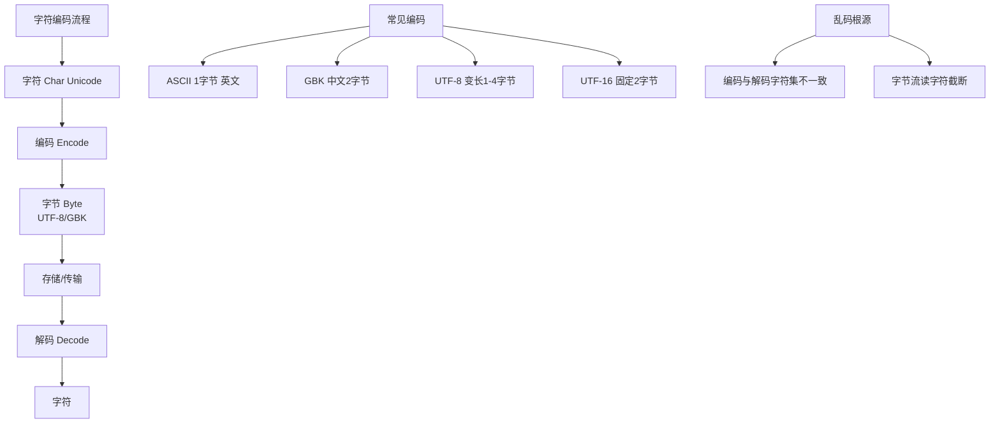

# 什么是可变长度编码？

## 可变长度编码

可变长度编码是一种用不同字节数表示不同字符/数值的编码方式。核心策略是**高频字符用短码，低频字符用长码**，从而节省存储空间和传输带宽。

### 与固定长度编码对比

| 编码方式 | 特点 | 优点 | 缺点 |
|----------|------|------|------|
| **固定长度** | 所有字符占用相同位数（如 ASCII 1字节，UTF-32 4字节） | 编解码简单，随机访问极快（O(1)） | 浪费空间，高频低频同等对待 |
| **可变长度** | 字符长度根据频率或数值大小动态变化（1-N 字节） | 空间利用率高，节省 I/O | 编解码复杂，需扫描前缀确定边界 |

### 前缀编码规则
可变长度编码必须是**前缀码**（Prefix Code）：任何字符的编码都不是另一个字符编码的前缀。否则解码时产生歧义。

**示例**：
```
❌ 非前缀码（有歧义）:
  A=0, B=01, C=1
  比特流 "01" 解析结果不确定 -> 可能是 A,C 或 B

✅ 前缀码（无歧义，二叉树结构）:
  A=0, B=10, C=11
  比特流 "010" -> 解析为 A, B (唯一确定)
```

**解码原理（二叉树匹配）**：
```text
      Root
      /  \
    0(A)  1
          / \
        0(B) 1(C)
```

### 典型应用

1. **Huffman 编码**：最优前缀编码，根据字符出现频率构建哈夫曼树，频率最高的字符路径最短。
2. **UTF-8**：互联网标准编码，兼容 ASCII。英文用 1 字节，中文通常用 3 字节，Emoji 用 4 字节。
3. **Varint (Protocol Buffers)**：用于整数编码。利用字节的最高位（MSB）作为“延续标志”，数值越小字节数越少。
   - **字节结构**：`[MSB][7-bit Payload]`
   - MSB=1：后续还有字节；MSB=0：这是最后一个字节。
4. **LZW 压缩**：字典编码，输出为变长的字典索引码。

### UTF-8 编码规则详解

```
1字节: 0xxxxxxx          (0-127, ASCII 兼容)
2字节: 110xxxxx 10xxxxxx (128-2047)
3字节: 1110xxxx 10xxxxxx 10xxxxxx (中文常用范围)
4字节: 11110xxx 10xxxxxx 10xxxxxx 10xxxxxx (Emoji, 生僻字)
```

**原理**：通过开头连续的 `1` 的个数判断字节数，后续字节以 `10` 开头。

### Varint (Protobuf) 编码示例

假设数字 `300`：
- 二进制：`1 0010 1100`
- 分割（7位一组）：`0000 0010` 和 `0101 1100`
- 添加 MSB 标志：`1010 1100` (首字节, MSB=1) + `0000 0010` (次字节, MSB=0)
- 结果：`0xAC 0x02`

## 实战案例
在分布式存储系统中，大量使用 Protobuf 进行节点间通信。**实战经验**：在存储大量带符号的整型 ID（如 MongoDB 的 ObjectId）时，直接使用 Protobuf 的 Varint 编码效率极低。因为负数在计算机中以补码表示，最高位为 1，导致 Varint 认为这是一个“超大数”，从而错误地使用 10 个字节进行编码。**解决方案**：使用 Protobuf 的 `sint32`/`sint64` 类型，内部采用 ZigZag 编码将有符号数映射为无符号数（如 -1 编码为 1，1 编码为 2），使得绝对值较小的数都能用较少的字节表示。

## 代码示例 (Java - Varint 编码实现)
```java
public static byte[] writeVarInt(int value) {
    byte[] result = new byte[5]; // int最多5字节
    int index = 0;
    while (true) {
        if ((value & ~0x7F) == 0) { // 高于7位全为0
            result[index++] = (byte) value;
            break;
        } else {
            result[index++] = (byte) ((value & 0x7F) | 0x80); // 取低7位，最高位置1
            value >>>= 7;
        }
    }
    return Arrays.copyOf(result, index);
}
```

### 为什么需要可变长度编码？

1. **存储效率**：在文本数据中，字符（如空格、e、t）和数值（如小 ID）的分布极不均匀，短码能大幅压缩体积。
2. **网络传输**：减少带宽消耗，尤其在分布式系统（如 RPC、数据库 Replication）中效果显著。
3. **兼容性**：UTF-8 的设计使其向后兼容 ASCII，保证了旧系统也能处理新编码的文本。

## 常见考点
1. **UTF-8 乱码问题**：如果丢失了首字节，后续字节为何全是乱码？（因为后续字节以 `10` 开头，解码器找不到合法的起始字节）。
2. **Varint 的缺点**：对于负数和大整数（最高位为 1 的符号位问题），Varint 反而可能占用 10 字节（ZigZag 编码如何解决此问题？）。
3. **Huffman 编码解码条件**：为何需要传输 Huffman 树或频率表？接收方如何重建字典？


## 核心架构图



## 记忆要点

- 核心策略是高频字符用短码，低频字符用长码，节省空间
- 必须是前缀码(任意字符编码不是另一字符的前缀)，防解码歧义
- UTF-8是典型应用：兼容ASCII，英文1字节中文常3字节
- Varint(Protobuf)用最高位(MSB)做延续标志，小数值占字节少
- 大坑：负数补码致Varint膨胀，需用ZigZag编码转无符号

## 结构化回答


**30 秒电梯演讲：** 常用电话号码短，冷门电话号码长，且不会拨错。

**展开框架：**
1. **基于频率分配码长** — 基于频率分配码长，压缩数据
2. **必须遵循前缀** — 必须遵循前缀码规则（无二义性）
3. **典型应用** — Huffman编码、UTF-8、Varint

**收尾：** 这是我实战中的理解，您想深入哪一段？


## 视频脚本

> 预计时长：2 分钟 | 由浅入深

| 时间 | 画面/字幕 | 口播台词 | 讲解要点 |
|------|----------|----------|----------|
| 0:00 | 标题卡：什么是可变长度编码 | "什么是可变长度编码？一句话——常用电话号码短，冷门电话号码长，且不会拨错。" | 开场钩子 |
| 0:40 | 概念动画/示意图 | "高频用短码，低频用长码，前缀规则保证无歧义——常用电话号码短，冷门电话号码长，且不会拨错" | 核心定义 |
| 1:20 | 核心策略是高频字符用短码示意 | "低频字符用长码，节省空间" | 要点1 |
| 2:00 | 总结卡 | "记住这几条，面试不慌。下期讲进阶追问。" | 收尾 |
