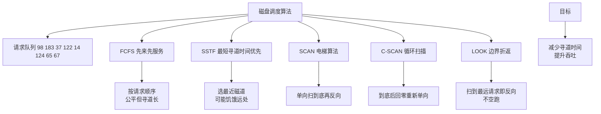

# 什么是常见磁盘调度算法？

## 常见磁盘调度算法

磁盘 I/O 时间主要消耗在**寻道时间**（磁头移动到指定磁道）。为了减少寻道时间，操作系统需要对请求队列中的请求进行重新排序（调度）。

### 1. 先来先服务 (FCFS)
- **策略**：按照请求到达的先后顺序进行处理。
- **优点**：公平，算法简单。
- **缺点**：寻道距离长，效率低。可能磁头在 100 道，下一个请求却在 1 道，来回移动。

### 2. 最短寻道时间优先 (SSTF)
- **策略**：优先处理距离当前磁头位置最近的请求（类似于 SJF 算法）。
- **优点**：平均寻道时间最短，性能较好。
- **缺点**：**饥饿问题**。如果一直有新请求出现在当前磁头附近，远处请求可能永远得不到服务。

### 3. 扫描算法/电梯算法 (SCAN)
- **策略**：磁头像电梯一样，从一端向另一端移动，沿途处理所有请求。到达边缘后反向移动。
- **优点**：解决了 SSTF 的饥饿问题，寻道性能较稳定。
- **缺点**：对于刚刚扫过的区域的新请求，需要等磁头再次转回来，延迟稍高。

### 4. 循环扫描算法 (C-SCAN)
- **策略**：SCAN 的变体。磁头只从一端移动到另一端（如 0→Max），沿途处理请求；到达末端后，直接快速返回起点（不处理请求），然后再次单向扫描。
- **优点**：相比 SCAN，提供了更均匀的等待时间，特别适合实时系统。

### 5. LOOK / C-LOOK
- **策略**：SCAN/C-SCAN 的优化。磁头不需要移动到磁盘边缘，只需要移动到当前方向上最远的那个请求处就反向。
- **优点**：减少了不必要的空行程。

---

### 实战案例
在数据库高并发写入场景中，如果使用默认的 `CFQ`（Completely Fair Queuing，类似于基于时间片的公平调度）而非 `Deadline` 或 `NOOP`，可能会导致数据库的 `fsync` 调度延迟过高，进而导致数据库连接池爆满。对于 OLTP 数据库，通常建议调整为 `deadline` 算法以减少读写请求的饥饿。

### 算法对比表格

| 算法 | 平均寻道时间 | 公平性/防饥饿 | 适用场景 | 现代应用变体 |
| :--- | :--- | :--- | :--- | :--- |
| **FCFS** | 差 | 最好 | 简单嵌入式设备 | - |
| **SSTF** | 最好 | 差（饥饿） | 理论模型，少单独使用 | - |
| **SCAN** | 较好 | 好 | 批处理系统 | Linux CFQ
| **C-SCAN** | 一般 | 最好（均匀延迟） | 实时系统、大块数据读写 | - |
| **LOOK/C-LOOK** | 好 | 好 | 通用操作系统（默认逻辑） | Linux Deadline/NOOP

### 代码示例 (C语言模拟SSTF逻辑)
```c
// SSTF 寻找最近磁道的简化逻辑
int find_closest(int current, int requests[], int n) {
    int min_dist = INT_MAX, index = -1;
    for (int i = 0; i < n; i++) {
        if (requests[i] != -1) { // -1 表示已处理
            int dist = abs(requests[i] - current);
            if (dist < min_dist) {
                min_dist = dist;
                index = i;
            }
        }
    }
    return index;
}
```

## 常见考点
1. **SSTF 的饥饿现象**：请举例说明为什么 SSTF 会导致某些请求长时间得不到响应。
2. **SCAN 与 C-SCAN 的区别**：为什么 C-SCAN 的等待时间更均匀？（C-SCAN 将请求队列视为环形，消除了扫描两端时的极端延迟差异）。
3. **LOOK 算法的优化点**：为什么现代系统更多使用 LOOK 而不是 SCAN？（LOOK 减少了磁头在无请求区域的空转，节省机械磨损和时间）。


## 核心架构图



## 记忆要点

- 目标：优化磁头移动轨迹，核心是减少寻道时间
- FCFS按序服务公平但寻道长；SSTF找最近导致远处饥饿
- SCAN像电梯双向清扫，C-SCAN单向清扫且快速重置起点
- LOOK是SCAN优化，只需移动到最远请求处而非磁盘物理边缘
- 现代OLTP数据库常选Deadline调度，防读写请求被饿死

## 结构化回答


**30 秒电梯演讲：** 像送快递，FCFS是按单顺序送，SCAN是电梯式逐层送，SSTF是送最近的。

**展开框架：**
1. **FCFS** — 简单但效率低，可能乱跑
2. **SSTF** — 走最近路，但会导致远处请求饥饿
3. **SCAN（电梯）** — 单向到底，解决饥饿

**收尾：** 这是我实战中的理解，您想深入哪一段？


## 视频脚本

> 预计时长：2 分钟 | 由浅入深

| 时间 | 画面/字幕 | 口播台词 | 讲解要点 |
|------|----------|----------|----------|
| 0:00 | 标题卡：什么是常见磁盘调度算法 | "什么是常见磁盘调度算法？一句话——像送快递，FCFS是按单顺序送，SCAN是电梯式逐层送，SSTF是送最近的。" | 开场钩子 |
| 0:40 | 概念动画/示意图 | "通过重排磁盘I/O请求顺序来减少磁头移动距离——像送快递，FCFS是按单顺序送，SCAN是电梯式逐层送，SSTF是送最近的" | 核心定义 |
| 1:20 | 目标示意 | "优化磁头移动轨迹，核心是减少寻道时间" | 要点1 |
| 2:00 | 总结卡 | "记住这几条，面试不慌。下期讲进阶追问。" | 收尾 |
