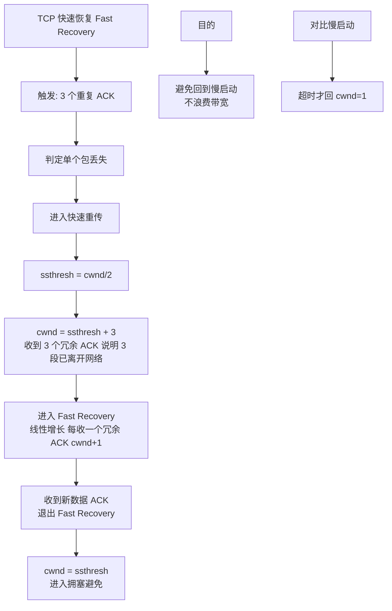

# 什么是快速恢复？

## TCP 快速恢复

快速恢复是 TCP 拥塞控制算法的一部分，通常与**快速重传**配合使用。目的是在发生少量丢包时，避免像超时重传那样将拥塞窗口降为 1（重新开始慢启动），而是维持较高的传输速率，从而提高网络利用率。

### 触发条件
发送方收到 **3 个重复 ACK**（Duplicate ACK），说明网络只是轻微拥塞，有数据包丢失，但后续包还能到达。

### 算法步骤

1. **调整阈值**
   - 将慢启动阈值 `ssthresh` 设置为当前 `cwnd` 的一半：`ssthresh = cwnd / 2`。

2. **设置窗口**
   - 将拥塞窗口 `cwnd` 设置为 `ssthresh + 3`。
   - **解释**：`+3` 代表收到的 3 个重复 ACK，意味着有 3 个数据包已经离开了网络到达了接收缓存（接收方缓存腾出了空间），可以立刻发送 3 个新包。

3. **重传丢失包**
   - 立即重传那个被认为丢失的数据包。

4. **窗口增长**
   - 如果后续每收到 1 个重复的 ACK，`cwnd` 加 1。这允许发送方发送新的数据包（有来有走）。

5. **恢复完成**
   - 当收到新的数据确认 ACK（确认重传包及后续数据）时，说明恢复阶段结束。
   - 将 `cwnd` 重新设置为 `ssthresh`，进入**拥塞避免**阶段。

---

### 实战案例
在长肥网络（如高延迟跨国专线）传输大文件时，如果发生偶发丢包，TCP Tahoe 版本（无快速恢复）会急剧降速导致吞吐量暴跌；而使用 Reno 或 Cubic（包含快速恢复）算法，由于不需要重新慢启动，能够保持较高的带宽利用率，显著缩短传输总耗时。

### 拥塞处理对比

| 场景 | 拥塞信号 | cwnd 变化 | ssthresh 变化 | 算法行为 |
| :--- | :--- | :--- | :--- | :--- |
| **轻微拥塞** | 3 Dup ACKs | 减半 (设为 ssthresh+3) | 减半 | 快速重传 + 快速恢复 |
| **严重拥塞** | 超时 (RTO) | 降为 1 | 减半 | 慢启动 |

### 代码示例 (Go语言模拟核心状态变化)
```go
// 模拟快速恢复核心逻辑
func onDupAck(tc *TCPConn) {
    tc.dupAckCount++
    if tc.dupAckCount == 3 {
        // 触发快速重传与恢复
        tc.ssthresh = tc.cwnd / 2
        tc.cwnd = tc.ssthresh + 3 // 快速恢复公式
        retransmitLostPacket()    // 立即重传
    } else if tc.dupAckCount > 3 {
        tc.cwnd += 1 // 收到后续重复ACK，窗口加1，允许发送新包
    }
}
```

## 常见考点
1. **为什么 cwnd = ssthresh + 3？**：这是为了利用收到重复 ACK 这一事实，代表有对应数量的数据包已经离开网络到达接收方，网络有剩余容量，可以立即填补这些空缺。
2. **快速重传和快速恢复的关系**：快速重传是基于重复 ACK 触发的重传机制，而快速恢复是紧接着重传后的窗口控制策略，两者通常配合使用（Reno 版本）。
3. **TCP NewReno 对快速恢复的改进**：原始 Reno 在一个窗口内丢失多个包时处理不佳（进入超时），NewReno 引入了 Partial ACK（部分确认）机制，能持续重传多个丢失包而不必退出快速恢复。


## 核心架构图



## 记忆要点

- 触发条件：连续收到3个重复ACK，判定为网络轻微拥塞
- 核心公式：ssthresh减半，cwnd设为ssthresh+3并重传丢包
- 加3代表有3个离开网络的包，收到新Dup ACK则cwnd加1
- 恢复结束：收到新数据ACK时cwnd降为ssthresh，进入拥塞避免
- 对比超时：超时降为1重启慢启动，快恢维持高速不从头开始

## 结构化回答

**30 秒电梯演讲：** 丢包后窗口减半并立即恢复，避免重回慢启动。打个比方，高速公路堵了一辆车，只减速不减半，排障后马上恢复车速。

**展开框架：**
1. **触发条件** — 连续收到3个重复ACK，判定为网络轻微拥塞
2. **核心公式** — ssthresh减半，cwnd设为ssthresh+3并重传丢包
3. **加3代表有3个离开网络的包** — 收到新Dup ACK则cwnd加1

**收尾：** 我在项目里踩过坑——在长肥网络（如高延迟跨国专线）传输大文件时，如果发生偶发丢包，TCP Tahoe 版本（无快速恢复）会急剧降速导致吞吐量暴跌；而使用 Reno 或 Cubic（包含快速恢复）算法，由于不需要重新慢启动，能够保持较高的带宽利用率，显著缩短传输总耗时。您想深入聊哪一段：原理、避坑还是对比选型？

## 视频脚本

> 预计时长：2 分钟 | 由浅入深

| 时间 | 画面/字幕 | 口播台词 | 讲解要点 |
|------|----------|----------|----------|
| 0:00 | 标题卡：什么是快速恢复 | "什么是快速恢复？一句话——高速公路堵了一辆车，只减速不减半，排障后马上恢复车速。" | 开场钩子 |
| 0:40 | 概念动画/示意图 | "丢包后窗口减半并立即恢复，避免重回慢启动——高速公路堵了一辆车，只减速不减半，排障后马上恢复车速" | 核心定义 |
| 1:20 | 触发条件示意 | "连续收到3个重复ACK，判定为网络轻微拥塞" | 要点1 |
| 2:00 | 总结卡 | "记住这几条，面试不慌。下期讲进阶追问。" | 收尾 |
