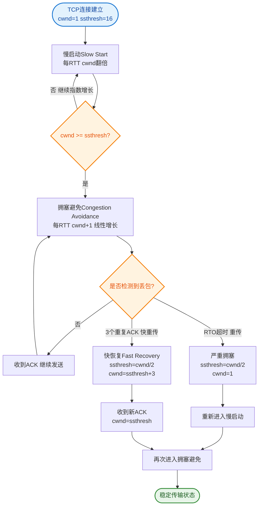

# 什么是拥塞发生？

**拥塞发生**是 TCP 拥塞控制中网络过载时的关键阶段，指网络中数据量超过路由器处理能力，导致丢包和延迟剧增。

## TCP 拥塞控制四个阶段

```
        慢启动（指数增长）
            │
            ▼ ssthresh
        拥塞避免（线性增长）
            │
            ▼ 超时/3次重复ACK
    ┌───────┴───────┐
  超时丢包        3次重复ACK
  → 慢启动       → 快速重传 + 快速恢复
  cwnd=1        ssthresh=cwnd/2, cwnd=ssthresh
```

## 拥塞发生的信号

| 信号 | 含义 | 触发机制 |
|------|------|----------|
| **超时** | 发出的包长时间没收到ACK | RTO超时 → 严重拥塞 |
| **3次重复ACK** | 收到3个相同ACK | 轻微丢包 → 轻度拥塞 |

## 两种拥塞情况的区别处理

**超时（严重拥塞）**：
- cwnd 重置为 1（回到慢启动）
- ssthresh = cwnd / 2
- 重新指数增长

**3次重复ACK（轻度拥塞）**：
- ssthresh = cwnd / 2
- cwnd = ssthresh（不回到1）
- 直接进入拥塞避免（线性增长）
- 这就是"快速恢复"

## 关键参数

- **cwnd（拥塞窗口）**：发送方维护，控制发送速率
- **ssthresh（慢启动门限）**：决定慢启动和拥塞避免的分界点
- **RTO（重传超时）**：超时定时器，超时即认为丢包

---

### 实战案例
在弱网环境（如 4G/5G 信号波动区域）进行视频通话时，如果 RTO 设置得过大，一旦发生丢包，视频流会卡顿很久；但如果仅仅收到 3 个重复 ACK，快速恢复机制能让画面迅速恢复流畅。反之，如果是网络彻底断开，必须依赖超时机制来彻底重置连接。

### 拥塞反馈机制对比

| 特性 | 超时 | 3个重复 ACK |
| :--- | :--- | :--- |
| **严重程度** | 严重拥塞/链路断开 | 轻微拥塞/局部丢包 |
| **cwnd 动作** | 降为 1 | 降为 ssthresh (减半) |
| **恢复阶段** | 慢启动 | 快速恢复 (拥塞避免) |
| **性能影响** | 吞吐量呈指数级下降，恢复慢 | 吞吐量平稳下降，恢复快 |

### 代码示例 (C++伪代码)
```cpp
// 拥塞发生时的核心决策逻辑
void onCongestionEvent(TCPState& state, bool isTimeout) {
    state.ssthresh = std::max(state.cwnd / 2, 2); // 阈值减半，最小保底
    if (isTimeout) {
        // 严重拥塞，满血复活状态重置
        state.cwnd = 1; 
        state.state = SLOW_START;
    } else {
        // 轻微拥塞 (3 DupACKs)，进入快速恢复
        // cwnd 具体调整逻辑通常在快速恢复阶段设置
        state.cwnd = state.ssthresh + 3; 
        state.state = FAST_RECOVERY;
    }
}
```

## 常见考点
1. **为什么超时比 3 个重复 ACK 严重？**：超时意味着接收方完全没有响应，网络可能完全堵塞；而收到重复 ACK 说明数据包虽然在乱序，但网络链路仍然是通的（"有路"），只是有拥堵。
2. **RTO 是如何计算的？**：通常基于 RTT（往返时间）测量，使用加权移动平均或 Karn 算法计算，并包含一定的方差补偿，以适应网络波动。
3. **拥塞控制和流量控制的区别**：拥塞控制是全局性的，防止网络过载；流量控制是点对点的，防止发送方淹没接收方（滑动窗口机制）。


## 核心流程图


## 记忆要点

- 拥塞信号分两种：超时代表严重拥堵，3次重复ACK代表轻微丢包
- 严重拥塞(超时)：ssthresh减半，cwnd直接降为1重走慢启动
- 轻微拥塞(3 Dup ACK)：ssthresh减半，cwnd降为ssthresh启动快恢
- 对比流量控制：拥塞控制防网络过载(全局)，流量防淹没接收方(端到端)
- 超时意味着链路可能不通，而重复ACK证明网络依然有送达能力

## 结构化回答


**30 秒电梯演讲：** 堵车了，如果彻底堵死就清空重开（超时），如果是慢行就减速慢行（快速恢复）。

**展开框架：**
1. **RTO超时** — 严重拥塞，cwnd置1，重回慢启动
2. **3个重复ACK** — 轻度拥塞，cwnd减半，快速恢复
3. **慢启动** — 指数增长（填满管道）

**收尾：** 这是我实战中的理解，您想深入哪一段？


## 视频脚本

> 预计时长：2 分钟 | 由浅入深

| 时间 | 画面/字幕 | 口播台词 | 讲解要点 |
|------|----------|----------|----------|
| 0:00 | 标题卡：什么是拥塞发生 | "什么是拥塞发生？一句话——堵车了，如果彻底堵死就清空重开（超时），如果是慢行就减速慢行（快速恢复）。" | 开场钩子 |
| 0:40 | 概念动画/示意图 | "根据丢包严重程度（超时或ACK丢失）调整发送速率——堵车了，如果彻底堵死就清空重开（超时），如果是慢行就减速慢行（快速恢复）" | 核心定义 |
| 1:20 | 拥塞信号分两种示意 | "超时代表严重拥堵，3次重复ACK代表轻微丢包" | 要点1 |
| 2:00 | 总结卡 | "记住这几条，面试不慌。下期讲进阶追问。" | 收尾 |
